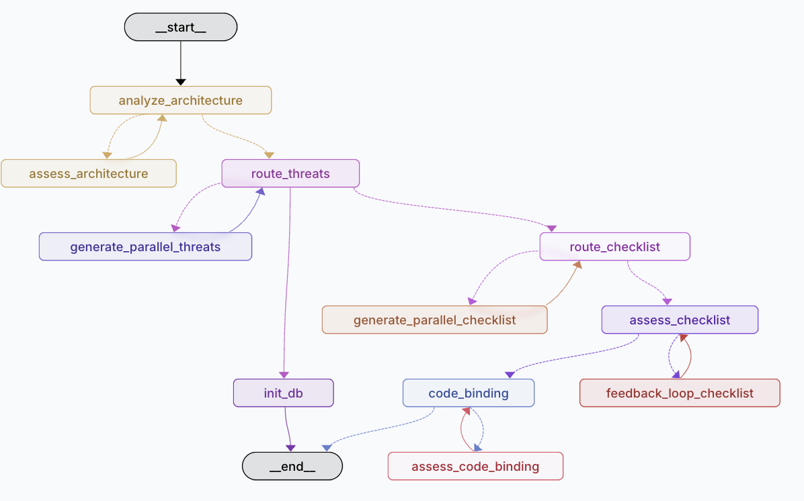

# WrappedThreatPromptor

> **Multi-Agent Threat Modeling System** powered by LangGraph and Google Gemini

A sophisticated threat modeling agent that performs comprehensive security analysis on blockchain systems using STRIDE methodology with structured judgment basis documentation.

## 🏗️ Architecture

This is a **Multi-Agent System** built with:
- **LangGraph StateGraph**: Orchestrates complex workflow with parallel processing
- **Google Gemini AI**: Powers threat analysis and checklist generation
- **STRIDE Framework**: Systematic threat identification methodology
- **Structured Output**: JSON-based analysis with detailed judgment basis

### Agent Workflow



The system follows a sophisticated multi-stage workflow:

```
Architecture Analysis → Threat Generation → Checklist Creation → Code Binding
       ↓                     ↓                    ↓                ↓
   Assessment          Parallel Processing    Assessment      Final Validation
```

**Key Workflow Stages:**
- **🏗️ Architecture Analysis**: Extract system components, actors, and trust boundaries
- **🔍 Threat Generation**: Parallel STRIDE-based threat identification per actor  
- **📋 Checklist Creation**: Generate actionable security verification items
- **💻 Code Binding**: Smart contract-specific security checks
- **🔄 Feedback Loops**: Iterative refinement through assessment panels

## 📁 Project Structure

```
WrappedThreatPromptor/
├── src/react_agent/           # Core agent implementation
│   ├── config.py              # Pydantic schemas & API configurations
│   ├── graph.py               # LangGraph workflow definition
│   ├── node.py                # Individual agent nodes
│   ├── prompt.py              # LLM prompt templates
│   ├── state.py               # Shared state management
│   ├── llm_utils.py           # LLM utilities & error handling
│   ├── variables.py           # Global variables
│   └── Utils/                 # Smart contract analysis utilities
│       ├── AnalyzeSolidity.py
│       ├── CallgraphMaker.py
│       ├── contracts/         # Berachain smart contracts
│       └── ...
├── dataset/                   # Input documentation
│   └── hyperlane-monorepo_docs_merged.md
├── results/                   # Generated analysis outputs
│   ├── actors/               # Individual actor threat files
│   ├── architecture_analysis.json
│   ├── all_threats.json
│   ├── checklist.json
│   └── ...
├── cache/                    # LLM response cache
├── static/                   # Web UI assets
└── langgraph.json           # LangGraph configuration
```

## 🚀 Quick Start

### Prerequisites
- Python 3.11+
- Google Gemini API key
- Git

### 1. Clone & Setup

```bash
git clone https://github.com/StackAuditFlow/WrappedThreatPromptor.git
cd WrappedThreatPromptor

# Clone required utilities and contracts
cd src/react_agent 
git clone https://github.com/StackAuditFlow/Utils.git
cd Utils 
git clone https://github.com/berachain/contracts.git
cd ../../../
```

### 2. Install Dependencies

```bash
make install
```

### 3. Environment Setup

Create `.env` file with your API keys:
```bash
GOOGLE_API_KEY=your_gemini_api_key_here
OPENAI_API_KEY=your_openai_api_key_here  # Optional
```

### 4. Start LangGraph Studio

```bash
make run
```

This launches the LangGraph Studio interface at `https://smith.langchain.com/studio/thread?baseUrl=http://127.0.0.1:2024&mode=graph&render=interact&assistantId=5a0dc938-8126-58c5-9e81-d5cfbf422909`

## 🎯 Usage

### Input Requirements
- **Target Documentation**: System architecture documentation (Markdown format)
- **Smart Contracts**: Solidity contracts for code binding analysis

### Example Input
```bash
# Use the included Berachain documentation
input: dataset/hyperlane-monorepo_docs_merged.md
```

### Generated Outputs
1. **Architecture Analysis** (`results/architecture_analysis.json`)
   - Actors, components, assets, data flows, trust boundaries
   - Individual judgment basis for each decision

2. **Threat Analysis** (`results/all_threats.json`)
   - STRIDE-based threat identification
   - Risk assessments with detailed rationale
   - Individual judgment basis per threat

3. **Security Checklist** (`results/checklist.json`)
   - Actionable security verification items
   - Priority assignments and evidence requirements
   - Individual judgment basis per checklist item

4. **Code Binding** (`results/code_binding.json`)
   - Smart contract-specific security checks
   - Implementation verification requirements

## 🔧 Core Features

### Advanced Threat Modeling
- **STRIDE Methodology**: Systematic threat categorization
- **Parallel Processing**: Concurrent threat analysis for multiple actors
- **Judgment Basis**: Detailed rationale for every decision
- **Risk Assessment**: Context-aware severity evaluation

### Intelligent Checklist Generation
- **Threat-Driven**: Checklist items derived from identified threats
- **Code Binding**: Smart contract verification requirements
- **Evidence-Based**: Specific proof requirements for each check
- **Priority Assignment**: Risk-based prioritization

### Multi-Agent Coordination
- **State Management**: Shared context across analysis stages
- **Feedback Loops**: Iterative refinement with assessment panels
- **Error Resilience**: Graceful fallback mechanisms
- **Parallel Execution**: Efficient processing of multiple entities

## 🛠️ Development

### Key Components

- **`node.py`**: Core agent functions (analysis, assessment, routing)
- **`prompt.py`**: LLM prompt templates with structured output
- **`config.py`**: Pydantic models for data validation
- **`graph.py`**: LangGraph workflow orchestration
- **`llm_utils.py`**: LLM interaction utilities with retry logic

### Adding New Analysis Types
1. Define Pydantic schema in `config.py`
2. Create prompt template in `prompt.py`
3. Implement analysis node in `node.py`
4. Add to workflow in `graph.py`

## 📊 Output Examples

### Threat Analysis with Judgment Basis
```json
{
  "threats": [...],
  "Threat_Analysis_Judgment_Basis": [
    {
      "threat_id": 1,
      "threat_identification_logic": "Spoofing threat identified due to...",
      "risk_level_justification": "High risk assigned because...",
      "attack_vector_analysis": "Attack surface mapped through...",
      "mitigation_reasoning": "Technical control recommended because...",
      "documentation_traceability": "Threat traced to specific architectural elements..."
    }
  ]
}
```

### Security Checklist with Individual Rationale
```json
{
  "checklist_items": [...],
  "Checklist_Generation_Judgment_Basis": [
    {
      "checklist_item_id": 1,
      "item_selection_logic": "Item generated from Threat ID 1 addressing...",
      "priority_assignment_reasoning": "High priority because...",
      "code_binding_assessment": "Requires code verification because...",
      "evidence_requirements_analysis": "Screenshot evidence needed because...",
      "actionability_verification": "Clear verification steps provided..."
    }
  ]
}
```
