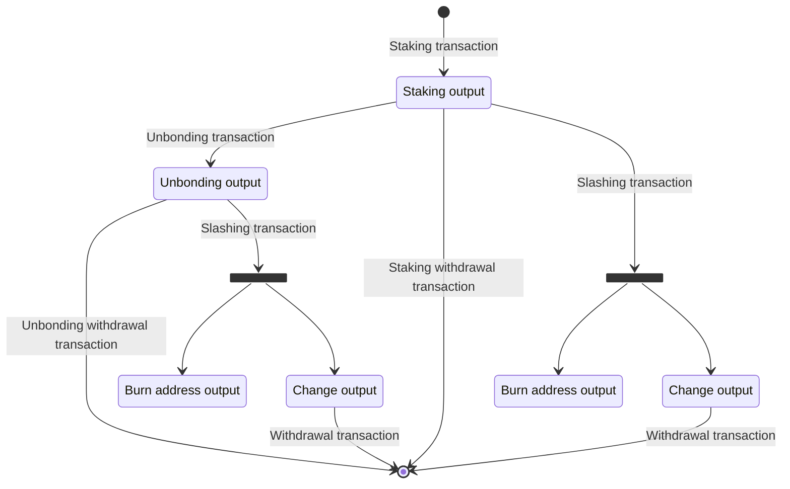

# Berachain 문서

*이 문서는 모든 Berachain 문서를 하나의 종합적인 참조로 결합합니다.*

## 목차

1. [Welcome to the Guides Section](#doc_1)
2. [guides/This ensures it doesn't show in sidebar](#doc_2)
3. [guides/architecture/Architecture](#doc_3)
4. [guides/architecture/babylon_genesis_modules/BTC Checkpoint](#doc_4)
5. [guides/architecture/babylon_genesis_modules/BTC Light Client](#doc_5)
6. [guides/architecture/babylon_genesis_modules/BTC Staking Module](#doc_6)
7. [guides/architecture/babylon_genesis_modules/BTCSTK Consumer](#doc_7)
8. [guides/architecture/babylon_genesis_modules/Babylon Genesis Modules](#doc_8)
9. [guides/architecture/babylon_genesis_modules/Checkpointing](#doc_9)
10. [guides/architecture/babylon_genesis_modules/Epoching](#doc_10)
11. [guides/architecture/babylon_genesis_modules/Finality](#doc_11)
12. [guides/architecture/babylon_genesis_modules/Incentive Modules](#doc_12)
13. [guides/architecture/babylon_genesis_modules/Mint Module](#doc_13)
14. [guides/architecture/babylon_genesis_modules/Monitor](#doc_14)
15. [guides/architecture/btc_staking_program/BTC Staking Program](#doc_15)
16. [guides/architecture/btc_staking_program/EOTS Manager](#doc_16)
17. [guides/architecture/btc_staking_program/Finality Providers](#doc_17)
18. [guides/architecture/btc_staking_program/Large BTC Reorgs Receovery Procedure](#doc_18)
19. [guides/architecture/consumer_zone_programs/Babylon Contracts](#doc_19)
20. [guides/architecture/consumer_zone_programs/Consumer Zone (BSN) Programs](#doc_20)
21. [guides/architecture/consumer_zone_programs/IBC Relayer](#doc_21)
22. [guides/architecture/consumer_zone_programs/Zone Concierge](#doc_22)
23. [guides/architecture/vigilantes/Vigilante Checkpointing Monitor](#doc_23)
24. [guides/architecture/vigilantes/Vigilante Reporter](#doc_24)
25. [guides/architecture/vigilantes/Vigilante Submitter](#doc_25)
26. [guides/architecture/vigilantes/Vigilantes](#doc_26)
27. [guides/baby_stakers/A Guide to BABY Staking Mechanisms](#doc_27)
28. [guides/baby_stakers/BABY Staking CLI Guide](#doc_28)
29. [guides/baby_stakers/BABY Staking Integration](#doc_29)
30. [guides/baby_stakers/BABY Staking Tools](#doc_30)
31. [guides/baby_stakers/Staking BABY on Babylon](#doc_31)
32. [guides/btc_stakers/BTC Staking Tools](#doc_32)
33. [guides/btc_stakers/Staking BTC on Babylon](#doc_33)
34. [guides/btc_stakers/campaigns/Pioneer Pass NFT Campaign](#doc_34)
35. [guides/btc_stakers/liquid_staking/Liquid Staking Tokens](#doc_35)
36. [guides/btc_stakers/native_staking/Custodial Staking](#doc_36)
37. [guides/btc_stakers/native_staking/Geo Blocking](#doc_37)
38. [guides/btc_stakers/native_staking/Staking via CLI Tools](#doc_38)
39. [guides/btc_stakers/native_staking/Staking via web app](#doc_39)
40. [guides/btc_stakers/native_staking/Unbond via CLI](#doc_40)
41. [guides/btc_stakers/native_staking/Unbond via Web](#doc_41)
42. [guides/governance/Babylon Genesis Chain Governance](#doc_42)
43. [guides/governance/drafting_proposals/Drafting Proposals  ](#doc_43)
44. [guides/governance/drafting_proposals/Proposal Templates and Examples](#doc_44)
45. [guides/governance/reviewing_proposals/Proposal Review Guide  ](#doc_45)
46. [guides/governance/reviewing_proposals/Voting on Proposals via CLI](#doc_46)
47. [guides/governance/reviewing_proposals/Voting on Proposals via Web Interface](#doc_47)
48. [guides/governance/submit_proposals/On-chain Submission via Web  ](#doc_48)
49. [guides/governance/submit_proposals/Smart Contract Deployment Proposal ](#doc_49)
50. [guides/governance/submit_proposals/Submit Proposals  ](#doc_50)
51. [guides/governance/submit_proposals/Submit Proposals via CLI](#doc_51)
52. [guides/networks/Networks](#doc_52)
53. [guides/networks/phase-1/Phase 1 Mainnet](#doc_53)
54. [guides/networks/phase-1/mainnet/Finality Provider Registration](#doc_54)
55. [guides/networks/phase-1/mainnet/Phase 1: Mainnet](#doc_55)
56. [guides/networks/phase-1/mainnet/Staking Global Parameters](#doc_56)
57. [guides/networks/phase-1/mainnet/covonent_committee/Covenant Committee](#doc_57)
58. [guides/networks/phase-1/testnet/Finality Provider Registration](#doc_58)
59. [guides/networks/phase-1/testnet/Phase 1: Testnet](#doc_59)
60. [guides/networks/phase-1/testnet/Staking Global Parameters](#doc_60)
61. [guides/networks/phase-1/testnet/covonent_committee/Covenant Committee](#doc_61)
62. [guides/networks/phase-2/Phase 2](#doc_62)
63. [guides/networks/phase-2/mainnet/Phase 2: Mainnet](#doc_63)
64. [guides/networks/phase-2/testnet/Phase 2: Testnet](#doc_64)
65. [guides/networks/phase-3/Phase 3](#doc_65)
66. [guides/networks/phase-3/devnet/Phase 3: Devnet](#doc_66)
67. [guides/overview/Babylon Bitcoin Staking Protocol Overview](#doc_67)
68. [guides/overview/Bitcoin Staking](#doc_68)
69. [guides/overview/Bitcoin Supercharged Networks (BSNs)](#doc_69)
70. [guides/overview/babylon_genesis/Babylon Genesis Overview](#doc_70)
71. [guides/overview/babylon_genesis/Babylon Genesis Tokenomics](#doc_71)
72. [guides/overview/phases_of_the_launch/Phases of The Launch](#doc_72)
73. [guides/overview/phases_of_the_launch/phase-1/Phase 1: Bitcoin Locking](#doc_73)
74. [guides/overview/phases_of_the_launch/phase-2/Bitcoin Staking Registration](#doc_74)
75. [guides/overview/phases_of_the_launch/phase-2/Phase 2: Babylon Genesis Launch](#doc_75)
76. [guides/overview/phases_of_the_launch/phase-2/Staking Registration Eligibility](#doc_76)
77. [guides/overview/phases_of_the_launch/phase-3/Phase 3: Bitcoin Multi-staking](#doc_77)
78. [guides/research/Bitcoin Staking Litepaper](#doc_78)
79. [guides/research/Bitcoin Timestamping Research Paper](#doc_79)
80. [guides/security/Audit Reports](#doc_80)
81. [guides/security/Bug Bounty Program](#doc_81)
82. [guides/specifications/Bitcoin Staking Scripts](#doc_82)
83. [guides/specifications/Staking Transactions](#doc_83)
84. [guides/support/Developer Channels](#doc_84)
85. [guides/support/FAQs](#doc_85)
86. [guides/support/User Channels](#doc_86)

---

<a id="doc_1"></a>

## Welcome to the Guides Section

*파일 경로: index.mdx*

---
id: guides
title: Guides
slug: /
---


This is the main page for all guides.

import DocCardList from '@theme/DocCardList';

<DocCardList />

---

<a id="doc_2"></a>

## 📁 guides / This ensures it doesn't show in sidebar

*파일 경로: guides/index.mdx*

---
id: guides-index
slug: /guides
sidebar_class_name: hidden
---

import {Redirect} from '@docusaurus/router';

<Redirect to="/guides/overview" />;

---

<a id="doc_3"></a>

## 📁 guides/architecture / Architecture

*파일 경로: guides/architecture/architecture.mdx*

---
sidebar_class_name: architecture_sidebar
sidebar_position: 2
---


The Babylon network has a layered architecture composed of Bitcoin scripts, Babylon node 
built on Cosmos SDK, Finality Providers, and peripheral software solutions that 
are designed to securely interact with Bitcoin Chain so it can facilitate staking and 
multi-staking of Bitcoin.

import useBaseUrl from '@docusaurus/useBaseUrl';
import ThemedImage from '@theme/ThemedImage';

<div className="flex flex-col items-center justify-center" id="babylon_architecture">
  <ThemedImage
    alt="Overview of Babylon Bitcoin Staking Protocol"
    sources={{
      light: useBaseUrl('/img/guides/architecture.png'),
      dark: useBaseUrl('/img/guides/architecture_dark.png'),
    }}
  />
  <em>Babylon Architecture</em><br/>
</div>

On the top layer, Babylon ensures Bitcoin Chain and Babylon Genesis are securely connected 
and synchronized by using Checkpointing. It also keeps track of Bitcoin holders' staking 
transactions with a BTC staking monitor and indexer. The Vigilante network is used to 
monitor the Bitcoin Chain and Babylon Genesis for any malicious activities. Anyone can run 
these nodes and help maintain the security of the network.

The middle layer is the Babylon node. It is built on Cosmos SDK and implements the 
Babylon Bitcoin staking logic. It implements the eight core modules of: Babylon 
Epoching, Checkpointing, BTC Checkpointing, BTC Light Client, Zone Concierge, BTC 
Staking, Finality, and Rewards. It also includes the Babylon Genesis and the Validators and Finality Providers set and runs on CometBFT for consensus.

At the bottom layer, EOTS Manager and Finality Provider nodes provide the means for 
group signatures and validating the data of an external network. Covenant Emulator 
provides enforcements on the transaction data for staking, unbonding and slashing. The 
IBC relayer and Babylon Contracts, which are usually implemented by BSNs consuming 
Bitcoin security help to communicate and standardize the data exchange between them.

### Components

import DocCardList from '@theme/DocCardList';

<DocCardList />

---

<a id="doc_4"></a>

## 📁 guides/architecture/babylon_genesis_modules / BTC Checkpoint

*파일 경로: guides/architecture/babylon_genesis_modules/btc_checkpointing.mdx*

---
sidebar_class_name: btc_checkpointing_sidebar
sidebar_position: 3
---


`/babylon/x/btccheckpoint`

import RemoteMD from '@site/src/components/RemoteMD';

export const rawUrl="https://raw.githubusercontent.com/babylonlabs-io/babylon/refs/heads/main/x/btccheckpoint/README.md";

<RemoteMD
  networkVersions={{
    mainnet: rawUrl
  }}
  hideEnv={true}
  hideRelease={false}
/>

---

<a id="doc_5"></a>

## 📁 guides/architecture/babylon_genesis_modules / BTC Light Client

*파일 경로: guides/architecture/babylon_genesis_modules/btc_lightclient.mdx*

---
sidebar_class_name: architecture_sidebar
sidebar_position: 3
---


`/babylon/x/btclightclient`

import RemoteMD from '@site/src/components/RemoteMD';

export const rawUrl="https://raw.githubusercontent.com/babylonlabs-io/babylon/refs/heads/main/x/btclightclient/README.md";

<RemoteMD
  networkVersions={{
    mainnet: rawUrl
  }}
  hideEnv={true}
  hideRelease={false}
/>

---

<a id="doc_6"></a>

## 📁 guides/architecture/babylon_genesis_modules / BTC Staking Module

*파일 경로: guides/architecture/babylon_genesis_modules/btc_staking.mdx*

---
sidebar_class_name: btc_staking_sidebar
sidebar_position: 3
---


`/babylon/x/btcstaking`

import RemoteMD from '@site/src/components/RemoteMD';

export const rawUrl="https://raw.githubusercontent.com/babylonlabs-io/babylon/refs/heads/main/x/btcstaking/README.md";

<RemoteMD
  networkVersions={{
    mainnet: rawUrl
  }}
  hideEnv={true}
  hideRelease={false}
/>

---

<a id="doc_7"></a>

## 📁 guides/architecture/babylon_genesis_modules / BTCSTK Consumer

*파일 경로: guides/architecture/babylon_genesis_modules/btcstkconsumer.mdx*

---
sidebar_position: 2

---


`/babylon/x/btcstkconsumer`


The `btcstkconsumer` module manages Bitcoin Secure Networks (BSNs) as consumers
registrations and finality provider relationships in Babylon's Bitcoin staking protocol. 

Here is a functional breakdown:

- BSN Registration (handles permissioned or permissionless settings)
- Finality Provider Relationship Management
- BTC Staking and Delegation Management
- Reward Distribution Configuration

### Core functions

1. BSN Registration
- Manages registration of different types of BSNs
- Tracks BSN metadata and provider information
- Controls the permissioned or permissionless settings for registration process


2. Finality Provider Relationship Management
- Tracks finality provider list for each BSN
- Manages voting power of the finality providers
- Monitors slashing status


3. BTC Staking and Delegation Management    


BSN registration data consists of "Consumer Id", Consumer Name and description, 
Chain-specific metadata (e.g. IBC channel ID). 

### State

The module maintains the following state:

- BSN Registry State
- Finality Provider State
- Slashing State

The btcstkconsumer module implements a state management system that uses 
prefix-based keys and maintains separate stores for different types of data. 
It implements CRUD operations utilizing protocol buffers for serialization, and 
supports iteration over state collections. All this state data is persisted in 
the chain's underlying database and can be accessed through keeper methods.

### Endpoints

The module exposes these gRPC queries: 

- `GET /babylon/btcstkconsumer/v1/params` - Query module parameters
- `GET /babylon/btcstkconsumer/v1/consumers_registry/{consumer_ids}` - Query BSN registration details
- `GET /babylon/btcstkconsumer/v1/finality_providers/{consumer_id}` - Query finality providers for a given BSN
- `GET /babylon/btcstkconsumer/v1/finality_provider/{consumer_id}/{fp_btc_pk_hex}` - Query finality provider details
- `GET /babylon/btcstkconsumer/v1/finality_provider_consumer/{fp_btc_pk_hex}` - Query BSNs for a given finality provider

---

<a id="doc_8"></a>

## 📁 guides/architecture/babylon_genesis_modules / Babylon Genesis Modules

*파일 경로: guides/architecture/babylon_genesis_modules/babylon_genesis_modules.mdx*

---
sidebar_position: 1
---

import DocCardList from '@theme/DocCardList';


Cosmos custom modules are designed to be used with Babylon Genesis to support the Babylon Bitcoin Staking Protocol. 

<DocCardList />

---

<a id="doc_9"></a>

## 📁 guides/architecture/babylon_genesis_modules / Checkpointing

*파일 경로: guides/architecture/babylon_genesis_modules/checkpointing.mdx*

---
sidebar_class_name: checkpointing_sidebar
sidebar_position: 3
---


`/babylon/x/checkpointing`

import RemoteMD from '@site/src/components/RemoteMD';

export const rawUrl="https://raw.githubusercontent.com/babylonlabs-io/babylon/refs/heads/main/x/checkpointing/README.md";

<RemoteMD
  networkVersions={{
    mainnet: rawUrl
  }}
  hideEnv={true}
  hideRelease={false}
/>

---

<a id="doc_10"></a>

## 📁 guides/architecture/babylon_genesis_modules / Epoching

*파일 경로: guides/architecture/babylon_genesis_modules/epoching.mdx*

---
sidebar_class_name: architecture_sidebar
sidebar_position: 3
---


`/babylon/x/epoching`

import RemoteMD from '@site/src/components/RemoteMD';

export const rawUrl="https://raw.githubusercontent.com/babylonlabs-io/babylon/refs/heads/main/x/epoching/README.md";

<RemoteMD
  networkVersions={{
    mainnet: rawUrl
  }}
  hideEnv={true}
  hideRelease={false}
/>

---

<a id="doc_11"></a>

## 📁 guides/architecture/babylon_genesis_modules / Finality

*파일 경로: guides/architecture/babylon_genesis_modules/finality.mdx*

---
sidebar_class_name: finality_sidebar
sidebar_position: 3
---


`/babylon/x/finality`

import RemoteMD from '@site/src/components/RemoteMD';

export const rawUrl="https://raw.githubusercontent.com/babylonlabs-io/babylon/refs/heads/main/x/finality/README.md";

<RemoteMD
  networkVersions={{
    mainnet: rawUrl
  }}
  hideEnv={true}
  hideRelease={false}
/>

---

<a id="doc_12"></a>

## 📁 guides/architecture/babylon_genesis_modules / Incentive Modules

*파일 경로: guides/architecture/babylon_genesis_modules/incentive.mdx*

---
sidebar_class_name: incentive_sidebar
sidebar_position: 3
sidebar_label: Incentive
---


`/babylon/x/incentive`


The incentive module acts as a reward distribution and tracking system for two key aspects:

- BTC Staking Rewards Distribution
- Finality Provider Rewards Distribution

Module functions: 

- Manages reward distribution for BTC stakers
- Records historical and current rewards for Finality Providers
- Enables reward withdrawal mechanisms
- Maintains delegation rewards

Note that this module does not take care of the reward distribution for Babylon Genesis
validators. This is handled by the `distribution` module which is standard practice for 
Cosmos SDK based chains.

### BTC Staking Rewards Distribution

In this function, the incentive module manages the distribution of rewards through:

- Tracking BTC staking gauges at specific block heights
- Managing reward gauges for BTC stakers and Finality Providers
- Handling reward withdrawal requests
- Maintaining withdrawal address configurations

### Finality Provider Rewards Management

The incentive module also manages Finality Provider commissions through:

- Tracking historical rewards per Finality Provider
- Managing current rewards and periods
- Handling delegation rewards tracking
- Processing reward distribution calculations

Note that this module requires initial state configuration at genesis, including parameters
such as BTC staking portions and reward distribution rules.

### Endpoints

The incentive module provides the following endpoints:

- `GET /babylon/incentive/params` - to query module parameters
- `GET /babylon/incentive/address/{address}/reward_gauge` - to query reward gauges for a stakeholder
- `GET /babylon/incentive/btc_staking_gauge/{height}` - to query BTC staking gauge at specific height
- `GET /babylon/incentive/delegators/{delegator_address}/withdraw_address` - to query delegator's withdrawal address
- `GET /babylon/incentive/finality_providers/{finality_provider_address}/delegators/{delegator_address}/delegation_rewards` - to query delegation rewards

---

<a id="doc_13"></a>

## 📁 guides/architecture/babylon_genesis_modules / Mint Module

*파일 경로: guides/architecture/babylon_genesis_modules/mint.mdx*

---
sidebar_position: 1
sidebar_label: Mint Module
---


`/babylon/x/mint`

The mint module is responsible for managing the Babylon Genesis's token supply and inflation.
It controls the minting of new tokens based on pre-defined infaltion schedules. 

This module has a few key functions in implementing economic policies: 

- Token supply management and inflation control
- Network security and economic stability

The module is important because it:

- controls network-wide token emission and inflation
- provides sustanable rewards for validators and stakers
- enable monetary policy flexibility via governance processes

The module is the key to long-term economic sustainability of the network.

### Token Supply Management

The mint module manages network's token supply via: 
- calculate new token issurance based on inflation rate
- Tracking annual provisions to maintain target inflation rate
- Adjust token supply based on network parameters
- Manage bond denomination of minted tokens

Note that this module requires initial state configuration at genesis, including bond 
denomination and minting parameters.

### State Management

The mint module maintains the following state variables: 

- `inflation_rate`: current inflation rate (e.g. 10% per year)
- `annual_provisions`: current annual token provision to be minted
- `pre_vious_block_time`: timestamp of the last block
- `bond_denom`: denomination of toekns. A genesis state of determins the initial 
denomination for miniting.

### Endpoints

The mint module exposes the following endpoint: 

- `GET /cosmos/mint/v1beta1/inflation_rate` - to query current inflation rate
- `GET /cosmos/mint/v1beta1/annual_provisions` - to query current annual token provisions
- `GET /cosmos/mint/v1beta1/genesis_time` - to query chain's genesis timestamp

---

<a id="doc_14"></a>

## 📁 guides/architecture/babylon_genesis_modules / Monitor

*파일 경로: guides/architecture/babylon_genesis_modules/monitor.mdx*

---
sidebar_position: 11 
sidebar_label: Monitor
---


`/babylon/x/monitor`

The monitor module serves as a monitoring and tracking system for two key aspects
of Babylon Bitcoin Staking Protocol: 

1. Ensure the BTC Light Client's height tracking is consistent
2. Ensure the Babylon Genesis's liveness and safety

This module is particularly important because it: 

- helps track the synchronization status between Babylon Genesis and Bitcoin
- provides visibility into the checkpoint reporting process
- enables verification of checkpoint integrity and liveness using checpoint hasehes

### BTC Light Client Height Tracking

In this function, the monitor module will track the Bitcoin Light Client's height
at specific epoch boundaries. Monitor when epochs end and records the corresponding
BTC block height. It will also allow querying of the historical BTC block height for
any given epoch. 

### Babylon Genesis' Liveness and Safety

The monitor module also ensures the Babylon Genesis's liveness and safety.

In this function, the monitor module will track when checkpoint are reported back to 
Babylon Genesis. Records the BTC Light Client's height at which a  specific checkpointing
were reported. It will also allow querying of checkpoint reporting using checpoint hashes. 

Note that this module does not any initial state at genesis but rather accumulates data as 
the Babylon Genesis runs. 

### Endpoints

The monitor module provides the following endpoints:

- `GET /btc/lightclient/epochs/{epoch_num}` - to query the BTC Light Client's height at a specific epoch
- `GET /btc/lightclient/checkpoints/{ckpt_hash}` - to query the checkpoint reporting history using checkpoint hashes

---

<a id="doc_15"></a>

## 📁 guides/architecture/btc_staking_program / BTC Staking Program

*파일 경로: guides/architecture/btc_staking_program/btc_staking_program.mdx*

---
sidebar_position: 1
---


Software solutions related to Bitcoin Staking processes.

import DocCardList from '@theme/DocCardList';

<DocCardList />

---

<a id="doc_16"></a>

## 📁 guides/architecture/btc_staking_program / EOTS Manager

*파일 경로: guides/architecture/btc_staking_program/eots_manager.mdx*

---
sidebar_class_name: eots_manager_sidebar
sidebar_label: EOTS Manager
sidebar_position: 9
---


The EOTS daemon is responsible for managing EOTS keys, producing EOTS randomness, and
using them to produce EOTS signatures.

> ⚡ **Note:** EOTS stands for Extractable One Time Signature. You can read more about it
in
the [Babylon BTC Staking Litepaper](https://docs.babylonchain.io/assets/files/btc_staking_litepaper-32bfea0c243773f0bfac63e148387aef.pdf).
In short, the EOTS manager generates EOTS public/private randomness pairs. The
finality provider commits the public part of these pairs to Babylon for every future
block height that they intend to provide a finality signature for. If the Finality
Provider votes for two different blocks on the same height, they will have to reuse
the same private randomness which will lead to their EOTS private key being
exposed, leading to slashing. 

Once a Finality Provider double-signs, their voting power is immediately reduced
to zero, while their private key is exposed. A Finality Provider that double-signs
can never regain voting power (tombstoning). Additionally, the exposed private key
of the Finality Provider can be used to fully sign the slashing transactions of all
their stake delegations.

The EOTS manager is responsible for the following operations:

1. **EOTS Key Management:**
    - Generates [Schnorr](https://en.wikipedia.org/wiki/Schnorr_signature) key pairs
      for a given Finality Provider using the
      [BIP-340](https://github.com/bitcoin/bips/blob/master/bip-0340.mediawiki)
      standard as its EOTS key pair.
    - Persists generated key pairs in the internal Cosmos keyring.
2. **Randomness Generation:**
    - Generates lists of EOTS randomness pairs based on the EOTS key, chain ID, and
      block height.
    - The randomness is deterministically generated and tied to specific parameters.
3. **Signature Generation:**
    - Signs EOTS using the private key of the finality provider and the corresponding
      secret randomness for a given chain at a specified height.
    - Signs Schnorr signatures using the private key of the Finality Provider.

---

<a id="doc_17"></a>

## 📁 guides/architecture/btc_staking_program / Finality Providers

*파일 경로: guides/architecture/btc_staking_program/finality_providers.mdx*

---
sidebar_position: 1
---


`/finality_providers`

import RemoteMD from '@site/src/components/RemoteMD';

export const rawUrl="https://raw.githubusercontent.com/babylonlabs-io/finality-provider/refs/heads/main/README.md";

<RemoteMD
  networkVersions={{
    mainnet: rawUrl
  }}
  hideEnv={true}
  hideRelease={false}
/>

---

<a id="doc_18"></a>

## 📁 guides/architecture/btc_staking_program / Large BTC Reorgs Receovery Procedure

*파일 경로: guides/architecture/btc_staking_program/btc_reorg_procedure.mdx*

---
sidebar_class_name: btc_reorg_procedure_sidebar
sidebar_label: BTC Reorg Receovery Procedure
sidebar_position: 3
---


Procedure for handling Large BTC Reorg activities.

import RemoteMD from '@site/src/components/RemoteMD';

export const rawUrl="https://raw.githubusercontent.com/babylonlabs-io/babylon/refs/heads/main/x/btcstaking/docs/btc-reorg.md";

<RemoteMD
  networkVersions={{
    mainnet: rawUrl
  }}
  hideEnv={true}
  hideRelease={false}
/>

---

<a id="doc_19"></a>

## 📁 guides/architecture/consumer_zone_programs / Babylon Contracts

*파일 경로: guides/architecture/consumer_zone_programs/babylon_contracts.mdx*

---
sidebar_position: 1
---


`/babylon-contracts`

A [CosmWasm](https://cosmwasm.com/) smart contract intended for
deployment in a BSN (or Consumer Zone).
It enables Bitcoin Checkpointing functionality without introducing
invasive changes in the codebase of the BSN.
Based on the Bitcoin Checkpointing functionality,
the BSN can make decisions based on the inclusion
of its checkpoints in the Bitcoin ledger
(e.g. execute BTC-assisted unbonding requests).

import Link from '@docusaurus/Link';

<Link
  to="https://github.com/babylonlabs-io/babylon-contract"
  id="contracts"
>
    Babylon Contracts
</Link>

Getting started with deploying Babylon Contracts: 

import RemoteMD from '@site/src/components/RemoteMD';

export const rawUrl="https://raw.githubusercontent.com/babylonlabs-io/babylon-contract/refs/heads/main/README.md";

<RemoteMD
  networkVersions={{
    mainnet: rawUrl
  }}
  hideEnv={true}
  hideRelease={false}
/>

---

<a id="doc_20"></a>

## 📁 guides/architecture/consumer_zone_programs / Consumer Zone (BSN) Programs

*파일 경로: guides/architecture/consumer_zone_programs/consumer_zone_programs.mdx*

---
sidebar_position: 1
---


Solutions that are used by BSNs to interact with Babylon Genesis.

import DocCardList from '@theme/DocCardList';

<DocCardList />

---

<a id="doc_21"></a>

## 📁 guides/architecture/consumer_zone_programs / IBC Relayer

*파일 경로: guides/architecture/consumer_zone_programs/ibc_relayer.mdx*

---
sidebar_position: 1
sidebar_class_name: consumer_zone_sidebar
sidebar_label: IBC Relayer
---


`/babylon-relayer`

The IBC Relayer maintains the
[IBC protocol](https://cosmos.network/ibc/) connection
between Babylon Genesis and other BSNs.
It is responsible for updating the BSN's light client
inside the Babylon Genesis ledger to enable checkpointing and
propagating checkpoint information to the Babylon smart contract
deployed within the BSN.

There are different IBC relayer implementations that can achieve
this function. Most notably:

- [Cosmos Relayer](https://github.com/cosmos/relayer):
  A fully functional relayer written in Go.
- [Babylon Genesis Relayer](https://github.com/babylonlabs-io/babylon-relayer/):
  A wrapper of the Cosmos Relayer that can maintain a one-way IBC connection.
  It is recommended to be used when the BSN does not deploy the
  Babylon smart contract.
- [Hermes Relayer](https://github.com/informalsystems/hermes):
  A fully functional relayer written in Rust.

---

<a id="doc_22"></a>

## 📁 guides/architecture/consumer_zone_programs / Zone Concierge

*파일 경로: guides/architecture/consumer_zone_programs/zone_concierge.mdx*

---
sidebar_class_name: zone_concierge_sidebar
sidebar_position: 3
---


`/x/zoneconcierge/`

import RemoteMD from '@site/src/components/RemoteMD';

export const rawUrl="https://raw.githubusercontent.com/babylonlabs-io/babylon/refs/heads/main/x/zoneconcierge/README.md";

<RemoteMD
  networkVersions={{
    mainnet: rawUrl
  }}
  hideEnv={false}
  hideRelease={true}
/>

---

<a id="doc_23"></a>

## 📁 guides/architecture/vigilantes / Vigilante Checkpointing Monitor

*파일 경로: guides/architecture/vigilantes/monitor.mdx*

---
sidebar_class_name: reporter_sidebar
sidebar_label: Vigilante Monitor
sidebar_position: 3
---


The Checkpointing Monitor is a separate process running alongside a Babylon node.
The responsibility of the Checkpointing Monitor is to constantly check (1) consistency between the Babylon node and BTC,
and (2) whether the blockchain is under a liveness attack.
Once a critical issue is found, it raises an alarm to the user who decides whether to stall the blockchain.
Running a Checkpointing Monitor is optional but highly recommended since it ensures a Babylon node is in a healthy state.

### Problem Statement

The Checkpointing Monitor aims to provide the following properties:

- BTC header chain safety and liveness.
It ensures that the BTC header chain maintained by btclightclient is live and consistent with the BTC canonical chain.
- Babylon checkpoint chain safety and liveness.
It ensures that the checkpoint chain of the Babylon node is live and consistent with that submitted to BTC canonical chain.

### Design

The Checkpointing Monitor can be started at any time after the Babylon node is started.
The Checkpointing Monitor initiates by reading some parameters from the genesis file, i.e., validator BLS key set, base BTC height.
Then it goes through a bootstrapping procedure to process checkpoints that have already been submitted to BTC.
After that, it is driven by newly mined BTC blocks.
Note that the monitor only processes a BTC block when it is `k-deep` where `k` is a configurable parameter.

The vigilante checkpointing monitor program makes the following design decisions:

- [Consistency Check](#consistency-check)
- [Liveness Check](#liveness-check)

In the following description, when we say upon a BTC block, it means the block is already `k-deep`.

#### Consistency Check

The workflow of the Checkpointing Monitor checking consistency of the Babylon ledger against BTC upon a new BTC block is described as the following:

1. Compare the BTC header with the header at the same height from Babylon.
If they do not match, the alarm is raised.
If the header does not exist in Babylon, send the alarm.

2. Upon a found BTC checkpoint (ignore checkpoints with higher epochs than the current epoch)
   - the Checkpointing Monitor verifies the checkpoint using the validator BLS key set 
     - if the BLS sig is valid, continue 
     - otherwise, skip this checkpoint 
   - queries the checkpoint from Babylon and checks whether the two checkpoints match on LastCommitHash 
     - if matched, extend the checkpoint chain, increase the current epoch, continue 
     - otherwise, or the Babylon node does not have the checkpoint at the same epoch, the alarm is raised 
   - it updates the validator BLS key set by querying the Babylon node 
     - an alarm is raised if the Babylon node does not have the validator BLS key set for the next epoch

#### Liveness Check

##### Definition

The Checkpointing Monitor should alarm if any of the unique checkpoints (the same checkpoints can have different submitters) with a valid BLS signature is not reported to Babylon within a period of time, which is measured by BTC height.
We first define some marks of the lifecycle of a unique checkpoint (measured by BTC height):

- **H1**: the tip height of `btclightclient` when the relevant epoch ends (obtained from Babylon)
- **H2**: the BTC height at which the checkpoint first appears on BTC (obtained from BTC)
- **H3**: the tip height of `btclightclient` when the checkpoint is reported as a submission (obtained from Babylon)
- **H4**: the current tip height of `btclightclient` when asked (obtained from Babylon)

We decide a checkpoint is under liveness attack if:
- Happy case (H3 > H2 > H1)
  - H3 - H1 > X (the checkpoint is received by `btccheckpoint`)
  - H4 - H1 > X (the checkpoint is not received by `btccheckpoint`)
- Unhappy case (H2 < H1, the checkpoint is forked and submitted before epoch ends)
  - H3 - H2 > X (the checkpoint is received by `btccheckpoint`)
  - H4 - H2 > X (the checkpoint is not received by `btccheckpoint`)

For short, we decide a checkpoint is under liveness attack if:
- H3 - min(H1, H2) > X (the checkpoint is received by `btccheckpoint`)
- H4 - min(H1, H2) > X (the checkpoint is not received by `btccheckpoint`)

##### Bookkeeping

The checkpointing monitor uses the following table for bookkeeping.
For each newly scanned checkpoint with a valid BLS sig, the checkpointing monitor records its epoch number, H2 and the status of `not_reported`

| Epoch |  Checkpoint id | H2  | Status       |
|-------|---|-----|--------------|
| 1     |   | 10  | reported     |
| 2     |   | 20  | reported     |
| 3     |   | 30  | not_reported |

We implement a new module called `monitor` in Babylon to provide all the data (e.g., H1, H3, H4) that is needed by the vigilante Checkpointing Monitor.

##### Workflow

For every t seconds (a configurable parameter), the Checkpointing Monitor identifies `not_reported` checkpoints and asks btccheckpoint to check whether each checkpoint is reported:
- If so, check the `gap = H3 - min(H1, H2)`; 
  - if `gap > X`, change the status to `censored` and send the alarm. 
  - Otherwise, change the status to `reported` and check the next checkpoint 
- Otherwise, check the `gap = H4 - min(H1, H2)`; 
  - if `gap > X`, change the status to `censored` and send the alarm. 
  - Otherwise, check the next checkpoint

---

<a id="doc_24"></a>

## 📁 guides/architecture/vigilantes / Vigilante Reporter

*파일 경로: guides/architecture/vigilantes/reporter.mdx*

---
sidebar_class_name: reporter_sidebar
sidebar_position: 3
---


The vigilante reporter is a separate program that is responsible for forwarding headers and checkpoints from BTC to Babylon.
Upon a new BTC block, the reporter extracts the block header and the checkpoint (if there is one) from it, wraps them in transactions and sends them to Babylon.
It is a critical piece to ensure the liveness of Babylon as it keeps the BTC header chain of Babylon growing.
We need to ensure that at least one reporter is working in the Babylon network.

### Problem Statement

The vigilante reporter needs to continuously process BTC blocks from the BTC height at which the Babylon checkpointing starts.
It needs to forward all the BTC headers on the canonical chain to feed the BTC header chain of Babylon.
The reporter also needs to check every transaction in a BTC block and try to match raw checkpoints since a raw checkpoint is decoded into two different BTC transactions.

### Design

The vigilante reporter program makes the following design decisions:

- [Bootstrapping](#bootstrapping)
- [Forwarding Headers/Checkpoints](#forwarding-headerscheckpoints)

#### Bootstrapping

When a vigilant reporter is started, it needs to go through the bootstrapping process, which makes the following design decisions:

- **BTC header synchronization**: Babylon's BTC header chain is synchronized with the BTC full node that connects to vigilante.
If the BTC header chain of Babylon falls behind the BTC full node, the bootstrapping helps the header chain catch up.
On the other hand, if the header chain is ahead of the BTC full node, the reporter will wait until the BTC full node to catch up.
- **Header consistency**: Babylon's `k-deep` BTC headers are consistent with the BTC full node
- **Checkpoint synchronization**: historical checkpoints on BTC are reported to Babylon.
The reporter sends checkpoints that are not `w-deep` yet in BTC to Babylon.
The reporter also buffers all the checkpoint parts that have not been matched with a checkpoint.

#### Forwarding Headers/Checkpoints

After the reporter is bootstrapped, it subscribes new BTC block events via a websocket (btcd backend) or ZeroMQ (bitcoind backend).
Upon a new BTC block, the reporter extracts the header and sends the header to Babylon.
In the meantime, it checks every transaction in a block and extracts checkpoint parts if there are any.
Recall that a raw checkpoint is split into the `OP_RETURN` field of two BTC transactions.
Therefore, once a checkpoint part is extracted from a transaction, it will be first buffered into a `checkpoint segment pool` and a raw checkpoint will be popped if there is a match. 
Once a whole checkpoint is found, the reporter wraps it along with relevant Merkle proof into a transaction and sends it to Babylon.

---

<a id="doc_25"></a>

## 📁 guides/architecture/vigilantes / Vigilante Submitter

*파일 경로: guides/architecture/vigilantes/submitter.mdx*

---
sidebar_class_name: submitter_sidebar
sidebar_position: 3
---


The Vigilante submitter is a separate program that is responsible for submitting checkpoints from Babylon to BTC periodically.
To submit a checkpoint to Bitcoin, the Babylon Genesis needs to encode a checkpoint to two transactions and submit them to BTC.
It is a critical piece to ensure the liveness of Babylon.
We need to ensure that at least one submitter is working in the Babylon network.

### Problem Statement

The Vigilante submitter needs to convert a raw checkpoint to BTC transactions and send them to BTC.
It also needs to ensure that all the `SEALED` checkpoints will be eventually submitted to BTC.
Further, since submitting checkpoints costs real Bitcoin to pay the miners, the submitter needs to minimize the cost and duplicate submissions.

### Design

The Vigilante submitter program makes the following design decisions:

- [Extracting Checkpoints](#extracting-checkpoints)
- [Converting Checkpoints to BTC Transactions](#converting-checkpoints-to-btc-transactions)

#### Extracting Checkpoints

In case of any failure, a checkpoint may not be successfully submitted to BTC in one shot.
To ensure a raw checkpoint will be eventually submitted to BTC, the submitter adopts a pull-based approach to repetitively submit checkpoints with the status of `SEALED` even though they have been submitted before.
The submitter uses two configurable items, `pulling-intervals` and `resend-intervals` to control the frequency of the pulling and re-sending checkpoints that have been sent before.

#### Converting Checkpoints to BTC Transactions

BTC allows users to store arbitrary data in the Bitcoin blockchain via `OP_RETURN`, which is a transaction output in Bitcoin that is provably unspendable.
To avoid abuse of `OP_RETURN`, the data size carried in `OP_RETURN` is limited to less than 80 bytes.

A raw checkpoint consists of `epoch_num` (8 bytes), `last_commit_hash` (32 bytes), `bitmap` (13 bytes), and `bls_multi_sig` (48 bytes), which is 101 bytes.
Besides a raw checkpoint, the checkpoint data includes
a Babylon identifier (4 bytes) and the submitter's Babylon address (20 bytes).
While this address is not used for any purposes at the moment, it could be used
in future upgrades to potentially reward vigilante submitters for the
submission.

Therefore, we need at least two BTC transactions to carry a raw checkpoint.
The structure of the two `OP_RETURN` entries is shown as the following:

```protobuf
// 73 Bytes in total
message CheckpointFirst {
  int32 identifier = 0x62626E00 // 4-Byte identifier (0x62626E = BBN in text, 0x00 signals the first half)
  uint64 epoch_num // 4 Bytes, big endian
  bytes last_commit_hash // 32 Bytes
  bytes bitmap // 13 Bytes
  bytes bbn_addr // 20 bytes (for reward)
}

// 62 Bytes in total
message CheckpointSecond {
  int32 identifier = 0x62626E01 // 4-Byte identifier (0x62626E = BBN in text, 0x01 denotes the second half)
  bytes bls_multi_sig // 48 Bytes
  bytes checksum // first 10 Bytes of the Sha256 hash of CheckpointFirst
}
```

---

<a id="doc_26"></a>

## 📁 guides/architecture/vigilantes / Vigilantes

*파일 경로: guides/architecture/vigilantes/vigilantes.mdx*

---
sidebar_position: 1
sidebar_label: Vigilantes
---


Solutions related to vigilantes incentivised monitoring network. 

import DocCardList from '@theme/DocCardList';

<DocCardList />

---

<a id="doc_27"></a>

## 📁 guides/baby_stakers / A Guide to BABY Staking Mechanisms

*파일 경로: guides/baby_stakers/staking_mechanism.mdx*

---
sidebar_class_name: baby_stakers_sidebar
sidebar_label: Staking Mechanism
sidebar_position: 1
---


The Babylon Genesis implements an epochised staking mechanism that is distinct
from conventional Cosmos SDK implementations. This architectural approach
provides higher security guarantees and reliable voting power transitions.

### Epoch Definition

An epoch is defined as a block height range demarcated by the `x/epoching`
module. Throughout each epoch's duration, staking operations are aggregated in
a message queue rather than modifying validator state immediately. At the last
block of each epoch, all accumulated staking messages are atomically processed
in a deterministic batch execution sequence.

### The Delayed Execution Queue

The core of the epochised staking approach is the delayed execution queue:

- **Message Submission**: When users submit staking transactions (delegate,
  undelegate, redelegate), these messages are immediately acknowledged and
  added to the queue.

- **Pending Status**: The transactions remain in a pending state until the
  current epoch ends.

- **Batch Processing**: At the epoch boundary, all queued messages are processed
  together.

- **Voting Power Update**: Validator voting power updates occur only at epoch
  transitions.

### UX Considerations for Epochised Staking

This mechanism introduces important considerations that stakers should
understand:

- **Delayed Staking Activation**: While staking transactions are confirmed
  immediately, the actual staking operation only takes effect at the epoch's
  end.

- **Delayed Funds Locking**: User funds remain liquid until staking activation
  occurs at epoch conclusion.

- **Potential for Failure**: If users transfer or spend their funds before the
  epoch ends, the staking transaction will fail when processed.

- **Visibility into Pending Messages**: Users can view pending staking messages
  using the LastEpochMsgs query in the `x/epoching` module.

### The `x/epoching` Module

Babylon Genesis replaces the standard Cosmos SDK `x/staking` module with a custom
`x/epoching` module that:

- Wraps standard staking functionality to enforce epoch-based voting power
  transitions.

- Implements similar messages to the default `x/staking` module but with
  epochised processing.

- Maintains compatibility with Cosmos SDK while adding the security benefits
  of epochised staking.

The epoch interval is set to 360 blocks, which makes it 1 hour (with 10s block
speed). For more information on this module and exact staking operations,
please refer to `x/epoching` module.

### End-of-Epoch Processing

After user’s staking transaction submission, when the current epoch ends, the
system will conduct the following actions:

- **Queue Processing**: All queued staking requests are processed together.

- **Validator Updates**: Validator power and delegations are refreshed and
  updated.

- **Fund Locking**: Your staked BABY tokens are now locked and earning rewards.

- **Rewards Begin**: You start earning staking rewards from this point.

### Viewing Pending Staking Transactions

To monitor pending staking transactions that will be processed at epoch end:

- Use [Babylon Genesis Explorers](/developers/babylon_genesis_chain/#chain-explorer) that support epochised staking, or

- Use [Babylon Node](/operators/babylon_node/installation_guide/) or [RPC Endpoints](/developers/babylon_genesis_chain/#node-information) to query the `LastEpochMsgs` endpoint in the
  `x/epoching` module.

- Check with compatible wallet interfaces.

### Fast Unbonding

Babylon's Genesis chain introduces a groundbreaking fast unbonding feature that
significantly enhances the staking experience for users, allowing them to
unstake their BABY tokens in a fraction of the time compared to traditional
Cosmos SDK chains. This feature is made possible through a cryptographically
secured accelerated unbonding protocol, which reduces the standard 21-day
unbonding time to approximately 2 days by utilizing Bitcoin checkpoint
verification and timestamping technology.

#### The Unbonding Process

When a user decides to unstake their BABY tokens, the process involves several
key steps:

- **Submission**: The user submits a request to unstake (undelegate) their tokens.

- **Epoch Processing**: The unbonding request is queued until the end of the
  current epoch.

- **Bitcoin Checkpointing**: The epoch state is recorded on the Bitcoin blockchain.

- **Confirmation Wait**: The system waits for 300 Bitcoin block confirmations
  (~50 hours).

- **Token Release**: Once confirmed, BABY tokens are fully released and become
  transferable.

#### Benefits of Fast Unbonding

The accelerated unbonding process offers several advantages:

- **Improved Liquidity**: Users can access their funds much faster, reducing opportunity costs.

- **Capital Efficiency**: Faster capital recycling enables more dynamic staking strategies.

- **Security Retention**: The process maintains security by leveraging Bitcoin's proven security model.

#### Practical Considerations

When planning to unbond BABY tokens, users should consider the following:

- **Timing**: Unbonding near the end of an epoch may minimize waiting time.

- **Bitcoin’s Network Conditions**: Network congestion could extend the unbonding process.

- **Monitoring**: Utilize blockchain explorers such as [Mempool](https://mempool.space/) to track Bitcoin confirmation speed.

### Slashing Mechanisms

Babylon Genesis chain enforces slashing to maintain network integrity and
security. Specifically, this occurs when a validator signs or votes two
distinct blocks at the same height. This situation represents a severe security
breach that can potentially lead to network forks. The consensus mechanism
automatically identifies double signing by detecting conflicting signatures,
ensuring that such misbehavior is promptly addressed.

#### Slashing Implementation

- **Enforced via `x/evidenc`e module**: Double Signing: The protocol accepts and
  verifies cryptographic evidence of equivocation of a validator.

- **Enforced via `x/slashing` module**:

  - **Jailing**: Validators that trigger slashing events are temporarily
    removed from the active set to "jailed".

  - **Unjailing**: Validators must submit an unjail transaction and wait for a
    specific period before rejoining.

#### Slashing Parameters for BABY

| Parameter                 | Description                                             | Value         |
|---------------------------|---------------------------------------------------------|---------------|
| **Signed Blocks Window**  | The number of blocks over which validator performance is measured | 10,000 blocks |
| **Minimum Signed Blocks** | The percentage of blocks a validator must sign within the window to avoid jailing | 60% (6,000 blocks) |
| **Slash Fraction for Doublesign** | The percentage of staked tokens slashed for equivocation (signing conflicting blocks) | 0.05 (5%)     |
| **Downtime Jail Duration** | The period a validator is jailed after failing to meet minimum signed blocks | 300s          |

The slashing conditions and the protections in place is crucial for delegators
as it adds to the risk premium of the staking strategy. These measures are
designed to maintain the integrity of the network while providing safeguards
for delegators against potential losses due to validator misbehavior.

---

<a id="doc_28"></a>

## 📁 guides/baby_stakers / BABY Staking CLI Guide

*파일 경로: guides/baby_stakers/baby_staking_cli.mdx*

---
sidebar_class_name: baby_staking_cli_sidebar
sidebar_position: 4
---


### Introduction
This guide is designed to assist you in using the Command - Line Interface (CLI) to perform staking operations on the Babylon network. We will provide a detailed introduction to the processes of staking and unbonding.

### Prerequisites
- The `babylond` CLI tool has been installed.
- You possess a wallet on the Babylon network with sufficient `ubbn` tokens.
- You know the address of the validator node to which you want to stake.

### Step 1: Check Wallet and Node Connection
Before performing staking operations, ensure that the `babylond` tool is correctly configured and can connect to the Babylon network.

#### List Keys in the Wallet
```bash
babylond keys list
```

#### Check Node Connection
```bash
babylond status --node [node-url]
```
Make sure there are no error messages in the output and that the correct network status is displayed.

### Step 2: Stake Tokens
#### Staking Command Format
```bash
babylond tx epoching delegate [validator-addr] [amount] --from [wallet-name] --chain-id [chain-id] --node [node-url] --gas auto --gas-adjustment 1.2 --fees [fee-amount] -y
```

#### Parameter Explanation
- `[validator-addr]`: The address of the validator node to which you are staking tokens.
- `[amount]`: The number of tokens you want to stake, in the unit of `ubbn`. For example, if you want to stake 1 $bbn$, you should enter `1000000ubbn`.
- `[wallet-name]`: The name of the wallet used to sign the transaction.
- `[chain-id]`: The chain ID of the Babylon network, such as `bbn-test-5`.
- `[node-url]`: The URL of the connected node, such as `https://babylon-testnet-rpc.nodes.guru`.
- `[fee-amount]`: The transaction fee, for example, `100ubbn`.

#### Example Command
Suppose you want to stake 1 $bbn$ to the validator `bbnvaloper1fa0c7df8v25mv926wey4m9kunhhm7svnp6tezt`, using the wallet `test - staking`, with a chain ID of `bbn-test-5` and a node address of `https://babylon-testnet-rpc.nodes.guru` and a fee of `1000ubbn`. You can use the following command:
```bash
babylond tx epoching delegate bbnvaloper1fa0c7df8v25mv926wey4m9kunhhm7svnp6tezt 1000000ubbn --from test-staking --chain-id bbn-test-5 --node https://babylon-testnet-rpc.nodes.guru --gas auto --gas-adjustment 1.2 --fees 1000ubbn -y
```

### Step 3: Unbond Tokens
#### Unbonding Command Format
```bash
babylond tx epoching unbond [validator-addr] [amount] --from [wallet-name] --chain-id [chain-id] --node [node-url] --gas auto --gas-adjustment 1.2 --fees [fee-amount] -y
```

#### Parameter Explanation
The parameters are the same as those in the staking command.

#### Example Command
Suppose you want to unbond 1 $bbn$ from the validator `bbnvaloper1fa0c7df8v25mv926wey4m9kunhhm7svnp6tezt`, using the wallet `test - staking`, with a chain ID of `bbn-test-5` and a node address of `https://babylon-testnet-rpc.nodes.guru` and a fee of `1000ubbn`. You can use the following command:
```bash
babylond tx epoching unbond bbnvaloper1fa0c7df8v25mv926wey4m9kunhhm7svnp6tezt 1000000ubbn --from test-staking --chain-id bbn-test-5 --node https://babylon-testnet-rpc.nodes.guru --gas auto --gas-adjustment 1.2 --fees 1000ubbn -y
```

### Precautions
- There may be a certain lock - up period for unbonding. The unbonded tokens will return to your account only after the lock - up period ends.
- Ensure that your wallet has enough tokens to cover the transaction fees.

### Summary
By following the above steps, you can use the CLI to perform staking and unbonding operations on the Babylon network. If you encounter any issues during the operation, please refer to the official Babylon documentation or community forums for assistance.

---

<a id="doc_29"></a>

## 📁 guides/baby_stakers / BABY Staking Integration

*파일 경로: guides/baby_stakers/baby_staking_integration.mdx*

---
title: BABY Staking Integration
sidebar_label: BABY Staking Integration
sidebar_position: 4
---


import { Redirect } from '@docusaurus/router';

<Redirect to="/developers/wallet_integration/babylon_wallet_integration#staking" />

---

<a id="doc_30"></a>

## 📁 guides/baby_stakers / BABY Staking Tools

*파일 경로: guides/baby_stakers/baby_staking_tools.mdx*

---
sidebar_class_name: baby_staking_tools_sidebar
sidebar_position: 3
---


There are a number of tools and services that will support Babylon BABY Staking.

### Wallets
A list of browser extension and mobile wallets that will support BABY Staking.

import Tabs from '@theme/Tabs';
import TabItem from '@theme/TabItem';
import HardwareBadge from '@site/src/components/badge/hardware';

<Tabs>
  <TabItem value="extension" label="Extension Wallets" default>
    | Wallet | BABY Address | BABY Staking | Staking Guides |
    |--------|-------------|--------------|----------------|
    | OKX | ✅ | ❌ | |
    | Onekey <HardwareBadge>Hardware</HardwareBadge> (pro & classic 1s)| ❌ | ❌ | |
    | Onekey | ✅ | ❌ |
    | Bitget | ❌ | ❌ | |
    | Cactus | ✅ | ❌ | |
    | Keystone <HardwareBadge>Hardware</HardwareBadge> | ❌ | ✅ | [Guide](https://guide.keyst.one/docs/keplr) (Select Babylon Genesis) |
    | Tomo | ❌ | ❌ | |
    | Gate wallet | ❌ | ❌ | |
    | Unisat Wallet | ✅ | ❌ (will be supported soon) | |
    | Keplr | ✅ | ✅ | [Guide](https://medium.com/@keplrwallet/dc044b93f20b) |
    | Cosmostation | ✅ | ✅ | [Guide](https://medium.com/cosmostation/a-step-by-step-guide-to-manage-your-baby-with-cosmostation-wallet-c70916ad820a) |
    | Leap wallet | ✅ | ✅ | [Guide](https://www.leapwallet.io/blog/babylon-genesis-baby-in-wallet-leap-staking-at-your-fingertips) |
    | Fordefi | ❌ | ❌ | |
    | Ledger | ✅ (via Keplr) | ✅ | [Guide](https://support.ledger.com/article/4411149814417-zd) (Select Babylon Genesis) |
    | Xverse | ❌ | ❌ | |
    | Imtoken | ✅ | ❌ | |
    | Binance | ✅ | ❌ | |
    | CoinEX | ✅ | ❌ | |
    | Coldlar | ✅ | ❌ | |
    | Ngrave | ✅ | ❌ | |
  </TabItem>

  <TabItem value="mobile" label="Mobile Wallets">
    | Wallet | BABY Address | BABY Staking | Staking Guides |
    |--------|-------------|--------------|----------------|
    | OKX | ✅ | ❌ | |
    | Onekey <HardwareBadge>Hardware</HardwareBadge> | ✅ | ❌ | |
    | Onekey | ✅ | ❌ | |
    | Bitget | ❌ | ❌ | |
    | Tomo | ❌ | ❌ | |
    | Xverse | ❌ | ❌ |
    | Gate wallet | ✅ | ✅ | |
    | Unisat Wallet | ✅ | ❌ | |
    | Keplr | ✅ | ✅ | |
    | Cosmostation | ✅ | ✅ | |
    | Leap wallet | ✅ | ✅ | |
    | Imtoken | ❌ | ❌ | |
    | Binance | ❌ | ❌ | |
    | CoinEX | ✅ | ❌ | |
    | Coldlar <HardwareBadge>Hardware</HardwareBadge> (HW via Mobile) | ✅ | ❌ | |
  </TabItem>
</Tabs>

### Custody Services

A list of custody services or platforms that will support BABY Staking.

| Custody | BABY Staking |
|---------|-------------|
| Anchorage | ✅ |
| Hex Trust | ✅ |
| Cobo | ❌ |
| Chainup | ❌ |
| Ceffu | ✅ |
| Amber | ✅ |
| Coinbase | ❌ |
| Bitgo | ❌ |

### Exchange

A list of crypto exchanges that will support BABY Staking.

| Exchange | BABY Staking |
|----------|-------------|
| Binance | ✅ |
| Bitrue | ✅ |
| OKX | ❌ |
| Gate | ❌ |
| Bitget | ✅ |
| Bybit | ❌ |
| CoinEX | ❌ |
| Kucoin | ❌ |
| BingX | ❌ |


Where:
- ✅ - indicates the feature is supported.
- ❌ - indicates the feature is not currently supported.
- <HardwareBadge>Hardware</HardwareBadge> - indicates that the wallet is a hardware wallet.

:::note
The above list is not exhaustive and is subject to change. Please check the official documentation of the staking tools for the latest information.
:::

---

<a id="doc_31"></a>

## 📁 guides/baby_stakers / Staking BABY on Babylon

*파일 경로: guides/baby_stakers/baby_stakers.mdx*

---
sidebar_class_name: baby_stakers_sidebar
sidebar_label: BABY Stakers
sidebar_position: 1
---

**BABY staking** is a native staking mechanism that secures the Babylon Genesis -
the first Bitcoin Supercharged Network and a Proof of Stake chain. This allows token
holders to delegate to a chain validator to accrue inflationary rewards
proportional to their stake. Alongside BTC staking on Finality Providers of
Babylon Genesis, it contributes to the chain’s security and decentralization.

### Benefits of BABY Staking

By staking BABY tokens, the delegator can:

- **Earn rewards**: Receive a portion of the annual inflation allocated to BABY
stakers.
- **Secure the network**: Contribute to the Babylon Genesis chain's security
and decentralization.
- **Fast unbonding**: Access a significantly reduced unbonding period of
approximately 2 days compared to the typical 21 days in most PoS chains.
- **Governance participation**: BABY staking gives stakers voting power in the
chain’s governance to help shape the future of the network.


### The Staking Process

When you have acquired BABY and decide to stake your BABY tokens, the general
process is as follows:

1. **Submission**: You send a BABY staking request through supported wallets.
2. **Confirmation**: The system confirms it received your request.
3. **Queuing**: Your request joins the queue, waiting for the current epoch to
end.
4. **Funds Status**: Important: Your funds remain available in your wallet
until the epoch ends.

*More on the staking mechanism can be found [here](/guides/baby_stakers/staking_mechanism).*

### Slashing Conditions

Like all staking operations, BABY staking carries certain risks that delegators
should understand.

- Staked validators can only be slashed for double signing, which means
proposing two different blocks at the same height (considered a severe
security violation).
- When slashing occurs, 5% of the delegated tokens are slashed, while the
remaining 95% are returned to the BABY delegator.

Babylon implements several measures to protect BABY delegators:

- **On-chain Records**: All slashing events are recorded on-chain and visible
through explorers. Validator slashing history is publicly available to inform
delegation decisions.
- **Partial Slashing**: Calibrated slashing parameters in percentage help
protect delegators from catastrophic loss.

*More on the slashing conditions can be found [here](/guides/baby_stakers/staking_mechanism).*

### Fast Unbonding

Babylon Genesis employs the Bitcoin Timestamping protocol, which enables a
fast unbonding process:

#### Unbonding Initiation:
- Delegator submits an unbonding request transaction.
- Request is queued for processing at the epoch boundary.
- At epoch conclusion, the token delegation status changes to "unbonding".

#### Bitcoin Checkpoint Verification:
- The protocol commits a cryptographic hash of the Babylon Genesis chain
state to the Bitcoin blockchain.
- The system monitors the Bitcoin chain for confirmation of the block that
contains the checkpoint.
- Required confirmation depth: 300 Bitcoin blocks (~2 days).

#### Token Release:
- Once Bitcoin confirmations reach the required threshold, tokens are
automatically released and returned to the delegator.
- Released tokens become fully liquid and transferable; there are no more
restrictions.

*More on fast unbonding process [here](/guides/baby_stakers/staking_mechanism).*

### Relationship with Bitcoin Staking

BABY staking operates alongside Babylon's Bitcoin Staking Protocol. Both
mechanisms contribute to securing the Babylon Genesis chain.Staking natively
allows Babylon Genesis validators to validate chain information, while BTC
staking allows Babylon Genesis Finality Providers to do the same.

This dual-staking model is the foundation of Babylon’s Bitcoin Secured
Network model, combining the robustness of Bitcoin with the efficiency of
Proof of Stake consensus.

Bitcoin staking delegators earn BABY rewards from a separate annual
inflation figure. However, they do not participate in the governance of
Babylon Genesis.

*More information on governance can be found [here](/guides/governance/).*

This overview provides the foundation for understanding BABY staking. The
following sections will delve deeper into specific mechanisms, the unique fast
unbonding process, and practical guides to getting started with BABY staking.

---

<a id="doc_32"></a>

## 📁 guides/btc_stakers / BTC Staking Tools

*파일 경로: guides/btc_stakers/btc_staking_tools.mdx*

---
sidebar_class_name: btc_staking_tools_sidebar
sidebar_position: 3
---


There are a number of tools and services that will support Babylon BTC Staking.

### Wallets
A list of browser extension or mobile wallets that will support Babylon BTC Staking.

import Tabs from '@theme/Tabs';
import TabItem from '@theme/TabItem';
import HardwareBadge from '@site/src/components/badge/hardware';

<Tabs>
  <TabItem value="extension" label="Extension Wallets" default>
    | Wallet | BTC Staking | Reward Claiming | Guide |
    |--------|-------------|-----------------|-------|
    | OKX | ✅ | ✅ |  |
    | Onekey <HardwareBadge>Hardware</HardwareBadge> (pro & classic 1s)| ✅ | ✅ |  |
    | Onekey | ✅ | ✅ |  |
    | Bitget | ✅ | ✅ |  |
    | Cactus | ✅ | ✅ |  |
    | Keystone <HardwareBadge>Hardware</HardwareBadge> | ✅ | ✅ |  |
    | Tomo | ✅ | ✅ |  |
    | Gate wallet | ❌ | ❌ |  |
    | Unisat Wallet | ✅ | ✅ |  |
    | Keplr | ✅ | ✅ | [Video](https://x.com/keplrwallet/status/1917550545033912687) |
    | Cosmostation | ✅ | ✅ |  |
    | Leap wallet | ✅ | ✅ |  |
    | Fordefi | ❌ | ❌ |  |
    | Ledger <HardwareBadge>Hardware</HardwareBadge> | ❌ | ❌ |  |
    | Xverse | ✅ | ❌ |  |
    | Imtoken | ✅ | ✅ |  |
    | Binance | ✅ | ✅ |  |
    | CoinEX | ✅ | ✅ |  |
    | Coldlar | ✅ | ✅ |  |
    | Ngrave | ❌ | ❌ |  |
  </TabItem>

  <TabItem value="mobile" label="Mobile Wallets">
    | Wallet | BTC Staking | Reward Claiming |
    |--------|-------------|-----------------|
    | OKX | ✅ | ✅ |
    | Onekey <HardwareBadge>Hardware</HardwareBadge> | ✅ | ✅ |
    | Onekey| ✅ | ✅ | |
    | Bitget | ✅ | ✅ |
    | Tomo | ❌ | ❌ |
    | Xverse | ❌ | ❌ |
    | Gate wallet | ✅ | ✅ |
    | Unisat Wallet | ✅ | ✅ |
    | Keplr | ❌ | ❌ |
    | Cosmostation | ✅ | ✅ |
    | Leap wallet | ✅ | ✅ |
    | Imtoken | ❌ | ❌ |
    | Binance | ❌ | ❌ |
    | CoinEX | ❌ | ❌ |
    | Coldlar <HardwareBadge>Hardware</HardwareBadge> (HW via Mobile) | ✅ | ✅ | |
  </TabItem>
</Tabs>

### Custody Services

A list of custody services or platforms that will support BTC Staking.

| Custody | BTC Staking |
|---------|-------------|
| Anchorage | ✅ |
| Hex Trust | ✅ |
| Cobo | ✅ |
| Chainup | ✅ |
| Ceffu | ✅ |
| Amber | ✅ |
| Coinbase | ❌ |
| Bitgo | ❌ |

### Exchange

A list of crypto exchanges that will support BTC Staking.

| Exchange | BTC Staking |
|----------|-------------|
| Binance | ✅ |
| Bitrue | ✅ |
| OKX | ✅ |
| Gate | ✅ |
| Bitget | ✅ |
| Bybit | ❌ |
| CoinEX | ✅ |
| Kucoin | ❌ |
| BingX | ❌ |

### Liquid Staking Token Projects

A list of liquid staking token project that will support BTC Staking.

| LST Project | BTC Staking |
|-------------|-------------|
| Lombard: LBTC | ✅ |
| Solv: SolvBTC.BBN | ✅ |
| PumpBTC | ✅ |
| Bedrock: UniBTC | ✅ |
| Lorenzo: stBTC | ✅ |
| Acorn (Amber): aBTC | ✅ |
| Babypie: mBTC | ✅ |
| pSTAKE: yBTC | ✅ |
| Kinza: kBTC | ✅ |

### Staking Platforms

Other staking platforms that offer Babylon BTC staking.

| Platform | BTC Staking |
|----------|-------------|
| Staking Rewards | ✅ |

Where:
- ✅ - indicates the feature is supported.
- ❌ - indicates the feature is not currently supported.
- <HardwareBadge>Hardware</HardwareBadge> - indicates that the wallet is a hardware wallet.

:::note
The above list is not exhaustive and is subject to change. Please check the official documentation of the staking tools for the latest information.
:::

---

<a id="doc_33"></a>

## 📁 guides/btc_stakers / Staking BTC on Babylon

*파일 경로: guides/btc_stakers/btc_stakers.mdx*

---
sidebar_class_name: btc_stakers_sidebar
sidebar_label: BTC Stakers
sidebar_position: 1
---


There are several ways a user can perform self-custodial staking on Babylon. 

import DocCardList from '@theme/DocCardList';

<DocCardList />

---

<a id="doc_34"></a>

## 📁 guides/btc_stakers/campaigns / Pioneer Pass NFT Campaign

*파일 경로: guides/btc_stakers/campaigns/pioneer_nfts.mdx*

---
sidebar_class_name: stakers_sidebar
sidebar_label: Pioneer Pass NFTs
sidebar_position: 1
---


The Pioneer Pass campaign is designed to reward and recognize early stakers within 
the Babylon BTC Stakers community. 

The primary goal of the Pioneer Pass campaign is to acknowledge and commemorate early 
adopters and stakers of the Babylon project.

Eligibility for owning a Pioneer Pass is open to anyone. The Pioneer Pass can be 
acquired on the Polygon NFT marketplace.

### Key Concepts

*   **Babylon Testnet:** A risk-free environment built on BTC Signet for testing Bitcoin staking.  
*   **BTC Signet:** A testing network for Bitcoin with 0-value tokens.  
*   **Bitcoin Pioneer Pass:** A commemorative NFT awarded to early participants in the Babylon testnet.  


### Specifications

*   **Token Standard:** ERC-721
*   **Network:** Polygon
*   **Contract Address:** `0x79c385C2A5bB9986824A54817c1EAF4b57F09f10`

The Pioneer Pass provides a utility boost within the airdrop campaign. Holders 
of the Pioneer Pass will receive a multiplier or bonus in the calculation of their 
airdrop allocation. The specific details of the boost will be announced separately 
for each airdrop campaign.

For details please refer to Babylon Foundation website: [https://www.babylon.foundation/](https://www.babylon.foundation/)

### Distribution

The Pioneer Pass is not directly distributed by the Babylon project. In the early stage, 
stakers can stake Signet BTC (testnet BTC that has no real value) and claim. At anytime, 
users can acquire the Pioneer Pass through NFT marketplaces that support the Polygon network.

### How to Participate  

#### 1. Prepare Your Wallets  

You will need two wallets:  

1.  **Keplr Wallet:** Connects to the Babylon appchain for staking rewards. Download from: [https://www.keplr.app/download](https://www.keplr.app/download)  
2.  **OKX Wallet:** Connects to Signet, the Bitcoin test network. Download from: [https://www.okx.com/download](https://www.okx.com/download)  

#### 2. Acquire Testnet Bitcoin  

1.  Visit the official Bitcoin Signet faucet: [https://signetfaucet.com/](https://signetfaucet.com/) 
or use OKX Babylon Signet faucet: [https://www.okx.com/en-au/web3/faucet/babylon/24](https://www.okx.com/en-au/web3/faucet/babylon/24)
2.  Enter your Bitcoin Signet address from your OKX wallet.  
3.  Request a maximum of 0.01 test Bitcoin.  

#### 3. Stake Your Testnet Bitcoins  

1. Visit the testnet staking dApp: [https://btcstaking.testnet.babylonlabs.io/](https://btcstaking.testnet.babylonlabs.io/)
2. Connect your BTC wallet and switch to Signet network.
3. Select a Finality Provider and click on "Stake" button.
4. Confirm the transaction and wait for the staking to complete.

#### 4. Claim Your Bitcoin Pioneer Pass  

1.  Connect to the Babylon app.  
2.  Stake your testnet Bitcoins.  
3.  Claim your Bitcoin Pioneer Pass NFT. 

#### 5. Purchase your Bitcoin Pioneer Pass Directly
Alternatively, you can purchase your Bitcoin Pioneer Pass directly from NFT marketplaces without staking.

1. Visit the Pioneer Pass collection: [https://www.okx.com/en-au/web3/marketplace/nft/collection/polygon/bitcoin-staking-pioneer-pass](https://www.okx.com/en-au/web3/marketplace/nft/collection/polygon/bitcoin-staking-pioneer-pass)
2. Click on "Buy Now" button.
3. Confirm the purchase and wait for the NFT to be added to your wallet.

### Important Details  

*   **Claim Period:** The claim period is open for 7 days, starting on Wednesday, February 28th, and 
ending at 23:59 UTC on Tuesday, March 5th, 2024.  
*   **Limited Supply:** There is a limited supply of Pioneer Passes.  
*   **Serial Number:** The NFT's serial number reflects how early you participated in Bitcoin staking.

### Existing Transactions

Polygon Scan provides a list of transactions on the network related to this collection: [https://polygonscan.com/token/0x79c385c2a5bb9986824a54817c1eaf4b57f09f10](https://polygonscan.com/token/0x79c385c2a5bb9986824a54817c1eaf4b57f09f10)

### Join the Community  

Learn more about the Bitcoin Staking Revolution by joining the [Discord](https://discord.gg/babylonglobal).

---

<a id="doc_35"></a>

## 📁 guides/btc_stakers/liquid_staking / Liquid Staking Tokens

*파일 경로: guides/btc_stakers/liquid_staking/liquid_staking_tokens.mdx*

---
sidebar_class_name: liquid_staking_tokens_sidebar
sidebar_position: 2
---


Liquid Staking Tokens (LSTs) are a type of staking tokens that stake on Babylon on behalf of token holders. They are intermediaries that enable individuals to participate in staking while maintaining liquidity. 

When one stakes Bitcoin directly with Babylon, the Bitcoin is locked for a period. However, liquid staking protocols offer a solution to this by providing a liquid token that represents your staked Bitcoin. Offering great flexibility and ease of use. 

They will deal with: 
- Managing staking transactions
- Performing delegation selection
- Handling reward distribution
- Maintaining the proper ratio between staked BTC and LSTs

However, it's important to understand that when using liquid staking protocols:

- The holder is not directly participating in Babylon staking
- The protocol manages the holder's stake and receives the points/rewards
- The holder is trusting the liquid staking protocol with their Bitcoin

See a list of liquid staking tokens (LSTs) protocols at [BTC Staking Tools](/guides/btc_stakers/btc_staking_tools) page.

---

<a id="doc_36"></a>

## 📁 guides/btc_stakers/native_staking / Custodial Staking

*파일 경로: guides/btc_stakers/native_staking/custody_support.mdx*

---
sidebar_class_name: custodial_staking_sidebar
sidebar_label: Custodial Staking
sidebar_position: 2
---


Many institutional holders and whales prefer to keep their Bitcoin in custodial services. Many also provide staking services or a pathway to do so. 

## Services

A list of custodial services that support Babylon Bitcoin staking:
- [Anchorage](https://www.anchorage.com/platform/custody)
- [Chainup Custody](https://chainup.com/)
- [Ceffu](https://www.ceffu.com/)
- [Cobo](https://cobo.com/)
- [Hex Trust](https://www.hextrust.com/)


#### Guides

Here are some handy guides on how to use custodial services to stake Bitcoin: 

- [Stake BTC Securely on Babylon with Cobo's MPC Wallets](https://www.cobo.com/post/stake-btc-on-babylon-with-cobo-mpc-wallets)
- [Hext Trust supports Babylon Bitcoin Staking](https://www.hextrust.com/resources-collection/babylon-genesis-phase-2)
- [Anchorage Digital Supports Babylon Genesis](https://www.anchorage.com/insights/anchorage-digital-supports-babylon-genesis-for-mainnet-launch)

---

<a id="doc_37"></a>

## 📁 guides/btc_stakers/native_staking / Geo Blocking

*파일 경로: guides/btc_stakers/native_staking/geo_blocking.mdx*

---
sidebar_class_name: bitcoin_self_custodial_staking_sidebar
sidebar_label: Geo Blocking
sidebar_position: 7
---


Babylon's https://btcstaking.babylonlabs.io/ and API services excludes users from 
certain jurisdictions to comply with local regulations.    

### Restricted Territories

Users in Restricted Territories will not be able to load the website and see a 
message saying "Staking is not available in this region". 

Restricted terriories are: 
|  |  |  |
|----------|----------|----------|
| Afghanistan | Cuba | Nicaragua |
| Belarus | Democratic People's Republic of Korea | Russia |
| Bosnia and Herzegovina | Democratic Republic of the Congo | Somalia |
| Burundi | Donetsk Region of Ukraine | South Sudan |
| Central African Republic | Eritrea | Sudan |
| China | Global Anti-Corruption | Syria |
| Crimea | Guinea | Venezuela |
| Guinea-Bissau | Haiti | Yemen |
| Iran | Iraq | Zimbabwe |
| Lebanon | Libya | Myanmar |
| Luhansk Regions of Ukraine | Mali | |
|  | | |

Entities from restricted territories can't access our API at all.

### Excluded Jurisdictions

Users in excluded jurisdictions can load the website but not 
able to connect their wallets to stake or unbond.

The excluded jurisdictions are:
|  |
|----------|
| United States of America |
| Canada |
| Australia |

Entities in excluded jurisdictions can access our API, but they can't access endpoints related to 
unbonding or points. 

API endpoints to be blocked are: 

| Endpoint | Method |
|----------|--------|
| /healthcheck | `GET` |
| /v1/staker/delegations | `GET` |
| /v1/unbonding | `POST` |
| /v1/points/* | `GET` |
| /v2/delegations | `GET` |
| /v2/delegation | `GET` |

### VPN Blocking

Additionally, we are blocking all IPs associated with VPNs based on 
a Cloudflare managed list. VPN users are treating same as [Restricted Territories](#restricted-territories).

---

<a id="doc_38"></a>

## 📁 guides/btc_stakers/native_staking / Staking via CLI Tools

*파일 경로: guides/btc_stakers/native_staking/staking_via_cli.mdx*

---
sidebar_class_name: bitcoin_staking_scripts_sidebar
sidebar_label: Staking via CLI
sidebar_position: 3
---


This guide provides a simplified step by step guide of how to stake, unbond, and
withdraw BTC using the CLI tools.

### BTC-Staker

(BTC-Staker)[https://github.com/babylonlabs-io/btc-staker] is a tool that allows
you to participate in native Bitcoin staking. It also allows operators to do it
programmatically. It consists of two parts:

*   `stakerd`: The background program that manages connections to the Bitcoin
    and Babylon networks.
*   `stakercli`: The command-line tool you use to interact with `stakerd`.

### Prerequisites

*   **Go:** Make sure you have Go version 1.21 or later installed.

### Step 1: Setting Up Your Bitcoin Node

1.  **Download Bitcoin Core:** Download and extract the Bitcoin Core binaries.
2.  **Configure Bitcoin:** Create a `bitcoind.service` file and configure it
    with your RPC username, password, and other settings. Make sure to enable
    the creation of a legacy wallet.
3.  **Start Bitcoin Node:** Start the Bitcoin node using `systemctl`.
4.  **Create a Legacy Wallet:** Create a legacy wallet using the
    `createwallet` command. Make sure to set a wallet name and passphrase.
5.  **Load the Wallet:** Load the wallet using the `loadwallet` command.
6.  **Generate a New Address:** Generate a new Bitcoin address for your wallet
    using the `getnewaddress` command.
7.  **Get Testnet BTC:** Request testnet BTC from the [Discord
    #faucet-signet-btc channel](https://discord.gg/babylonglobal) and send it
    to the address you have generated.

### Step 2: Installing BTC-Staker

1.  **Clone the Repository:** Clone the BTC-Staker repository from GitHub:

    ```bash
    git clone https://github.com/babylonlabs-io/btc-staker.git
    cd btc-staker
    ```
2.  **Checkout a Release:** Choose a specific version from the [official
    releases page](https://github.com/babylonlabs-io/btc-staker/releases) and
    check it out:

    ```bash
    git checkout v0.15.4
    ```
3.  **Build and Install:** Build and install the `stakerd` and `stakercli`
    binaries:

    ```bash
    make install
    ```
4.  **Create a Babylon Keyring:** Follow instructions to create baby key-ring,
    then go to [L2Scan Babylon Testnet Faucet](https://babylon-testnet.l2scan.co/faucet)
    to request funds.

### Step 3: Configuring BTC-Staker

1.  **Dump Default Configuration:** Initialize the home directory for the
    Staker Daemon and dump the default configuration file:

    ```bash
    stakercli admin dump-config --config-file-dir /path/to/stakerd-home/
    ```

2.  **Edit `stakerd.conf`:** Edit the `stakerd.conf` file located in your
    stakerd home directory. Pay attention to the following sections:

    *   **\[babylon]:** Configure your Babylon Genesis Chain ID, RPC address, GRPC
        address, and keyring settings.
    *   **\[chain]:** Set the BTC network to `signet` or `mainnet`.
    *   **\[btcnodebackend]:** Set the node type to `bitcoind` and wallet type
        to `bitcoind`.
    *   **\[walletconfig]:** Set the wallet name and passphrase to match what
        you configured in your Bitcoin node.
    *   **\[walletrpcconfig]:** Configure the RPC connection details for your
        Bitcoin wallet.
    *   **\[bitcoind]:** Configure the RPC connection details for your Bitcoin
        node.

### Step 4: Running BTC-Staker

1.  **Start the Daemon:** Start the `stakerd` daemon:

    ```bash
    stakerd --rpclisten 'localhost:15812'
    ```

### Step 5: Staking Operations

#### 1. Stake Bitcoin

   1.  **List Finality Providers:** Find the BTC public key of the Finality
        Provider you want to stake to:

        ```bash
        stakercli daemon babylon-finality-providers
        ```
   2.  **List Outputs:** Find the BTC address with enough balance:

        ```bash
        stakercli daemon list-outputs
        ```
   3.  **Stake:** Stake your Bitcoin:

        ```bash
        stakercli daemon stake \
          --staker-address <your_btc_address> \
          --staking-amount <amount_in_satoshis> \
          --finality-providers-pks <finality_provider_btc_pubkey> \
          --staking-time <lock_time_in_blocks>
        ```

#### 2. Unbond Staked Funds

   *   **Unbond:** Initiate the unbonding process:

        ```bash
        stakercli daemon unbond \
          --staking-transaction-hash <staking_tx_hash>
        ```

#### 3. Withdraw Staked Funds

   *   **Withdraw:** After the timelock expires, withdraw your funds:

        ```bash
        stakercli daemon unstake \
          --staking-transaction-hash <staking_tx_hash>
        ```

**Important Notes:**

*   Make sure your Bitcoin node is running on the same network as the Babylon
    node (Signet for the testnet, Mainnet for the Babylon Genesis Mainnet).
*   Ensure you are using a legacy (non-descriptor) wallet.
*   You must wait for the timelock to expire before you can withdraw your
    funds.

---

<a id="doc_39"></a>

## 📁 guides/btc_stakers/native_staking / Staking via web app

*파일 경로: guides/btc_stakers/native_staking/web_staking.mdx*

---
sidebar_class_name: bitcoin_self_custodial_staking_sidebar
sidebar_label: Web Staking
sidebar_position: 1
---

import useBaseUrl from '@docusaurus/useBaseUrl';
import ThemedImage from '@theme/ThemedImage';
import Tabs from '@theme/Tabs';
import TabItem from '@theme/TabItem';
import HardwareBadge from '@site/src/components/badge/hardware';


Babylon Labs provides a web dApp (BTC Staking Dashboard) for staking BTC to the Babylon Genesis chain.
Following is a step by step guide to stake BTC using the dashboard.

### 1. For Phase 1 Stakers
#### How to register your Phase 1 stake to Phase 2

According to the requirements set by the Babylon Foundation, you must convert your Phase 1 staking to 
Phase 2 in order to start earning BABY staking rewards or qualify for any additional airdrops. 
The process is as follows:

##### Step 1: Access the Staking Dashboard
Visit the [Babylon Staking](https://btcstaking.babylonlabs.io/) website.
<ThemedImage
  alt="Babylon Staking Web App"
  sources={{
    light: useBaseUrl('/img/guides/btc_stakers/web_staking/web_app.png'),
    dark: useBaseUrl('/img/guides/btc_stakers/web_staking/web_app_dark.png'),
  }}
/>

##### Step 2: Connect Your Wallet
Connect your [compatible wallet](/guides/btc_stakers/native_staking/web_staking/#compatible-wallets) 
compatible wallet to continue with the staking operation.

<ThemedImage
  alt="Babylon Staking Web App"
  sources={{
    light: useBaseUrl('/img/guides/btc_stakers/web_staking/4.png'),
    dark: useBaseUrl('/img/guides/btc_stakers/web_staking/4_dark.png'),
  }}
/>

##### Step 3: Submit the Registration Transaction
Phase 1 stakers need to submit a registration transaction to the Babylon Genesis chain. 
Follow the instructions below to submit your registration transaction in the Babylon BTC
Staking Dashboard:

<ThemedImage
  alt="Babylon Staking Web App"
  sources={{
    light: useBaseUrl('/img/guides/btc_stakers/web_staking/1.png'),
    dark: useBaseUrl('/img/guides/btc_stakers/web_staking/1_dark.png'),
  }}
/>

- This registration transaction requires a small amount of BABY as a transaction fee.
- The transaction must include the binding of BTC and BABY addresses to activate staking and requires the staker's signature as consent for penalty security.

##### Step 4: Wait for Verification
After submitting the registration transaction, please wait patiently for it to be verified by Babylon Genesis.
<ThemedImage
  alt="Babylon Staking Web App"
  sources={{
    light: useBaseUrl('/img/guides/btc_stakers/web_staking/2.png'),
    dark: useBaseUrl('/img/guides/btc_stakers/web_staking/2_dark.png'),
  }}
/>

**Once registered successfully:**
<ThemedImage
  alt="Babylon Staking Web App"
  sources={{
    light: useBaseUrl('/img/guides/btc_stakers/web_staking/3.png'),
    dark: useBaseUrl('/img/guides/btc_stakers/web_staking/3_dark.png'),
  }}
/>
- Your staking transaction is successfully registered on the Babylon Genesis.
- From this point forward, your stake will be subject to penalties, with a penalty rate of 0.1%.

### 2. For New Stakers
#### How to Register BTC Staking in Phase 2

##### **Step 1: Connect Your BTC and BABY Wallets**

Access the [Babylon Staking Dashboard](https://btcstaking.babylonlabs.io/) and connect your BTC and 
BABY wallets.

<ThemedImage
  alt="Babylon Staking Web App"
  sources={{
    light: useBaseUrl('/img/guides/btc_stakers/web_staking/4.png'),
    dark: useBaseUrl('/img/guides/btc_stakers/web_staking/4_dark.png'),
  }}
/>

##### **Step 2: Choose a Finality Provider**

Select the Finality Provider to whom you want to delegate voting rights, enter your staking 
amount, and click "Preview".

<ThemedImage
  alt="Babylon Staking Web App"
  sources={{
    light: useBaseUrl('/img/guides/btc_stakers/web_staking/5.png'),
    dark: useBaseUrl('/img/guides/btc_stakers/web_staking/5_dark.png'),
  }}
/>

<ThemedImage
  alt="Babylon Staking Web App"
  sources={{
    light: useBaseUrl('/img/guides/btc_stakers/web_staking/6.png'),
    dark: useBaseUrl('/img/guides/btc_stakers/web_staking/6_dark.png'),
  }}
/>

Please note that different Finality Providers charge varying commission rates; lower 
commissions mean higher staking rewards.

##### **Step 3: Agree to Penalties and Wallet Binding**

You will need to agree to the penalty terms and bind your wallet. 
The transaction will then be sent to the Bitcoin network.

<ThemedImage
  alt="Babylon Staking Web App"
  sources={{
    light: useBaseUrl('/img/guides/btc_stakers/web_staking/7.png'),
    dark: useBaseUrl('/img/guides/btc_stakers/web_staking/7_dark.png'),
  }}
/>

##### **Step 4: Wait for Transaction Confirmation**

After your staking transaction is included in the Bitcoin blockchain, you will need 
to wait for 30 blocks to finalize your staking. During this waiting period, the covenant 
committee will pre-sign the transactions as part of the slashing mechanism design.

<ThemedImage
  alt="Babylon Staking Web App"
  sources={{
    light: useBaseUrl('/img/guides/btc_stakers/web_staking/8.png'),
    dark: useBaseUrl('/img/guides/btc_stakers/web_staking/8_dark.png'),
  }}
/>

##### **Step 5: Send the Staking Transaction**

Once the waiting period is complete, you can click "Stake BTC" and sign the transaction 
via your BTC wallet. After you see the transaction confirmation screen, your stake 
will be active.

<ThemedImage
  alt="Babylon Staking Web App"
  sources={{
    light: useBaseUrl('/img/guides/btc_stakers/web_staking/9.png'),
    dark: useBaseUrl('/img/guides/btc_stakers/web_staking/9_dark.png'),
  }}
/>
**Note:** From this point onward, your stake will be subject to a maximum penalty rate of 0.1%.


### Compatible Wallets

#### Browser Extension Wallets

| Wallet Name | BTC | BABY |
|:--|:-:|:-:|
| OKX | ✅ | ❌ |
| Unisat | ✅ | ✅ |
| OneKey | ✅ | ✅ |
| BitGet | ✅ | ✅ |
| Cactus Link | ✅ | ✅ |
| Leap | ✅ | ✅ |
| Keplr | ✅ | ✅ |
| Cosmostation | ✅ | ✅ |
| Tomo | ✅ | ❌ |
| Fordefi | ❌ | ❌ |
| Xverse | ✅ | ❌ |
| Gate Web3 | ❌ | ❌ |
| Keystone <HardwareBadge>Hardware</HardwareBadge> | ✅ | ❌ |
| Ledger (via Keplr app) <HardwareBadge>Hardware</HardwareBadge> | ❌ | ✅ |
| OneKey (Pro & Classic 1S) <HardwareBadge>Hardware</HardwareBadge> | ✅ | ❌ |

#### Mobile App Wallets

| Wallet Name | BTC | BABY |
|:--|:-:|:-:|
| OKX | ✅ | ❌ |
| Unisat | ✅ | ✅ |
| OneKey | ✅ | ✅ |
| BitGet | ✅ | ✅ |
| Leap | ✅ | ✅ |
| Keplr | ❌ | ❌ |
| Cosmostation | ✅ | ✅ |
| Tomo | ✅ | ✅ |
| Xverse | ❌ | ❌ |
| CoinEx | ❌ | ❌ |
| ImToken | ❌ | ❌ |
| Gate Web3 | ✅ | ✅ |
| Coldlar <HardwareBadge>Hardware</HardwareBadge>  | ✅ | ✅ |

Where:
* ✅ - indicates that the wallet is supported by the Babylon Staking web app.
* ❌ - indicates that the wallet is not supported.
* <HardwareBadge>Hardware</HardwareBadge> - indicates that the wallet is a hardware wallet.

:::note
The above list is not exhaustive and is subject to change. Please check the official documentation of the staking wallets for the latest information.
:::

### Staking via CLI

Babylon created the stakers-cli tool to allow users to stake via the command line
interface and programmatic control in any operating system.

For details check out [BTC Staker](/guides/btc_stakers/native_staking/staking_via_cli)

---

<a id="doc_40"></a>

## 📁 guides/btc_stakers/native_staking / Unbond via CLI

*파일 경로: guides/btc_stakers/native_staking/unbonding_via_cli.mdx*

---
sidebar_class_name: unbonding_via_cli_sidebar
sidebar_label: Unbonding via CLI
sidebar_position: 5
---
### Quick Links
- [Phase 1 Unbonding](#phase-1-unbonding): Jump to the detailed guide on Phase 1 unbonding, covering all necessary steps and configurations.
- [Phase 2 Unbonding](#phase-2-unbonding): Directly access the information related to Phase 2 unbonding, including setup, unbonding process, and troubleshooting.
### Phase 1 Unbonding
#### Prerequisites
- Environment Setup
    - Go Installation: Ensure that Go version 1.20 or earlier is installed on your system. You can check the installed Go version using the go version command.
    - Install btc-staker: Clone the btc-staker code from the official repository and install it:
```bash
git clone https://github.com/babylonlabs-io/btc-staker.git
cd btc-staker
git checkout <phase1_release_tag>
make install
```
If the shell cannot find the installed binaries after installation, add $GOPATH/bin to the system's PATH environment variable:
```bash
export PATH=$HOME/go/bin:$PATH
echo 'export PATH=$HOME/go/bin:$PATH' >> ~/.profile
source ~/.profile
```
- Run Bitcoin Node: Run a bitcoind Bitcoin node and load a legacy wallet on the Bitcoin mainnet. Ensure that Babylond is on the same network as the Bitcoin node. Refer to the following steps to set up the Bitcoin node:

    - Download and Extract:
```bash
wget https://bitcoincore.org/bin/bitcoin-core-<phase1_version>/bitcoin-<phase1_version>-x86_64-linux-gnu.tar.gz
tar -xvf bitcoin-<phase1_version>-x86_64-linux-gnu.tar.gz
chmod +x bitcoin-<phase1_version>/bin/bitcoind
chmod +x bitcoin-<phase1_version>/bin/bitcoin-cli
```
- Create and Start Systemd Service:
```bash
sudo tee /etc/systemd/system/bitcoind.service >/dev/null <<EOF
[Unit]
Description=bitcoin mainnet node
After=network.target

[Service]
User=<user>
Type=simple
ExecStart=/home/ubuntu/bitcoin-<phase1_version>/bin/bitcoind \
    -mainnet \
    -server \
    -rpcport=8332 \
    -rpcuser=<your_rpc_username> \
    -rpcpassword=<your_rpc_password>
Restart=on-failure
LimitNOFILE=65535

[Install]
WantedBy=multi-user.target
EOF
sudo systemctl daemon-reload
sudo systemctl enable bitcoind
sudo systemctl start bitcoind
```
- Create Legacy Wallet:
```bash
~/bitcoin-<phase1_version>/bin/bitcoin-cli -mainnet \
    -rpcuser=<your_rpc_username> \
    -rpcpassword=<your_rpc_password> \
    -rpcport=8332 \
    -named createwallet \
    wallet_name=btcstaker \
    passphrase="<passphrase>" \
    load_on_startup=true \
    descriptors=false
```
- Load Wallet:
```bash
~/bitcoin-<phase1_version>/bin/bitcoin-cli -mainnet \
    -rpcuser=<your_rpc_username> \
    -rpcpassword=<your_rpc_password> \
    -rpcport=8332 \
    loadwallet "btcstaker"
 ```
- Configure Keyring: Create a keyring loaded with Babylon tokens to pay for transactions. Refer to the official documentation or relevant guides for the specific creation method.
Parameter File Preparation

Prepare a ```parameters.json``` file containing global parameters. This file must meet specific format and parameter requirements:

- File Structure: The file should contain a Versions field, whose value is an array. Each element in the array corresponds to the global parameters of a version, with the following format:
```json
{
    "Versions": [
        {
            "Version": 3,
            "ActivationHeight": 874088,
            "StakingCap": 3,
            "CapHeight": 875090,
            "Tag": "bbn1",
            "CovenantPks": ["d45c70d28f169e1f0c7f4a78e2bc73497afe585b70aa897955989068f3350aaa",
                            "4b15848e495a3a62283daaadb3f458a00859fe48e321f0121ebabbdd6698f9fa",
                            "23b29f89b45f4af41588dcaf0ca572ada32872a88224f311373917f1b37d08d1",
                            "d3c79b99ac4d265c2f97ac11e3232c07a598b020cf56c6f055472c893c0967ae",
                            "8242640732773249312c47ca7bdb50ca79f15f2ecc32b9c83ceebba44fb74df7",
                            "e36200aaa8dce9453567bba108bdc51f7f1174b97a65e4dc4402fc5de779d41c",
                            "cbdd028cfe32c1c1f2d84bfec71e19f92df509bba7b8ad31ca6c1a134fe09204",
                            "f178fcce82f95c524b53b077e6180bd2d779a9057fdff4255a0af95af918cee0",
                            "de13fc96ea6899acbdc5db3afaa683f62fe35b60ff6eb723dad28a11d2b12f8c"],
            "CovenantQuorum": 6,
            "UnbondingTime": 1008,
            "UnbondingFee": 10000,
            "MaxStakingAmount": 500000000000,
            "MinStakingAmount": 500000,
            "MaxStakingTime": 64000,
            "MinStakingTime": 64000,
            "ConfirmationDepth": 30
        },
        // Parameters of other versions...
    ]
}
```
- Parameter Explanation:
  - Version: The parameter version number must increase monotonically.
  - ActivationHeight: The parameter version takes effect when the Bitcoin blockchain reaches this height.
  - StakingCap and CapHeight: Only one of them can be set. StakingCap represents the staking cap (in satoshis), and CapHeight represents the Bitcoin block height at which the staking cap takes effect.
  - Tag: A 4-byte hexadecimal string used to mark transactions.
  - CovenantPks: A list of Bitcoin public keys of covenant members. Each public key should be in a valid 33-byte format.
  - CovenantQuorum: The quorum of the covenant. It cannot exceed the length of CovenantPks and must be a positive integer.
  - UnbondingTime: The time lock for unbonding (in Bitcoin blocks).
  - UnbondingFee: The fee required for unbonding (in satoshis).
  - MaxStakingAmount and MinStakingAmount: Represent the maximum and minimum staking amounts (in satoshis), respectively. MaxStakingAmount must be greater than or equal to MinStakingAmount.
  - MaxStakingTime and MinStakingTime: Represent the maximum and minimum staking times (in Bitcoin blocks), respectively. MaxStakingTime must be greater than or equal to MinStakingTime.
  - ConfirmationDepth: The confirmation depth to ensure that the transaction is confirmed by enough blocks. It must be greater than 1.

#### Create Unsigned Unbonding Transaction

Command Format
```bash
stakercli transaction create-phase1-unbonding-transaction [fullpath/to/parameters.json] \
--staking-transaction <staking_tx_hex> \
--tx-inclusion-height <height> \
--network <network_name> \
--staking-daemon-address <daemon_address>
```
Parameter Explanation

- Required Parameters:
    - [fullpath/to/parameters.json]: Specify the full path of the JSON file containing global parameters to obtain parameter information related to the transaction.
    - --staking-transaction: Specify the hexadecimal-encoded Phase 1 staking transaction, which will serve as the basis for creating the unbonding transaction.
    - --network: Specify the Bitcoin network. Available values are mainnet (main network), testnet3 (test network 3), regtest (regression test network), simnet (simulation test network), signet (signal test network).
    - Optional Parameters:
    - --tx-inclusion-height: Specify the inclusion height of the staking transaction to select the correct version of global parameters. If this parameter is not provided, the command will attempt to obtain the height by communicating with the stakerd daemon.
    - --staking-daemon-address: Specify the full address of the stakerd daemon in the format ```tcp://<host>:<port>```. The default value is helpers.DefaultStakingDaemonAddress.
Operation Steps
- Prepare Staking Transaction Hash: Obtain the hexadecimal-encoded hash value of a valid Phase 1 staking transaction. This hash value can be found in the records of previous staking operations or obtained through relevant query commands.

- Execute Unbonding Transaction Command: For example, in a mainnet environment, if the parameter file is located at /home/user/params.json and the staking transaction hash is abcdef1234567890..., execute the following command:
```bash
stakercli transaction create-phase1-unbonding-transaction /home/user/params.json \
--staking-transaction abcdef1234567890... \
--network mainnet
```
If the inclusion height of the staking transaction is known, you can add the --tx-inclusion-height parameter to improve the transaction creation efficiency. For example:
```bash
stakercli transaction create-phase1-unbonding-transaction /home/user/params.json \
--staking-transaction abcdef1234567890... \
--tx-inclusion-height 123456 \
--network mainnet
```
Check Transaction Creation Result: After the command executes successfully, it will output the relevant information of the created unsigned unbonding transaction in JSON format:
```json
{
    "UnbondingTxHex": "010203...", // Hexadecimal encoding of the unsigned unbonding transaction
    "UnbondingPsbtPacketBase64": "base64_encoded_data..." // Base64-encoded PSBT packet
}
```
#### Create Unsigned Withdrawal Transaction
Command Format:
```bash
stakercli transaction create-phase1-withdrawal-transaction [fullpath/to/parameters.json] \
--staking-transaction <staking_tx_hex> \
--tx-inclusion-height <height> \
--network <network_name> \
--staking-daemon-address <daemon_address>
```
Parameter Explanation:
The parameters for the withdrawal transaction command are similar to those of the unbonding transaction command.
- Required Parameters:
    - [fullpath/to/parameters.json]: The full path to the JSON file containing global parameters, which is used to retrieve transaction - related parameter information.
    - --staking-transaction: The hexadecimal-encoded Phase 1 staking transaction, which is the basis for creating the withdrawal transaction.
    - --network: The Bitcoin network, with available options including mainnet, testnet3, regtest, simnet, and signet.
- Optional Parameters:
    - --tx-inclusion-height: The inclusion height of the staking transaction. It helps to select the appropriate version of global parameters. If not provided, the command will try to obtain this height by communicating with the stakerd daemon.
    - --staking-daemon-address: The full address of the stakerd daemon, formatted as ```tcp://<host>:<port>```, with the default value being helpers.DefaultStakingDaemonAddress.
Operation Steps:
- Prepare Staking Transaction Hash: Similar to the unbonding process, you need to have the hexadecimal hash of the valid Phase 1 staking transaction at hand.
- Execute Withdrawal Transaction Command: For instance, in a mainnet environment, if the parameter file is at /home/user/params.json and the staking transaction hash is abcdef1234567890..., run the following command:
```bash
stakercli transaction create-phase1-withdrawal-transaction /home/user/params.json \
--staking-transaction abcdef1234567890... \
--network mainnet
```
If you know the inclusion height of the staking transaction, you can enhance the transaction creation efficiency by adding the --tx-inclusion-height parameter. For example:
```bash
stakercli transaction create-phase1-withdrawal-transaction /home/user/params.json \
--staking-transaction abcdef1234567890... \
--tx-inclusion-height 123456 \
--network mainnet
```
Check Transaction Creation Result: Once the command executes successfully, it will output the details of the created unsigned withdrawal transaction in JSON format:
```json
{
    "WithdrawalTxHex": "010203...", // Hexadecimal encoding of the unsigned withdrawal transaction
    "WithdrawalPsbtPacketBase64": "base64_encoded_data..." // Base64-encoded PSBT packet for withdrawal
}
```
### Phase 2 Unbonding

#### Prerequisites
Bitcoin Node Setup
You need to have a running Bitcoin node `bitcoind`. You should also have a legacy wallet loaded on Bitcoin mainnet. Babylond will also need to be on the same network. You can configure the stakerd daemon to connect to either `bitcoind` or `btcd` node types, but `bitcoind` is preferred.

To set up the Bitcoin node:

Download and Extract:
```shell
## Download Bitcoin Core binary
wget https://bitcoincore.org/bin/bitcoin-core-26.0/bitcoin-26.0-x86_64-linux-gnu.tar.gz

## Extract the downloaded archive
tar -xvf bitcoin-26.0-x86_64-linux-gnu.tar.gz

## Provide execution permissions to binaries
chmod +x bitcoin-26.0/bin/bitcoind
chmod +x bitcoin-26.0/bin/bitcoin-cli

```
Create and Start Systemd Service: Update the following configurations in the provided file. Replace ```your_rpc_username``` and ```your_rpc_password``` with your own values. Set ```user``` to the machine user (e.g., ubuntu). Note that deprecatedrpc = create_bdb is necessary for creating a legacy wallet. You can add rpcallowip = 0.000.0/0 and rpcbind = 0.000.0 to enable remote connections and start bitcoind with -txindex option.
```shell
## Create the service file
sudo tee /etc/systemd/system/bitcoind.service >/dev/null <<EOF
[Unit]
Description=bitcoin mainnet node
After=network.target

[Service]
User=<user>
Type=simple
ExecStart=/home/ubuntu/bitcoin-26.0/bin/bitcoind \
    -deprecatedrpc=create_bdb \
    -mainnet \
    -server \
    -txindex \
    -rpcport=8332 \
    -rpcuser=<your_rpc_username> \
    -rpcpassword=<your_rpc_password>
Restart=on - failure
LimitNOFILE=65535

[Install]
WantedBy=multi-user.target
EOF
## Start the service
sudo systemctl daemon-reload
sudo systemctl enable bitcoind
sudo systemctl start bitcoind
## Check the status and logs of the service
systemctl status bitcoind
journalctl -u bitcoind -f
```
Create Legacy Wallet:
```shell
~/bitcoin-26.0/bin/bitcoin-cli -mainnet \
    -rpcuser=<your_rpc_username> \
    -rpcpassword=<your_rpc_password> \
    -rpcport=8332 \
    -named createwallet \
    wallet_name=btcstaker \
    passphrase="<passphrase>" \
    load_on_startup=true \
    descriptors=false
```
Load Wallet:
```shell
~/bitcoin-26.0/bin/bitcoin-cli -mainnet \
    -rpcuser=<your_rpc_username> \
    -rpcpassword=<your_rpc_password> \
    -rpcport=8332 \
    loadwallet "btcstaker"
 ```
BTC Staker Installation
This project requires Go version 1.21 or later. Install Go by following the official Go installation guide.
Install essential tools:
```shell
sudo apt install build-essential
```
Download the code:
```shell
git clone https://github.com/babylonlabs-io/btc-staker.git
cd btc-staker
git checkout <release-tag>
```
Build and install the binary:
```shell
make install
```
If your shell cannot find the installed binaries, add $GOPATH/bin to the $PATH:
```shell
export PATH=$HOME/go/bin:$PATH
echo 'export PATH=$HOME/go/bin:$PATH' >> ~/.profile
```
Create a Babylon Keyring
The stakerd daemon requires a keyring with loaded Babylon tokens to pay for transactions. Follow this guide to create a keyring and request funds.
BTC Staker Setup
Staker Daemon Configuration: Initialize the home directory and dump the default configuration file:
```shell
stakercli admin dump-config --config-file-dir /path/to/stakerd-home/
```
Important Configuration Parameters:
Babylon Configuration:
```plaintext
[babylon]
## Name of the key in the keyring to use for signing transactions
Key = btc-staker

## Chain id of the chain (Babylon)
ChainID = bbn-1

## Address of the chain's RPC server (Babylon)
RPCAddr = http://localhost:26657

## Address of the chain's GRPC server (Babylon)
GRPCAddr = https://localhost:9090

## Directory to store staker keys in
KeyDirectory = /path/to/stakerd-home/
```
BTC Node Configuration:
```plaintext
[chain]
## btc network to run on
Network = mainnet

[btcnodebackend]
## type of node to connect to {bitcoind, btcd}
Nodetype = bitcoind

## type of wallet to connect to {bitcoind, btcwallet}
WalletType = bitcoind

## fee mode to use for fee estimation {static, dynamic}. In dynamic mode fee will be estimated using backend node
FeeMode = static
```
BTC Wallet Configuration:
```plaintext
[walletconfig]
## name of the wallet to sign Bitcoin transactions.
## this should be the same as set in createwallet command in bitcoind.
WalletName = btcstaker

## passphrase to unlock the wallet
WalletPass = walletpass

[walletrpcconfig]
## location of the wallet rpc server
## note: in case of bitcoind, the wallet host is same as the rpc host
Host = localhost:8332

## user auth for the wallet rpc server
## note: in case of bitcoind, the wallet rpc credentials are same as rpc credentials
## this should be the same as set in the bitcoind daemon
User = your_rpc_username

## password auth for the wallet rpc server. This should be the same as set in the bitcoind daemon
Pass = your_rpc_password

## disables tls for the wallet rpc client
DisableTls = true
```
BTC Node Type Specific Configuration:
```plaintext
[bitcoind]
## The daemon's rpc listening address
## note: P2P port for mainnet is 8332/8333
## ref - https://github.com/bitcoin/bitcoin/blob/03752444cd54df05a731557968d5a9f33a55c55c/src/chainparamsbase.cpp#L39
RPCHost = 127.0.0.1:8332

## Username for RPC connections. This should be the same as set in the bitcoind daemon
RPCUser = your_rpc_username

## Password for RPC connections. This should be the same as set in the bitcoind daemon
RPCPass = your_rpc_password

## The address listening for ZMQ connections to deliver raw block notifications
ZMQPubRawBlock = tcp://127.0.0.1:29001

## The address listening for ZMQ connections to deliver raw transaction notifications
ZMQPubRawTx = tcp://127.0.0.1:29002
```
Metrics Configuration:
```plaintext
[metricsconfig]
## if it should be enabled.
Enabled = false

## host of prometheus server.
Host = 127.0.0.1

## port of prometheus server.
ServerPort = 2112
```
BTC Staker Environment Configuration:
Create a .env file in the same directory as the binaries with BTCSTAKER_USERNAME and BTCSTAKER_PASSWORD for secure communication between the Staker Daemon and stakercli.

####  Unbonding BTC Stakes

The unbond command initiates the unbonding procedure, which involves communication with the Babylon chain, Covenant Emulators, and the Bitcoin blockchain. It builds the unbonding transaction, sends it to the Babylon Genesis chain, waits for signatures from the Covenant Emulators, and then sends the transaction to the Bitcoin blockchain.

To use the unbond command, you need the `--staking-transaction-hash`, which is the transaction hash from the response of the stake command.

```shell
stakercli daemon unbond \
  --staking-transaction-hash `your_staking_transaction_hash`
```
Replace `your_staking_transaction_hash` with the actual transaction hash you received when you staked your Bitcoin. For example:
```shell
stakercli daemon unbond \
  --staking -transaction -hash 6bf442a2e864172cba73f642ced10c178f6b19097abde41608035fb26a601b10
```

#### Additional Functionality

##### List Staking Transactions
You can use the following command to get the list of all staking transactions in the database:
```shell
stakercli daemon list -staking -transactions
```
#### Minimum Unbonding Time
There is a minimum unbonding time currently set to 1008 BTC blocks. After this period, the unbonding timelock will expire, and the staked funds will be unbonded. You can monitor the progress of the Bitcoin blocks in the `bitcoind` systemd logs using `journalctl -u bitcoind -f` or by comparing the latest block in your node with a BTC explorer like `https://mempool.space/mainnet`.

#### Troubleshooting

Gas - related Errors
If you encounter gas - related errors during the unbonding operation, consider adjusting the `GasAdjustment` and `GasPrices` parameters in the `stakerd.conf` file. For example:

```plaintext
GasAdjustment = 1.5
GasPrices = 0.002ubbn
```

#### Communication Issues
Ensure all configuration settings in the `stakerd.conf` file are correct, including RPC and GRPC addresses, wallet credentials, and network settings.

#### Withdraw staked BTC
The staker can withdraw the staked funds after the timelock of the staking or unbonding transaction expires. Use the `--staking-transaction-hash` from the response of the stake command.

```shell
stakercli daemon unstake \
  --staking -transaction -hash `your_staking_transaction_hash`
```
Replace `your_staking_transaction_hash` with the actual transaction hash. For example:
```shell
stakercli daemon unstake \
  --staking -transaction -hash 6bf442a2e864172cba73f642ced10c178f6b19097abde41608035fb26a601b10
```
Note: You can also use this command to get the list of all withdrawable staking transactions in the database.
```shell
stakercli daemon withdrawable -transactions
```

To unstake, you need to wait for your staking/unbonding transaction to be deep enough in the Bitcoin blockchain so that the timelock expires.


### Getting Help

If you encounter any issues and the unbonding fails, please contact our [Babylon Discord](https://discord.com/channels/1046686458070700112/1257918935848849460) for support.

---

<a id="doc_41"></a>

## 📁 guides/btc_stakers/native_staking / Unbond via Web

*파일 경로: guides/btc_stakers/native_staking/unbonding_via_web.mdx*

---
sidebar_class_name: unbonding_via_web_sidebar
sidebar_label: Unbonding via Web
sidebar_position: 4
---
import useBaseUrl from '@docusaurus/useBaseUrl';
import ThemedImage from '@theme/ThemedImage';


### Step 1: Connect Your Wallet
First, connect your wallet to [Babylon Staking Dashboard](https://btcstaking.babylonlabs.io/). Once your [compatible wallet](/guides/btc_stakers/native_staking/web_staking/#compatible-wallets) is successfully connected, you will be able to view the staking history list. If there are stakes that have not been transitioned yet, they will appear in the **Pending Registration** list. On the other hand, stakes that have already been transitioned to Phase 2 Babylon Genesis will show up in the **Babylon Genesis Stakes** list.

### Step 2: Unbond BTC Stake
#### Unbonding Before Transition to Phase 2 Babylon Genesis
For stakes that are in the **Pending Registration** list (i.e., before the transition), locate the stake you wish to unbond. Click on the three - dot icon next to the stake entry, and then select the **Unbond** option from the dropdown menu. This will initiate the unbonding process for the selected stake.

#### Unbonding After Transition to Phase 2 Babylon Genesis
If your stake has already been transitioned and is listed in the **Babylon Genesis Stakes** list, the unbonding process is more straightforward. Simply click on the **Unbond** button next to the stake you want to unbond, and the system will start the unbonding procedure for that particular stake.
<ThemedImage
  alt="unbonding_via_web"
  sources={{
    light: useBaseUrl('/img/guides/unbonding_via_web_stake_list.png'),
    dark: useBaseUrl('/img/guides/unbonding_via_web_stake_list_dark.png'),
  }}
/>

### Step 3: Wait for the Unbonding Period and Withdraw
After you initiate the unbonding process, you need to wait for a specific period to complete the unbonding. Specifically, you must wait for 1,008 Bitcoin blocks (~7 days) to be mined, which typically takes around one week. This waiting period ensures the stability and security of the network.
Once the unbonding period has elapsed, return to the staking history list in your wallet. Locate the unbonded stake. For stakes that have completed the unbonding process, you will see a **Withdraw** button. Click on the **Withdraw** button to transfer the unbonded funds back to your wallet. After clicking **Withdraw**, confirm the transaction in your wallet, and the funds will be on their way to your wallet address.

:::note
Unbonding before completing the 100 - day period will make you ineligible for the bonus airdrop. Make sure to carefully consider your decision to unbond, especially if you are aiming to receive the bonus airdrop as part of your staking rewards.
:::

### Additional Precautions
If you encounter failures during the unbonding process, follow these steps:

1. Update your wallet browser extension to the latest version to ensure compatibility and stability
2. Disable all non - essential browser extensions to avoid functional conflicts
3. Clear your browser cache to prevent abnormal data from affecting the operation

### Getting Help

If the unbonding still fails after the above steps, please contact us via the [Babylon Discord](https://discord.com/channels/1046686458070700112/1257918935848849460). When reporting the issue, provide detailed information such as error messages, steps, screenshots and the status of your stake in the wallet for a quicker resolution.

---

<a id="doc_42"></a>

## 📁 guides/governance / Babylon Genesis Chain Governance

*파일 경로: guides/governance/governance.mdx*

---
title: Governance
sidebar_position: 4.1
---


As a part of its design, Babylon Genesis enables stakeholders to participate in the decision-making process, which shapes the chain's future. This document outlines the governance framework, parameters, and processes.

#### Governance Framework

Babylon Genesis employs an on-chain governance system built on the Cosmos SDK governance module. This module empowers BABY token holders, along with their delegates, to propose, vote on, and enact modifications to the network through a transparent and decentralized process.

To foster a culture of transparency and openness, an off-chain discussion in a structured forum is essential. This approach aligns with the practices of similar projects.

The framework is crafted to enable swift decision-making while safeguarding against potential abuses and attacks.

Recommended readings on the governance facilitated by the Cosmos SDK governance module:
- [Overview of Cosmos SDK based chains governance](https://medium.com/stakin/overview-of-cosmos-governance-4184e930a25d)
- [Cosmos SDK Governance Module Technical Specification](https://docs.cosmos.network/main/build/modules/gov)

#### Governance Participants

- **BABY Token Holders**: Participate in governance by voting on proposals and/or submitting new ones.
- **Babylon Genesis Validators**: Vote with staked tokens and delegated tokens (if stakers don't vote).
- **Babylon Foundation**: Provide forum for governance process as the steward of the community.

#### Governance Parameters

The following parameters define how governance operates on Babylon:

| Parameter | Value | Description |
|-----------|--------|-------------|
| Minimum Deposit | 50,000 BABY | Minimum tokens required for a proposal to enter the voting period |
| Maximum Deposit Period | 14 days | Maximum time to reach the minimum deposit for a proposal |
| Voting Period / Expedited | 3 days / 1 day | Duration of the voting period for standard proposals / expedited proposals |
| Quorum | 33.4% (>1/3) | Minimum percentage of voting power needed for a valid vote |
| Approval Threshold | 50% | Proportion of Yes votes (excluding Abstain) needed for approval |
| Veto Threshold | 33.4% (>1/3) | Proportion of NoWithVeto votes that can block a proposal |
| Expedited Approval Threshold | 66.7% (>2/3) | Higher threshold for expedited proposals |
| Expedited Voting Period | 1 day | Shorter voting period for urgent proposals |
| Expedited Minimum Deposit | 200,000 BABY | Higher deposit for expedited proposals |
| Burn Proposal Deposit (no quorum) | No | Deposit returned 100% if quorum is not reached |
| Burn Proposal Deposit (veto) | Yes | Deposit burned 100% if the proposal is vetoed |
| Cancel Burn Ratio | 50% | 50% of the Deposit is burned if the proposer cancels the proposal |
| Minimum Initial Deposit Ratio | 0% | No minimum initial deposit ratio required |

#### Voting Options

When voting on proposals, participants can choose from the following options:

- **Yes**: Approve the proposal
- **No**: Reject the proposal
- **No With Veto**: Reject and express strong opposition (contributes to veto threshold)
- **Abstain**: Formally register participation without affecting Yes/No ratio

The proposal owner can cancel the proposal during the active voting period. This would lead to 50% of the deposit being burned.

#### Voting Inheritance

If a staker does not vote, their validator's vote is automatically inherited. This means validators have significant responsibility in representing their delegators' interests.

- If the staker votes before its validator, it will not inherit from the validator's vote.
- If the staker votes after its validator, it will override its validator vote with its own.

If the proposal is urgent, it is possible that the vote will close before stakers have a chance to react and override their validator's vote. This is not a problem, because the system is designed with sufficient safety margins built in.

The governance framework requires a supermajority (more than 2/3) to pass proposals. This high threshold already accounts for potential validator influence because it's significantly higher than the 1/3 threshold at which validators could disrupt the network. So even if stakers can't override their validators' votes in time for urgent proposals, the required supermajority ensures adequate protection against potential validator collusion.

#### Proposal Types

Babylon's governance supports several types of proposals:

- **Text Proposals**: Proposals for signaling community sentiment or discussing ideas.
- **Parameter Change Proposals**: Modify specific blockchain parameters without changing underlying code.
- **Community Spend Proposals**: Request funds from the community pool for projects, initiatives, or development.
- **Software Upgrade Proposals**: Coordinate chain-wide software upgrades with specific upgrade heights or times.

Each type of proposal has two urgency levels: standard or expedited.

##### Standard Proposals

For a standard proposal, the governance process requires:
- Minimum deposit of 50,000 BABY
- Deposit period of 14 days
- Voting period of 3 days
- Approval threshold of 50%

##### Expedited Proposals

For time-sensitive matters, expedited proposals offer a faster governance path with:
- Higher minimum deposit at 200,000 BABY
- Shorter voting period of 1 day
- Higher approval threshold of 66.7%

#### Proposal Lifecycle

Every proposal goes through the following phases:

1. **Discussion**
   - Community discussion on the Babylon Foundation Forum
   - Refinement of proposal based on community feedback
   - Recommended discussion period is one week

2. **Submission**
   - On-chain proposal submission with initial deposit (via babylond command-line tools or help of an explorer tool such as L2Scan or MintScan)
   - Deposit period (up to 14 days) to reach the minimum deposit

3. **Voting**
   - 3-day voting period once the minimum deposit is reached
   - All staked BABY holders can vote
   - Validators vote with their delegated stake unless delegators vote directly

4. **Execution**
   - If approved, automatic implementation for parameter changes and fund transfers
   - In case of Software Upgrade, execution for software upgrades will be scheduled
   - For text proposals, manual implementation by the relevant parties

#### Unsuccessful Proposals

The off-chain forum discussion gives a premise to feel the community temperature on the proposal before it was sent on-chain. Lots of negative sentiments will more likely lead to proposal failures. The governance has specific rules about what happens to proposal deposits in case of unsuccessful proposals.

##### Pre-Voting Failures
If a proposal fails to gather enough deposits to enter the voting phase, the deposit is not burned. Any deposited tokens are returned to the contributor. This rule encourages participation in governance while protecting proposers who may have misjudged the situation.

##### Quorum Failures
When a proposal makes it to the voting phase but fails to reach quorum, the deposit is not burned. The deposits are returned to the contributors.

##### Veto Situations
If a proposal is actively vetoed during the voting phase, the deposit is burned fully. This is the only scenario where deposits are destroyed rather than returned. This serves as a deterrent against spam or malicious proposals.

#### Initial Deposit Flexibility

There is no minimum initial deposit requirement. This means proposers can:
- Start with any amount they choose (including zero)
- Allow other community members to help reach the minimum deposit

#### Governance Forums

To facilitate proposal discussions and community engagement, Babylon maintains several communication channels:
- **Forum**: Structured discussions on longer-term topics and detailed proposals
- **Discord**: Just-in-time discussions and informal feedback

#### Best Practices for Governance Participation

- Research thoroughly before voting on or submitting proposals
- Engage in discussions to understand community sentiment and reasoning
- Consider long-term effects rather than short-term benefits
- Vote on all proposals to ensure your voice is heard rather than defaulting to your validator's position
- Follow the proposal lifecycle and participate in each step

#### Continuous Improvements

The Babylon Genesis governance is designed to evolve. Governance processes themselves can be modified through governance proposals. Depending on the changes, it might be possible with a Parameter Change Proposal or require a Software Upgrade Proposal. This allows the system to adapt to the community's needs over time.

#### Closing Thoughts

Governance is a vital component of Babylon's decentralized ecosystem. By participating in governance, all network participants have the opportunity to shape the future. We encourage everyone to take an active role in this process, whether by voting on proposals, engaging in discussions, or submitting new proposals.

#### Next Steps

Keen to get started on governance? Follow the links below:

- [Reviewing Proposals](./reviewing_proposals)
- [Drafting Proposals](./drafting_proposals)
- [Submit Proposals](./submit_proposals)

For specific feedback and reports of abuse and malicious acts in the governance process, please contact the Babylon Foundation Governance Team at governance@babylon.foundation.

---

<a id="doc_43"></a>

## 📁 guides/governance/drafting_proposals / Drafting Proposals  

*파일 경로: guides/governance/drafting_proposals/drafting_proposals.mdx*

---  
id: drafting-proposals  
title: Drafting Proposals  
sidebar_label: Drafting Proposals  
description: A guide to creating effective governance proposals for Babylon Genesis  
keywords: [governance, proposals, drafting, community engagement, Babylon]  
---  


Creating a successful governance proposal requires careful planning, community engagement, and thorough documentation. This guide outlines the process for developing and submitting proposals within the Babylon ecosystem.  

### Engage Community and Seek Feedback  

Engagement is critical to the success of a proposal.  

The extent of your engagement with the Babylon community should reflect the potential impact of your proposal on stakeholders. A proposal that affects many stakeholders or involves significant funds should involve more extensive community consultation.  

We recommend a staged approach to engagement to conserve resources and build support incrementally. Check in with key stakeholders at each stage before investing more time in developing your proposal.  

In the first stage, engage with community members and experts informally about your idea:  

- Does it address a real need?  
- Are there critical flaws in your reasoning?  
- Are there better alternatives?  

**Note**: Consider hosting AMAs on Discord, creating explainer videos, presenting at community calls, or developing simulations. Experiment with approaches that play to your strengths and connections.  

### Stage 1: Refine Your Idea  

#### Not yet confident about your idea?  

Governance proposals can have far-reaching impacts on many stakeholders. Start by introducing your idea to community members before investing significant resources into drafting a formal proposal.  

If you know any active Babylon community members, send them a short overview of your thinking and the expected outcomes of your proposal. Let them ask questions before providing all the details. Do the same in community channels where constructive feedback is common. The Babylon Discord channels for governance and the Babylon Forum are good places to start these discussions.  

#### Confident with your idea?  

Great! However, remember that governance proposals can impact stakeholders in unexpected ways. Introduce your idea to community members before investing resources in drafting a formal proposal. At this stage, actively seek critical feedback to protect yourself from confirmation bias. This is the ideal time to identify flaws, as submitting a flawed proposal will waste both your resources and the community's attention.  

#### Ready to draft a governance proposal?  

You'll likely encounter different opinions about the value of your proposal and your implementation strategy. If you've considered feedback from diverse perspectives and believe your proposal is valuable, and you think others feel this way too, it's worth drafting a proposal.  

Remember that the largest BABY stakers have the biggest voting power, so a vocal minority isn't necessarily representative of the likely outcome of an on-chain vote. A conservative approach is to have some confidence that you have initial support from a majority of the voting power before proceeding to draft your proposal. However, if your idea addresses an important issue, you may want to pursue it regardless of whether you're confident about having immediate support.  

### Stage 2: Your Draft Proposal  

#### Begin with a well-structured draft proposal  

Ensure that you have thoroughly considered your proposal and anticipated questions that the community will likely ask. Once your proposal is on-chain, you cannot change it.  

The ideal format for a proposal is as a Markdown file (i.e., `.md`) in a GitHub repository. Markdown is a simple and accessible format for writing plain text files that is easy to learn. See the [GitHub Markdown Guide](https://guides.github.com/features/mastering-markdown/) for details on writing markdown files.  

If you don't have a [GitHub](http://github.com/) account already, register one. You can either create your own repository or submit a pull request to the Babylon governance repository (if available). For help using GitHub, see the [GitHub Forking Guide](https://guides.github.com/activities/forking/). If you need assistance with GitHub, don't hesitate to ask in the Babylon Discord.  

If you prefer not to use GitHub, you can draft a proposal in another format, but Markdown is the standard for distributed collaboration on text files. The [Babylon Proposal Templates](./proposal_templates) provide structured formats you should follow.  

1. Post a draft of your proposal on the [Babylon Forum](https://forum.babylonchain.io/) under the governance category. Include a link to your GitHub repository if applicable.  

2. Directly engage key members of the community for feedback. These could include:  
   - Active validators  
   - Large BABY stakers  
   - BTC stakers  
   - Finality providers  
   - Community members with relevant expertise  
   - Those likely to be most impacted by the proposal  

3. Engage with the Babylon Foundation governance team. These are people focused on Babylon governance who can provide feedback and recommend resources to support your work. Members can be contacted on the forum or in Discord governance channels.  

4. Present your proposal in community calls or governance-focused discussions. This allows for synchronous feedback and lets you address concerns immediately.  

5. Once you've incorporated initial feedback, alert the broader community to your draft proposal via:  
   - Twitter, tagging the official Babylon account and relevant community leaders  
   - Discord announcements  
   - Telegram groups (if applicable)  
   - Forum posts with updates on the proposal's development  

#### Test your proposal (if applicable)  

For parameter change proposals, consider:  
- Simulating the effects of your parameter changes if possible  
- Testing on testnet before proposing on mainnet  
- Providing data and analysis on expected outcomes  

For software upgrade proposals:  
- Ensure thorough testing on testnet environments  
- Document testing procedures and results  
- Provide clear validator instructions  

Submitting details of your testing increases community confidence in your proposal and demonstrates your commitment to its success.  

### Stage 3: Your On-Chain Proposal  

A significant portion of the voting community should be aware of and have considered your proposal before it goes live on-chain. If you're taking a conservative approach, you should have reasonable confidence that your proposal will pass before risking deposit contributions.  

Make final revisions to your draft proposal based on community feedback before submission.  

#### The Deposit Period  

The deposit period lasts 14 days. If you submit your transaction with the minimum deposit (50,000 BABY for standard proposals, 200,000 BABY for expedited), your proposal will immediately enter the voting period.  

If you don't submit the full minimum deposit amount, this may be an opportunity for others to show their support by contributing their BABY as a bond for your proposal. You can request contributions openly and contact stakeholders directly (particularly those enthusiastic about your proposal).  

Remember that each contributor is risking their funds—deposits are returned for proposals that pass or fail (but not vetoed), but are burned if the proposal:  
- Doesn't reach the minimum deposit within 14 days  
- Receives >33.4% NoWithVeto votes  

This stage is when proposals typically gain broader attention. Most block explorers display proposals in the deposit period. Having your proposal in the deposit period is a good time to engage the broader Babylon community on Twitter, Discord, and other channels to prepare validators and BABY-holders for voting.  

#### The Voting Period  

During the voting period (3 days for standard proposals, 1 day for expedited), track which validators have voted and which have not. Re-engage directly with top stake-holders, particularly the highest-ranking validator operators, to ensure that:  

1. They are aware of your proposal  
2. They can ask you any questions about your proposal  
3. They are prepared to vote  

Remember that any voter may change their vote at any time before the voting period ends. While this doesn't happen often, there may be opportunities to address concerns and convince voters to change their votes.  

The biggest risk is that stakeholders won't vote at all. Validator operators often need multiple reminders to vote. How you choose to contact validator operators, how often, and what you say is up to you—remember that no validator is obligated to vote, and operators likely have competing demands for their attention. Take care not to strain your relationships with validator operators.  

### After the Vote  

Whether your proposal passes or not, it's valuable to:  

1. Thank the community for their participation  
2. Summarize the outcome and next steps  
3. Document lessons learned for future proposals  
4. Follow through on any commitments made in your proposal  

For proposals that pass, provide regular updates on implementation progress. For proposals that fail, consider the feedback received and whether a revised proposal might be appropriate in the future.  

### Real Examples  

Before drafting your proposal, review successful proposals from the Babylon forum and on-chain voting history. These can provide practical examples of proposal structure, argumentation style, and engagement strategies that have worked in the past.  

Remember that governance is a collaborative process. The goal isn't just to get your proposal passed but to improve the Babylon ecosystem through thoughtful, well-considered changes that have broad community support.

---

<a id="doc_44"></a>

## 📁 guides/governance/drafting_proposals / Proposal Templates and Examples

*파일 경로: guides/governance/drafting_proposals/proposal_templates.mdx*

---
title: Proposal Templates
---


This page offers templates for different types of governance proposals. These templates serve as suggestions; feel free to include additional relevant sections to strengthen your proposal.

### Step by Step Guides for Submission
- [Submit on-chain proposal via CLI](/guides/governance/submit_proposals/submit_via_cli/)
- [Submit on-chain proposal via Web](/guides/governance/submit_proposals/submit_via_web/)

### Text Proposal Template

```json
{
  "title": "[TEXT] Concise descriptive title",
  "gov version": "V1",
  "description": "Detailed proposal description that includes:
  ## Background
  [Context and relevant history]
  ## Proposal
  [Specific details of what is being proposed]
  ## Rationale
  [Reasoning and benefits of the proposal]
  ## Discussion
  [Summary of community feedback and how it was addressed]
  ## IPFS Link
  [Link to IPFS-hosted detailed proposal: ipfs://...]
  ## Forum Link
  [Link to official forum discussion: URL]
  ## Additional Link
  [Link to other relevant resources: URL]
  ## Additional Info
  [Any supplementary information that doesn't fit in the categories above
  This can include technical specifications, background research, comparative analysis,
  or any other information that would be helpful for proposal evaluation but doesn't
  naturally fit in other sections.]",
  "deposit": "50000ubbn"
}
```

### Parameter Change Proposal Template

```json
{
  "title": "[PARAM] Parameter Change for [Module/Function]",
  "gov version": "V1",
  "description": "Detailed description including:
  ## Background
  [Context and relevant history]
  ## Changes
  [Current parameter values and proposed new values with units]
  ## Rationale
  [Reasoning for each parameter change and expected effects]
  ## Risk Assessment
  [Potential risks and mitigation strategies]
  ## Discussion
  [Summary of community feedback and how it was addressed]
  ## Links
  [Forum discussion: URL]
  [Additional links: URL]",
  "messages": [
    {
      "@type": "/cosmwasm.wasm.v1.MsgUpdateParams",
      "authority": "bbn10d07y265gmmuvt4z0w9aw880jnsr700jdufnyd",
      "params": {
      }
    }
  ],
  "deposit": "50000000000ubbn"
}
```

### Software Upgrade Proposal Template

```json
{
  "title": "[UPGRADE] Software Upgrade to [Version]",
  "gov version": "V1",
  "description": "Detailed description including:
  ## Overview
  [Summary of the upgrade and its purpose]
  ## Features
  [New features and improvements]
  ## Technical Details
  [Implementation details and requirements]
  ## Testing Results
  [Results of testnet deployment and testing]
  ## Upgrade Timeline
  [Specific schedule for the upgrade]
  ## Validator Instructions
  [Steps validators need to take]
  ## Rollback Plan
  [Procedure if issues arise]
  ## Discussion
  [Summary of community feedback and how it was addressed]
  ## IPFS Link
  [Link to IPFS-hosted detailed proposal: ipfs://...]
  ## Forum Link
  [Link to official forum discussion: URL]
  ## Additional Link
  [Link to other relevant resources: URL]
  ## Additional Info
  [Any supplementary information that doesn't fit in the categories above
  This can include technical specifications, background research, comparative analysis,
  or any other information that would be helpful for proposal evaluation but doesn't
  naturally fit in other sections.]",
  "plan": {
    "name": "v2.2.0",
    "height": "1000000",
    "info": "https://github.com/babylonlabs-io/babylon/releases/tag/v2.2.0"
  },
  "deposit": "50000000000ubbn"
}
```

---

<a id="doc_45"></a>

## 📁 guides/governance/reviewing_proposals / Proposal Review Guide  

*파일 경로: guides/governance/reviewing_proposals/reviewing_proposals.mdx*

---  
id: proposal-review-guide  
title: Reviewing Proposals
sidebar_label: Reviewing Proposals 
description: A comprehensive guide to help you evaluate Babylon Genesis governance proposals systematically.  
keywords: [governance, proposals, voting, Babylon Genesis]  
---  


Each vote is an opportunity to influence Babylon Genesis' direction, making careful review not just nice, but essential. This guide helps you evaluate proposals systematically, ensuring your voting decisions are well-informed and contribute meaningfully to the network's future.  

### Understand the Context  

Start by identifying key information about the proposal:  

#### Proposal Details

| Aspect | Description |
|--------|-------------|
| **Type** | Determine if this proposal is a Text, Parameter Change, Smart Contract Deployment, Software Upgrade, or Custom Proposal |
| **Proposer** | Check details regarding the identity of the proposer, including their background, history, and reputation within the community |
| **Timeline** | Check for important dates, such as the Submission Date, Voting End Date, and the Implementation Schedule |
| **Deposit** | Check the status (Has the minimum of 50,000 BABY been reached?), list the contributors, and state the current amount |

### General Checklist for Proposal Analysis  

Utilize this checklist when reviewing proposals:  

- Carefully reviewed the entire proposal, including all linked documentation.  
- Understand the changes that this proposal aims to implement.  
- Examined community discussions to this proposal.  
- Weighed both the benefits and potential risks associated with it.  
- Recognized how this proposal may affect various stakeholders.  
- Confirmed that the proposer has addressed community feedback.  
- Considered the long-term implications beyond the immediate effects.  
- Evaluated the proposal's alignment with Babylon's core values.  
- If this is a technical proposal, grasp the implementation strategy.  

### Analysis Based on Type  

#### For Text Proposals:  

- Is the proposal clearly articulated and well-structured?  
- Are the objectives and expected outcomes explicitly defined?  
- Does it incorporate data, research, or evidence to substantiate its claims?  
- Are potential risks, drawbacks, or trade-offs acknowledged?  

#### For Parameter Change Proposals:  

- What specific parameters are being modified?  
- What are the current values and the proposed new values?  
- Is there a clear rationale for each proposed change?  
- Have simulations or analyses been conducted to assess impacts?  

#### For Software Upgrade Proposals:  

- What functional changes are being introduced?  
- Has the code been audited or reviewed?  
- Is there a rollback plan in case issues arise?  
- Are validators prepared for the upgrade?  

### Evaluate External Discussion  

- Has the proposal been discussed on Commonwealth, Discord, or other forums?  
- What feedback has been provided by community members?  
- Have technical experts or validators contributed their insights?  
- Have concerns raised been addressed by the proposer?  
- Is there a consensus or controversy surrounding the proposal?  

### Consider Long-term Implications  

- How does this proposal align with Babylon's long-term vision?  
- Could there be unintended consequences?  
- Does it impact the security or decentralization of the network?  
- Does it set precedents for future decisions?  
- How might it affect various stakeholder groups?  

### Check Technical Feasibility  

- Is the implementation realistic with current technology?  
- Are the resource requirements (computational, human, financial) reasonable?  
- Has similar functionality been successfully implemented elsewhere?  
- Is the proposed timeline realistic?  

### Voting Decision Framework

| Vote Option | When to Use | Impact |
|-------------|-------------|---------|
| **Yes** | The proposal is sound, beneficial, and you support its implementation | Counts toward approval threshold |
| **No** | The proposal has issues or drawbacks, but you don't consider it harmful enough to veto | Counts toward rejection |
| **No With Veto** | The proposal is harmful, malicious, or against core principles | If >33.4% vote this way, proposal is rejected and deposit burned |
| **Abstain** | You've reviewed the proposal but prefer not to influence the Yes/No outcome | Contributes to quorum only |

#### Special Considerations for Veto Votes  

The "No With Veto" option carries significant weight in Babylon Genesis' governance. Use this option when:  

- The proposal violates fundamental principles of the network  
- There is evidence of malicious intent  
- The proposal could harm the security or stability of the network  
- The proposal process was manipulated or circumvented proper discussion  

Remember that if >33.4% (1/3) of votes are "No With Veto," the proposal is rejected and the deposit is burned 100%.  

### Resources for Proposal Review  

- [Babylon Foundation Forum](https://forum.babylon.foundation/) - For a formal and structure discussion on proposals  
- Babylon Genesis Chain Explorer - For checking proposal status and voting history  
  - [L2Scan Explorer - Proposals](https://babylon-testnet.l2scan.co/proposals)  
  - [Node Guru Explorer - Proposals](https://testnet.babylon.explorers.guru/proposals)
  - [Mintscan Explorer - Proposals](https://www.mintscan.io/babylon-testnet/proposals)  
- [Babylon Discord](https://discord.com/invite/babylonglobal) - For informal community discussions  
- [GitHub](https://github.com/babylonlabs-io) - For reviewing code if the proposal involves software changes  
- [Babylon Documentation](http://docs.babylonlabs.io/) - For understanding current parameters and modules  

### Closing Thoughts  

Thoughtful proposal review is essential for Babylon Genesis' evolution. By following this structured and educated approach, you can make informed voting decisions that contribute to the network's health and success.  

Remember that your vote matters - as a token holder, you have a direct say. Take this responsibility seriously by conducting thorough, thoughtful reviews of all governance proposals.

---

<a id="doc_46"></a>

## 📁 guides/governance/reviewing_proposals / Voting on Proposals via CLI

*파일 경로: guides/governance/reviewing_proposals/voting_via_cli.mdx*

---
id: voting-via-cli
title: Voting via CLI
---


### Prerequisites

Before voting, ensure that:
1. You have reviewed the proposal details and understand what you're voting on
2. Your node has voting power
3. You have sufficient funds for transaction fees

### Checking Your Voting Power

Check your delegations to see your voting power:

```bash
babylond q staking delegations <your_baby_address>
```

This command shows:
- Validator Address: The validator(s) you're delegating to
- Shares: Your delegated token amount
- Voting Power: Your effective voting power

Check your account balance:

```bash
babylond q bank balances <your_baby_address>
```

### Viewing Proposals

List all proposals with their IDs and statuses:

```bash
babylond q gov proposals
```

### Casting Your Vote

Use the following command to vote:

```bash
babylond tx gov vote <proposal_id> <voting_option> \
  --from <your_baby_address> \
  --fees <amount> \
  --chain-id <chain_id> \
  --keyring-backend test
```

#### Parameters:
- `<proposal_id>`: The ID of the proposal
- `<voting_option>`: Your vote choice:
  - `yes`
  - `no`
  - `no-with-veto`
  - `abstain`
- `<amount>`: Transaction fee (e.g., `5000ubabylon`)
- `<chain_id>`: Your Babylond network chain ID

### Verifying Your Vote

Check your transaction status:

```bash
babylond q tx <transaction_hash>
```

View updated proposal results:

```bash
babylond q gov proposals
```

---

<a id="doc_47"></a>

## 📁 guides/governance/reviewing_proposals / Voting on Proposals via Web Interface

*파일 경로: guides/governance/reviewing_proposals/voting_via_web.mdx*

---
title: "Voting via Web"
description: "Learn how to vote on governance proposals using Mintscan's web interface"
sidebar_label: "Voting via Web"
---


Mintscan provides a graphical interface for voting on governance proposals. This guide will walk you through the process of voting using your browser.

### Prerequisites

Before casting your vote, please ensure:

- You have read the proposal in its context and reviewed related community discussions
- You have sufficient tokens in your wallet for transaction fees
- You have staked BABY tokens (required for voting)
- You are aware of the voting deadline

:::note
You can choose to delegate your vote to your validator. If you take no action, your voting power will automatically be delegated to your validator. Remember that votes cannot be changed once submitted.
:::

### Step-by-Step Guide

#### 1. Connect Your Wallet

1. Visit [Mintscan Voting Portal](http://Mintscan.io/wallet/vote)
2. Click "Connect Wallet" in the top right corner
3. Select your wallet (supported options include Keplr, Leap, and others)
4. Approve the connection request

#### 2. Find the Governance Section

1. Navigate to your specific Cosmos chain
2. Click on "Governance" in the main navigation menu
3. You will see a list of all active proposals

#### 3. Select a Proposal

Browse through the active proposals and select the one you wish to vote on. Each proposal includes:

- Title
- Description
- Voting period
- Current voting statistics

#### 4. Cast Your Vote

1. Click the "Vote" button
2. Choose your voting option:
   - Yes
   - No
   - No with Veto
   - Abstain
3. Confirm the transaction in your wallet
4. Pay the transaction fee

#### 5. Verify Your Vote

After confirmation, your vote will be recorded on-chain. You can verify your vote by:

1. Going to the "Votes" tab of the proposal
2. Checking your voting record

:::tip
Your voting power is determined by your staked tokens or delegated token amount.
:::

---

<a id="doc_48"></a>

## 📁 guides/governance/submit_proposals / On-chain Submission via Web  

*파일 경로: guides/governance/submit_proposals/submit_via_web.mdx*

---  
title: On-chain Submission via Web 
sidebar_label: Submit via Web
sidebar_position: 3
description: Guide for submitting governance proposals via web interfaces on Babylon  
---  


Some explorer tools provide a graphic interface for stakeholders to submit governance proposals via web interface. Mintscan and L2Scan both provide these capabilities. This guide shows you how to complete such submissions online.  

### Prerequisites  

Create your BABY wallet by following instructions [here](https://babylon.foundation/docs/wallet-compatibilities).  

### Submit Proposal via Mintscan  

#### Step 1: Connect Wallet  

Visit the "Create Proposal" page on mintscan: [https://www.mintscan.io/wallet/create-proposal](https://www.mintscan.io/wallet/create-proposal). Select your wallet type, sign when prompted to login.  

#### Step 2: Select Proposal Type  

Click on "New Proposal". Select the proposal type from the available options:  

- Text Proposal  
- Parameter Change  
- Software Upgrade  
- Community Pool Spend  

#### Step 3: Fill in Proposal Details  

- **Title:** Enter a clear, descriptive title  
- **Description:** Provide detailed information about your proposal  
- Add any relevant links or documentation  
- Specify the deposit amount (must meet minimum deposit requirement)  

#### Step 4: Review and Submit  

- Double-check all information  
- Ensure you have enough tokens for the deposit  
- Click "Submit Proposal"  
- Confirm the transaction in your wallet  

### Submit Proposal via L2Scan  

#### Step 1: Login and Connect Wallet  

Visit the "Create Proposal" page on L2scan: [https://babylon-testnet.l2scan.co/create-proposal](https://babylon-testnet.l2scan.co/create-proposal). Click on "login" from top right corner. Select "connect wallet" then look for your wallet name before connecting. You will need to sign a message to sign in.  

#### Step 2: Select Proposal Type  

While UI provides great convenience, most technically capable validators or stakers will mostly use CLI to interact with governance process.  

Click on "New Proposal". Select the proposal type from the available options:  

- Text  
- Software Upgrades  
- Community Pool Spend (which is not available)  
- Custom  

  

#### Step 3: Fill in Proposal Details  

- **Proposal Title** - Your proposal's title  
- **Proposal Summary** - Detailed description of your proposal  
- **IPFS** - Link to IPFS content if applicable  
- **Forum** - Link to forum discussion  
- **Additional Link** - Any other relevant links  
- **Additional Info** - Extra information about your proposal  

  

#### Step 4: Review and Submit  

- Double-check all information  
- Ensure you have enough tokens for the deposit  
- Click "Create"  
- Confirm the transaction in your wallet  

Once submitted, you can check your proposal status at the proposals page: [https://babylon-testnet.l2scan.co/proposals](https://babylon-testnet.l2scan.co/proposals).

---

<a id="doc_49"></a>

## 📁 guides/governance/submit_proposals / Smart Contract Deployment Proposal 

*파일 경로: guides/governance/submit_proposals/smart_contract_deployment.mdx*

---
title: Smart Contract Deployment
description: Learn how to submit a smart contract deployment proposal in the Babylon Genesis ecosystem
sidebar_label: "Smart Contract Deployment"
sidebar_position: 4
---


Babylon Genesis will initiate with a permissioned phase, allowing only approved smart contract code to be uploaded, and only whitelisted developer accounts to deploy smart contracts on the mainnet. This temporary measure is crucial for maintaining the integrity of the Babylon Bitcoin Staking Protocol, which protects billions of dollars in assets. It provides the necessary time for the Babylon Genesis network to stabilize, address any bugs, and implement security enhancements following audits.  

### Overview of the Process  

Anyone wishing to deploy a CosmWasm smart contract must first initiate a forum discussion to facilitate community dialogue and submit an on-chain proposal.  

Two preferred methods for deploying a smart contract to the Babylon Genesis chain are Code Upload and Account Whitelisting.  

#### Code Upload Method  

This method enables developers to request the upload of smart contract code from a governance address that has already been whitelisted. Upon approval, the governance account will automatically execute the code upload. The specific proposal type for this process is `/cosmwasm.wasm.v1.MsgStoreCode`.  

This approach is particularly well-suited for smart contracts that do not necessitate frequent updates or upgrades, thereby minimizing the risks and potential abuses associated with whitelisted accounts.  

#### Account Whitelisting Method  

The Account Whitelisting Method enables the inclusion of BABY accounts, which are usually restricted to a single address, allowing for the uploading and updating of smart contracts. This proposal entails modifying a parameter to add a new BABY address to the `Addresses` array within the CosmWasm module parameters. Once approved, this parameter will be deployed automatically, facilitating developers in the seamless deployment of their CW contracts. The specific type of proposal associated with this method is `/MsgAddCodeUploadParamsAddresses`.  

This approach is ideal for large and complex projects that require a certain level of flexibility for software upgrades and patches. It is important to note that this method typically invites a more thorough review from the community.  

A code repository, which includes a local deployment demonstration of this process, is available [here](https://github.com/babylonlabs-io/babylon-demo/tree/main/whitelisting-address-gov-prop).  

###### Commitments to Account Whitelisting Method

Whitelisted addresses pose elevated security risks to Babylon Genesis during the permissioned phase. Therefore, proposers granted whitelisting privileges must adhere to the following commitments:

Whitelisted addresses shall be used exclusively for:
- Deploying contracts explicitly specified in the approved governance proposal
- Implementing patches for those approved contracts

For any new smart contract deployment not covered in the original proposal:
- The team must obtain prior approval via a governance signaling proposal
- Only after proposal passage may the team deploy the new contract and its subsequent patches

For whitelisted address that need to upgrade their contract:
- Major contract upgrades (e.g., significant new releases) require explicit governance approval before implementation

Non-compliance with these guidelines may result in governance revoking the whitelisting privileges for the address in question.

### Before You Submit  

Before initiating a forum discussion, ensure you meet the following prerequisites:  

- Your smart contract is deployed and tested on the testnet.  
- A security audit has been completed and is available for review.  
- Your smart contract is open-source (to ensure transparency and build trust within the community).  
- You have confirmed funding for the deposit or secured a commitment from the community to contribute to the deposit.  

### Discuss and Submit  

Once your proposal is prepared, you will need to present it for structured discussion at the Babylon Foundation Governance Forum at forum.babylon.foundation(public release soon). After a week, you can choose to submit an on-chain proposal via [CLI](/guides/governance/submit_proposals/submit_via_cli/) or [Web](/guides/governance/submit_proposals/submit_via_web/).

---

<a id="doc_50"></a>

## 📁 guides/governance/submit_proposals / Submit Proposals  

*파일 경로: guides/governance/submit_proposals/submit_proposals.mdx*

---
title: Submit Proposals
sidebar_label: Submit Proposals
sidebar_position: 1
description: A guide to submitting governance proposals in the Babylon Genesis ecosystem
keywords: [governance, proposals, submission, Babylon, Genesis]
---


This guide provides detailed instructions for preparing and submitting governance proposals in the Babylon Genesis ecosystem. Whether you're creating text proposals for signaling, parameter changes, community pool funding, or software upgrades, this guide will help you navigate the process with ease.  

### Choose Proposal Types  

To begin, it's essential to identify the type of proposal you need to create. The table below offers valuable guidance to help you select the appropriate type:  

| Intention | Type of Proposal | Urgency |  
|-----------|-----------------|---------|  
| 🗣️ Establish community consensus without code changes | Text Proposal | Consider expedited if time-sensitive and critical |  
| 🔧 Change network parameters (introduce new dapps, inflation, deposit amounts, etc.) | Parameter Change Proposal | Consider expedited for security concerns |  
| 🔄 Implement chain-wide software upgrade | Software Upgrade Proposal | Consider expedited for critical fixes |  
| 📜 To whitelist developer addresses or directly upload Smart Contract for deployment during permissioned phase of Babylon Genesis chain| Smart Contract Deployment Proposal | Consider expedited for project needs immediate launch |  
| 🧐 Other types of messages supported by Cosmos SDK's governance module | Custom Proposal | Depends on the proposal |  

### General Proposal Submission Process  

The general lifecycle of a proposal and what to do during each step:  

#### Step 1: Pre-Submission  

Before submitting an on-chain proposal:  

1. **Draft your proposal** following the templates provided below  
2. **Share for discussion** on official Babylon forums:  
   * Post on Babylon Foundation Forum (must have)  
   * Share in Discord #governance channel  
   * Consider additional feedback channels as appropriate  
3. **Gather feedback** and refine your proposal (a 7-day discussion period recommended)  
4. **Build consensus** and address concerns raised by community members  
5. **Announce intent** to submit on-chain within 48 hours once discussion period have passed  

#### Step 2: On-Chain Submission  

Once your proposal has been thoroughly discussed:  

1. **Prepare final proposal** incorporating community feedback  
2. **Ensure sufficient BABY** for deposit (minimum 50,000 BABY for standard proposals, 200,000 BABY for an expedited path)  
3. **Deposit** yourself or rally supporter to deposit for you  
4. **Submit on-chain** using CLI or web tools (explorers)  
5. **Share submission** with transaction hash on Forum  
6. **Track deposit progress** to ensure minimum threshold is reached within 14 days  

#### Step 3: Voting Period  

After the minimum deposit is reached:  

1. **Promote awareness** of your active proposal across Babylon communities  
2. **Respond to questions** and provide clarification as needed  
3. **Monitor voting progress** through block explorers (L2Scan or MintScan)  
4. **Prepare for implementation** if the proposal appears likely to pass  

#### Step 4: Implementation (if needed and approved)  

If your proposal passes:  

1. **Parameter changes** execute automatically  
2. **Software upgrades** require validator coordination  
3. **Text proposals** need manual implementation by relevant parties  
4. **Provide updates** on implementation progress to the community  

### Best Practices for Successful Proposals  

#### Preparation Phase  

1. **Research thoroughly**: Understand the current state and historical context  
2. **Consult with experts**: Get input from technical advisors if proposing technical changes  
3. **Start small**: For newer community members, begin with smaller, less controversial proposals  
4. **Use testnet**: Test technical (e.g. param change) proposals on testnet before proposing on mainnet  

#### Drafting Phase  

1. **Be specific**: Clearly define what you're proposing and expected outcomes  
2. **Provide context**: Explain why the proposal is necessary  
3. **Include data**: Support claims with relevant data and analysis  
4. **Address alternatives**: Explain why your approach is preferred over alternatives  
5. **Acknowledge trade-offs**: Be honest about potential drawbacks  
6. **Set clear metrics**: Define how success will be measured  
7. **Consider Security:** Arrange auditing if the change is likely to cause security concerns  
8. **Analyse Risks:** Analyse risks and also think of mitigation techniques related to this change  

#### Discussion Phase  

1. **Be responsive**: Actively participate in discussion and answer questions  
2. **Remain open**: Be willing to modify the proposal based on feedback  
3. **Document changes**: Maintain a changelog of modifications to your proposal  
4. **Build consensus**: Work to address concerns from different stakeholder groups  
5. **Be patient**: Allow sufficient time for thorough discussion (recommended forum discussion period is one week)  

#### Submission Phase  

1. **Double-check parameters**: Ensure all technical details are correct  
2. **Secure sufficient deposit**: Arrange for the minimum deposit before submission  
3. **Coordinate with validators**: Especially important for software upgrades  
4. **Time strategically**: Consider market conditions and network events  

#### Voting Phase  

1. **Stay engaged**: Continue to answer questions and provide clarification  
2. **Monitor voting**: Track participation and sentiment  
3. **Respect outcomes**: Accept the community's decision gracefully  

### Common Pitfalls to Avoid  

1. **Insufficient discussion**: Rushing to on-chain submission without adequate community input  
2. **Vague proposals**: Lack of specific details or implementation plans  
3. **Ignoring feedback**: Not addressing legitimate concerns raised during discussion  
4. **Overambitious scope**: Trying to change too many things in a single proposal  
5. **Technical errors**: Incorrect parameter formats or values  
6. **Inadequate testing**: Not thoroughly testing technical changes before proposing  
7. **Poor timing**: Submitting during community conferences or network upgrades  

### Wallet Security  

Please exercise caution and take care of the BABY key associated with governance processes. Here are some best practices for wallet security:  

* The address has to be controlled by a multisig, avoid single-signature admin control  
* Ensure secret keys of the multisig account are held by different persons / entities  
* Store admin keys in cold storage or hardware wallets  
* Maintain separate addresses for testnet/mainnet environments  
* Never store private keys on servers or in environment variables  
* Document and test recovery procedures  
* Never share private keys between team members  
* Keep personal addresses separate from admin ones  
* Document all access patterns and procedures  

### Notification of Compromises  

If the secret key of a governance related account is compromised (e.g. whitelisted wasm account), the developer is recommended to notify the community on the forum, so that the community can take measures, e.g., submit a gov prop to delist the address.  

If the developer is proven to fail to exercise these best practices, the community might take measures, e.g., submit a gov prop to delist the address.  

### Conclusion  

Submitting a governance proposal is a significant responsibility that contributes to the evolution of the Babylon ecosystem. By following the guidelines in this document and engaging constructively with the community, you can help ensure that the governance process remains effective, transparent, and beneficial for all stakeholders.  

Remember that the best proposals emerge from collaborative efforts and thorough discussion. We encourage all community members to participate in governance discussions, even if you're not yet ready to submit your own proposals.

---

<a id="doc_51"></a>

## 📁 guides/governance/submit_proposals / Submit Proposals via CLI

*파일 경로: guides/governance/submit_proposals/submit_via_cli.mdx*

---
title: Submit Proposals via CLI
description: Learn how to draft and submit on-chain proposals using the Babylond CLI
sidebar_label: "Submit via CLI"
sidebar_position: 2
---


[Babylond](https://github.com/babylonlabs-io/babylon) (install instructions [here](https://github.com/babylonlabs-io/networks/blob/main/bbn-test-5/babylon-node/README.md)) provides various commands that assist you to draft and submit your on-chain proposal. This guide will walk through step by step how to create a proposal.

### Step 1: Create a BABY wallet

This account should be used as a proposer of the wallet. Please ensure it has sufficient amount of funding to submit the proposal's deposit and gas fee.

You can also follow steps outlined here to create a BABY account via web extension or mobile. To be able to use it with CLI tool for proposal submission, you must import it via:

```bash
babylond --home /your-babylond-home keys add <your_account_name> --recover --keyring-backend test
```

You will be prompted to enter the mnemonic phrase to recover the wallet.

### Step 2: Create a Draft Proposal

For drafting, CLI provides an interactive command-line interface (CLI) tool to assist in drafting proposals using the tx gov draft-proposal command:

```bash
babylond tx gov draft-proposal
```

Use the arrow keys to navigate: ↓ ↑ → ←

```bash
? Select proposal type:
  ▸ text
    community-pool-spend
    software-upgrade
    cancel-software-upgrade
    other
```

This process will generate a file named draft_proposal.json, which you can then use in the submit-proposal command for on-chain submission.

You will need to serialize your proposal description (your_proposal.md) into a string using the following command:

```bash
## Convert markdown to base64
PROPOSAL_DESC=$(base64 -w 0 your_proposal.md)
## Then include it in the command line
✔ Enter proposal description: "$PROPOSAL_DESC"
```

For certain type of proposals you might want to check some information before you compose your proposal. For example, review current module parameters before proposing a change. You can use query method to inspect.

```bash
babylond query wasm params
```

This command will display the current CosmWasm module parameters available for updates.

Provide the forum URL related to this proposal to reference the discussion that took place on the Babylon Foundation Forum.

Optionally, you may include context for the voting options. Here's an example:

A YES vote will add the specified developer addresses to the CosmWasm code upload whitelist, allowing only these addresses to upload smart contract code. A NO vote will maintain the current whitelist configuration. A NO WITH VETO vote indicates opposition to this proposal, suggesting it should not have been proposed.

Finally, specify the initial deposit amount in ubbn units, e.g., 50000000000ubbn. This amount can range from 0 to a significantly high number. Check governance parameters here.

Once created, you can review your draft-proposal.json located in your Babylond home directory. It should resemble the following structure:

```json
{
    "messages": [
        {
            "@type": "/cosmwasm.wasm.v1.MsgAddCodeUploadParamsAddresses",
            "authority": "bbn10d07y265gmmuvt4z0w9aw880jnsr700jduz5f2",
            "addresses": [
                "your-developer-address-to-be-whitelisted"
            ]
        }
    ],
    "metadata": "ipfs://CID",
    "deposit": "10000bbn",
    "title": "Whitelisting Address XXX",
    "summary": "Whitelisting Address XXX for dApp XXX",
    "expedited": false
}
```

Additionally, a draft_metadata.json file should be created. This file must be uploaded to IPFS, and the link should be included in the submission command. It should look something like this:

```json
{
 "title": "My dApp Proposal",
 "authors": [
  "bbn1cad8ky4zwsxy50h8wwzn50wtd0dj2tme42ehgc"
 ],
 "summary": "Whitelisting Address XXX",
 "details": "Add your-developer-address-to-be-whitelisted to the code upload whitelist",
 "proposal_forum_url": "https://forum.babylon.foundation/t/whitelist-address-for-my-dapp-deployment/29",
 "vote_option_context": "yes, no, no-veto"
}
```

### Step 2: Submit Proposal

If everything appears correct, you can submit your proposal using the submit-proposal command:

```bash
babylond tx gov submit-proposal draft_proposal.json \
  --from=your-proposer-baby-key \
  --deposit="50000bbn" \
  --chain-id=bbn-test-5 \
  --gas=auto \
  --fees=2000ubbn
```

Where:

draft_proposal.json: The JSON file containing your proposal details, created earlier using the draft-proposal command.

--from=your-proposer-baby-key: Identifies which key in your keyring should sign the transaction. Replace "your-proposer-baby-key" with the name of your key as it appears in your keyring (the output of babylond keys list).

--deposit="50000000000ubbn": The amount you are depositing with the proposal. This must meet or exceed the minimum deposit required to enter the voting period. If specified in your JSON file, this flag may be redundant or could override what's in the file. Default amount is also 500000000000ubbn.

--chain-id=bbn-test-5: Specifies the blockchain network to which you are submitting.

--gas=auto: Automatically estimates the gas required for the transaction. The CLI will calculate how much gas your transaction needs, rather than you specifying a fixed amount.

--fees=2000ubbn: The transaction fee you are willing to pay, incentivizing validators to include your transaction in a block.

Note: You must have possession of the proposer's key on your machine to submit the proposal.

A transaction hash will be provided if the proposal has been attempted. You can check for the status of the transaction using babylond query tx `your_proposal_submission_txn` to check the proposal.

### Step 3: Confirm Proposal Submission

You can verify that your proposal is submitted by babylond q gov proposals the result will allow you to inspect all on-chain proposals.

Filter this by proposal id with babylond q gov proposals `proposal-id`.

A example output should look like this:

```json
{
  "proposals": [
    {
      "id": "1",
      "messages": [
        {
          "type": "wasm/MsgUpdateParams",
          "value": {
            "authority": "bbn10d07y265gmmuvt4z0w9aw880jnsr700jduz5f2",
            "params": {}
          }
        }
      ],
      "status": 2,
      "final_tally_result": {
        "yes_count": "0",
        "abstain_count": "0",
        "no_count": "0",
        "no_with_veto_count": "0"
      },
      "submit_time": "2025-03-19T11:56:28.256134041Z",
      "deposit_end_time": "2025-03-21T11:56:28.256134041Z",
      "total_deposit": [
        {
          "denom": "ubbn",
          "amount": "50000000000"
        }
      ],
      "voting_start_time": "2025-03-19T11:56:28.256134041Z",
      "voting_end_time": "2025-03-21T11:56:28.256134041Z",
      "title": "Update Wasm Parameters",
      "summary": "Add addresses to code upload access list",
      "proposer": "bbn16yunpzy4wdyae57w4fp9ylawwka2akv20dlhmp"
    }
  ],
  "pagination": {
    "total": "1"
  }
}
```

### Step 4: Check Votes

Once deposit phase is passed, the voting phase will start. You can check your votes on your proposal here. Note that votes are tallied at the end ot the voting period, you can check real-time counting by using the following command.

```bash
babylond query gov tally <your-proposal-id>
```

An example output looks like this:

```json
{
  "tally": {
    "yes_count": "100000000",
    "abstain_count": "0",
    "no_count": "0",
    "no_with_veto_count": "0"
  }
}
```

While checking for votes, don't forget to rally support from stakers and validators they are most influencial in voting. Once vote is finalised, you will see the status change if you query for proposals again.

---

<a id="doc_52"></a>

## 📁 guides/networks / Networks

*파일 경로: guides/networks/networks.mdx*

---
title: Networks
sidebar_label: Networks
sidebar_position: 1
---


Babylon's protocol deployment follows a strategic phased approach across both testing and production environments.

#### Testnet Environments

- Phase 1: Bitcoin staking test environment using BTC signet without the full Babylon Genesis chain.
- Phase 2: Complete Babylon Genesis testnet with validators, finality providers, and full staking functionality.
- Phase 3 (dev environments): Development networks for Bitcoin Supercharged Networks (BSNs) integration testing.

#### Mainnet Implementation

The mainnet deployment progresses through similar phases with incremental feature releases, ultimately enabling Bitcoin's security to be shared across multiple blockchain networks. Phase 1 focuses on Bitcoin staking, Phase 2 launches the complete Genesis chain, and Phase 3 enables multi-staking to secure partner networks.

---

<a id="doc_53"></a>

## 📁 guides/networks/phase-1 / Phase 1 Mainnet

*파일 경로: guides/networks/phase-1/phase-1.mdx*

---
title: Phase 1
sidebar_label: Phase 1
sidebar_position: 1
---

import DocCardList from '@theme/DocCardList';


Following is information related to this system: 

<DocCardList />

---

<a id="doc_54"></a>

## 📁 guides/networks/phase-1/mainnet / Finality Provider Registration

*파일 경로: guides/networks/phase-1/mainnet/finality_provider_registration.mdx*

---
sidebar_class_name: finality_provider_registration_sidebar
sidebar_label: Finality Provider Registration
sidebar_position: 1
---


Registration process for Finality Providers in Phase 1 Mainnet.

import RemoteMD from '@site/src/components/RemoteMD';

export const rawUrl="https://raw.githubusercontent.com/babylonlabs-io/networks/refs/heads/main/bbn-1/finality-providers/README.md";

<RemoteMD
  networkVersions={{
    mainnet: rawUrl
  }}
  hideEnv={false}
  hideRelease={true}
/>

---

<a id="doc_55"></a>

## 📁 guides/networks/phase-1/mainnet / Phase 1: Mainnet

*파일 경로: guides/networks/phase-1/mainnet/mainnet.mdx*

---
title: Mainnet
sidebar_label: Mainnet
sidebar_position: 1
---


Following is information related to this system:

import DocCardList from '@theme/DocCardList';

<DocCardList />

---

<a id="doc_56"></a>

## 📁 guides/networks/phase-1/mainnet / Staking Global Parameters

*파일 경로: guides/networks/phase-1/mainnet/global_parameters.mdx*

---
sidebar_class_name: global_parameters_sidebar
sidebar_label: Global Parameters
sidebar_position: 0
---


Global staking parameters for Babylon Phase 1 Mainnet.

import RemoteMD from '@site/src/components/RemoteMD';

export const rawUrl="https://raw.githubusercontent.com/babylonlabs-io/networks/refs/heads/main/bbn-1/parameters/README.md";

<RemoteMD
  networkVersions={{
    mainnet: rawUrl
  }}
  hideEnv={false}
  hideRelease={true}
/>

---

<a id="doc_57"></a>

## 📁 guides/networks/phase-1/mainnet/covonent_committee / Covenant Committee

*파일 경로: guides/networks/phase-1/mainnet/covonent_committee/covonent_committee.mdx*

---
sidebar_class_name: covonent_committee_sidebar
sidebar_label: Covenant Committee
sidebar_position: 1
---


Covenant Committee is a multi-signature parties who are responsible for the 
integrity of staking related transactions.

import RemoteMD from '@site/src/components/RemoteMD';

export const rawUrl="https://raw.githubusercontent.com/babylonlabs-io/networks/refs/heads/main/bbn-1/covenant-committee/README.md";

<RemoteMD
  networkVersions={{
    mainnet: rawUrl,
    testnet: 'http://testnet.example.com/docs/README.md',
    devnet: 'http://devnet.example.com/docs/README.md'
  }}
  hideEnv={false}
  hideRelease={true}
/>

---

<a id="doc_58"></a>

## 📁 guides/networks/phase-1/testnet / Finality Provider Registration

*파일 경로: guides/networks/phase-1/testnet/finality_provider_registration.mdx*

---
sidebar_class_name: finality_provider_registration_sidebar
sidebar_label: Finality Provider Registration
sidebar_position: 1
---


Registration process for Finality Providers in Babylon Phase 1 Testnet.

import RemoteMD from '@site/src/components/RemoteMD';

export const rawUrl="https://raw.githubusercontent.com/babylonchain/networks/refs/heads/main/bbn-test-4/finality-providers/README.md";

<RemoteMD
  networkVersions={{
    testnet: rawUrl
  }}
  hideEnv={false}
  hideRelease={true}
/>

---

<a id="doc_59"></a>

## 📁 guides/networks/phase-1/testnet / Phase 1: Testnet

*파일 경로: guides/networks/phase-1/testnet/testnet.mdx*

---
title: Testnet
sidebar_label: Testnet
sidebar_position: 1
---


Phase 1 testnet focuses on the security of the staked BTC.

The Phase 1 Testnet (bbn-test-4) focuses on the security of the staked 
Bitcoins by only testing the user’s interaction with the BTC signet 
network. This will be a lock-only network without the Babylon Genesis 
chain operating, meaning that the only participants of this testnet 
will be Finality Providers and Bitcoin stakers.

Since there is no PoS chain to store system information. Such 
information includes:

- **Finality Providers Information** which contains additional information about Finality Providers participating in the system such as their monikers, committed commission, and other identifying information. Finality Providers wishing to register more information about themselves to display on the testnet web interfaces, should submit their information there.

**Registration is turned off** for the current testnet, you can still test the creation and check if everything worked properly with the scripts.

- **System parameters** which are versioned parameters denoting what constitutes a valid stake that is accepted by the lock-only staking system. These parameters are timestamped on Bitcoin for easy verification.

- **Integration** which contains information on wallet integration on the testnet system and operating a staking provider back-end.

- **Covenant Committee** which contains information about the covenant emulation committee.

Following is information related to this system: 

import DocCardList from '@theme/DocCardList';

<DocCardList />

---

<a id="doc_60"></a>

## 📁 guides/networks/phase-1/testnet / Staking Global Parameters

*파일 경로: guides/networks/phase-1/testnet/global_parameters.mdx*

---
sidebar_class_name: global_parameters_sidebar
sidebar_label: Global Parameters
sidebar_position: 0
---


Global staking parameters for Babylon Phase 1 Testnet.

import RemoteMD from '@site/src/components/RemoteMD';

export const rawUrl="https://raw.githubusercontent.com/babylonchain/networks/refs/heads/main/bbn-test-4/parameters/README.md";

<RemoteMD
  networkVersions={{
    testnet: rawUrl
  }}
  hideEnv={false}
  hideRelease={true}
/>

---

<a id="doc_61"></a>

## 📁 guides/networks/phase-1/testnet/covonent_committee / Covenant Committee

*파일 경로: guides/networks/phase-1/testnet/covonent_committee/covonent_committee.mdx*

---
sidebar_class_name: covonent_committee_sidebar
sidebar_label: Covenant Committee
sidebar_position: 1
---


Covenant Committee is a multi-signature parties who are responsible for the 
integrity of staking related transactions.

import RemoteMD from '@site/src/components/RemoteMD';

export const rawUrl="https://raw.githubusercontent.com/babylonchain/networks/refs/heads/main/bbn-test-4/covenant-committee/README.md";

<RemoteMD
  networkVersions={{
    testnet: rawUrl
  }}
  hideEnv={false}
  hideRelease={true}
/>

---

<a id="doc_62"></a>

## 📁 guides/networks/phase-2 / Phase 2

*파일 경로: guides/networks/phase-2/phase-2.mdx*

---
title: Phase 2
sidebar_label: Phase 2
sidebar_position: 2
---


import DocCardList from '@theme/DocCardList';

<DocCardList />

---

<a id="doc_63"></a>

## 📁 guides/networks/phase-2/mainnet / Phase 2: Mainnet

*파일 경로: guides/networks/phase-2/mainnet/mainnet.mdx*

---
title: Mainnet
sidebar_class_name: mainnet_sidebar
sidebar_position: 1
---


### Mainnet Network Details

import RemoteMD from '@site/src/components/RemoteMD';

export const rawUrl="https://raw.githubusercontent.com/babylonlabs-io/networks/refs/heads/main/bbn-1/README.md";

<RemoteMD
  networkVersions={{
    mainnet: rawUrl
  }}
  hideEnv={true}
  hideRelease={true}
/>

---

<a id="doc_64"></a>

## 📁 guides/networks/phase-2/testnet / Phase 2: Testnet

*파일 경로: guides/networks/phase-2/testnet/testnet.mdx*

---
title: Testnet
sidebar_label: Testnet
sidebar_position: 1
---


### Network Details

import RemoteMD from '@site/src/components/RemoteMD';

export const rawUrl="https://raw.githubusercontent.com/babylonlabs-io/networks/refs/heads/main/bbn-test-5/README.md";

<RemoteMD
  networkVersions={{
    testnet: rawUrl
  }}
  hideEnv={true}
  hideRelease={true}
/>

---

<a id="doc_65"></a>

## 📁 guides/networks/phase-3 / Phase 3

*파일 경로: guides/networks/phase-3/phase-3.mdx*

---
title: Phase 3
sidebar_label: Phase 3
sidebar_position: 3
---


Phase 3 of Babylon network is still under development and frequently updated. Developers
are welcomed to test on the public devnet.

Following networks are available for public testing: 

import DocCardList from '@theme/DocCardList';

<DocCardList />

---

<a id="doc_66"></a>

## 📁 guides/networks/phase-3/devnet / Phase 3: Devnet

*파일 경로: guides/networks/phase-3/devnet/devnet.mdx*

---
title: Devnet
sidebar_label: Devnet
sidebar_position: 1
---


Phase 3 devnet is a development network for BSNs.

import RemoteMD from '@site/src/components/RemoteMD';

export const rawUrl="https://raw.githubusercontent.com/babylonlabs-io/networks/refs/heads/jenks/add-phase-3-devnet-parameters/euphrates-0.5.0/README.md";

<RemoteMD
  networkVersions={{
    devnet: rawUrl
  }}
  hideEnv={true}
  hideRelease={true}
/>

---

<a id="doc_67"></a>

## 📁 guides/overview / Babylon Bitcoin Staking Protocol Overview

*파일 경로: guides/overview/overview.mdx*

---
sidebar_class_name: guide_sidebar_index
sidebar_label: Overview
---


Babylon is a decentralized protocol that enables native bitcoin staking directly 
on the Bitcoin blockchain without intermediaries. The protocol implements a novel 
shared-security architecture that extends Bitcoin's security model to the broader 
decentralized ecosystem. Through its architecture, BTC holders can participate in 
multi-staking operations while maintaining their assets on Bitcoin, 
providing verifiable security guarantees to Bitcoin Supercharged Networks (BSNs).

The protocol's primary function is to enhance Proof-of-Stake (PoS) consensus security by 
implementing Bitcoin staking mechanisms. Through cryptographic primitives and 
protocol-level innovations, Babylon protocol enables trustless Bitcoin staking with 
efficient unbonding periods.

import useBaseUrl from '@docusaurus/useBaseUrl';
import ThemedImage from '@theme/ThemedImage';
import Link from '@docusaurus/Link';

<div className="flex flex-col items-center justify-center">
  <ThemedImage
    alt="Overview of Babylon Bitcoin Statking Protocol"
    sources={{
      light: useBaseUrl('/img/guides/overview.png'),
      dark: useBaseUrl('/img/guides/overview_dark.png'),
    }}
  />
  <em>Babylon Overview</em><br/>
</div>

Key features of Babylon Bitcoin Staking Protocol:

-  Trustless staking architecture - BTC remains native with no wrapped assets
-  Fast unbonding - Stake withdrawal period of just a few days
-  Configurable slashing - Protocol violations trigger configrable penalties
-  Modular security - Compatible with any PoS consensus implementation

When implemented at scale, Bitcoin represents the largest potential staking capital 
pool in the web3 ecosystem.

### Core Concepts 

<CardSection
  id="core-concepts"
>
  <Card
    title="Bitcoin Staking"
    to="/guides/overview/bitcoin_staking"
  />
  <Card
    title="Bitcoin Secured Systems (BSNs)"
    to="/guides/overview/bitcoin_secured_networks"
  />
  <Card
    title="Babylon Genesis"
    to="/guides/overview/babylon_genesis"
  />
  <Card
    title="Phases of the Launch"
    to="/guides/overview/phases_of_the_launch"
  />
</CardSection>

### Multi-staking Architecture

The Babylon multi-staking architecture enables secure BTC staking across 
multiple networks simultaneously. The system implements integration endpoints for any 
BSN requiring economic security guarantees. The architecture comprises cryptographic 
mechanisms that ensure:

- Reliable cross-chain data synchronization
- Secure inter-chain message passing
- Robust asset locking mechanisms
- Automated reward distribution
- Configurable slashing

Read more on modules of the multi-staking architecture [here](/guides/architecture/).

### Bitcoin Supercharged Networks (BSNs)

The Babylon multi-staked bitcoins are used to secure BSNs. BSNs can be broadly defined as 
any system that requires finality that has a data-driven application. 
In most cases, a BSN is a blockchain of some kind, for example, an L1 or L2 rollup 
chain. It can also be versatile such as a DeFi protocol, blockchain infrastructure 
project like a swap or bridge, or a decentralized network such as a compute network, etc. 

Read more on how to integrate BSNs with Babylon [here](/guides/overview/bitcoin_secured_networks).

### Security Specifications

Babylon Network implements the following security guarantees:

- **PoS Security:** Security violations trigger automatic slashing of a portion 
of the Bitcoin stake.
- **Staker's Security:** Staked Bitcoin remains recoverable contingent on network 
compliance by the staker or delegated validator.
- **Withdrawal Assurance:** Unbonding operations execute securely without requiring 
consensus coordination.

### Technical Integration

For developers looking to integrate to Babylon protocol, we 
provide a comprehensive set of tools and documentation to help you get started. 

* [Babylon node](/operators/babylon_node/installation_guide)
* [Babylon RPC](/api/babylon-gRPC/babylon-grpc-api-docs)
* [Babylon SDK (Cosmos SDK reference smart contracts)](/developers/bsns/cosmos_chains/babylon_sdk)

Interchain communication is handled through [IBC protocol](https://tutorials.cosmos.network/academy/3-ibc/).

### Babylon Genesis Chain

Babylon Genesis implements a Cosmos SDK-based blockchain with native IBC (Inter-
Blockchain Communication) protocol support. Babylon Genesis will be the first 
BSN and will serve as the control plane for BTC security 
and liquidity orchestration to other BSNs to come.   

For smart contract deployment, Babylon Genesis provides CosmWasm compatibility. 
Developers familiar with the Cosmos ecosystem can deploy standard contracts (e.g., 
CW-20 implementations) through trusted  or self-hosted RPC endpoints.

More about Babylon Genesis [here](/developers/babylon_genesis_chain).

---

<a id="doc_68"></a>

## 📁 guides/overview / Bitcoin Staking

*파일 경로: guides/overview/bitcoin_staking.mdx*

---
sidebar_position: 1
sidebar_label: Bitcoin Staking
---
import useBaseUrl from '@docusaurus/useBaseUrl';
import ThemedImage from '@theme/ThemedImage';


Bitcoin staking in Babylon protocol enables BTC holders to lock their assets in a 
time-bound contract as security collateral, earning rewards for securing any networks. 
The protocol implements a slashing mechanism where staked assets may be forfeited if 
protocol security rules are violated, similar to traditional security deposits but 
with protocol-enforced penalties. Networks consuming such a security are called 
Bitcoin Supercharged Networks (BSNs).

### Native Bitcoin Staking Implementation

Babylon's staking mechanism is built directly on Bitcoin's UTXO model and native 
scripting capabilities. This differs from traditional cross-chain staking solutions 
that require wrapping or bridging Bitcoin to external networks.

#### Core Requirements

For protocol security, Bitcoin staking implements the following attributes:
- Self-custody: Stakers maintain direct control of their Bitcoin
- Trustless execution: No reliance on third parties
- Native operation: Direct integration with Bitcoin blockchain
- Slashing capability: Protocol-enforced penalties for malicious behavior

#### Technical Implementation

The staking mechanism leverages Bitcoin's UTXO model, allowing holders to create 
multiple UTXOs with distinct spending conditions defined through Bitcoin scripts. 
These scripts form the basis of staking contracts with the following conditions:

1. Holder's cryptographic signature
2. Time-lock expiration
3. Covenant committee consensus (for slashing)

The protocol introduces Extractable One-Time Signatures (EOTS) and a covenant 
committee to enable slashing functionality. The committee can execute slashing 
through majority consensus if malicious behavior is detected, resulting in partial 
or complete forfeiture of staked assets.

<div className="flex flex-col items-center justify-center">
  <ThemedImage
    alt="Staking Contract"
    sources={{
      light: useBaseUrl('/img/guides/staking.png'),
      dark: useBaseUrl('/img/guides/staking_dark.png'),
    }}
  />
  <em>Babylon Staking Protocol Architecture</em><br/>
</div>

The Babylon Staking Protocol maintains an index of staked Bitcoin by monitoring 
and validating transactions between Bitcoin Chain and Babylon Genesis, enabling 
programmatic security for connected BSNs.

### Multi-Staking Architecture

Bitcoin Multi-Staking enables BTC holders to delegate their assets across multiple 
Finality Providers and BSNs. This architecture forms the foundation of Babylon's 
shared security model, allowing stakers to diversify their delegation while 
maximizing rewards from multiple BSNs.

<div className="flex flex-col items-center justify-center max-w-md mx-auto">
  <ThemedImage
    alt="Multi-staking Contract"
    sources={{
      light: useBaseUrl('/img/guides/multi-staking.png'),
      dark: useBaseUrl('/img/guides/multi-staking_dark.png'),
    }}
  />
  <em>Multi-Staking Architecture</em><br/>
</div>

#### Protocol Components

The multi-staking architecture consists of:
1. Staking Contract: Bitcoin script-based security mechanism with covenant committee 
   integration, facilitated via Babylon Genesis
2. Finality Provider: Delegated validators for BSN chain or data validation
3. BSNs: Bitcoin Supercharged Networks utilizing the multi-staking infrastructure

#### Security Properties

The shared security model provides:
1. Slashable PoS Security: Guaranteed partial stake forfeiture upon safety 
   violations, with chain-specific slashing isolation
2. Asset Safety: Guaranteed withdrawal capability for honest stakers and validators
3. Liquidity Assurance: Secure, efficient unbonding without social consensus 
   requirements
4. Security Isolation: Chain-specific security boundaries prevent cross-chain 
   contamination

#### Protocol Benefits

This architecture optimizes Bitcoin's utility as security collateral without 
requiring additional capital allocation. It addresses the cold-start problem faced 
by new blockchain networks in bootstrapping security capital and trust. The shared 
slashing mechanism across networks creates strong security incentives, as malicious 
behavior results in stake loss across all delegated networks.

---

<a id="doc_69"></a>

## 📁 guides/overview / Bitcoin Supercharged Networks (BSNs)

*파일 경로: guides/overview/bitcoin_secured_networks.mdx*

---
sidebar_class_name: bitcoin_secured_networks_sidebar
sidebar_position: 4
---

import useBaseUrl from '@docusaurus/useBaseUrl';
import ThemedImage from '@theme/ThemedImage';


A BSN is any PoS chain that needs to ensure its blocks are final and 
unchangeable using Bitcoin as stake. To integrate with Babylon, BSNs 
need to implement several key modules: 
* a Bitcoin light client for verifying Bitcoin transactions, 
* a BTC timestamping module for securing data with Bitcoin-based timestamps, 
* a BTC staking module for managing staked Bitcoin and finality providers, 
* a finality module for handling the consensus process, 
* a relayer for facilitating communication between Babylon and the BSN,  ensuring timely message delivery. 


<div className="flex flex-col items-center justify-center" id="bsn_overview">
  <ThemedImage
    alt="Overview of BSNs"
    sources={{
      light: useBaseUrl('/img/guides/bsn.png'),
      dark: useBaseUrl('/img/guides/bsn_dark.png'),
    }}
  />
</div>

BSNs have several advantages: 
- *Security*: BSNs inherit Bitcoin's security without relying on third parties or bridges.
- *Decentralization*: BSNs tap into Bitcoin, the most decentralized network to become more 
resilient and resistant to censorship.
- *Liquidity*: BSNs can benefit from Bitcoin's trillions of dollars in idle liquidity.
- *Fast finality*: Transactions on BSNs can benefit from quicker finality times.

### Who are BSNs?
Upon the mainnet launch of Babylon's Phase 2, Babylon Genesis (built on Cosmos SDK) will be 
the first BSN. Accepting delegations from Bitcoin stakers, Babylon Genesis will be able to 
provide blockchain finality to itself and to any decentralized applications (dApps) that 
are built on it.

In [Phase 3](/guides/overview/phases_of_the_launch/phase-3) of Babylon mainnet, Babylon will gradually and carefully 
introduce new BSNs to the ecosytem. This will allow other PoS blockchains to enhance their 
security and decentralization. 

Babylon developed solutions for: 
* Cosmos-based networks
* OP Stack L2 networks
* Arbitrum L2 networks

and many more in the pipeline. PoS chains are the most common type of BSNs that will understand
the value of economic security Bitcoin can provide. 

### Building a BSN
Building a BSN takes a considerable amount of time and resources. It requires 
understanding of Bitcoin chain, inter-chain communication, and the existing consensus 
and reward mechanisms. Babylon Labs provides a comprehensive suite of tools, documentation, 
reference implementation and business support to help you become a BSN.

Before integration starts, there will be research, integration and development work needed. 
Discussions on economic impact and social impact of the integration should also be in place. 
The BSNs, if it is an existing chain, will likely need to go through a governance process to 
accept the integration. Likewise, the Babylon committee will also need to go through a 
governance process to accept the integration.

### BSN Categories
BSN architecture is flexible and allows for a wide range of chains to be integrated. 
Examples of these chains include layer 1 public blockchains, permissioned blockchains, 
layer 2 rollup chains, privacy preserving zkp chains, and more.

The key categories of BSNs are:

<div className="flex flex-col items-center justify-center" id="bsn_categories">
  <ThemedImage
    alt="Categories of BSNs"
    sources={{
      light: useBaseUrl('/img/guides/bsn_categories.png'),
      dark: useBaseUrl('/img/guides/bsn_categories_dark.png'),
    }}
  />
  <em>Categories of BSNs</em><br/>
</div>

Each BSN can modify its consensus mechanism by using Babylon as an additional 
security layer through Bitcoin staking. The modular design allows for 
flexible integration with various system architectures without requiring fundamental 
changes to the core application of a chain, thus allowing Bitcoin security to be more ubiquitous in 
blockchain networks.


### Get in Touch
Email us at [build@babylonlabs.io](mailto:build@babylonlabs.io) to get started.

import Link from '@docusaurus/Link';

<Link
  to="mailto:build@babylonlabs.io"
>
    Email Us
</Link>

---

<a id="doc_70"></a>

## 📁 guides/overview/babylon_genesis / Babylon Genesis Overview

*파일 경로: guides/overview/babylon_genesis/babylon_genesis.mdx*

---
sidebar_class_name: bitcoin_staking_babylon_genesis_chain_sidebar
sidebar_label: Babylon Genesis
sidebar_position: 3
---

import useBaseUrl from '@docusaurus/useBaseUrl';
import Link from '@docusaurus/Link';
import ThemedImage from '@theme/ThemedImage';


### Introduction

Babylon Genesis is the first Bitcoin Supercharged Network (BSN) to leverage Bitcoin's security
and serves as the control plane for security and liquidity orchestration for future BSNs.
Built on the Cosmos SDK framework, Babylon Genesis introduces key innovations for enhanced
PoS security and interoperability, unlocking Bitcoin's potential beyond its traditional role
as a store of value.

### Consensus & Security Model

Babylon Genesis introduces a multi-staked CometBFT (Tendermint) consensus mechanism:

1. **Bitcoin Staked**: BTC holders can stake their assets directly on the Bitcoin network
in a self-custodial manner without wrapping or bridging. These BTC stakers delegate to a
Finality Provider who enhances the security of the Proof-of-Stake (PoS) chain.

2. **BABY Staked**: BABY token stakers delegate to CometBFT validators who oversee block
production and consensus operations.

This dual approach combines Bitcoin's security with Cosmos's flexibility, creating a
robust and interoperable blockchain ecosystem.

### Bitcoin Timestamping & Checkpointing

Babylon Genesis leverages Bitcoin's blockchain to timestamp events from other blockchains, providing an additional layer of security and data integrity. This process:

* Creates immutable anchoring between Bitcoin's ledger and Babylon Genesis
* Mitigates vulnerabilities in PoS chains, such as long-range attacks and double-signing
* Enhances overall security through Bitcoin's proven consensus mechanism


<div className="flex flex-col items-center justify-center mx-auto">
  <ThemedImage
    alt="Three Facets of Babylon Genesis"
    sources={{
      light: useBaseUrl('/img/guides/babylon_genesis_facets.png'),
      dark: useBaseUrl('/img/guides/babylon_genesis_facets_dark.png'),
    }}
  />
</div>


### Unique Value Proposition

Babylon Genesis is uniquely positioned to deliver value to the web3 ecosystem because:

1. Allows massive economic security from Bitcoin to be used on BSNs
2. Plays a key role in reward distribution from BSNs to BTC stakers
3. Enables trust-minimized bridges that will unlock liquidity from LSTs
4. Bitcoin's role extends beyond a store of value, unlocking shared-security and other possibilities

Just as ancient Babylon was a vibrant center for trade, culture, and innovation, Babylon Genesis aims to unlock the best of Bitcoin security, liquidity, and community, extending it to the wider web3 ecosystem.

### Features Overview
The chain has a unique set of features that make it a powerful network with unique properties:
- **Bitcoin Integration:** Direct connection to Bitcoin for staking and timestamping via bitcoin scripts
- **Bitcoin Staking:** Native BTC staking and timestamping mechanisms, and Extractable One-Time Signature (EOTS)
- **Multi-staking:** Enables multiple BSNs to leverage Bitcoin's security simultaneously
- **Scaling Transactions:** Aggregates timestamps and checkpoints to minimize Bitcoin transaction costs
- **Multichain Communications:** Seamless communication with other chains via the IBC protocol

### Native Token: BABY

BABY is the native token of Babylon Genesis with the following specifications:

* **Name**: BABY
* **Total Initial Supply**: 10 Billion
* **Decimals**: 6

BABY works alongside staked Bitcoin, with BTC providing the economic security guarantees
while BABY enables protocol operations and governance.

#### Token Utility

1. **Transactions / Gas Features**
2. **Governance**
3. **Staking & Security**

### Development Phases

#### Phase 1: Bitcoin Staking

* Enabled Bitcoin holders to stake their BTC using a secure, self-custodial staking script directly on the Bitcoin
* Over 57,000 BTC were staked, demonstrating significant community enthusiasm
* Established Bitcoin as a top 10 staking asset by market cap, with only ~0.3% of all Bitcoin staked

#### Phase 2: Babylon Genesis Launch

* BTC stakers actively provide security to Babylon Genesis
* Demonstrates the security features (e.g. slashing) of Babylon Staking Protocol
* Serves as a reference implementation for future BSNs
* Provides base staking rewards to BTC stakers

#### Phase 3: Expanded BSN Ecosystem

* L1s and rollups can integrate the Babylon Bitcoin Staking Protocol to become Bitcoin Supercharged Networks
* Babylon Genesis serves as the control plane for orchestrating security
* Babylon Genesis will also become a Bitcoin liquidity hub via trustless bridges
* Implementation of Bitcoin multi-staking to allow Bitcoin's to secure multiple networks

Learn more about the Babylon Genesis network launch sequence below:

<Link
  to="/guides/overview/phases_of_the_launch"
  id="phases_of_the_launch"
>
  Phases of the Launch
</Link>

## Chain Governance

Babylon Genesis is governed by the native token BABY. BABY holders can actively engage in the decision-making process, influencing the direction and development of Babylon Genesis and the BSN cohorts. This participatory model ensures that the network always reflects the collective will of its token holders.

Proposals are critical function in the governance process. These proposals can cover a range of topics, from software upgrades to smart contract deployments during the permissioned phase, and the creation of new BSNs. It is a structured framework for submitting, discussing, and voting on these proposals, ensuring transparency and accountability.

The governance system is designed to balance the need for efficient governance with the need for decentralization and community participation. Deposits and voting periods are required to submit proposals, ensuring that the proposals are taken seriously and are worth the resources to implement. There are also mechanisms for expedited proposals and safeguards against potential harmful ones.

Learn more about the governance process below:

<Link
  to="https://forum.babylonlabs.io/c/governance-proposals"
  id="governance_forum"
>
  Governance Proposals Forum
</Link>

## Babylon Genesis Validators

BGC's block production process is safeguarded by Genesis Chain Validators. They are nodes that validate transactions, produce blocks, and help secure the Babylon Genesis Chain.

#### Become a Validator
To become a validator, you must follow the guides to apply to join the Babylon Genesis
Validator set.

:::note
Validators are accepted from Phase 2 of Babylon network. Phase 2 network is currently in
testnet.
:::

<Link
  to="https://github.com/babylonlabs-io/networks/tree/main/bbn-test-5/babylon-validators"
  id="validators"
>
    Become a Validator
</Link>

## Finality Providers

Finality Providers play a crucial role in securing not only PoS blockchains
but also decentralized systems that require data validation. These entities participate in
finality rounds, acting as impartial arbiters to ensure rule adherence, much like referees
in a football game.

They manage their Extractable One-Time Signature (EOTS) keys, submitting signatures using
public randomness. This process contributes to the security of the target system. The
reliable and honest computation is backed by staked Bitcoin, leveraging its economic
value to provide robust protection across various digital ecosystems.

### Become a Finality Provider
To become a Finality Provider, you don't need to stake on Babylon.

:::note
Finality Providers are accepted from Phase 3 of Babylon network. Phase 3 network is still
in devnet.
:::

<Link
  to="https://github.com/babylonlabs-io/networks/tree/main/bbn-1/finality-providers"
  id="finality_providers"
>
    Become a Finality Provider
</Link>

---

<a id="doc_71"></a>

## 📁 guides/overview/babylon_genesis / Babylon Genesis Tokenomics

*파일 경로: guides/overview/babylon_genesis/baby_tokenomics.mdx*

---
sidebar_class_name: baby_tokenomics_sidebar
sidebar_label: BABY Tokenomics
sidebar_position: 1
---


### Overview

| Property | Details |
|----------|---------|
| Token Name | BABY |
| Total Initial Supply | 10,000,000,000 BABY (10 Billion) |
| Denomination | ubbn (micro BBN) |
| Decimals | 6 (1 BABY = 1,000,000 ubbn) |
| Inflation Rate | 8% per annum (4% BTC staking rewards, 4% BABY staking rewards) |
| Governance | On-chain via BABY token voting (BTC stakers do not participate) |

### The Role of BABY in Babylon Genesis

BABY is the native token of Babylon Genesis. It will play a critical role in transactions, 
governance, and security within the ecosystem.

BABY serves as the gas token for Babylon Genesis, facilitating transactions and smart 
contract execution. It also enables governance, allowing token holders and their delegated 
validators to vote on protocol changes and network upgrades.

### Dual Staking & Security Model

Babylon Genesis employs a dual staking model, utilizing both BABY and BTC to strengthen 
network security. Both Bitcoin stakers and BABY stakers contribute security and receive 
BABY rewards. This mechanism promotes long-term participation, supporting a sustainable 
security framework for the Babylon ecosystem.

By utilizing BABY tokens, Babylon Genesis aligns incentives across validators, Bitcoin 
stakers, and governance participants, positioning it to be a robust and decentralized 
Bitcoin Supercharged Network.

### Token Distribution

Below is a breakdown of the planned allocation of 10,000,000,000 BABY tokens across 
various categories for a balanced distribution of incentives, ecosystem development, and 
governance. The allocation to the separate categories may be changed from time-to-time, 
and the names of the categories may change, provided that no additional allocation will 
be taken from other categories to be given to early team members, investors or advisors.

| Category | Allocation (BABY) | Allocation (%) | Vesting | Unlocking |
|----------|-------------------|---------------|---------|-----------|
| Community Incentives | 1,500,000,000 | 15% | No | Fully unlocked |
| Ecosystem Building | 1,800,000,000 | 18% | No | Yes, across 3 years |
| R&D + Operations | 1,800,000,000 | 18% | No | Yes, across 3 years |
| Early Private Investors | 3,050,000,000 | 30.5% | No | Yes, across 3 years |
| Team | 1,500,000,000 | 15% | Yes, across 4 years | Yes, across 4 years |
| Advisors | 350,000,000 | 3.5% | Yes | Yes, across 4 years |

import useBaseUrl from '@docusaurus/useBaseUrl';
import ThemedImage from '@theme/ThemedImage';

<ThemedImage
  alt="BABY Token Distribution Chart"
  sources={{
    light: useBaseUrl('/img/guides/baby_token_distribution.png'),
    dark: useBaseUrl('/img/guides/baby_token_distribution_dark.png'),
  }}
/>

#### Community Incentives (15%)
To encourage participation in the Babylon ecosystem, 1.5 billion BABY tokens have been 
allocated for community incentives. These tokens, managed by the Babylon Foundation, are 
not locked and can be distributed at any time. Up to 400 million BABY tokens can be 
staked within this category, and any staking rewards will be attributed back to this 
category.

#### Ecosystem Building (18%)
To foster ecosystem growth, 1.8 billion BABY tokens (18%) have been allocated for grants, 
bounties, investments, marketing and acquisitions. These tokens will be unlocked over 3 
years, with 25% unlocked at the Babylon Genesis network launch, and the rest unlocked 
linearly starting at the first anniversary of network launch.

Up to 800 million BABY tokens from this category can be staked, and any staking rewards 
will be attributed back to this category.

#### Research and Development + Operations (18%)
A total of 1.8 billion BABY tokens have been allocated to fund the operations of the 
Foundation as well as research and development activities for protocol and infrastructure 
development and advancing native use cases of Bitcoin. These tokens will be unlocked over 
3 years, with 25% unlocked at the network launch, and the rest unlocked linearly starting 
at the first anniversary of network launch.

The Babylon Foundation has the flexibility to reallocate unlocked tokens from this 
category to support Community Incentives or Ecosystem Building if needed. Up to 800 million 
BABY tokens from this allocation can be staked, and staking rewards will be attributed 
back to this category.

#### Early Private-Round Investors (30.5%)
Early investors in Babylon are allocated 3.05 billion BABY tokens, following a 4-year 
unlocking schedule. The first unlocking event occurs on the first anniversary of the 
network launch, releasing 12.5% of the total allocation. The remaining tokens unlock 
linearly over 3 years. Investors cannot stake locked tokens in the first year. After the 
first year, the locked tokens can be staked.

#### Team (15%)
1.5 billion BABY tokens are allocated to the core Babylon team members. These tokens 
follow a 4-year vesting schedule, with a 1-year cliff followed by linear vesting of the 
remaining 3 years. Unvested tokens cannot be staked.

Vested tokens are subject to a 4-year unlocking schedule. The first unlocking event occurs 
on the first anniversary of the network launch, or one year service anniversary, whichever 
is later. This first unlock releases 12.5% of the total allocation. The remaining tokens 
unlock linearly over 3 years. Team members cannot stake locked tokens in the first year. 
After that, the locked tokens can be staked.

#### Advisors (3.5%)
350 million BABY tokens are allocated to advisors, following individual vesting schedules 
and the same 4-year unlocking schedule as the team. Unvested tokens cannot be staked. 
Advisors cannot stake locked tokens in the first year. After that, the locked tokens can 
be staked.

<ThemedImage
  alt="BABY Token Unlocking Schedule"
  sources={{
    light: useBaseUrl('/img/guides/baby_token_unlocking_schedule.png'),
    dark: useBaseUrl('/img/guides/baby_token_unlocking_schedule_dark.png'),
  }}
/>

---

<a id="doc_72"></a>

## 📁 guides/overview/phases_of_the_launch / Phases of The Launch

*파일 경로: guides/overview/phases_of_the_launch/phases_of_the_launch.mdx*

---
sidebar_class_name: roadmap_sidebar
sidebar_title: Phases of The Launch
sidebar_position: 1
---

import DocCardList from '@theme/DocCardList';


:::info
Babylon is launching Phase 2 with a stable testnet (bbn-test-5) released on Jan 8, 2025.
:::

Babylon network is launching in three strategic phases.

import useBaseUrl from '@docusaurus/useBaseUrl';
import ThemedImage from '@theme/ThemedImage';


<div className="flex flex-col items-center justify-center">
  <ThemedImage
    alt="Babylon Launch Sequence"
    sources={{
      light: useBaseUrl('/img/guides/the_launch.png'),
      dark: useBaseUrl('/img/guides/the_launch_dark.png'),
    }}
  />
  <em>Babylon Launch Sequence</em><br/>
</div>


<CardSection
  id="launch-phases"
  title=""
  description="Details of each phase of the Babylon network launch:"
>
  <Card
    title="Phase 1: Bitcoin Locking"
    to="/guides/overview/phases_of_the_launch/phase-1/"
  />
  <Card
    title="Phase 2: Babylon Genesis Launch"
    to="/guides/overview/phases_of_the_launch/phase-2/"
  />
  <Card
    title="Phase 3: Bitcoin Multi-staking"
    to="/guides/overview/phases_of_the_launch/phase-3/"
  />
</CardSection>

Security assurances are the most important to Bitcoin stakers. We take the following measures in each phase to ensure this:
- Multiple audits in each phase
- Progressive onboarding of TVL with caps
- Covenant committee oversees all phases
- Ensuring all designs are self-custodial

---

<a id="doc_73"></a>

## 📁 guides/overview/phases_of_the_launch/phase-1 / Phase 1: Bitcoin Locking

*파일 경로: guides/overview/phases_of_the_launch/phase-1/phase-1.mdx*

---
sidebar_class_name: phase_1_sidebar
sidebar_label: "Phase 1: Bitcoin Locking"
sidebar_description: "A gradual introduction of BTC TVL to the protocol."
sidebar_position: 1
customProps:
  image: "img/icons/1.svg"
---


In the initial phase, Babylon will focus on achieving an initial Total Value Locked (TVL) of Bitcoins. This is a crucial milestone as it will demonstrate the network's ability to secure Bitcoin and provide a foundation for future growth.

Features in this phase are:
- self-custodial Bitcoin locking
- multi-sig covenant committee formed
- points accumulated for stakers

In this phase, there is only the Bitcoin chain supported. There are no slashing risks, and there are no staking rewards either.

Institutions, DeFi protocols, and individual BTC holders can lock their Bitcoin in three progressive staking caps. 

| Parameter | Cap 1 | Cap 2 | Cap 3 |
|-----------|--------|--------|--------|
| Capped by | 1000 BTC (amount based) | 10 Bitcoin Blocks/one hour (duration based) | 1000 Bitcoin Blocks/one week (duration based) |
| Min per stake | 0.005 BTC | 0.05 BTC | 0.05 BTC |
| Max per stake | 0.05 BTC | 0.5 BTC | 0.5 BTC |
| Unbonding fee | 0.0016 BTC | 0.00032 BTC | 0.00032 BTC (50% lower) |
| Points allocation | - | 3,125 to 10,000 points per BTC block | First 300 BTC blocks: 100,000 points per block<br/>Remaining 700 BTC blocks: 21,000 points per block |

The progressive caps serve several benefits related to security, market stability, technical validation, and managing the risk of the network.

---

<a id="doc_74"></a>

## 📁 guides/overview/phases_of_the_launch/phase-2 / Bitcoin Staking Registration

*파일 경로: guides/overview/phases_of_the_launch/phase-2/registration.mdx*

---
title: Staking Registration
sidebar_label: Staking Registration
sidebar_position: 1
---


Overview of Bitcoin staking registration process. 

import RemoteMD from '@site/src/components/RemoteMD';

export const rawUrl="https://raw.githubusercontent.com/babylonlabs-io/babylon/refs/heads/main/docs/register-bitcoin-stake.md";

<RemoteMD
  networkVersions={{
    mainnet: rawUrl
  }}
  hideEnv={true}
  hideRelease={true}
/>

---

<a id="doc_75"></a>

## 📁 guides/overview/phases_of_the_launch/phase-2 / Phase 2: Babylon Genesis Launch

*파일 경로: guides/overview/phases_of_the_launch/phase-2/phase-2.mdx*

---
sidebar_class_name: phase_2_sidebar
sidebar_label: "Phase 2: Babylon Genesis Launch"
sidebar_position: 2
---


In this Phase, Babylon will focus on enabling Bitcoin staking and launching the Babylon Genesis. This includes complete feature implementation on the Babylon node (slashing & rewards), dashboard and API services, scalable infrastructure deployments, staker registration, Finality Providers coordination, and wallet support. 

The launch of the chain consists of the following: 
- Launch of stable Phase 2 testnet
- Mainnet launch: Babylon Genesis and software rollout
- Finality Providers start signing and begin block production
- Stakers register their Phase 1 stakes
- Token Generation Event (TGE) 
- Airdrop distribution to qualified participants

The network will progressively expand to include more Finality Providers to decentralize the network further.  

<a
  href="/developers/babylon_genesis_chain"
>
    Read more on Babylon Genesis
</a>

### Launch Activities

import DocCardList from '@theme/DocCardList';

<DocCardList />

---

<a id="doc_76"></a>

## 📁 guides/overview/phases_of_the_launch/phase-2 / Staking Registration Eligibility

*파일 경로: guides/overview/phases_of_the_launch/phase-2/eligibility.mdx*

---
title: Registration Eligibility
sidebar_label: Registration Eligibility
sidebar_position: 2
---


Outline of eligibility criteria of BTC staking registration for Babylon Genesis Chain.

import RemoteMD from '@site/src/components/RemoteMD';

export const rawUrl="https://raw.githubusercontent.com/babylonlabs-io/babylon/refs/heads/main/x/btcstaking/docs/registration-eligibility.md";

<RemoteMD
  networkVersions={{
    mainnet: rawUrl
  }}
  hideEnv={true}
  hideRelease={true}
/>

---

<a id="doc_77"></a>

## 📁 guides/overview/phases_of_the_launch/phase-3 / Phase 3: Bitcoin Multi-staking

*파일 경로: guides/overview/phases_of_the_launch/phase-3/phase-3.mdx*

---
sidebar_class_name: phase_3_sidebar
sidebar_label: "Phase 3: Bitcoin Multi-staking"
sidebar_position: 3
---


Phase 3 will transform Babylon's staked BTC into universal security assets across multiple decentralized networks simultaneously.

At its core, Babylon uses an advanced implementation of multiple EOTS keys to provide a secure and programmable mechanism to prevent equivocation in any data-driven platform or BSNs. For PoS chains, this ensures that blocks are finalized with no risk of double-signing by its validators.

Sophisticated cross-chain communication and time synchronization are required for BSNs to implement BTC staking. Babylon Genesis manages these complicated interactions and ensures proper coordination events happen on multiple networks.  

The final phase establishes Babylon as a marketplace for shared security. Babylon Genesis will be the control plane to coordinate security arrangements between stakers and BSNs. 

<a href="/developers/bsns"
>
Read more on BSNs
</a>

---

<a id="doc_78"></a>

## 📁 guides/research / Bitcoin Staking Litepaper

*파일 경로: guides/research/btc_staking_litepaper.mdx*

---
sidebar_class_name: bitcoin_staking_litepaper_sidebar
sidebar_position: 1
---


#### Abstract
Proof-of-Stake (PoS) chains are secured by capital but capital can be very expensive. Bitcoin
is a Proof-of-Work chain but it is also a $600 Billion asset and most of it is idle capital. We
propose the concept of Bitcoin staking which allows bitcoin holders to stake their idle bitcoins
to increase the security of PoS chains and in the process earn yield. We present a Bitcoin
staking protocol which allows bitcoin holders to trustlessly stake their bitcoins without bridging
them to the PoS chain but yet provides the chain with full slashable security guarantees. The
protocol supports fast stake unbonding to maximize the liquidity for bitcoin holders. Moreover,
the protocol is designed as a modular plug-in for use on top of many different PoS consensus
algorithms and provides a primitive upon which restaking protocols can be built. A system
architecture is proposed for scaling the protocol to many stakers and many PoS chains with
a Bitcoin-staked Babylon Genesis acting as a control plane to synchronize between Bitcoin and
the PoS chains. Bitcoin staking enables an important new use case for Bitcoin and takes a
significant step towards integrating Bitcoin and the Proof-of-Stake economy.


<a
  href="/assets/files/btc_staking_litepaper-32bfea0c243773f0bfac63e148387aef.pdf"
>
    Read the Paper
</a>

---

<a id="doc_79"></a>

## 📁 guides/research / Bitcoin Timestamping Research Paper

*파일 경로: guides/research/btc_timestamping.mdx*

---
sidebar_class_name: bitcoin_staking_litepaper_sidebar
sidebar_position: 2
---
import Link from '@docusaurus/Link';


#### Abstract

Bitcoin is the most secure blockchain in the world,
supported by the immense hash power of its Proof-of-Work
miners. Proof-of-Stake chains are energy-efficient, have fast
finality but face several security issues: susceptibility to nonslashable long-range safety attacks, low liveness resilience and
difficulty to bootstrap from low token valuation. We show that
these security issues are inherent in any PoS chain without an
external trusted source, and propose a new protocol, Babylon,
where an off-the-shelf PoS protocol checkpoints onto Bitcoin to
resolve these issues. An impossibility result justifies the optimality
of Babylon. A use case of Babylon is to reduce the stake
withdrawal delay: our experimental results show that this delay
can be reduced from weeks in existing PoS chains to less than
5 hours using Babylon, at a transaction cost of less than 10K
USD per annum for posting the checkpoints onto Bitcoin.


<Link
  to="https://arxiv.org/pdf/2207.08392"
>
    Read on Arxiv.org
</Link>

---

<a id="doc_80"></a>

## 📁 guides/security / Audit Reports

*파일 경로: guides/security/audit_reports.mdx*

---
sidebar_class_name: audit_reports_sidebar
sidebar_position: 1
---

import BrowserOnly from '@docusaurus/BrowserOnly';


Babylon protocol is audited by industry leading web3 security firms.
Below you can find the audits conducted for the code base associated with
the different phases of the launch. 

#### Phase 1 Audits

Audits for the Phase 1 of the Babylon Bitcoin Staking Protocol are conducted by three different firms.

<CardSection id="Babylon Security Audit Reports">
  <BrowserOnly>
    {() => (
      <Card
        title="Coinspect Phase-1 Audit Report"
        to={new URL('/assets/files/coinspect-phase1-audit.pdf', window.location.origin).href}
        description="Coinspect Source Code Audit - Phase 1 (June 2024)"
        target="_blank"
        rel="noopener noreferrer"
      />
    )}
  </BrowserOnly>
  <BrowserOnly>
    {() => (
      <Card
        title="Coinspect Phase-1 Incremental Audit Report"
        to={new URL('/assets/files/coinspect-phase1-audit-incremental.pdf', window.location.origin).href}
        description="Zellic Source Code Audit - Phase 1 Cap-3 updates (October 2024)"
        target="_blank"
        rel="noopener noreferrer"
      />
    )}
  </BrowserOnly>
  <BrowserOnly>
    {() => (
      <Card
        title="Zellic Phase-1 Audit Report"
        to={new URL('/assets/files/zellic-phase1-audit.pdf', window.location.origin).href}
        description="Zellic Source Code Audit - Phase 1 (June 2024)"
        target="_blank"
        rel="noopener noreferrer"
      />
    )}
  </BrowserOnly>
  <BrowserOnly>
    {() => (
      <Card
        title="Cantina"
        to={new URL('/assets/files/cantina-phase1-competition.pdf', window.location.origin).href}
        description="Sherlock Source Code Security Competition - Phase 1 (June 2024)"
        target="_blank"
        rel="noopener noreferrer"
      />
    )}
  </BrowserOnly>
</CardSection>

#### Phase 2 Audits

Audits for the Babylon Genesis Chain are conducted by [Coinspect](https://www.coinspect.io/) and [Zellic](https://zellic.io/).

<CardSection id="Babylon Security Audit Reports">
  <BrowserOnly>
    {() => (
      <Card
        title="Coinspect Phase 2 Audit Report"
        to={new URL('/assets/files/coinspect_babylon_phase_2_audit_2025_03.pdf', window.location.origin).href}
        description="Coinspect Babylon Genesis Chain Audit (March 2025)"
        target="_blank"
        rel="noopener noreferrer"
      />
    )}
  </BrowserOnly>
  <BrowserOnly>
    {() => (
      <Card
        title="Zellic Babylon Genesis Audit Report"
        to={new URL('/assets/files/zellic_babylon_genesis_chain_audit_2025_03.pdf', window.location.origin).href}
        description="Zellic Babylon Genesis Chain Audit (March 2025)"
        target="_blank"
        rel="noopener noreferrer"
      />
    )}
  </BrowserOnly>
  <BrowserOnly>
    {() => (
      <Card
        title="Sherlock Security Review for Babylon"
        to={new URL('/assets/files/sherlock_security_revivew_for_babylon_2025_03.pdf', window.location.origin).href}
        description="Sherlock Babylon Babylon Genesis Chain Audit (March 2025)"
        target="_blank"
        rel="noopener noreferrer"
      />
    )}
  </BrowserOnly>
</CardSection>

---

<a id="doc_81"></a>

## 📁 guides/security / Bug Bounty Program

*파일 경로: guides/security/bug_bounties.mdx*

---
sidebar_class_name: bug_bounties_sidebar
sidebar_position: 2
sidebar_label: Bug Bounty
---

import Link from '@docusaurus/Link';


Babylon Labs now hosts a bug bounty program for the Babylon Staking Protocol on [Immunefi](https://immunefi.com/).

<Link
  to="https://immunefi.com/bug-bounty/babylon-labs/information/"
>
    Submit a Bug Report
</Link>

---

<a id="doc_82"></a>

## 📁 guides/specifications / Bitcoin Staking Scripts

*파일 경로: guides/specifications/bitcoin_staking_scripts.mdx*

---
title: Bitcoin Staking Scripts
sidebar_class_name: bitcoin_staking_scripts_sidebar
sidebar_label: Bitcoin Staking Scripts
sidebar_position: 3
---


### Introduction

Babylon's BTC staking protocol turns Bitcoin into a staking asset with the aim
to enhance the economic security of Babylon Genesis. Bitcoin holders can stake
their Bitcoin by locking them using a special transaction on the Bitcoin chain.
The locked Bitcoin contributes to Babylon Genesis's economic security and generates
yields for the Bitcoin stakers.
The protocol has the following important properties:

1. Staking is trustless and self-custodial, meaning it does not require
   bridging, wrapping, 3rd-party custody/multi-sig, or oracles.
2. The stake voting power is delegatable, a common feature of Delegated PoS
   (DPoS) protocols.
3. Stake security: the staked Bitcoin is slashed if and only if the BTC Staker
   itself (and in the case of delegation, its delegatee) is malicious. This implies
   that, even if Babylon Genesis is compromised and taken over by malicious
   actors, as long as the BTC Staker itself (and the validator it delegates to
   in case of delegation) is not malicious, its bitcoin stake is secure.
4. The protocol supports fractional slashing, meaning the protocol can be
   configured so that when slashing happens, only a fraction of the staked
   bitcoins are slashed, and the rest is returned to the staker.
5. The protocol allows stakers to on-demand unbond. On-demand unbonding; means
   the BTC staker can withdraw from staking with an unbonding delay.
6. Atomic slashing; means that if a delegator is slashed, then all the
   delegators of the same delegatee, including the delegatee's self-delegation,
   will be subject to slashing. In other words, the delegatee cannot
   selectively harm any specific delegator.
7. (WIP) Restakable; means that the same Bitcoin can be staked to secure
   multiple PoS chains and earn multiple PoS yields

In the entire Bitcoin staking process, two parties are involved: one is called
the Bitcoin Staker, and the other is called the Finality Provider.

- **Bitcoin Staker**: A Bitcoin Staker is an entity identified by `<StakerPk>`
in staking scripts. Note that a staking transaction can be funded from
arbitrary UTXO, including those owned by multisig/MPC/threshold accounts.
Thus, `<StakerPk>` is not necessarily the address of the source of the fund.
Rather, it is the controller and beneficiary of the stake after its creation.
- **Finality Provider**: A Finality Provider is an entity that votes
in the finality round to provide security assurance to the PoS chain.

The Bitcoin Staker can choose a specific Finality Provider to delegate
their voting power derived from their locked Bitcoin.

The key to making all these possible is the special construction of BTC
transactions using BTC scripts.

### Preliminary

Babylon interaction with Bitcoin is heavily based on Bitcoin's
[Taproot upgrade](https://github.com/bitcoin/bips/blob/master/bip-0341.mediawiki).
This design choice was made due to the heavy usage of
[Schnorr signatures](https://github.com/bitcoin/bips/blob/master/bip-0340.mediawiki)
that were introduced through the Taproot upgrade.

### Staking Flow

The following diagram shows how different transactions described in the following
paragraphs create and spend different Bitcoin outputs:



Withdrawal transactions are BTC transactions which transfer Bitcoins to the BTC
Staker wallet.

### Types of special transactions

There are three special transaction types recognized by Babylon Genesis:

- Staking Transaction
- Unbonding Transaction
- Slashing Transaction

#### Staking Transaction

The BTC Staker gains voting power by creating a staking transaction. This is a
Bitcoin transaction that commits a certain amount of to-be-staked Bitcoin to
Babylon-recognized BTC staking scripts. These scripts lock the stake for a
chosen amount of BTC blocks and enable other features such as unbonding and
slashable safety.

The requirements for a valid staking transaction are:

- It can contain an arbitrary number of inputs.
- It can contain an arbitrary number of outputs. One of those outputs must be
  a Taproot output committing to the BTC staking scripts recognized by Babylon.
  Henceforth known as `Staking Output`.

#### Unbonding Transaction

The BTC Staker utilizes the unbonding transaction when they want to unlock
their stake before their originally committed timelock has expired.

The requirements for a valid unbonding transaction are:

- It contains exactly one input which points to the staking transaction's `Staking
Output`.
- It contains exactly one output which must be a Taproot output committing to
  the BTC unbonding scripts recognized by Babylon. Henceforth known as `Unbonding
Output`.

#### Slashing Transaction

The slashing transaction is used to punish a BTC Staker when they (or the
Finality Provider they have delegated to) perform an offense.

The requirements for a valid slashing transaction are:

- It must have exactly one input pointing to either the staking output or the
  unbonding output.
- It must have exactly two outputs, the first sending the slashed fraction of
  the funds to a burn address specified in the Babylon Genesis's parameters, and the
  second sending the remaining funds to an output which can be unlocked by the staker
  after the timelock.
- The fee for the slashing transactions must be larger than or equal to the
  minimal fee specified in Babylon's parameters

### Staking and Unbonding output scripts

In the scripts below, there are three entities, each represented by a BTC public
key:

- `StakerPK` - BTC Staker public key.
- `FinalityProviderPk` - Finality Provider public key.
- `CovenantPk1..CovenantPkN` - public keys of covenant committee members
There must be no duplicated public keys in created scripts.
For example, `StakerPK` must never be equal to `FinalityProviderPk`.

#### Staking output

The staking output is a Taproot output which can only be spent through a script
spending path.
The key spending path is disabled by using the "Nothing Up My Sleeve"
(NUMS) point as internal key. Chosen point is the one described in
[BIP341](https://github.com/bitcoin/bips/blob/master/bip-0341.mediawiki#constructing-and-spending-taproot-outputs)
i.e,

```
H = lift_x(0x50929b74c1a04954b78b4b6035e97a5e078a5a0f28ec96d547bfee9ace803ac0)
```

which is a point constructed by taking the hash of the standard uncompressed
encoding of the secp256k1 base point `G` as the X coordinate.

The staking output can be spent by three script spending paths.

##### 1. Timelock path

The timelock path locks the staker's Bitcoin for a pre-determined number of
Bitcoin blocks. It commits to a script of the form:

```
<StakerPK> OP_CHECKSIGVERIFY  <TimelockBlocks> OP_CHECKSEQUENCEVERIFY
```

where:

- `<StakerPK>` is the BTC Staker's public key.
- `<TimelockBlocks>` is the lockup period denoted in Bitcoin blocks. The
  timelock comes into effect after the Bitcoin transaction has been included in a
  mined block. In essence, the script denotes that only the staker can unlock the
  funds after the timelock has passed. It must be lower than `65535`.

##### 2. Unbonding path

The unbonding path allows the staker to on-demand unlock their locked Bitcoin
before the timelock expires. It commits to a script of the form:

```
<StakerPk> OP_CHECKSIGVERIFY
<CovenantPk1> OP_CHECKSIG <CovenantPk1> OP_CHECKSIGADD ... <CovenantPkN> OP_CHECKSIGADD
<CovenantThreshold> OP_NUMEQUAL
```

where:

- `StakerPK` is the BTC staker's public key.
- `CovenantPk1..CovenantPkN` are the lexicographically sorted public keys of the
  current covenant committee recognized by Babylon Genesis.
- `CovenantThreshold` is a Babylon parameter specifying how many
  covenant committee member signatures are required.

Signatures from a quorum of the covenant committee are required to ensure that
this script is not used for on-demand unlocking without the stake going through
an unbonding period. Reward all covenant members for their work.

##### 3. Slashing path

The slashing path is utilized for punishing Finality Providers and their
delegators in the case of double signing. It commits to a script:

```
<StakerPk> OP_CHECKSIGVERIFY
<FinalityProviderPk> OP_CHECKSIGVERIFY
<CovenantPk1> OP_CHECKSIG <CovenantPk1> OP_CHECKSIGADD ... <CovenantPkN> OP_CHECKSIGADD
<CovenantThreshold> OP_NUMEQUAL
```

where:

- `StakerPK` is the BTC Staker's public key.
- `FinalityProviderPk` is the BTC public key of the Finality Provider to which
  the staker delegates their stake
- `CovenantPk1..CovenantPkN` are the lexicographically sorted public keys of the
  current covenant committee members recognized by Babylon Genesis.
- `CovenantThreshold` is a Babylon parameter denoting how many covenant
  committee member signatures are required.

This path can only be executed with the collaboration of the BTC Staker,
Finality Provider, and covenant committee.
It is used in following way:

- For stake to become active, staker must publish pre-signed slashing transaction.
- The covenant committee validates such transaction, and publish its own signatures.
- The only signature missing to send the slashing transaction is Finality Provider
  signature. If the Finality Provider private key leaks due to infractions, anyone can
  sign slashing transaction and send slashing transaction to Bitcoin network.

##### Difference between Unbonding and Slashing Path

The main difference between the unbonding and slashing paths is the existence of
`FinalityProviderPk` in the slashing path.

This leads to following system wide repercussions:

- For staking request to become active, BTC Staker needs to provide valid
  unbonding transaction in this staking request. This staking request will become
  active only when the `CovenantThreshold` signatures are received by the Babylon
  chain. The lack of `FinalityProviderPk` in the unbonding path, means that after
  delegation becomes active, staker can send an unbonding transaction at any time
  without asking the Finality Provider for permission.
- The existence of `FinalityProviderPk` in the slashing path, coupled with the fact that
  BTC Staker needs to provide pre-signed slashing transaction which needs to be
  signed by covenant committee for delegation request to become active, leads to
  situation in which the only signature missing to send slashing transaction to
  BTC is signature of Finality Provider.

#### Unbonding output

Unbonding output is a Taproot output which can be only spent through script
spending path. The key spending path is disabled by using "Nothing Up My Sleeve"
(NUMS) point as internal key. Chosen point is the one described in BIP341 i.e H
= lift_x(0x50929b74c1a04954b78b4b6035e97a5e078a5a0f28ec96d547bfee9ace803ac0)
which is point constructed by taking the hash of the standard uncompressed
encoding of the secp256k1 base point G as X coordinate.

Unbonding output can be spent by two script spending paths.

##### 1. Timelock path

The timelock path locks the staker's Bitcoin for a pre-determined number of
Bitcoin blocks. It commits to a script of the form:

```
<StakerPK> OP_CHECKSIGVERIFY  <TimelockBlocks> OP_CHECKSEQUENCEVERIFY`
```

where:

- `<StakerPK>` is BTC Staker public key.
- `<TimelockBlocks>` is unbonding time. It must be lower or equal 65535, but larger
  than `max(MinUnbondingTime, CheckpointFinalizationTimeout)`. `MinUnbondingTime`
  and `CheckpointFinalizationTimeout` are Babylon parameters.

##### 2. Slashing path

The slashing path is utilized for punishing Finality Providers and their
delegators in the case of double signing. It commits to a script:

```
<StakerPk> OP_CHECKSIGVERIFY
<FinalityProviderPk> OP_CHECKSIGVERIFY
<CovenantPk1> OP_CHECKSIG <CovenantPk1> OP_CHECKSIGADD ... <CovenantPkN> OP_CHECKSIGADD
<CovenantThreshold> OP_NUMEQUAL
```

where:

- `StakerPK` is the BTC Staker's public key.
- `FinalityProviderPk` is the BTC public key of the Finality Provider to which
  the staker delegates their stake.
- `CovenantPk1..CovenantPkN` are the lexicographically sorted public keys of the
  current covenant committee members recognized by Babylon Genesis.
- `CovenantThreshold` is a Babylon parameter denoting how many covenant
  committee member signatures are required.

##### Existence of Slashing path in Unbonding output

The fact that slashing path exists in unbonding output means that even if staker
is unbonding, he can be slashed if the finality provider commits an infraction during
unbonding time.

---

<a id="doc_83"></a>

## 📁 guides/specifications / Staking Transactions

*파일 경로: guides/specifications/staking_transactions.mdx*

---
title: Staking Transactions
sidebar_label: Staking Transactions
sidebar_position: 1
---


Specification of all the transactions, which is for those who want to construct Bitcoin staking related transactions by themselves instead of using our code or dapps.

### Introduction

A lock-only network involves users locking their Bitcoin using the self-custodial
Bitcoin Staking script without a Babylon Genesis operating.
In this document, we precisely define how one can construct
the Bitcoin transactions specified by the Bitcoin Staking protocol.

### Prerequisites

- [Scripts doc](/guides/specifications/bitcoin_staking_scripts) - a document which defines how different
Bitcoin Staking scripts look like
- [BIP341](https://github.com/bitcoin/bips/blob/master/bip-0341.mediawiki) -
a document specifying how to spend Taproot outputs

### System parameters

The lock-only staking protocol is governed by a set of parameters that specify
what constitutes a valid staking transaction. Based on those,
an observer of the Bitcoin ledger can precisely identify which transactions
are valid staking transactions and whether they should be considered active stake.
These parameters are different depending on the Bitcoin height a transaction is
included in and a constructor of a Bitcoin Staking transaction should take them into
account before propagating a transaction to Bitcoin.
For the rest of the document, we will refer to those parameters as `global_parameters`.

More details about parameters can be found in the
[parameters spec](https://github.com/babylonchain/networks/tree/main/bbn-test-4/parameters).

### Taproot outputs

Taproot outputs are outputs whose locking script is an elliptic curve point `Q`
created as follows:
```
Q = P + hash(P||m)G
```
where:
- `P` is the internal public key
- `m` is the root of a Merkle tree whose leaves consist of a version number and a
script

For Bitcoin Staking transactions, the internal public key is chosen as:

```
P = lift_x(0x50929b74c1a04954b78b4b6035e97a5e078a5a0f28ec96d547bfee9ace803ac0)
```

This key is described in the
[BIP341](https://github.com/bitcoin/bips/blob/master/bip-0341.mediawiki#constructing-and-spending-taproot-outputs)
specification.

The use of this key as an internal public key disables spending from Taproot output
through the key spending path.
The construction of this key can be found [here](https://github.com/babylonlabs-io/babylon/blob/main/btcstaking/types.go?plain=1#L27).

### Observable Staking Transactions

#### Staking transaction

A staker enters the protocol through the creation of a staking transaction
which locks Bitcoin in the Bitcoin Staking script.

##### Requirements

For the transaction to be considered a valid staking transaction, it must:
- Have a Taproot output which has the key spending path disabled
and commits to a script tree composed of three scripts:
timelock script, unbonding script, slashing script.
This output is henceforth known as the `staking_output` and
the value in this output is known as `staking_amount`
- Have `OP_RETURN` output which contains: `global_parameters.tag`,
 `version`, `staker_pk`, `finality_provider_pk`, `staking_time`
- All the values must be valid for the `global_parameters` which are applicable at
the height in which the staking transaction is included in the BTC ledger.


##### OP_RETURN output description

Data in the OP_RETURN output is described by the following struct:

```go
type V0OpReturnData struct {
	Tag                       []byte
	Version                   byte
	StakerPublicKey           []byte
	FinalityProviderPublicKey []byte
	StakingTime               []byte
}
```
The implementation of the struct can be found [here](https://github.com/babylonlabs-io/babylon/blob/main/btcstaking/identifiable_staking.go?plain=1#L52)

Fields description:
- `Tag` - 4 bytes, a tag which is used to identify the staking transaction
among other transactions in the Bitcoin ledger.
It is specified in the `global_parameters.Tag` field.
- `Version` - 1 byte, the current version of the OP_RETURN output.
- `StakerPublicKey` - 32 bytes, staker public key. The same key must be used in
the scripts used to create the Taproot output in the staking transaction.
- `FinalityProviderPublicKey` - 32 bytes, finality provider public key. The same key
must be used in the scripts used to create the Taproot output in the
staking transaction.
- `StakingTime` - 2 bytes big-endian unsigned number, staking time.
The same timelock time must be used in scripts used to create the Taproot
output in the staking transaction.


This data is serialized as follows:
```
SerializedStakingData = Tag || Version || StakerPublicKey || FinalityProviderPublicKey || StakingTime
```

To transform this data into OP_RETURN data:

```
StakingDataPkScript = 0x6a || 0x47 || SerializedStakingData
```

where:
- 0x6a - is byte marker representing OP_RETURN op code.
- 0x47 - is byte marker representing OP_DATA_71 op code, which pushed 71 bytes onto the stack.

The final OP_RETURN output will have the following shape:
```
TxOut {
 Value: 0,
 PkScript: StakingDataPkScript
}
```

Logic creating output from data can be found [here](https://github.com/babylonlabs-io/babylon/blob/main/btcstaking/identifiable_staking.go?plain=1#L175)


##### Staking output description

Staking output should commit to three scripts:
- `timelock_script`
- `unbonding_script`
- `slashing_script`

Data needed to create `staking_output`:
- `staker_public_key` - chosen by the user sending the staking transaction. It
will be used in every script. This key needs to be put in the OP_RETURN output
in the staking transaction.
- `finality_provider_public_key` - chosen by the user sending the staking
transaction. It will be used as `<FinalityPk>` in the `slashing_script`. In the
lock-only network, there is no slashing, so this key has mostly informative purposes.
This key needs to be put in the OP_RETURN output of the staking transaction.
- `staking_time` - chosen by the user sending the staking transaction. It will
be used as the locking time in the `timelock_script`. It must be a valid `uint16` number,
in the range `global_parameters.min_staking_time <= staking_time <= global_parameters.max_staking_time`.
It needs to be put in the OP_RETURN output of the staking transaction.
- `covenant_committee_public_keys` - it can be retrieved from
`global_parameters.covenant_pks`. It is a set of covenant committee public keys which
will be put in `unbonding_script` and `slashing_script`.
- `covenant_committee_quorum` - it can be retrieved from
`global_parameters.covenant_quorum`. It is the quorum of covenant committee
members required to authorize spending using the `unbonding_script` or `slashing_script`.
- `staking_amount` - chosen by the user, it will be placed in `staking_output.value`.
- `btc_network` - the BTC network on which staking transactions will take place.

##### Building OP_RETURN and staking output implementation

The Babylon staking library exposes the [BuildV0IdentifiableStakingOutputsAndTx](https://github.com/babylonlabs-io/babylon/blob/main/btcstaking/identifiable_staking.go?plain=1#L231)
function with the following signature:

```go
func BuildV0IdentifiableStakingOutputsAndTx(
	tag []byte,
	stakerKey *btcec.PublicKey,
	fpKey *btcec.PublicKey,
	covenantKeys []*btcec.PublicKey,
	covenantQuorum uint32,
	stakingTime uint16,
	stakingAmount btcutil.Amount,
	net *chaincfg.Params,
) (*IdentifiableStakingInfo, *wire.MsgTx, error)
```

It enables the caller to create valid outputs to put inside an unfunded and not-signed
staking transaction.

The suggested way of creating and sending a staking transaction using
[bitcoind](https://github.com/bitcoin/bitcoin) is:
1. Create `staker_key` in the bitcoind wallet.
2. Create unfunded and not signed staking transaction using
the `BuildV0IdentifiableStakingOutputsAndTx` function.
3. Serialize the unfunded and not signed staking transaction to `staking_transaction_hex`.
4. Call `bitcoin-cli fundrawtransaction "staking_transaction_hex"` to
retrieve `funded_staking_transaction_hex`.
The bitcoind wallet will automatically choose unspent outputs to fund this transaction.
5. Call `bitcoin-cli signrawtransactionwithwallet "funded_staking_transaction_hex"`.
This call will sign all inputs of the transaction and return `signed_staking_transaction_hex`.
6. Call `bitcoin-cli sendrawtransaction "signed_staking_transaction_hex"`.

#### Unbonding transaction

The unbonding transaction allows the staker to on-demand unbond their
locked Bitcoin stake prior to its original timelock expiration.

##### Requirements

For the transaction to be considered a valid unbonding transaction, it must:
- Have exactly one input and one output.
- Input must be a valid staking output.
- Output must be a Taproot output. This Taproot output must have disabled
the key spending path, and committed to script tree composed of two scripts:
the timelock script and the slashing script. This output is henceforth known
as the `unbonding_output`.
- Timelock in the timelock script must be equal to `global_parameters.unbonding_time`.
- Value in the unbonding output must be equal to `staking_output.value - global_parameters.unbonding_fee`.

##### Building Unbonding output

The Babylon Bitcoin staking library exposes
the [BuildUnbondingInfo](https://github.com/babylonlabs-io/babylon/blob/main/btcstaking/types.go?plain=1#416)
function which builds a valid unbonding output.
It has the following signature:

```go
func BuildUnbondingInfo(
	stakerKey *btcec.PublicKey,
	fpKeys []*btcec.PublicKey,
	covenantKeys []*btcec.PublicKey,
	covenantQuorum uint32,
	unbondingTime uint16,
	unbondingAmount btcutil.Amount,
	net *chaincfg.Params,
) (*UnbondingInfo, error)
```

where:
- `stakerKey`- must be the same key as the staker key in `staking_transaction`.
- `fpKeys` - must contain one key, which is the same finality provider key used
in `staking_transaction`.
- `covenantKeys`- are the same covenant keys as used in `staking_transaction`.
- `covenantQuorum` - is the same quorum as used in `staking_transaction`.
- `unbondingTime` - is equal to `global_parameters.unbonding_time`.
- `unbondingAmount` - is equal to `staking_amount - global_parameters.unbonding_fee`.

### Spending Taproot outputs

To create transactions which spend from Taproot outputs, either staking output
or unbonding output, providing signatures satisfying the script is not enough.

The spender must also provide:
- The whole script which is being spent.
- The control block which contains: leaf version, internal public key, and proof of
inclusion of the given script in the script tree.

Given that creating scripts is deterministic for given data, it is possible to
avoid storing scripts by re-building scripts when the need arises.

#### Re-creating script and control block

To build the script and control block necessary to spend from a staking output through the
timelock script, the following function could be implemented.

```go
import (
	// Babylon btc staking library
	"github.com/babylonlabs-io/babylon/btcstaking"
)

func buildTimelockScriptAndControlBlock(
	stakerKey *btcec.PublicKey,
	finalityProviderKey *btcec.PublicKey,
	covenantKeys []*btcec.PublicKey,
	covenantQuorum uint32,
	stakingTime uint16,
	stakingAmount btcutil.Amount,
	netParams *chaincfg.Params,
) ([]byte, []byte, error) {

	stakingInfo, err := btcstaking.BuildStakingInfo(
		stakerKey,
		[]*btcec.PublicKey{finalityProviderKey},
		covenantKeys,
		covenantQuorum,
		stakingTime,
		stakingAmount,
		netParams,
	)

	if err != nil {
		return nil, nil, err
	}

	si, err := stakingInfo.TimeLockPathSpendInfo()

	if err != nil {
		return nil, nil, err
	}

	scriptBytes := si.RevealedLeaf.Script

	controlBlock := si.ControlBlock

	controlBlockBytes, err := controlBlock.ToBytes()
	if err != nil {
		return nil, nil, err
	}

	return scriptBytes, controlBlockBytes, nil
}

```

The returned script and control block can be used to either build the witness directly
or to put them in a PSBT which can be used by bitcoind to create the witness.

#### Creating PSBT to get signature for given Taproot path from Bitcoind

To avoid creating signatures/witness manually,
Bitcoind's [walletprocesspsbt](https://developer.bitcoin.org/reference/rpc/walletprocesspsbt.html)
can be used. To use this Bitcoind endpoint to get signature/witness the wallet must
maintain one of the keys used in the script.

Example of creating psbt to sign unbonding transaction using unbonding script from
staking output:

```go
import (
	"github.com/btcsuite/btcd/btcutil/psbt"
)

func BuildPsbtForSigningUnbondingTransaction(
	unbondingTx *wire.MsgTx,
	stakingOutput *wire.TxOut,
	stakerKey *btcec.PublicKey,
	spentLeaf *txscript.TapLeaf,
	controlBlockBytes []byte,
) (string, error) {
	psbtPacket, err := psbt.New(
		[]*wire.OutPoint{&unbondingTx.TxIn[0].PreviousOutPoint},
		unbondingTx.TxOut,
		unbondingTx.Version,
		unbondingTx.LockTime,
		[]uint32{unbondingTx.TxIn[0].Sequence},
	)

	if err != nil {
		return "", fmt.Errorf("failed to create PSBT packet with unbonding transaction: %w", err)
	}

	psbtPacket.Inputs[0].SighashType = txscript.SigHashDefault
	psbtPacket.Inputs[0].WitnessUtxo = stakingOutput
	psbtPacket.Inputs[0].Bip32Derivation = []*psbt.Bip32Derivation{
		{
			PubKey: stakerKey.SerializeCompressed(),
		},
	}

	psbtPacket.Inputs[0].TaprootLeafScript = []*psbt.TaprootTapLeafScript{
		{
			ControlBlock: controlBlockBytes,
			Script:       spentLeaf.Script,
			LeafVersion:  spentLeaf.LeafVersion,
		},
	}

	return psbtPacket.B64Encode()
}

```

Given that to spend through the unbonding script requires more than the
staker's signature, the `walletprocesspsbt` endpoint will produce a new psbt
with the staker signature attached.

In the case of a timelock path which requires only the staker's signature,
`walletprocesspsbt` would produce the whole witness required to send the
transaction to the BTC network.

---

<a id="doc_84"></a>

## 📁 guides/support / Developer Channels

*파일 경로: guides/support/dev_channels.mdx*

---
sidebar_class_name: dev_channel_sidebar
sidebar_position: 2
---
import Link from '@docusaurus/Link';


Join the Babylon Labs Discord's developer channel to get help from the Babylon Labs DevRel team and community developers.

<Link
  to="https://discord.com/channels/1046686458070700112/1282600119346270281n"
>
    Join Dev Channel
</Link>

---

<a id="doc_85"></a>

## 📁 guides/support / FAQs

*파일 경로: guides/support/faqs.mdx*

---
sidebar_class_name: dev_channel_sidebar
sidebar_position: 3
---


### Questions about Babylon's Native Bitcoin Staking

#### Will my Bitcoins be bridged or pegged to other blockchains?

**No**.
Babylon allows Bitcoin holders to stake their
bitcoins without bridging them to other blockchains,
while providing the chain with full slashable security guarantees.

#### As a bitcoin staker, do I have to run a validator by myself?

**No**. Like most PoS systems,
with the Bitcoin staking protocol,
you can delegate your voting power to a validator that you trust.
The validator will usually charge a commission on your staking reward.
If the delegated validator acts maliciously, your stake will also be slashed.
Running a validator by yourself will avoid this trust and commission,
putting both the stake and reward fully under your control.

#### When slashing happens, will all my staked bitcoins be burned?

**Not necessarily**.
Our protocol supports partial slashing.
This means that, when slashing happens,
only a certain portion of the staked bitcoins will be slashed,
with the portion being a parameter of the protocol.

Send a [GitHub issue](https://github.com/babylonlabs-io/babylonlabs.github.io/issues) if you would like more questions included in this FAQ.

---

<a id="doc_86"></a>

## 📁 guides/support / User Channels

*파일 경로: guides/support/user_channels.mdx*

---
sidebar_class_name: user_channels_sidebar
sidebar_position: 1
---
import Link from '@docusaurus/Link';


The quickest way to get help from the Babylon Labs team is to join the Babylon Labs Discord. And ask question in the `#support channel.


<Link
  to="https://discord.com/channels/1046686458070700112/1257918935848849460"
>
    Join Support Channel
</Link>

---

*병합된 문서의 끝*
