# Berachain 문서

*이 문서는 모든 Berachain 문서를 하나의 종합적인 참조로 결합합니다.*

## 목차

1. [CODE OF CONDUCT](#doc_1)
2. [Contributing to Hyperlane](#doc_2)
3. [DISCLAIMER](#doc_3)
4. [Hyperlane](#doc_4)
5. [LICENSE](#doc_5)
6. [.changeset/Changesets](#doc_6)
7. [.changeset/orange-cats-stare](#doc_7)
8. [.github/pull request template](#doc_8)
9. [.github/ISSUE_TEMPLATE/feature request](#doc_9)
10. [rust/or if service account used](#doc_10)
11. [rust/main/agents/scraper/optionally to connect](#doc_11)
12. [rust/main/agents/scraper/migration/Running Migrator CLI](#doc_12)
13. [rust/main/terraform/Terraform Module for Hyperlane Validator](#doc_13)
14. [rust/sealevel/programs/mailbox/Mailbox](#doc_14)
15. [rust/sealevel/programs/mailbox-test/mailbox-test](#doc_15)
16. [solidity/@hyperlane-xyz/core](#doc_16)
17. [solidity/Hyperlane Core](#doc_17)
18. [solidity/contracts/hooks/Post-Dispatch Hooks](#doc_18)
19. [solidity/contracts/isms/Interchain Security Modules](#doc_19)
20. [solidity/contracts/middleware/Middleware Contracts](#doc_20)
21. [solidity/contracts/token/Hyperlane Tokens and Warp Routes](#doc_21)
22. [solidity/contracts/token/extensions/Yield Routes](#doc_22)
23. [starknet/@hyperlane-xyz/starknet-core](#doc_23)
24. [starknet/Hyperlane Starknet Core](#doc_24)
25. [tools/grafana/Grafana Dashboards](#doc_25)
26. [typescript/.changeset/pink-mirrors-sneeze](#doc_26)
27. [typescript/.changeset/tall-radios-grin](#doc_27)
28. [typescript/ccip-server/@hyperlane-xyz/ccip-server](#doc_28)
29. [typescript/ccip-server/CCIP-read service framework](#doc_29)
30. [typescript/cli/@hyperlane-xyz/cli](#doc_30)
31. [typescript/cli/Hyperlane CLI](#doc_31)
32. [typescript/cosmos-sdk/@hyperlane-xyz/cosmos-sdk](#doc_32)
33. [typescript/cosmos-sdk/Hyperlane Cosmos Module SDK](#doc_33)
34. [typescript/cosmos-types/@hyperlane-xyz/cosmos-types](#doc_34)
35. [typescript/cosmos-types/Hyperlane Cosmos Module SDK Types](#doc_35)
36. [typescript/github-proxy/@hyperlane-xyz/github-proxy](#doc_36)
37. [typescript/github-proxy/Github Proxy](#doc_37)
38. [typescript/helloworld/@hyperlane-xyz/helloworld](#doc_38)
39. [typescript/helloworld/Hyperlane 'Hello World' App Template](#doc_39)
40. [typescript/helloworld/src/multiProtocolApp/HelloMultiProtocol](#doc_40)
41. [typescript/infra/@hyperlane-xyz/infra](#doc_41)
42. [typescript/infra/@hyperlane-xyz/infra](#doc_42)
43. [typescript/infra/src/infrastructure/external-secrets/helm/`external-secrets-gcp`](#doc_43)
44. [typescript/sdk/@hyperlane-xyz/sdk](#doc_44)
45. [typescript/sdk/Hyperlane SDK](#doc_45)
46. [typescript/tsconfig/@hyperlane-xyz/tsconfig](#doc_46)
47. [typescript/utils/@hyperlane-xyz/utils](#doc_47)
48. [typescript/utils/Hyperlane Utils](#doc_48)
49. [typescript/widgets/@hyperlane-xyz/widgets](#doc_49)
50. [typescript/widgets/Hyperlane Widgets](#doc_50)

---

<a id="doc_1"></a>

## CODE OF CONDUCT

*파일 경로: CODE_OF_CONDUCT.md*

Hyperlane is a decentralized project to enable developers to create shared state blockchain applications.
Our goal is to create an environment where a diverse array of participants come to work together bringing forth their unique experience. In that process it is inevitable that contributors and supporters alike will experience differences in location, language, nationality, professional and overall life experience.
It is only natural that in such an environment of open and diverse participation disagreements and misunderstandings will happen. More often than not these can be easily resolved informally, however there will be edge cases where behavior can cross the line.
Our goal is to create an environment that is welcoming to all contributors, and fosters a robust community built on collaboration and experimentation.
Thus we believe it is necessary to ensure those rare cases that devolve into harassing, intimidating, or otherwise disruptive behavior are mitigated and understood to be unacceptable by the community.

This CoC applies to all members of the Hyperlane Network's community including, but not limited to - developers, participants in meetings both electronically and in person, conferences, or any other project functions. It is important to note that this code is a complement, not a replacement, to legal rights and obligations pertaining to any particular situation.

**Code**

1. Never harass or bully anyone. Not verbally, not physically, not sexually. Harassment will not be tolerated.
2. Never discriminate on the basis of personal characteristics or group membership.
3. Treat your fellow contributors with respect, fairness, and professionalism, especially in situations of high pressure.
4. Seek, offer, and accept objective criticism of yours and others work, strive to acknowledge the contributions of others.
5. Be transparent and honest about your qualifications and any potential conflicts of interest. Transparency is a key tenet of the Hyperlane project and we expect it from all contributors.
6. Bring an open and curious mind, the Hyperlane project is designed to enable developers to express their curiosity, experiment, and build things we couldn't have imagined ourselves.
7. Stay on track - Do your best to avoid off-topic discussion and make sure you are posting to the correct channel and repositories. Distractions are costly and it is far too easy for work to go off track.
8. Step down properly - Think of your fellow contributors when you step down from the project. Contributors of open-source projects come and go. It is crucial that when you leave the project or reduce your contribution significantly you do so in a way that minimizes disruption and keeps continuity in mind. Concretely this means telling your fellow contributors you are leaving and taking the proper steps to enable a smooth transition for other contributors to pick up where you left off.
9. Respect the privacy of others, and take extreme care to protect confidential data when you are exposed to it.
10. Promote the rules of this Code and take swift and deliberate action when you see them violated. At all times strive to bring civility and appropriate behavior back into the discussion.

---

<a id="doc_2"></a>

## Contributing to Hyperlane

*파일 경로: CONTRIBUTING.md*

We'd love for you to contribute to Hyperlane! Here are the guidelines to follow when contributing:

- [Code of Conduct](#coc)
- [Questions and Problems](#question)
- [Issue Submission Guidelines](#submit)
- [Pull Request Submission Guidelines](#submit-pr)

### <a name="coc"></a> Code of Conduct

Help us keep Hyperlane open and inclusive. Please read and follow our [Code of Conduct][coc].

### <a name="question"></a> Got a Question or Problem?

Please do not open issues for general questions as we want to keep GitHub issues for bug reports
and feature requests. You've got much better chances of getting your question answered on
[our Discord Server][discord].

### <a name="submit"></a> Issue Submission Guidelines

Please submit a [new issue][github-new-issue] if you have a bug report or feature request.

Help us to maximize the effort we can spend fixing issues and adding new features by not reporting duplicate issues.

### <a name="submit-pr"></a> Pull Request Submission Guidelines

Thank you for considering to help out with the source code! We welcome contributions
from anyone on the internet, and are grateful for even the smallest of fixes!

If you'd like to contribute to Hyperlane, please fork, fix, commit and send a pull request
for the maintainers to review and merge into the main code base. If you wish to submit
more complex changes, please check up with the core devs first on [our Discord Server][discord]
to ensure those changes are in line with the general philosophy of the project and/or get
some early feedback which can make both your efforts much lighter as well as our review
and merge procedures quick and simple.

[coc]: https://github.com/hyperlane-xyz/hyperlane-monorepo/blob/main/CODE_OF_CONDUCT.md
[github-new-issue]: https://github.com/hyperlane-xyz/hyperlane-monorepo/issues/new
[discord]: https://discord.com/invite/KBD3aD78Bb

---

<a id="doc_3"></a>

## DISCLAIMER

*파일 경로: DISCLAIMER.md*

The Hyperlane Protocol is an open generalized interchain messaging protocol that is designed to enable developers to send arbitrary data from one blockchain to another (“Protocol”). Your use of the Protocol is entirely at your own risk.
The Protocol is available on an “as is” basis without warranties of any kind, either express or implied, including, but not limited to, warranties of merchantability, title, fitness for a particular purpose and non-infringement.
You assume all risks associated with using the Protocol, and digital assets and decentralized systems generally, including but not limited to, that:
(a) digital assets are highly volatile; (b) using digital assets is inherently risky due to both features of such assets and the potential unauthorized acts of third parties; (c) you may not have ready access to assets;
and (d) you may lose some or all of your tokens or other assets. You agree that you will have no recourse against anyone else for any losses due to the use of the Protocol. For example, these losses may arise from or relate to:
(i) incorrect information; (ii) software or network failures; (iii) corrupted cryptocurrency wallet files; (iv) unauthorized access; (v) errors, mistakes, or inaccuracies; or (vi) third-party activities.
The Protocol does not collect any personal data, and your interaction with the Protocol will solely be through your public digital wallet address. Any personal or other data that you may make available in connection with the Protocol may not be private or secure.

---

<a id="doc_4"></a>

## Hyperlane

*파일 경로: README.md*

[![GitHub Actions][gha-badge]][gha] [](https://codecov.io/gh/hyperlane-xyz/hyperlane-monorepo) [![Foundry][foundry-badge]][foundry] [![License: MIT][license-badge]][license]

[gha]: https://github.com/hyperlane-xyz/hyperlane-monorepo/actions
[gha-badge]: https://github.com/PaulRBerg/prb-math/actions/workflows/ci.yml/badge.svg
[codecov-badge]: https://img.shields.io/codecov/c/github/hyperlane-xyz/hyperlane-monorepo
[foundry]: https://getfoundry.sh/
[foundry-badge]: https://img.shields.io/badge/Built%20with-Foundry-FFDB1C.svg
[license]: https://www.apache.org/licenses/LICENSE-2.0
[license-badge]: https://img.shields.io/badge/License-Apache-blue.svg

### Versioning

Note this is the branch for Hyperlane v3.

V2 is deprecated in favor of V3. The code for V2 can be found in the [v2](https://github.com/hyperlane-xyz/hyperlane-monorepo/tree/v2) branch. For V1 code, refer to the [v1](https://github.com/hyperlane-xyz/hyperlane-monorepo/tree/v1) branch.

### Overview

Hyperlane is an interchain messaging protocol that allows applications to communicate between blockchains.

Developers can use Hyperlane to share state between blockchains, allowing them to build interchain applications that live natively across multiple chains.

To read more about interchain applications, how the protocol works, and how to integrate with Hyperlane, please see the [documentation](https://docs.hyperlane.xyz).

### Working on Hyperlane

#### Prerequisites

##### Install `jq`

You need `jq` installed on your machine. You can download it from [official page](https://jqlang.github.io/jq/download/) or use a package manager of your choice.

##### Install `gitleaks`

You need `gitleaks` installed on your machine. You can download it from [official page](https://github.com/gitleaks/gitleaks) or use a package manager of your choice.

##### Foundry

First ensure you have Foundry installed on your machine.

Run the following to install `foundryup`:

```bash
curl -L https://foundry.paradigm.xyz | bash
```

Then run `foundryup` to install `forge`, `cast`, `anvil` and `chisel`.

```bash
foundryup
```

Check out the [Foundry Book](https://book.getfoundry.sh/getting-started/installation) for more information.

##### Node

This repository targets v20 of node. We recommend using [nvm](https://github.com/nvm-sh/nvm) to manage your node version.

To install nvm

```bash
curl -o- https://raw.githubusercontent.com/nvm-sh/nvm/v0.39.7/install.sh | bash
```

To install version 20

```bash
nvm install 20
nvm use 20
```

You should change versions automatically with the `.nvmrc` file.

#### Workspaces

This monorepo uses [Yarn Workspaces](https://yarnpkg.com/features/workspaces). Installing dependencies, building, testing, and running prettier for all packages can be done from the root directory of the repository.

- Installing dependencies

  ```bash
  yarn install
  ```

- Building

  ```bash
  yarn build
  ```

If you are using [VSCode](https://code.visualstudio.com/), you can launch the [multi-root workspace](https://code.visualstudio.com/docs/editor/multi-root-workspaces) with `code mono.code-workspace`, install the recommended workspace extensions, and use the editor settings.

#### Logging

The typescript tooling uses [Pino](https://github.com/pinojs/pino) based logging, which outputs structured JSON logs by default.
The verbosity level and style can be configured with environment variables:

```sh
LOG_LEVEL=DEBUG|INFO|WARN|ERROR|OFF
LOG_FORMAT=PRETTY|JSON
```

#### Rust

See [`rust/README.md`](rust/README.md)

#### Release Agents

- Tag the commit with the current date in the format `agents-yyyy-mm-dd`; e.g. `agents-2023-03-28`.
- [Create a Github Release](https://github.com/hyperlane-xyz/hyperlane-monorepo/releases/new) with a changelog against the previous version titled `Agents MMMM DD, YYYY`, e.g. `Agents March 28, 2023`.
- Include the agent docker image tag in the description of the release
- Create a summary of change highlights
- Create a "breaking changes" section with any changes required
- Deploy agents with the new image tag (if it makes sense to)

#### Releasing packages to NPM

We use [changesets](https://github.com/changesets/changesets) to release to NPM. You can use the `release` script in `package.json` to publish.

For an alpha or beta version, follow the directions [here](https://github.com/changesets/changesets/blob/main/docs/prereleases.md).

#### Manually Triggering Docker Builds in CI

To manually trigger Agent or Monorepo Docker builds in CI, you can use the workflows provided in the repository. Here are the steps to do so:

1. **Navigate to the workflow:**

   - For agents, go to the [Rust Docker Workflow](https://github.com/hyperlane-xyz/hyperlane-monorepo/actions/workflows/rust-docker.yml).
   - For the monorepo, go to the [Monorepo Docker Workflow](https://github.com/hyperlane-xyz/hyperlane-monorepo/actions/workflows/monorepo-docker.yml).

2. **Trigger the workflow:**

   - On the workflow page, click on the "Run workflow" button.
   - You may need to select a branch and decide whether to trigger builds for the `arm64` platform.

3. **Wait for the build to complete:**
   - Once triggered, monitor the progress of the build by opening the new workflow run.
     - You may have to refresh the page for it to appear.
   - Check the logs for any errors or issues during the build process.
   - Wait for the `build-and-push-to-gcr` step to complete successfully before using the new image.

---

<a id="doc_5"></a>

## LICENSE

*파일 경로: LICENSE.md*

Apache License
==============

_Version 2.0, January 2004_  
_&lt;<http://www.apache.org/licenses/>&gt;_

#### Terms and Conditions for use, reproduction, and distribution

##### 1. Definitions

“License” shall mean the terms and conditions for use, reproduction, and
distribution as defined by Sections 1 through 9 of this document.

“Licensor” shall mean the copyright owner or entity authorized by the copyright
owner that is granting the License.

“Legal Entity” shall mean the union of the acting entity and all other entities
that control, are controlled by, or are under common control with that entity.
For the purposes of this definition, “control” means **(i)** the power, direct or
indirect, to cause the direction or management of such entity, whether by
contract or otherwise, or **(ii)** ownership of fifty percent (50%) or more of the
outstanding shares, or **(iii)** beneficial ownership of such entity.

“You” (or “Your”) shall mean an individual or Legal Entity exercising
permissions granted by this License.

“Source” form shall mean the preferred form for making modifications, including
but not limited to software source code, documentation source, and configuration
files.

“Object” form shall mean any form resulting from mechanical transformation or
translation of a Source form, including but not limited to compiled object code,
generated documentation, and conversions to other media types.

“Work” shall mean the work of authorship, whether in Source or Object form, made
available under the License, as indicated by a copyright notice that is included
in or attached to the work (an example is provided in the Appendix below).

“Derivative Works” shall mean any work, whether in Source or Object form, that
is based on (or derived from) the Work and for which the editorial revisions,
annotations, elaborations, or other modifications represent, as a whole, an
original work of authorship. For the purposes of this License, Derivative Works
shall not include works that remain separable from, or merely link (or bind by
name) to the interfaces of, the Work and Derivative Works thereof.

“Contribution” shall mean any work of authorship, including the original version
of the Work and any modifications or additions to that Work or Derivative Works
thereof, that is intentionally submitted to Licensor for inclusion in the Work
by the copyright owner or by an individual or Legal Entity authorized to submit
on behalf of the copyright owner. For the purposes of this definition,
“submitted” means any form of electronic, verbal, or written communication sent
to the Licensor or its representatives, including but not limited to
communication on electronic mailing lists, source code control systems, and
issue tracking systems that are managed by, or on behalf of, the Licensor for
the purpose of discussing and improving the Work, but excluding communication
that is conspicuously marked or otherwise designated in writing by the copyright
owner as “Not a Contribution.”

“Contributor” shall mean Licensor and any individual or Legal Entity on behalf
of whom a Contribution has been received by Licensor and subsequently
incorporated within the Work.

##### 2. Grant of Copyright License

Subject to the terms and conditions of this License, each Contributor hereby
grants to You a perpetual, worldwide, non-exclusive, no-charge, royalty-free,
irrevocable copyright license to reproduce, prepare Derivative Works of,
publicly display, publicly perform, sublicense, and distribute the Work and such
Derivative Works in Source or Object form.

##### 3. Grant of Patent License

Subject to the terms and conditions of this License, each Contributor hereby
grants to You a perpetual, worldwide, non-exclusive, no-charge, royalty-free,
irrevocable (except as stated in this section) patent license to make, have
made, use, offer to sell, sell, import, and otherwise transfer the Work, where
such license applies only to those patent claims licensable by such Contributor
that are necessarily infringed by their Contribution(s) alone or by combination
of their Contribution(s) with the Work to which such Contribution(s) was
submitted. If You institute patent litigation against any entity (including a
cross-claim or counterclaim in a lawsuit) alleging that the Work or a
Contribution incorporated within the Work constitutes direct or contributory
patent infringement, then any patent licenses granted to You under this License
for that Work shall terminate as of the date such litigation is filed.

##### 4. Redistribution

You may reproduce and distribute copies of the Work or Derivative Works thereof
in any medium, with or without modifications, and in Source or Object form,
provided that You meet the following conditions:

* **(a)** You must give any other recipients of the Work or Derivative Works a copy of
this License; and
* **(b)** You must cause any modified files to carry prominent notices stating that You
changed the files; and
* **(c)** You must retain, in the Source form of any Derivative Works that You distribute,
all copyright, patent, trademark, and attribution notices from the Source form
of the Work, excluding those notices that do not pertain to any part of the
Derivative Works; and
* **(d)** If the Work includes a “NOTICE” text file as part of its distribution, then any
Derivative Works that You distribute must include a readable copy of the
attribution notices contained within such NOTICE file, excluding those notices
that do not pertain to any part of the Derivative Works, in at least one of the
following places: within a NOTICE text file distributed as part of the
Derivative Works; within the Source form or documentation, if provided along
with the Derivative Works; or, within a display generated by the Derivative
Works, if and wherever such third-party notices normally appear. The contents of
the NOTICE file are for informational purposes only and do not modify the
License. You may add Your own attribution notices within Derivative Works that
You distribute, alongside or as an addendum to the NOTICE text from the Work,
provided that such additional attribution notices cannot be construed as
modifying the License.

You may add Your own copyright statement to Your modifications and may provide
additional or different license terms and conditions for use, reproduction, or
distribution of Your modifications, or for any such Derivative Works as a whole,
provided Your use, reproduction, and distribution of the Work otherwise complies
with the conditions stated in this License.

##### 5. Submission of Contributions

Unless You explicitly state otherwise, any Contribution intentionally submitted
for inclusion in the Work by You to the Licensor shall be under the terms and
conditions of this License, without any additional terms or conditions.
Notwithstanding the above, nothing herein shall supersede or modify the terms of
any separate license agreement you may have executed with Licensor regarding
such Contributions.

##### 6. Trademarks

This License does not grant permission to use the trade names, trademarks,
service marks, or product names of the Licensor, except as required for
reasonable and customary use in describing the origin of the Work and
reproducing the content of the NOTICE file.

##### 7. Disclaimer of Warranty

Unless required by applicable law or agreed to in writing, Licensor provides the
Work (and each Contributor provides its Contributions) on an “AS IS” BASIS,
WITHOUT WARRANTIES OR CONDITIONS OF ANY KIND, either express or implied,
including, without limitation, any warranties or conditions of TITLE,
NON-INFRINGEMENT, MERCHANTABILITY, or FITNESS FOR A PARTICULAR PURPOSE. You are
solely responsible for determining the appropriateness of using or
redistributing the Work and assume any risks associated with Your exercise of
permissions under this License.

##### 8. Limitation of Liability

In no event and under no legal theory, whether in tort (including negligence),
contract, or otherwise, unless required by applicable law (such as deliberate
and grossly negligent acts) or agreed to in writing, shall any Contributor be
liable to You for damages, including any direct, indirect, special, incidental,
or consequential damages of any character arising as a result of this License or
out of the use or inability to use the Work (including but not limited to
damages for loss of goodwill, work stoppage, computer failure or malfunction, or
any and all other commercial damages or losses), even if such Contributor has
been advised of the possibility of such damages.

##### 9. Accepting Warranty or Additional Liability

While redistributing the Work or Derivative Works thereof, You may choose to
offer, and charge a fee for, acceptance of support, warranty, indemnity, or
other liability obligations and/or rights consistent with this License. However,
in accepting such obligations, You may act only on Your own behalf and on Your
sole responsibility, not on behalf of any other Contributor, and only if You
agree to indemnify, defend, and hold each Contributor harmless for any liability
incurred by, or claims asserted against, such Contributor by reason of your
accepting any such warranty or additional liability.

_END OF TERMS AND CONDITIONS_

#### APPENDIX: How to apply the Apache License to your work

To apply the Apache License to your work, attach the following boilerplate
notice, with the fields enclosed by brackets `[]` replaced with your own
identifying information. (Don't include the brackets!) The text should be
enclosed in the appropriate comment syntax for the file format. We also
recommend that a file or class name and description of purpose be included on
the same “printed page” as the copyright notice for easier identification within
third-party archives.

    Copyright [yyyy] [name of copyright owner]
    
    Licensed under the Apache License, Version 2.0 (the "License");
    you may not use this file except in compliance with the License.
    You may obtain a copy of the License at
    
      http://www.apache.org/licenses/LICENSE-2.0
    
    Unless required by applicable law or agreed to in writing, software
    distributed under the License is distributed on an "AS IS" BASIS,
    WITHOUT WARRANTIES OR CONDITIONS OF ANY KIND, either express or implied.
    See the License for the specific language governing permissions and
    limitations under the License.

---

<a id="doc_6"></a>

## 📁 .changeset / Changesets

*파일 경로: .changeset/README.md*

Hello and welcome! This folder has been automatically generated by `@changesets/cli`, a build tool that works
with multi-package repos, or single-package repos to help you version and publish your code. You can
find the full documentation for it [in our repository](https://github.com/changesets/changesets)

We have a quick list of common questions to get you started engaging with this project in
[our documentation](https://github.com/changesets/changesets/blob/main/docs/common-questions.md)

---

<a id="doc_7"></a>

## 📁 .changeset / orange-cats-stare

*파일 경로: .changeset/orange-cats-stare.md*

---
'@hyperlane-xyz/sdk': minor
---

Add ZKSync contract verification with custom compiler options and refactor verification classes

---

<a id="doc_8"></a>

## 📁 .github / pull request template

*파일 경로: .github/pull_request_template.md*

#### Description

<!--
What's included in this PR?
-->

#### Drive-by changes

<!--
Are there any minor or drive-by changes also included?
-->

#### Related issues

<!--
- Fixes #[issue number here]
-->

#### Backward compatibility

<!--
Are these changes backward compatible? Are there any infrastructure implications, e.g. changes that would prohibit deploying older commits using this infra tooling?

Yes/No
-->

#### Testing

<!--
What kind of testing have these changes undergone?

None/Manual/Unit Tests
-->

---

<a id="doc_9"></a>

## 📁 .github/ISSUE_TEMPLATE / feature request

*파일 경로: .github/ISSUE_TEMPLATE/feature_request.md*

---
name: Feature request
about: Suggest an idea for this project
title: ''
labels: ''
assignees: ''
---

### Problem

**Is your feature request related to a problem? Please describe.**
A clear and concise description of what the problem is. Ex. I'm always frustrated when [...]

**Additional context**
Add any other context or screenshots about the feature request here.

### Solution

**Describe the solution you'd like**
A clear and concise description of what you want to happen.

**Describe alternatives you've considered**
A clear and concise description of any alternative solutions or features you've considered.

### Nice to Have

**Describe non-essential extensions to the solution**
Additional features which should be implemented if they are easy to accommodate but otherwise can be skipped

---

<a id="doc_10"></a>

## 📁 rust / or if service account used

*파일 경로: rust/README.md*

### Hyperlane Rust implementations

#### Setup

- install `rustup`
  - [link here](https://rustup.rs/)

Note: You should be running >= version `1.72.1` of the rustc compiler, you can see that version with this command and
should see similar output:

```
$ rustup --version
rustup 1.26.0 (5af9b9484 2023-04-05)
info: This is the version for the rustup toolchain manager, not the rustc compiler.
info: The currently active `rustc` version is `rustc 1.72.1 (d5c2e9c34 2023-09-13)`
```

#### Overview of Rust Workspaces

There are two Rust workspaces in this directory:

- [main](https://github.com/hyperlane-xyz/hyperlane-monorepo/tree/main/rust/main): The offchain agents workspace, most notably comprised of the relayer, validator, scraper and the Rust end-to-end tests (in `utils/run-locally`)
- [sealevel](https://github.com/hyperlane-xyz/hyperlane-monorepo/tree/main/rust/sealevel): Hyperlane smart contracts and tooling for the SVM, implemented in native Rust.

You can only run `cargo build` after `cd`-ing into one of these workspaces.

##### Apple Silicon

If your device has an Apple Silicon processor, you may need to install Rosetta 2:

```bash
softwareupdate --install-rosetta --agree-to-license
```

#### Running Agents Locally

Make sure you're in the `main` workspace.

To run the validator, run:

```bash
cargo run --release --bin validator
```

Or build and then run the binary directly:

```bash
cargo build --release --bin validator
./target/release/validator
```

To run the relayer, run:

```bash
cargo run --release --bin relayer
```

Or build and then run the binary directly:

```bash
cargo build --release --bin relayer
./target/release/relayer
```

#### Running local binary against cloud resources (AWS KMS, S3, Postgresql, Google Cloud Storage, etc)

Building the docker image and upgrading the pod is a **slow** process. To speed up the development cycle, you can run a local binary against cloud resources.
This workflow is useful for testing local changes against cloud resources. It is also useful for debugging issues in production.

Example of fetching env from pod:

```bash
kubectl exec fuji-hyperlane-agent-validator-0 --namespace testnet3 -c agent -- printenv > ./config/validator.fuji.env
```

Copy directory (rocks DB) from pod to local:

```bash
kubectl cp testnet3/fuji-hyperlane-agent-validator-0:/usr/share/hyperlane /tmp/fuji-validator-db
```

Configure additional env variables appropriately:

```bash
HYP_DB=/tmp/fuji-validator-db
CONFIG_FILES=./config/testnet_config.json
HYP_TRACING_FMT=pretty
GCS_USER_SECRET=./path/to/file
GCS_SERVICE_ACCOUNT_KEY=./path/to/file
DATABASE_URL=<READ_REPLICA_POSTGRES_URL> # for scraper
```

Run binary with env copied from pod:

```bash
env $(cat ./config/validator.fuji.env | grep -v "#" | xargs) ./target/debug/validator
```

##### Automated E2E Test

Clone `hyperlane-registry` repo next to `hyperlane-monorepo` repo.

To perform an automated e2e test of the agents locally, from within the `hyperlane-monorepo/rust/main` directory, run:

```bash
cargo run --release --bin run-locally
```

This will automatically build the agents, start a local node, build and deploy the contracts, and run a relayer and
validator. By default, this test will run indefinitely, but can be stopped with `ctrl-c`.

To run the tests for a specific VM, use the `--features` flag.

###### Cosmos E2E Test

```bash
cargo test --release --package run-locally --bin run-locally --features cosmos -- cosmos::test --nocapture
```

###### Sealevel E2E Test

```bash
cargo test --release --package run-locally --bin run-locally --features sealevel -- sealevel::test --nocapture
```

#### Building Agent Docker Images

There exists a docker build for the agent binaries. These docker images are used for deploying the agents in a
production environment. You should run this at the top level of the repo.

```bash
./rust/build.sh <image_tag>
```

#### Deploy Procedure

The contract addresses of each deploy can be found in `rust/main/config`. The agents will
automatically pull in all configs in this directory.

When agents are deployed to point at a new environment, they cease to point at
the old ones. We **do not** continue to operate off-chain agents on old contract
deploys. Contracts not supported by the agents will cease to function (i.e.
messages will not be relayed between chains).

Off-chain agents are **not** automatically re-deployed when new contract deploys
are merged. Auto-redeploys will be implemented at some future date.

#### Useful cargo commands

- `cargo doc --open`
  - generate documentation and open it in a web browser
- `cargo build`
  - compile the project
- `cargo run --example example`
  - run the default executable for the current project
- `cargo test`
  - run the tests

#### Useful cargo extensions

- tree
  - show the dependency tree. Allows searching for specific packages
  - install: `cargo install cargo-tree`
  - invoke: `cargo tree`
- clippy
  - search the codebase for a large number of lints and bad patterns
  - install: `rustup component add clippy`
  - invoke: `cargo clippy`
- expand
  - expand macros and procedural macros. Show the code generated by the preprocessor
  - useful for debugging `#[macros]` and `macros!()`
  - install: `cargo install cargo-expand`
  - invoke `cargo expand path::to::module`

#### Architecture

The on-chain portions of Hyperlane are written in Solidity. The rust portions are
exclusively off-chain. Later, there may be on-chain rust for Near/Solana/
Polkadot.

Hyperlane will be managed by a number of small off-chain programs ("agents"). Each
of these will have a specific role. We want these roles to be simple, and
easily described. Each of these agents will connect to a home chain and any
number of replicas. They need to be configured with chain connection details
and have access to a reliable node for each chain.

For Ethereum and Celo connections we use
[ethers-rs](https://github.com/gakonst/ethers-rs). Please see the docs
[here](https://docs.rs/ethers/0.2.0/ethers/).

We use the tokio async runtime environment. Please see the docs
[here](https://docs.rs/tokio/1.1.0/tokio/).

#### `main` workspace layout

- `hyperlane-base`
  - lowest dependency hyperlane utilities
  - contains shared utilities for building off-chain agents
  - this includes
    - trait implementations for different chains
    - shared configuration file formats
    - basic setup for an off-chain agent
- `hyperlane-core`
  - depends on hyperlane-base
  - contains implementations of core primitives
  - this includes
    - traits (interfaces) for the on-chain contracts
    - model implementations of the contracts in rust
    - merkle tree implementations (for provers)
- `chains/hyperlane-*`
  - VM-specific integration of the agents
  - depends on hyperlane-core (and transitively hyperlane-base)
  - interfaces with the contracts of that VM (e.g `ethereum`, `sealevel`, `cosmos`, `fuel`, etc)
- `agents`
  - each of the off-chain agents implemented thus far

---

<a id="doc_11"></a>

## 📁 rust/main/agents/scraper / optionally to connect

*파일 경로: rust/main/agents/scraper/README.md*

For local testing, setup a postgres database with

```bash
docker run --name scraper -e POSTGRES_PASSWORD=47221c18c610 -p 5432:5432 -d postgres

docker exec -it scraper /usr/bin/psql -U postgres

## and to shutdown
docker stop scraper
docker rm -v scraper
```

To init the database, run from `rust` dir

```bash
cargo run --package migration --bin init-db
```

To re-create the database, run from `rust` dir

```bash
cargo run --package migration --bin recreate-db
```

To re-generate the sea-orm entity code, when no database is running in docker and from the `rust` dir, run

```bash
cargo run --package migration --bin generate-entities
```

_Note:_ This will install sea-orm-cli, start a docker container for postgresql, and then replace the existing entities.
It will not work if docker is not setup or if anything is already bound on port 5432.

---

<a id="doc_12"></a>

## 📁 rust/main/agents/scraper/migration / Running Migrator CLI

*파일 경로: rust/main/agents/scraper/migration/README.md*

- Generate a new migration file
  ```sh
  cargo run -- migrate generate MIGRATION_NAME
  ```
- Apply all pending migrations
  ```sh
  cargo run
  ```
  ```sh
  cargo run -- up
  ```
- Apply first 10 pending migrations
  ```sh
  cargo run -- up -n 10
  ```
- Rollback last applied migrations
  ```sh
  cargo run -- down
  ```
- Rollback last 10 applied migrations
  ```sh
  cargo run -- down -n 10
  ```
- Drop all tables from the database, then reapply all migrations
  ```sh
  cargo run -- fresh
  ```
- Rollback all applied migrations, then reapply all migrations
  ```sh
  cargo run -- refresh
  ```
- Rollback all applied migrations
  ```sh
  cargo run -- reset
  ```
- Check the status of all migrations
  ```sh
  cargo run -- status
  ```

---

<a id="doc_13"></a>

## 📁 rust/main/terraform / Terraform Module for Hyperlane Validator

*파일 경로: rust/main/terraform/README.md*

This Terraform module is designed to set up the necessary infrastructure for a Hyperlane validator on AWS. It automates the creation of resources such as ECS clusters, VPCs, subnets, and security groups required for running a validator node.

> **Note:** This module is intended to be an example of running a validator for a core supported network. You may have to modify the validator module to support more advanced configurations. It is recommended to test thoroughly before using in a production environment.

For more information, read the [Deploy with Terraform](https://hyp-v3-docs-git-feat-aws-agent-guide-abacus-works.vercel.app/docs/operate/deploy-with-terraform) documentation.

---

<a id="doc_14"></a>

## 📁 rust/sealevel/programs/mailbox / Mailbox

*파일 경로: rust/sealevel/programs/mailbox/README.md*

The Mailbox program lives here.

To build:

```
cargo build-sbf --arch sbf
```

To run unit tests:

```
cargo test
```

To run functional/integration tests, see the crate `../mailbox-test`.

---

<a id="doc_15"></a>

## 📁 rust/sealevel/programs/mailbox-test / mailbox-test

*파일 경로: rust/sealevel/programs/mailbox-test/README.md*

These are functional tests that ordinarily would live in `programs/mailbox/tests`, however
due to some funky dependency resolution, the building the SBF .so files included some dev dependencies
that would result in errors when trying to deploy the programs.

As a (slightly hacky) fix, these tests are pulled into an entirely separate crate.

---

<a id="doc_16"></a>

## 📁 solidity / @hyperlane-xyz/core

*파일 경로: solidity/CHANGELOG.md*

### 7.1.8

#### Patch Changes

- ba4deea: Revert workspace dependency syntax.
- Updated dependencies [ba4deea]
  - @hyperlane-xyz/utils@13.1.1

### 7.1.7

#### Patch Changes

- Updated dependencies [f41f766]
  - @hyperlane-xyz/utils@13.1.0

### 7.1.6

#### Patch Changes

- Updated dependencies [0de63e0]
  - @hyperlane-xyz/utils@13.0.0

### 7.1.5

#### Patch Changes

- Updated dependencies [d182d7d]
- Updated dependencies [b360802]
  - @hyperlane-xyz/utils@12.6.0

### 7.1.4

#### Patch Changes

- @hyperlane-xyz/utils@12.5.0

### 7.1.3

#### Patch Changes

- @hyperlane-xyz/utils@12.4.0

### 7.1.2

#### Patch Changes

- Updated dependencies [7500bd6fe]
  - @hyperlane-xyz/utils@12.3.0

### 7.1.1

#### Patch Changes

- @hyperlane-xyz/utils@12.2.0

### 7.1.0

#### Minor Changes

- e6f6d61a0: Refactor ZKsync artifact generation and validation logic

#### Patch Changes

- @hyperlane-xyz/utils@12.1.0

### 7.0.0

#### Major Changes

- 59a087ded: Remove unused FastTokenRouter
- 59a087ded: ## Changes

  Add immutable `scale` parameter to all warp route variants which scales outbound amounts **down** and inbound amounts **up**. This is useful when different chains of the route have different decimal places to unify semantics of amounts in messages.

  Removes `HypNativeScaled` in favor of `HypNative` with `scale` parameter.

  ## Migration

  If you want to keep the same behavior as before, you can set `scale` to `1` in all your routes.

  ### `HypNativeScaled` Usage

  ```diff
  - HypNativeScaled(scale, mailbox)
  + HypNative(scale, mailbox)
  ```

  ### `HypERC20` Usage

  ```diff
  - HypERC20(decimals, mailbox)
  + HypERC20(decimals, scale, mailbox)
  ```

  ### `HypERC20Collateral` Usage

  ```diff
  - HypERC20Collateral(erc20, mailbox)
  + HypERC20Collateral(erc20, scale, mailbox)
  ```

#### Minor Changes

- 07321f6f0: Add ZKSync support and restructure build artifacts:

  - Add ZKSync compilation support
  - Restructure typechain directory location to core-utils/typechain
  - Add ZKSync-specific artifact generation and exports
  - Update build process to handle both standard and ZKSync artifacts
  - Add new exports for ZKSync build artifacts and contract types

- 59a087ded: Fixed misuse of aggregation hook funds for relaying messages by making sure msg.value is adequate and refunding if excess.

#### Patch Changes

- 59a087ded: Refactor TokenRouter internal amount accounting for use in scaling Warp Routes
- 59a087ded: Fix yield route (`HypERC4626`/`HypERC4626Collateral`) decimal scaling by leveraging `FungibleTokenRouter`
  - @hyperlane-xyz/utils@12.0.0

### 6.1.0

#### Minor Changes

- cd0424595: Add ZKSync support and restructure build artifacts:

  - Add ZKSync compilation support
  - Restructure typechain directory location to core-utils/typechain
  - Add ZKSync-specific artifact generation and exports
  - Update build process to handle both standard and ZKSync artifacts
  - Add new exports for ZKSync build artifacts and contract types

#### Patch Changes

- Updated dependencies [3b060c3e1]
  - @hyperlane-xyz/utils@11.0.0

### 6.0.4

#### Patch Changes

- fff9cbf57: pin zksync deps from ccip package
- Updated dependencies [b8d95fc95]
  - @hyperlane-xyz/utils@10.0.0

### 6.0.3

#### Patch Changes

- @hyperlane-xyz/utils@9.2.1

### 6.0.2

#### Patch Changes

- @hyperlane-xyz/utils@9.2.0

### 6.0.1

#### Patch Changes

- @hyperlane-xyz/utils@9.1.0

### 6.0.0

#### Major Changes

- 88970a78c: ## Changes

  Add immutable `scale` parameter to all warp route variants which scales outbound amounts **down** and inbound amounts **up**. This is useful when different chains of the route have different decimal places to unify semantics of amounts in messages.

  Removes `HypNativeScaled` in favor of `HypNative` with `scale` parameter.

  ## Migration

  If you want to keep the same behavior as before, you can set `scale` to `1` in all your routes.

  ### `HypNativeScaled` Usage

  ```diff
  - HypNativeScaled(scale, mailbox)
  + HypNative(scale, mailbox)
  ```

  ### `HypERC20` Usage

  ```diff
  - HypERC20(decimals, mailbox)
  + HypERC20(decimals, scale, mailbox)
  ```

  ### `HypERC20Collateral` Usage

  ```diff
  - HypERC20Collateral(erc20, mailbox)
  + HypERC20Collateral(erc20, scale, mailbox)
  ```

#### Minor Changes

- 88970a78c: Fixed misuse of aggregation hook funds for relaying messages by making sure msg.value is adequate and refunding if excess.

#### Patch Changes

- 88970a78c: Refactor TokenRouter internal amount accounting for use in scaling Warp Routes
- Updated dependencies [4df37393f]
  - @hyperlane-xyz/utils@9.0.0

### 5.12.0

#### Minor Changes

- 1a0eba65b: Implement warp route amount routing ISM
- 05f89650b: Added utils for fetching extra lockboxes data from a xERC20 warp route
- 9a010dfc1: Implement CCIP hook and ISM with unordered execution
- 1a0eba65b: Implement warp amount routing hook
- f3c67a214: Implement mailbox.defaultHook redirect
- 03266e2c2: add amount routing hook support in the sdk and cli
- 4147f91cb: Added AmountRoutingIsm support to the IsmReader and Factory

#### Patch Changes

- 27eadbfc3: Add internal refund logic to hooks
- Updated dependencies [05f89650b]
- Updated dependencies [3518f8901]
  - @hyperlane-xyz/utils@8.9.0

### 5.11.6

#### Patch Changes

- @hyperlane-xyz/utils@8.8.1

### 5.11.5

#### Patch Changes

- @hyperlane-xyz/utils@8.8.0

### 5.11.4

#### Patch Changes

- @hyperlane-xyz/utils@8.7.0

### 5.11.3

#### Patch Changes

- @hyperlane-xyz/utils@8.6.1

### 5.11.2

#### Patch Changes

- ba50e62fc: Added ESLint configuration and dependency to enforce Node.js module restrictions
  - @hyperlane-xyz/utils@8.6.0

### 5.11.1

#### Patch Changes

- 044665692: Make `initialize` function public virtual
  - @hyperlane-xyz/utils@8.5.0

### 5.11.0

#### Minor Changes

- 47ae33c6a: Revert zksync changes.

#### Patch Changes

- @hyperlane-xyz/utils@8.4.0

### 5.10.0

#### Minor Changes

- db8c09011: Add ZKSync support and restructure build artifacts:

  - Add ZKSync compilation support
  - Restructure typechain directory location to core-utils/typechain
  - Add ZKSync-specific artifact generation and exports
  - Update build process to handle both standard and ZKSync artifacts
  - Add new exports for ZKSync build artifacts and contract types

#### Patch Changes

- 11cf66c5e: Export empty zksync buildArtifact to satisfy package.json exports
  - @hyperlane-xyz/utils@8.3.0

### 5.9.2

#### Patch Changes

- @hyperlane-xyz/utils@8.2.0

### 5.9.1

#### Patch Changes

- @hyperlane-xyz/utils@8.1.0

### 5.9.0

#### Minor Changes

- 0eb8d52a4: Made releaseValueToRecipient internal

#### Patch Changes

- Updated dependencies [79f8197f3]
- Updated dependencies [8834a8c92]
  - @hyperlane-xyz/utils@8.0.0

### 5.8.3

#### Patch Changes

- @hyperlane-xyz/utils@7.3.0

### 5.8.2

#### Patch Changes

- Updated dependencies [fa6d5f5c6]
  - @hyperlane-xyz/utils@7.2.0

### 5.8.1

#### Patch Changes

- Updated dependencies [0e285a443]
  - @hyperlane-xyz/utils@7.1.0

### 5.8.0

#### Minor Changes

- 836060240: Add storage based multisig ISM types

#### Patch Changes

- Updated dependencies [f48cf8766]
- Updated dependencies [e6f9d5c4f]
  - @hyperlane-xyz/utils@7.0.0

### 5.7.1

#### Patch Changes

- Updated dependencies [e3b97c455]
  - @hyperlane-xyz/utils@6.0.0

### 5.7.0

#### Minor Changes

- 469f2f340: Checking for sufficient fees in `AbstractMessageIdAuthHook` and refund surplus
- f26453ee5: Added msg.value to preverifyMessage to commit it as part of external hook payload
- 0640f837c: disabled the ICARouter's ability to change hook given that the user doesn't expect the hook to change after they deploy their ICA account. Hook is not part of the derivation like ism on the destination chain and hence, cannot be configured custom by the user.
- a82b4b4cb: Made processInboundMessage payable to send value via mailbox.process

#### Patch Changes

- Updated dependencies [e104cf6aa]
- Updated dependencies [04108155d]
- Updated dependencies [39a9b2038]
  - @hyperlane-xyz/utils@5.7.0

### 5.6.1

#### Patch Changes

- a42616ff3: Added overrides for transferFrom, totalSupply to reflect the internal share based accounting for the 4626 mirror asset
- Updated dependencies [5fd4267e7]
- Updated dependencies [a36fc5fb2]
  - @hyperlane-xyz/utils@5.6.2

### 5.6.0

#### Minor Changes

- c55257cf5: Minor token related changes like adding custom hook to 4626 collateral, checking for ERC20 as valid contract in HypERC20Collateral, etc.
- 8cc0d9a4a: Added WHypERC4626 as a wrapper for rebasing HypERC4626

#### Patch Changes

- 8cc0d9a4a: Add wrapped HypERC4626 for easy defi use
  - @hyperlane-xyz/utils@5.6.1

### 5.5.0

#### Minor Changes

- 72c23c0d6: Added PRECISION and rateUpdateNonce to ensure compatibility of HypERC4626

#### Patch Changes

- c9085afd9: Patched OPL2ToL1Ism to check for correct messageId for external call in verify
- ec6b874b1: Added nonce to HypERC4626
- Updated dependencies [f1712deb7]
- Updated dependencies [29341950e]
  - @hyperlane-xyz/utils@5.6.0

### 5.4.1

#### Patch Changes

- 92c86cca6: Forward value from ICA router to proxy for multicall
- Updated dependencies [2afc484a2]
  - @hyperlane-xyz/utils@5.5.0

### 5.4.0

#### Minor Changes

- bb75eba74: fix: constrain rate limited ISM to a single message recipient
- c5c217f8e: Embed NPM package version in bytecode constant

#### Patch Changes

- Updated dependencies [4415ac224]
  - @hyperlane-xyz/utils@5.4.0

### 5.3.0

#### Patch Changes

- Updated dependencies [746eeb9d9]
- Updated dependencies [50319d8ba]
  - @hyperlane-xyz/utils@5.3.0

### 5.2.1

#### Patch Changes

- eb5afcf3e: Patch `HypNative` with hook overrides `transferRemote` behavior
  - @hyperlane-xyz/utils@5.2.1

### 5.2.0

#### Minor Changes

- 203084df2: Added sdk support for Stake weighted ISM
- 445b6222c: ArbL2ToL1Ism handles value via the executeTransaction branch

#### Patch Changes

- Updated dependencies [d6de34ad5]
- Updated dependencies [291c5fe36]
  - @hyperlane-xyz/utils@5.2.0

### 5.1.0

#### Minor Changes

- 013f19c64: Added SDK support for ArbL2ToL1Hook/ISM for selfrelay
- 013f19c64: Added hook/ism for using the Optimism native bridge for L2->L1 calls
- 013f19c64: Added yield route with yield going to message recipient.
- 013f19c64: feat: attributable fraud for signers
- 013f19c64: Implement checkpoint fraud proofs for use in slashing

#### Patch Changes

- 013f19c64: fix: only evaluate dynamic revert reasons in reverting branch
  - @hyperlane-xyz/utils@5.1.0

### 5.0.0

#### Patch Changes

- 90598ad44: Removed outbox as param for ArbL2ToL1Ism
- Updated dependencies [388d25517]
- Updated dependencies [488f949ef]
- Updated dependencies [dfa908796]
- Updated dependencies [1474865ae]
  - @hyperlane-xyz/utils@5.0.0

### 4.1.0

#### Patch Changes

- @hyperlane-xyz/utils@4.1.0

### 4.0.0

#### Minor Changes

- 44cc9bf6b: Add CLI command to support AVS validator status check

#### Patch Changes

- @hyperlane-xyz/utils@4.0.0

### 3.16.0

#### Patch Changes

- @hyperlane-xyz/utils@3.16.0

### 3.15.1

#### Patch Changes

- 6620fe636: fix: `TokenRouter.transferRemote` with hook overrides
  - @hyperlane-xyz/utils@3.15.1

### 3.15.0

#### Minor Changes

- 51bfff683: Mint/burn limit checking for xERC20 bridging
  Corrects CLI output for HypXERC20 and HypXERC20Lockbox deployments

#### Patch Changes

- @hyperlane-xyz/utils@3.15.0

### 3.14.0

#### Patch Changes

- a8a68f6f6: fix: make XERC20 and XERC20 Lockbox proxy-able
  - @hyperlane-xyz/utils@3.14.0

### 3.13.0

#### Minor Changes

- babe816f8: Support xERC20 and xERC20 Lockbox in SDK and CLI
- b440d98be: Added support for registering/deregistering from the Hyperlane AVS

#### Patch Changes

- Updated dependencies [0cf692e73]
  - @hyperlane-xyz/utils@3.13.0

### 3.12.0

#### Patch Changes

- Updated dependencies [69de68a66]
  - @hyperlane-xyz/utils@3.12.0

### 3.11.1

#### Patch Changes

- @hyperlane-xyz/utils@3.11.1

### 3.11.0

#### Minor Changes

- b6fdf2f7f: Implement XERC20 and FiatToken collateral warp routes
- b63714ede: Convert all public hyperlane npm packages from CJS to pure ESM

#### Patch Changes

- Updated dependencies [b63714ede]
- Updated dependencies [2b3f75836]
- Updated dependencies [af2634207]
  - @hyperlane-xyz/utils@3.11.0

### 3.10.0

#### Minor Changes

- 96485144a: SDK support for ICA deployment and operation.
- 38358ecec: Deprecate Polygon Mumbai testnet (soon to be replaced by Polygon Amoy testnet)

#### Patch Changes

- Updated dependencies [96485144a]
- Updated dependencies [4e7a43be6]
  - @hyperlane-xyz/utils@3.10.0

### 3.9.0

#### Patch Changes

- @hyperlane-xyz/utils@3.9.0

### 3.8.2

#### Patch Changes

- @hyperlane-xyz/utils@3.8.2

### 3.8.1

#### Patch Changes

- Updated dependencies [5daaae274]
  - @hyperlane-xyz/utils@3.8.1

### 3.8.0

#### Minor Changes

- 9681df08d: Remove support for goerli networks (including optimismgoerli, arbitrumgoerli, lineagoerli and polygonzkevmtestnet)
- 9681df08d: Enabled verification of contracts as part of the deployment flow.

  - Solidity build artifact is now included as part of the `@hyperlane-xyz/core` package.
  - Updated the `HyperlaneDeployer` to perform contract verification immediately after deploying a contract. A default verifier is instantiated using the core build artifact.
  - Updated the `HyperlaneIsmFactory` to re-use the `HyperlaneDeployer` for deployment where possible.
  - Minor logging improvements throughout deployers.

#### Patch Changes

- Updated dependencies [9681df08d]
  - @hyperlane-xyz/utils@3.8.0

### 3.7.0

#### Patch Changes

- @hyperlane-xyz/utils@3.7.0

### 3.6.2

#### Patch Changes

- @hyperlane-xyz/utils@3.6.2

### 3.6.1

#### Patch Changes

- e4e4f93fc: Support pausable ISM in deployer and checker
- Updated dependencies [3c298d064]
- Updated dependencies [df24eec8b]
- Updated dependencies [78e50e7da]
  - @hyperlane-xyz/utils@3.6.1

### 3.6.0

#### Patch Changes

- @hyperlane-xyz/utils@3.6.0

### 3.5.1

#### Patch Changes

- @hyperlane-xyz/utils@3.5.1

### 3.5.0

#### Patch Changes

- @hyperlane-xyz/utils@3.5.0

### 3.4.0

#### Patch Changes

- e06fe0b32: Supporting DefaultFallbackRoutingIsm through non-factory deployments
- Updated dependencies [fd4fc1898]
  - @hyperlane-xyz/utils@3.4.0

### 3.3.0

#### Patch Changes

- 350175581: Rename StaticProtocolFee hook to ProtocolFee for clarity
  - @hyperlane-xyz/utils@3.3.0

### 3.2.0

#### Minor Changes

- df34198d4: Includes storage gap in Mailbox Client for forwards compatibility

#### Patch Changes

- @hyperlane-xyz/utils@3.2.0

### 3.1.10

#### Patch Changes

- c9e0aedae: Improve client side StandardHookMetadata library interface
  - @hyperlane-xyz/utils@3.1.10

---

<a id="doc_17"></a>

## 📁 solidity / Hyperlane Core

*파일 경로: solidity/README.md*

Hyperlane Core contains the contracts and typechain artifacts for the Hyperlane implementation for EVM.

### Install

```bash
## Install with NPM
npm install @hyperlane-xyz/core

## Or with Yarn
yarn add @hyperlane-xyz/core
```

Note, this package uses [ESM Modules](https://gist.github.com/sindresorhus/a39789f98801d908bbc7ff3ecc99d99c#pure-esm-package)

### Build

```bash
yarn build
```

### Test

```bash
yarn test
```

#### Fixtures

Some forge tests may generate fixtures. This allows the [SDK](https://github.com/hyperlane-xyz/hyperlane-monorepo/tree/main/typescript/sdk) tests to leverage forge fuzzing. These are git ignored and should not be committed.

### License

Apache 2.0

---

<a id="doc_18"></a>

## 📁 solidity/contracts/hooks / Post-Dispatch Hooks

*파일 경로: solidity/contracts/hooks/README.md*

Post-dispatch hooks allow developers to configure additional origin chain behavior with message content dispatched via the Mailbox.

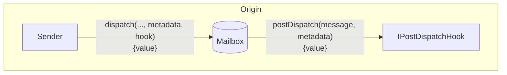

If the `postDispatch` function receives insufficient payment, it may revert.

> [!WARNING]
> Post-Dispatch Hooks may be replayable. Developers creating custom hooks should implement safe checks to prevent this behavior. [Here](./warp-route/RateLimitedHook.sol#L16) is an example implementation.

#### Quote Dispatch (Fees)

Fees are often charged in `postDispatch` to cover costs such as destination chain transaction submission and security provisioning. To receive a quote for a corresponding `postDispatch` call, you can query the `quoteDispatch` function.

The Mailbox has a `quoteDispatch` function that returns the aggregate fee required for a `dispatch` call to be successful.

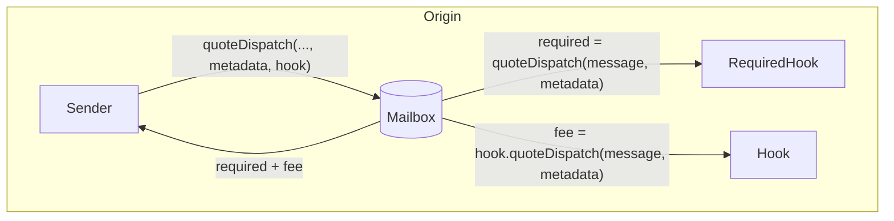

The custom `metadata` will be passed to the required hook's `quoteDispatch` and `postDispatch` functions, before being passed to the default hook's `postDispatch` function.

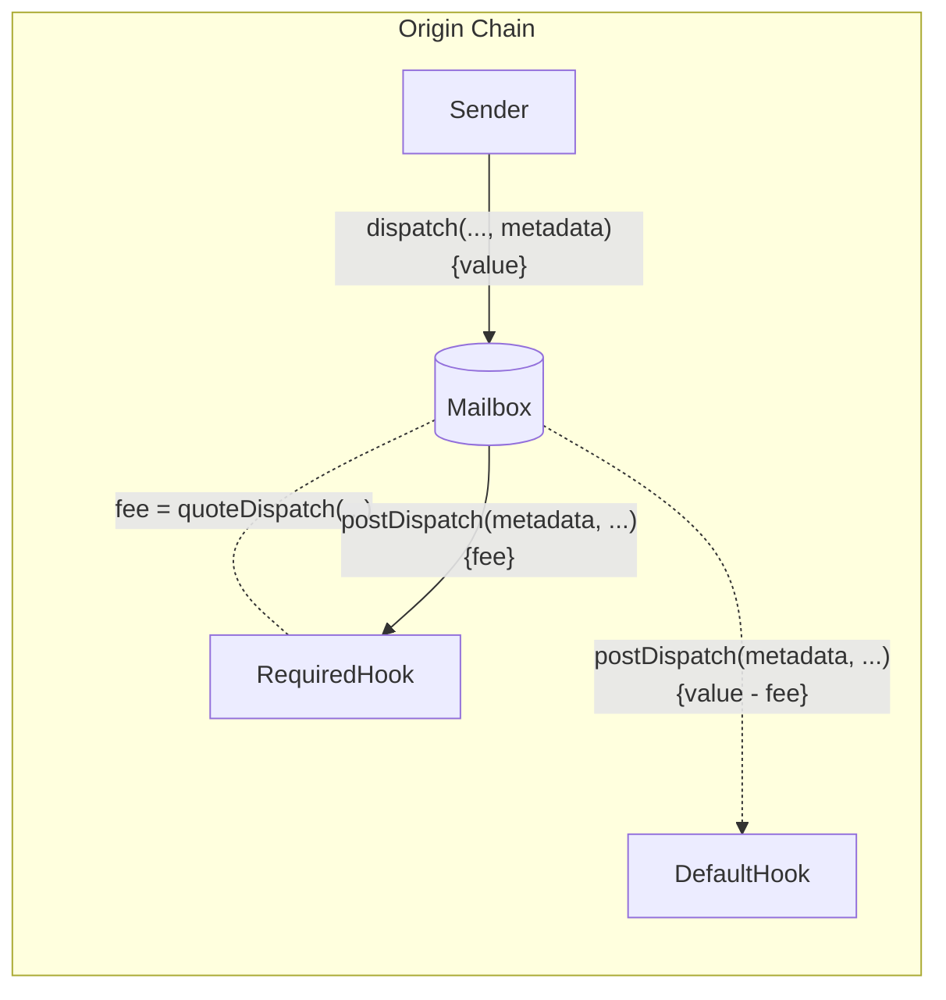

---

<a id="doc_19"></a>

## 📁 solidity/contracts/isms / Interchain Security Modules

*파일 경로: solidity/contracts/isms/README.md*

Interchain security modules allow developers to configure additional security checks for message content dispatched via the Mailbox.

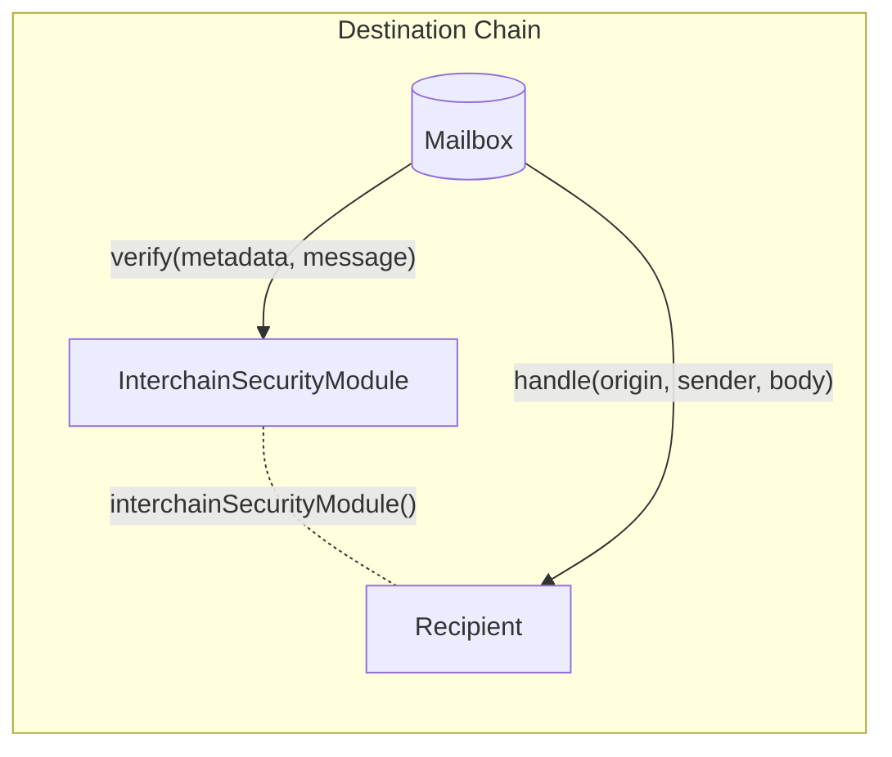

> [!WARNING]
> Interchain security modules may be replayable. Developers creating custom modules should include replay protection if necessary. [Here](./warp-route/RateLimitedIsm.sol#L23) is an example implementation.

---

<a id="doc_20"></a>

## 📁 solidity/contracts/middleware / Middleware Contracts

*파일 경로: solidity/contracts/middleware/README.md*

### Interchain Accounts

An interchain account is a smart contract that is deployed on a remote chain controlled exclusively by the origin chain's deployer account.
Interchain accounts provide developers with a [transparent multicall API](libs/OwnableMulticall.sol) to remote smart contracts.
This avoids the need to deploy application specific smart contracts on remote chains while simultaneously enabling cross-chain composability.

See [IBC Interchain Accounts](https://github.com/cosmos/ibc/blob/main/spec/app/ics-027-interchain-accounts/README.md) for the Cosmos ecosystem equivalent.

### Interchain Query System

The interchain query system generalizes view calls to contracts on remote chains. It is a [transparent multicall API](libs/OwnableMulticall.sol) that can be used to query remote smart contracts. This avoids the need to deploy application specific smart contracts on remote chains while simultaneously enabling cross-chain composability.

See [IBC Interchain Query System](https://github.com/cosmos/ibc/tree/main/spec/app/ics-031-crosschain-queries) for the Cosmos ecosystem equivalent.

---

<a id="doc_21"></a>

## 📁 solidity/contracts/token / Hyperlane Tokens and Warp Routes

*파일 경로: solidity/contracts/token/README.md*

This repo contains contracts and SDK tooling for Hyperlane-connected ERC20 and ERC721 tokens. The contracts herein can be used to create [Hyperlane Warp Routes](https://docs.hyperlane.xyz/docs/reference/applications/warp-routes) across different chains.

For instructions on deploying Warp Routes, see [the deployment documentation](https://docs.hyperlane.xyz/docs/deploy-hyperlane#deploy-a-warp-route) and the [Hyperlane CLI](https://www.npmjs.com/package/@hyperlane-xyz/cli).

### Warp Route Architecture

A Warp Route is a collection of [`TokenRouter`](./libs/TokenRouter.sol) contracts deployed across a set of Hyperlane chains. These contracts leverage the `Router` pattern to implement access control and routing logic for remote token transfers. These contracts send and receive [`Messages`](./libs/TokenMessage.sol) which encode payloads containing a transfer `amount` and `recipient` address.

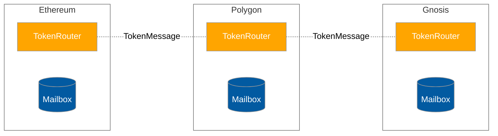

The Token Router contract comes in several flavors and a warp route can be composed of a combination of these flavors.

- [`Native`](./HypNative.sol) - for warping native assets (e.g. ETH) from the canonical chain
- [`Collateral`](./HypERC20Collateral.sol) - for warping tokens, ERC20 or ERC721, from the canonical chain
- [`Synthetic`](./HypERC20.sol) - for representing tokens, Native/ERC20 or ERC721, on a non-canonical chain

### Interchain Security Models

Warp routes are unique amongst token bridging solutions because they provide modular security. Because the `TokenRouter` implements the `IMessageRecipient` interface, it can be configured with a custom interchain security module. Please refer to the relevant guide to specifying interchain security modules on the [Messaging API receive docs](https://docs.hyperlane.xyz/docs/reference/messaging/messaging-interface).

### Remote Transfer Lifecycle Diagrams

To initiate a remote transfer, users call the `TokenRouter.transferRemote` function with the `destination` chain ID, `recipient` address, and transfer `amount`.

```solidity
interface TokenRouter {
  function transferRemote(
    uint32 destination,
    bytes32 recipient,
    uint256 amount
  ) public returns (bytes32 messageId);
}
```

**NOTE:** The [Relayer](https://docs.hyperlane.xyz/docs/operate/relayer/run-relayer) shown below must be compensated. Please refer to the details on [paying for interchain gas](https://docs.hyperlane.xyz/docs/protocol/interchain-gas-payment).

Depending on the flavor of TokenRouter on the source and destination chain, this flow looks slightly different. The following diagrams illustrate these differences.

#### Transfer Alice's `amount` native ETH from Ethereum to Bob on Polygon

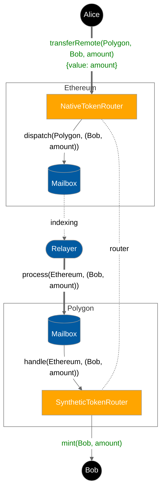

#### Transfer Alice's ERC20 `amount` from Ethereum to Bob on Polygon

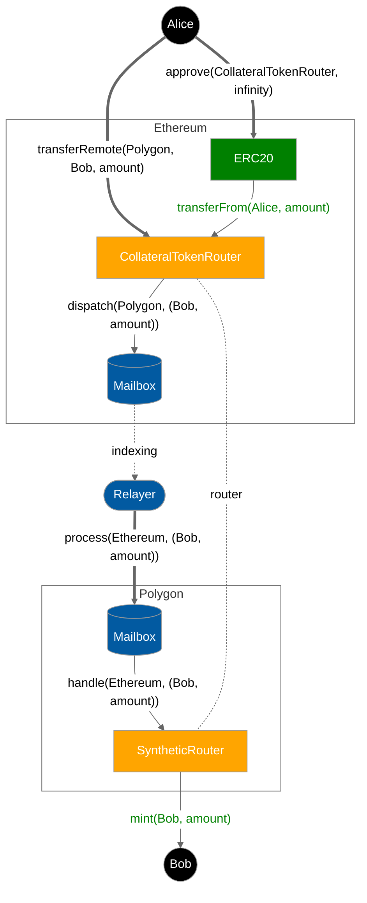

#### Transfer Alice's `amount` synthetic MATIC from Ethereum back to Bob as native MATIC on Polygon

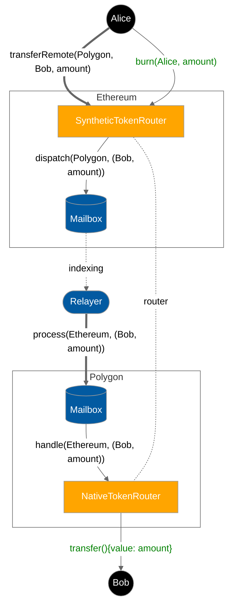

**NOTE:** ERC721 collateral variants are assumed to [enumerable](https://docs.openzeppelin.com/contracts/4.x/api/token/erc721#IERC721Enumerable) and [metadata](https://docs.openzeppelin.com/contracts/4.x/api/token/erc721#IERC721Metadata) compliant.

### Versions

| Git Ref                  | Release Date | Notes                          |
| ------------------------ | ------------ | ------------------------------ |
| [audit-v2-remediation]() | 2023-02-15   | Hyperlane V2 Audit remediation |
| [main]()                 | ~            | Bleeding edge                  |

### Learn more

For more information, see the [Hyperlane introduction documentation](https://docs.hyperlane.xyz/docs/intro).

---

<a id="doc_22"></a>

## 📁 solidity/contracts/token/extensions / Yield Routes

*파일 경로: solidity/contracts/token/extensions/4626.md*

Yield routes are a mechanism to transfer yield-bearing assets across chains using the ERC4626 standard.

`HypERC4626Collateral` is a contract that implements `ERC4626` deposits upon transfer and withdrawal upon transfer back.

`HypERC4646` is a contract that implements a rebasing `ERC20`. Balances are virtualized as vault shares times the total assets over the total shares in the `ERC4626` vault (on the collateral chain).

### `HypERC4626Collateral.transferRemote`

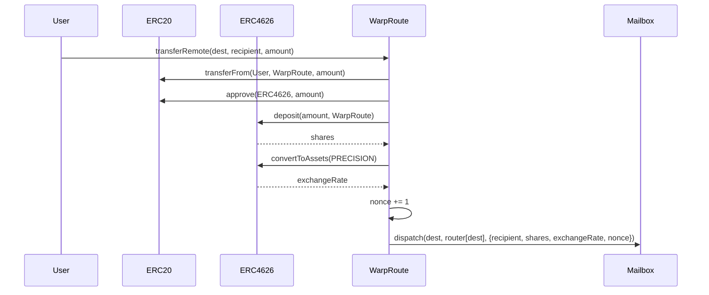

### `HypERC4626.handle`

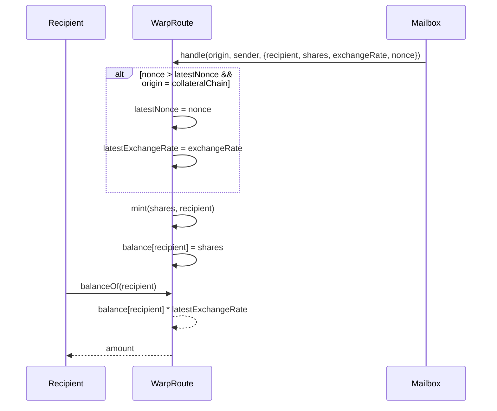

### `HypERC4626.transferRemote`

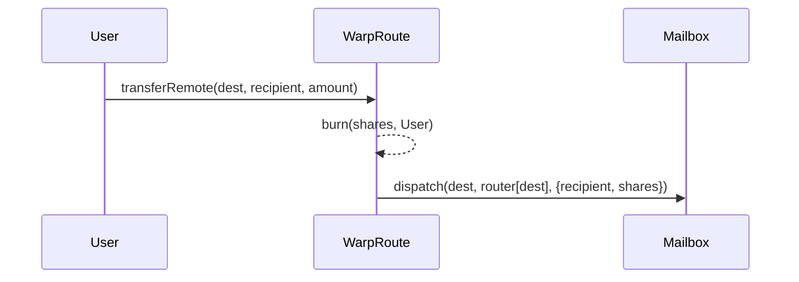

### `HypERC4626Collateral.handle`

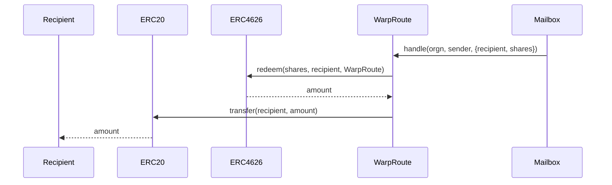

---

<a id="doc_23"></a>

## 📁 starknet / @hyperlane-xyz/starknet-core

*파일 경로: starknet/CHANGELOG.md*

### 13.1.1

#### Patch Changes

- ba4deea: Revert workspace dependency syntax.

### 13.1.0

### 13.0.0

#### Major Changes

- f8696c7: feat: Add Starknet contract ABI fetching and contract artifact generation

---

<a id="doc_24"></a>

## 📁 starknet / Hyperlane Starknet Core

*파일 경로: starknet/README.md*

The Hyperlane Starknet Core package provides TypeScript tooling for interacting with Hyperlane's Cairo contracts on Starknet. It includes TypeScript artifacts autogenerated from Cairo contracts developed in collaboration with Astraly Labs.

### Features

- Pre-compiled Cairo contract ABI artifacts
- TypeScript bindings for Starknet contracts

### Installation

```bash
## Install with NPM
npm install @hyperlane-xyz/starknet-core

## Or with Yarn
yarn add @hyperlane-xyz/starknet-core
```

### Requirements

- Node.js 18 or newer
- For development: `curl`, `jq`, and `unzip` utilities

### Usage

```typescript
import {
  ContractType,
  getCompiledContract,
} from '@hyperlane-xyz/starknet-core';

// Get the Hyperlane mailbox contract
const mailboxContract = getCompiledContract('mailbox');

// Get token contracts
const tokenContract = getCompiledContract('erc20', ContractType.TOKEN);

// Get mock contracts
const mockContract = getCompiledContract('mock_validator', ContractType.MOCK);
```

### Contract Categories

Contracts are organized into three categories:

- `contracts`: Core Hyperlane protocol contracts
- `tokens`: Token implementation contracts
- `mocks`: Test and mock contracts

### Development

#### Setup

1. Clone the repository
2. Install dependencies: `yarn install`

#### Build Process

The build process combines multiple steps in a specific order:

```bash
yarn build
```

This command runs:

1. TypeScript compilation (`tsc`)
2. Fetching contract artifacts from GitHub (`fetch-contracts`)
3. Generating TypeScript ABI artifacts from Cairo contracts (`generate-artifacts`)

All build output is placed in the `dist` directory.

#### Individual Build Steps

You can also run the individual build steps separately:

##### Fetching Contract Artifacts

```bash
yarn fetch-contracts
```

This downloads the contract artifacts from the [Hyperlane Starknet repository](https://github.com/hyperlane-xyz/hyperlane_starknet).

##### Generating TypeScript Artifacts

```bash
yarn generate-artifacts
```

This creates JavaScript and TypeScript declaration files in the `dist/artifacts` directory.

### License

Apache 2.0

---

<a id="doc_25"></a>

## 📁 tools/grafana / Grafana Dashboards

*파일 경로: tools/grafana/README.md*

NOTE: the dashboards here are not synced to our internal grafana and will need to manually be
updated when we want to update our published templates.

### Importing

1. Create a new dashboard in grafana
2. Select the gear icon "dashboard settings"
3. Select "JSON Model"
4. Copy/paste from the "\*.json" file

### Exporting

1. Open a dashboard
2. Select the gear icon "dashboard settings"
3. Select "JSON Model"
4. Copy/paste to a "\*.json" file
5. Remove `deployment`, `context`, and any other variables which are specific to our internal use
6. Rename `grafanacloud-prom` to `<prometheus>`

---

<a id="doc_26"></a>

## 📁 typescript/.changeset / pink-mirrors-sneeze

*파일 경로: typescript/.changeset/pink-mirrors-sneeze.md*

---
'@hyperlane-xyz/sdk': major
---

Refactor testIgpConfig function for clarity and maintainability

---

<a id="doc_27"></a>

## 📁 typescript/.changeset / tall-radios-grin

*파일 경로: typescript/.changeset/tall-radios-grin.md*

---
'@hyperlane-xyz/sdk': major
---

fix(sdk): refactor `addVerificationArtifacts` for enhanced Artifact Deduplication in HyperlaneDeployer

---

<a id="doc_28"></a>

## 📁 typescript/ccip-server / @hyperlane-xyz/ccip-server

*파일 경로: typescript/ccip-server/CHANGELOG.md*

### 13.1.1

#### Patch Changes

- ba4deea: Revert workspace dependency syntax.

### 13.1.0

### 13.0.0

### 12.6.0

### 12.5.0

### 12.4.0

### 12.3.0

### 12.2.0

### 12.1.0

### 12.0.0

### 11.0.0

### 10.0.0

### 9.2.1

### 9.2.0

### 9.1.0

### 9.0.0

### 8.9.0

### 8.8.1

### 8.8.0

### 8.7.0

### 8.6.1

### 8.6.0

### 8.5.0

### 8.4.0

### 8.3.0

### 8.2.0

### 8.1.0

### 8.0.0

### 7.3.0

### 7.2.0

### 7.1.0

### 7.0.0

### 6.0.0

### 5.7.0

### 5.6.2

### 5.6.1

### 5.6.0

### 5.5.0

### 5.4.0

### 5.3.0

### 5.2.1

### 5.2.0

#### Patch Changes

- 5a0d68bdc: replace import console module with direct console

### 5.1.0

### 5.0.0

### 4.1.0

### 4.0.0

### 3.16.0

### 3.15.1

### 3.15.0

### 3.14.0

### 3.13.0

### 3.12.0

### 3.11.1

### 3.11.0

### 3.10.0

#### Minor Changes

- 96485144a: SDK support for ICA deployment and operation.

### 3.9.0

### 3.8.2

### 3.8.1

### 3.8.0

---

<a id="doc_29"></a>

## 📁 typescript/ccip-server / CCIP-read service framework

*파일 경로: typescript/ccip-server/README.md*

This package contains the service framework for the CCIP-read project, built off of the [CCIP-server framework](https://github.com/smartcontractkit/ccip-read). It allows building of any execution logic, given a Hyperlane Relayer call.

## Definitions

- Server: The main entry point, and refers to `server.ts`.
- Service: A class that handles all logic for a particular service, e.g. ProofService, RPCService, etc.
- Service ABI: The interface for a service that tells the Server what input and output to expect. It serves similar functionalities as the Solidity ABIs, i.e., used for encoding and decoding data.

## Usage

The Relayer will make a POST request to the Server with a request body similar to the following:

```json
{
  "data": "0x0ee9bb2f000000000000000000000000873afca0319f5c04421e90e882566c496877aff8000000000000000000000000000000000000000000000000000000000000006000000000000000000000000000000000000000000000000000000000000000010000000000000000000000000000000000000000000000000000000000000001a2d9059b6d822aa460229510c754e9ecec100bb9f649186f5c7d4da8edf59858",
  "sender": "0x4a679253410272dd5232b3ff7cf5dbb88f295319"
}
```

The `data` property will be ABI-encoded, and server will parse it according to the Service ABI. It then will call the handler function with the parsed input.

## Building a Service

1. Create a Service ABI for your Service. This ABI tells the Server how to parse the incoming `data`, and how to encode the output. See `/abi/ProofsServiceAbi.ts` for an example.
2. Create a new Service class to handle your logic. This should inherit from `HandlerDescriptionEnumerated` if a function will be used to handle a Server request. The handler function should return a Promise that resolves to the output of the Service. See `/service/ProofsService.ts` for examples.
3. Instantiate the new Service in `server.ts`. For example:

```typescript
const proofsService = new ProofsService(
  config.LIGHT_CLIENT_ADDR,
  config.RPC_ADDRESS,
  config.STEP_FN_ID,
  config.CHAIN_ID,
  config.SUCCINCT_PLATFORM_URL,
  config.SUCCINCT_API_KEY,
);
```

4. Add the new Service by calling `server.add(...)` by providing the Service ABI, and the handler function. For example:

```typescript
server.add(ProofsServiceAbi, [proofsService.handler('getProofs')]);
```

---

<a id="doc_30"></a>

## 📁 typescript/cli / @hyperlane-xyz/cli

*파일 경로: typescript/cli/CHANGELOG.md*

### 13.1.1

#### Patch Changes

- ba4deea: Revert workspace dependency syntax.

### 13.1.0

#### Minor Changes

- ac13dde: add cosmos native core cli commands

#### Patch Changes

- 754f7ba: disable cosmos native signers and only allow evm signers for now again
- 86a8502: Change info logs to debug logs in MultiProtocolSignerManager.extractPrivateKey().

### 13.0.0

### 12.6.0

#### Minor Changes

- 2ae0f72: Add contract verification to CLI Warp Checker
- 672d6d1: adds logic to expand an ism or hook config if it is partially defined in the input file for the warp checker
- aec8961: Updates the `warp check` command output to only show fields that have diffs with the expected config
- e25af4b: Fixed warp route ID lookup to use deployment configs instead of warp routes when prompting users for selection on warp deployment
- ce0b173: Refactored warp route configuration functions to use object parameters instead of positional parameters for improved clarity and flexibility.
- 1770318: Upgraded @hyperlane-xyz/registry to v14.0.0 and updated warp route config API usage.
- 6a70b8d: Move executeDeploy logic from CLI to SDK
- 248d2e1: Enables the CLI to warp check routes that include non EVM routes
- de7c6ae: Added registry based warp configs support
- e381a8d: Update Registry version to 15.0.0

#### Patch Changes

- 166f849: Remove outputting isNft in warp init config
- f6ed6ad: Fixed proxy admin ownership transfer logic when the config is not specified in the input file

### 12.5.0

#### Minor Changes

- 862f14f: feat(cli): Add registry-based warp route lookup and config validation

### 12.4.0

### 12.3.0

#### Minor Changes

- 5db39f493: Fixes to support CosmosNative and warp apply with foreign deployments.

### 12.2.0

### 12.1.0

#### Patch Changes

- Updated dependencies [acbf5936a]
- Updated dependencies [c757b6a18]
- Updated dependencies [a646f9ca1]
- Updated dependencies [3b615c892]
  - @hyperlane-xyz/sdk@12.1.0
  - @hyperlane-xyz/utils@12.1.0

### 12.0.0

#### Minor Changes

- 82166916a: feat: support github auth token for authenticated registries

#### Patch Changes

- Updated dependencies [f7ca32315]
- Updated dependencies [4d3738d14]
- Updated dependencies [07321f6f0]
- Updated dependencies [59a087ded]
- Updated dependencies [59a087ded]
- Updated dependencies [337193305]
  - @hyperlane-xyz/sdk@12.0.0
  - @hyperlane-xyz/utils@12.0.0

### 11.0.0

#### Patch Changes

- Updated dependencies [888d180b6]
- Updated dependencies [3b060c3e1]
  - @hyperlane-xyz/sdk@11.0.0
  - @hyperlane-xyz/utils@11.0.0

### 10.0.0

#### Patch Changes

- Updated dependencies [7dbf7e4fa]
- Updated dependencies [b8d95fc95]
- Updated dependencies [28ca87293]
- Updated dependencies [4fd5623b8]
  - @hyperlane-xyz/sdk@10.0.0
  - @hyperlane-xyz/utils@10.0.0

### 9.2.1

#### Patch Changes

- Updated dependencies [e3d09168e]
  - @hyperlane-xyz/sdk@9.2.1
  - @hyperlane-xyz/utils@9.2.1

### 9.2.0

#### Patch Changes

- 2955bd990: Catch and log error instead of hard exiting when unable to get the tx receipt of a delivered message.
- 53dd71a4b: Do not error in hyperlane status if chain does not contain block explorer URL.
- Updated dependencies [7fe739d52]
- Updated dependencies [3e66e8f12]
- Updated dependencies [3852a9015]
  - @hyperlane-xyz/sdk@9.2.0
  - @hyperlane-xyz/utils@9.2.0

### 9.1.0

#### Minor Changes

- cad82683f: Extracted ISM and Hook factory addresses into a reusable utility function to reduce repetition and improve maintainability.
- cad82683f: Improved warp route extension and configuration handling

#### Patch Changes

- 9f9e2c3b5: fix `warp check` command to correctly check the remote routers in the config
- Updated dependencies [67d91e489]
- Updated dependencies [cad82683f]
- Updated dependencies [97c773476]
- Updated dependencies [351bf0010]
- Updated dependencies [cad82683f]
  - @hyperlane-xyz/sdk@9.1.0
  - @hyperlane-xyz/utils@9.1.0

### 9.0.0

#### Minor Changes

- 0d8624d99: Make mailbox optional on warp deploy config

#### Patch Changes

- Updated dependencies [0d8624d99]
- Updated dependencies [b07e2f2ea]
- Updated dependencies [4df37393f]
- Updated dependencies [88970a78c]
  - @hyperlane-xyz/sdk@9.0.0
  - @hyperlane-xyz/utils@9.0.0

### 8.9.0

#### Minor Changes

- 05f89650b: Added utils for fetching extra lockboxes data from a xERC20 warp route
- d121c1cb8: Add XERC20 derivation in SDK/CLI Warp Reading
- d6ddf5b9e: make warp:read and warp:check/warp:verify operations independent of signer requirements
- 766f50695: Change semantics of ism/hook config from undefined to 0x0 for reading/checking purposes
- 1955579cf: Expand warpDeployConfig for checking purposes
- 33178eaa8: Move getRegistry function from the CLI to `@hyperlane-xyz/registry` package.
- 4147f91cb: Added support for the new AmountRoutingIsm to be deployed and managed by the cli
- 500249649: Enable usage of CCIP Hooks and ISMs in warp routes.
- 03266e2c2: add amount routing hook support in the sdk and cli

#### Patch Changes

- 9fd3aa4f3: Correctly await address in native balance check.
- a835d5c5c: Only relay specified message ID
- Updated dependencies [05f89650b]
- Updated dependencies [d121c1cb8]
- Updated dependencies [3518f8901]
- Updated dependencies [d6ddf5b9e]
- Updated dependencies [766f50695]
- Updated dependencies [e78060d73]
- Updated dependencies [cb7c157f0]
- Updated dependencies [ede0cbc15]
- Updated dependencies [1955579cf]
- Updated dependencies [57137dad4]
- Updated dependencies [3518f8901]
- Updated dependencies [500249649]
- Updated dependencies [03266e2c2]
- Updated dependencies [cb93c13a4]
- Updated dependencies [456407dc7]
- Updated dependencies [4147f91cb]
  - @hyperlane-xyz/utils@8.9.0
  - @hyperlane-xyz/sdk@8.9.0

### 8.8.1

#### Patch Changes

- c68529807: Update registry dependency.
  - @hyperlane-xyz/sdk@8.8.1
  - @hyperlane-xyz/utils@8.8.1

### 8.8.0

#### Minor Changes

- d82d24cc7: Update `hyperlane warp init` to be undefined for ISM by default.
- b054b0424: Update `hyperlane warp init` to not output proxyAdmin by default.

#### Patch Changes

- Updated dependencies [719d022ec]
- Updated dependencies [c61546cb7]
  - @hyperlane-xyz/sdk@8.8.0
  - @hyperlane-xyz/utils@8.8.0

### 8.7.0

#### Minor Changes

- db832b803: Added support for multiple registries in CLI with prioritization.
- 7dd1f64a6: Update submitWarpApplyTransactions() to try-catch and print safe errors

#### Patch Changes

- Updated dependencies [bd0b8861f]
- Updated dependencies [55db270e3]
- Updated dependencies [b92eb1b57]
- Updated dependencies [ede0cbc15]
- Updated dependencies [12e3c4da0]
- Updated dependencies [d6724c4c3]
- Updated dependencies [d93a38cab]
  - @hyperlane-xyz/sdk@8.7.0
  - @hyperlane-xyz/utils@8.7.0

### 8.6.1

#### Patch Changes

- 236f27b5f: Fix cli package dependencies.
  - @hyperlane-xyz/sdk@8.6.1
  - @hyperlane-xyz/utils@8.6.1

### 8.6.0

#### Minor Changes

- d2bc2cfec: Update CLI package.json to be able to export functions

#### Patch Changes

- 1e6ee0b9c: Fix default multichain strategy resolving.
- Updated dependencies [407d82004]
- Updated dependencies [ac984a17b]
- Updated dependencies [276d7ce4e]
- Updated dependencies [ba50e62fc]
- Updated dependencies [1e6ee0b9c]
- Updated dependencies [77946bb13]
  - @hyperlane-xyz/sdk@8.6.0
  - @hyperlane-xyz/utils@8.6.0

### 8.5.0

#### Patch Changes

- Updated dependencies [55b8ccdff]
  - @hyperlane-xyz/sdk@8.5.0
  - @hyperlane-xyz/utils@8.5.0

### 8.4.0

#### Patch Changes

- Updated dependencies [f6b682cdb]
  - @hyperlane-xyz/sdk@8.4.0
  - @hyperlane-xyz/utils@8.4.0

### 8.3.0

#### Minor Changes

- 228f7c3d1: Fix issue where warp deploy artifacts did not include correct symbols.

#### Patch Changes

- Updated dependencies [7546c0181]
- Updated dependencies [49856fbb9]
  - @hyperlane-xyz/sdk@8.3.0
  - @hyperlane-xyz/utils@8.3.0

### 8.2.0

#### Minor Changes

- 9eb19cac7: Add explorer link to warp send and send message commands
- aad2c2d1e: Fixing the chain resolver checks and handling for argv.chain

#### Patch Changes

- 1536ea570: Print displayName instead of chain name in signer validity logs.
- Updated dependencies [69a684869]
  - @hyperlane-xyz/sdk@8.2.0
  - @hyperlane-xyz/utils@8.2.0

### 8.1.0

#### Minor Changes

- 2d018fa7a: Fix hyperlane warp send where --origin and --destination are out of order

#### Patch Changes

- Updated dependencies [79c61c891]
- Updated dependencies [9518dbc84]
- Updated dependencies [9ab961a79]
  - @hyperlane-xyz/sdk@8.1.0
  - @hyperlane-xyz/utils@8.1.0

### 8.0.0

#### Minor Changes

- fd20bb1e9: Add FeeHook and Swell to pz and ez eth config generator. Bump up Registry 6.6.0
- bb44f9b51: Add support for deploying Hooks using a HookConfig within a WarpConfig
- c2ca8490d: fix signer strategy init for broken cli commands
- 9f6b8c514: Allow self-relaying of all messages if there are multiple in a given dispatch transaction.
- 3c4bc1cca: Update hyperlane warp send to send a round trip transfer to all chains in WarpCoreConfig, if --origin and/or --destination is not provided.
- 79f8197f3: Added strategy management CLI commands and MultiProtocolSigner implementation for flexible cross-chain signer configuration and management
- a5ece3b30: Add chain technical stack selector with Arbitrum Nitro support to `hyperlane registry init` command
- d35502fa7: Update single chain selection to be searchable instead of a simple select

#### Patch Changes

- 472b34670: Bump registry version to v6.3.0.
- 0c8372447: fix: balance check skip confirmation
- 657ac9255: Suppress help on CLI failures
- 9349ef73e: Fix strategy flag propagation
- cd7c41308: Fix yaml resource exhaustion
- 98ee79c17: Added ZKSync signer support using zksync-ethers package
- Updated dependencies [472b34670]
- Updated dependencies [79f8197f3]
- Updated dependencies [fd20bb1e9]
- Updated dependencies [26fbec8f6]
- Updated dependencies [71aefa03e]
- Updated dependencies [9f6b8c514]
- Updated dependencies [82cebabe4]
- Updated dependencies [95cc9571e]
- Updated dependencies [c690ca82f]
- Updated dependencies [5942e9cff]
- Updated dependencies [de1190656]
- Updated dependencies [e9911bb9d]
- Updated dependencies [8834a8c92]
  - @hyperlane-xyz/sdk@8.0.0
  - @hyperlane-xyz/utils@8.0.0

### 7.3.0

#### Minor Changes

- aa1ea9a48: updates the warp deployment config schema to be closer to the ica routing schema
- 323f0f158: Add ICAs management in core apply command

#### Patch Changes

- 455a897fb: Fix a bug where it would try to relay the incorrect message from a transaction that dispatches multiple messages.
- Updated dependencies [2054f4f5b]
- Updated dependencies [a96448fa6]
- Updated dependencies [170a0fc73]
- Updated dependencies [9a09afcc7]
- Updated dependencies [24784af95]
- Updated dependencies [3e8dd70ac]
- Updated dependencies [aa1ea9a48]
- Updated dependencies [665a7b8d8]
- Updated dependencies [f0b98fdef]
- Updated dependencies [ff9e8a72b]
- Updated dependencies [97c1f80b7]
- Updated dependencies [323f0f158]
- Updated dependencies [61157097b]
  - @hyperlane-xyz/sdk@7.3.0
  - @hyperlane-xyz/utils@7.3.0

### 7.2.0

#### Minor Changes

- d51815760: Support using the CLI to deploy warp routes that involve foreign deployments
- 81ab4332f: Remove ismFactoryAddresses from warpConfig
- 4b3537470: Changed the type of defaultMultisigConfigs, to track validator aliases in addition to their addresses.

#### Patch Changes

- Updated dependencies [81ab4332f]
- Updated dependencies [4b3537470]
- Updated dependencies [fa6d5f5c6]
- Updated dependencies [fa6d5f5c6]
  - @hyperlane-xyz/sdk@7.2.0
  - @hyperlane-xyz/utils@7.2.0

### 7.1.0

#### Minor Changes

- 5db46bd31: Implements persistent relayer for use in CLI

#### Patch Changes

- Updated dependencies [6f2d50fbd]
- Updated dependencies [1159e0f4b]
- Updated dependencies [0e285a443]
- Updated dependencies [ff2b4e2fb]
- Updated dependencies [0e285a443]
- Updated dependencies [5db46bd31]
- Updated dependencies [0cd65c571]
  - @hyperlane-xyz/sdk@7.1.0
  - @hyperlane-xyz/utils@7.1.0

### 7.0.0

#### Minor Changes

- fa424826c: Add support for updating the mailbox proxy admin owner
- 836060240: Add storage based multisig ISM types

#### Patch Changes

- Updated dependencies [bbb970a44]
- Updated dependencies [fa424826c]
- Updated dependencies [f48cf8766]
- Updated dependencies [40d59a2f4]
- Updated dependencies [0264f709e]
- Updated dependencies [836060240]
- Updated dependencies [ba0122279]
- Updated dependencies [e6f9d5c4f]
- Updated dependencies [f24835438]
- Updated dependencies [5f41b1134]
  - @hyperlane-xyz/sdk@7.0.0
  - @hyperlane-xyz/utils@7.0.0

### 6.0.0

#### Major Changes

- e3b97c455: Detangle assumption that chainId == domainId for EVM chains. Domain IDs and Chain Names are still unique, but chainId is no longer guaranteed to be a unique identifier. Domain ID is no longer an optional field and is now required for all chain metadata.

#### Patch Changes

- Updated dependencies [7b3b07900]
- Updated dependencies [30d92c319]
- Updated dependencies [e3b97c455]
  - @hyperlane-xyz/sdk@6.0.0
  - @hyperlane-xyz/utils@6.0.0

### 5.7.0

#### Minor Changes

- db0e73502: re-enable space key for multiselect cli prompt
- 7e9e248be: Add feat to allow updates to destination gas using warp apply
- 4c0605dca: Add optional proxy admin reuse in warp route deployments and admin proxy ownership transfer in warp apply
- db5875cc2: Add `hyperlane warp verify` to allow post-deployment verification.
- 956ff752a: Enable configuration of IGP hooks in the CLI

#### Patch Changes

- Updated dependencies [5dabdf388]
- Updated dependencies [469f2f340]
- Updated dependencies [e104cf6aa]
- Updated dependencies [d9505ab58]
- Updated dependencies [04108155d]
- Updated dependencies [7e9e248be]
- Updated dependencies [4c0605dca]
- Updated dependencies [db9196837]
- Updated dependencies [db5875cc2]
- Updated dependencies [56328e6e1]
- Updated dependencies [956ff752a]
- Updated dependencies [39a9b2038]
  - @hyperlane-xyz/sdk@5.7.0
  - @hyperlane-xyz/utils@5.7.0

### 5.6.2

#### Patch Changes

- Updated dependencies [5fd4267e7]
- Updated dependencies [a36fc5fb2]
  - @hyperlane-xyz/utils@5.6.2
  - @hyperlane-xyz/sdk@5.6.2

### 5.6.1

#### Patch Changes

- 3474a8450: Explicitly define inquirer/core and inquirier/figures dependencies
  - @hyperlane-xyz/sdk@5.6.1
  - @hyperlane-xyz/utils@5.6.1

### 5.6.0

#### Minor Changes

- 41035aac8: Add strategyUrl detect and validation in the beginning of `warp apply`
  Remove yaml transactions print from `warp apply`
- 29341950e: Adds new `core check` command to compare local configuration and on chain deployments. Adds memoization to the EvmHookReader to avoid repeating configuration derivation
- 32d0a67c2: Adds the warp check command to compare warp routes config files with on chain warp route deployments
- 3662297fc: Add prompt in `warp init` command to choose if a trusted relayer should be used instead of making the choice by default for the user and enable the `--yes` flag to default to a trusted ISM
- b1ff48bd1: Add rebasing yield route support into CLI/SDK
- d41aa6928: Add `EthJsonRpcBlockParameterTag` enum for validating reorgPeriod
- c3e9268f1: Add support for an arbitrary string in `reorgPeriod`, which is used as a block tag to get the finalized block.
- a4d5d692f: Update `warp apply` such that it updates in place AND extends in a single call
- 01e7070eb: updates the multi chain selection prompt by adding search functionality and an optional confirmation prompt for the current selection

#### Patch Changes

- e89f9e35d: Update registry to v4.7.0
- Updated dependencies [f1712deb7]
- Updated dependencies [46044a2e9]
- Updated dependencies [02a5b92ba]
- Updated dependencies [29341950e]
- Updated dependencies [8001bbbd6]
- Updated dependencies [32d0a67c2]
- Updated dependencies [b1ff48bd1]
- Updated dependencies [d41aa6928]
- Updated dependencies [c3e9268f1]
- Updated dependencies [7d7bcc1a3]
- Updated dependencies [7f3e0669d]
- Updated dependencies [2317eca3c]
  - @hyperlane-xyz/utils@5.6.0
  - @hyperlane-xyz/sdk@5.6.0

### 5.5.0

#### Patch Changes

- fcfe91113: Reuse SDK transaction typings in tx submitters
- Updated dependencies [2afc484a2]
- Updated dependencies [2afc484a2]
- Updated dependencies [3254472e0]
- Updated dependencies [fcfe91113]
- Updated dependencies [6176c9861]
  - @hyperlane-xyz/sdk@5.5.0
  - @hyperlane-xyz/utils@5.5.0

### 5.4.0

#### Minor Changes

- 4415ac224: Add Gnosis safe transaction builder to warp apply

#### Patch Changes

- Updated dependencies [4415ac224]
  - @hyperlane-xyz/utils@5.4.0
  - @hyperlane-xyz/sdk@5.4.0

### 5.3.0

#### Minor Changes

- 35d4503b9: Update to registry v4.3.6
- aef3dbf4d: Remove mailbox choice prompt if it can be automatically detected from the registry

#### Patch Changes

- a513e1b51: Override default with merkle hook for self relay
- Updated dependencies [eb47aaee8]
- Updated dependencies [50319d8ba]
- Updated dependencies [8de531fa4]
- Updated dependencies [746eeb9d9]
- Updated dependencies [fd536a79a]
- Updated dependencies [50319d8ba]
  - @hyperlane-xyz/sdk@5.3.0
  - @hyperlane-xyz/utils@5.3.0

### 5.2.1

#### Patch Changes

- @hyperlane-xyz/sdk@5.2.1
- @hyperlane-xyz/utils@5.2.1

### 5.2.0

#### Minor Changes

- a5afd20f3: Add CLI e2e typescript tests
- 203084df2: Added sdk support for Stake weighted ISM
- a46fe434a: Add hyperlane registry rpc and addresses --contract utils
- f2783c03b: Add ChainSubmissionStrategySchema
- 3c07ded5b: Add Safe submit functionality to warp apply

#### Patch Changes

- Updated dependencies [a19e882fd]
- Updated dependencies [d6de34ad5]
- Updated dependencies [518a1bef9]
- Updated dependencies [203084df2]
- Updated dependencies [74a592e58]
- Updated dependencies [739af9a34]
- Updated dependencies [44588c31d]
- Updated dependencies [2bd540e0f]
- Updated dependencies [291c5fe36]
- Updated dependencies [69f17d99a]
- Updated dependencies [3ad5918da]
- Updated dependencies [291c5fe36]
- Updated dependencies [9563a8beb]
- Updated dependencies [73c232b3a]
- Updated dependencies [445b6222c]
- Updated dependencies [d6de34ad5]
- Updated dependencies [2e6176f67]
- Updated dependencies [f2783c03b]
- Updated dependencies [2ffb78f5c]
- Updated dependencies [3c07ded5b]
- Updated dependencies [815542dd7]
  - @hyperlane-xyz/sdk@5.2.0
  - @hyperlane-xyz/utils@5.2.0

### 5.1.0

#### Minor Changes

- 013f19c64: Update to registry v2.5.0
- 013f19c64: Added SDK support for ArbL2ToL1Hook/ISM for selfrelay
- 013f19c64: Add output of hyperlane warp read to ./configs/warp-route-deployment.yaml
- 013f19c64: Remove registry.getUri() from core read logging to prevent registry error
- 013f19c64: Fixes the new chain message to display the correct command
- 013f19c64: Add check & confirm for existing mailbox to core deploy to allow users to decide if they want to deploy a new mailbox

#### Patch Changes

- 013f19c64: Require at least 1 chain selection in warp init
- 013f19c64: feat: Add long-running CLI relayer
- Updated dependencies [013f19c64]
- Updated dependencies [013f19c64]
- Updated dependencies [013f19c64]
- Updated dependencies [013f19c64]
- Updated dependencies [013f19c64]
- Updated dependencies [013f19c64]
- Updated dependencies [013f19c64]
- Updated dependencies [013f19c64]
- Updated dependencies [013f19c64]
- Updated dependencies [013f19c64]
- Updated dependencies [013f19c64]
- Updated dependencies [013f19c64]
- Updated dependencies [013f19c64]
- Updated dependencies [013f19c64]
- Updated dependencies [19f7d4fd9]
  - @hyperlane-xyz/sdk@5.1.0
  - @hyperlane-xyz/utils@5.1.0

### 5.0.0

#### Major Changes

- f1d70a5e8: refactor: select chain now become 2 step, select mainnet/testnet type first, then select chain

#### Minor Changes

- 388d25517: Added HyperlaneRelayer for relaying messages from the CLI
- d0f7f21fd: Fix logging for hyperlane core apply
- d00f2ffc0: Displays formatted deployment plan to confirm warp deploy.
- 40255575c: Adds blockExplorers option on registry init.
- 708999433: Adds hyperlane warp apply
- 0e1a80e6e: Improve chain metadata and address fetching from github registries
- 5529d98d0: Add hyperlane core apply with update ownership
- 62d71fad3: Add hyperlane warp update to extend a warp config
- 49986aa92: Add collateralAddressOrDenom for collateralVault
- ded5718a0: Update hyperlane core read to log the config terminal "preview", only if the number of lines is < 250
- 5125b798d: Prompt for chain testnet/mainnet during chain definition flow
- bb470aec2: Add 'submit' command to CLI.

#### Patch Changes

- 80ac5d28e: Display token symbol when balance is insufficient for command
- 6341edf2a: fix: use merkle tree hook address from registry for self relay hook derivations
- c539775d7: Default to mailbox address in registry
- c2a2897d7: Update CLI verbiage to ask for vault and not token when initiating collateralVault warp route.
- Updated dependencies [2c0ae3cf3]
- Updated dependencies [0dedbf5a0]
- Updated dependencies [388d25517]
- Updated dependencies [69a39da1c]
- Updated dependencies [4907b510c]
- Updated dependencies [488f949ef]
- Updated dependencies [c7f5a35e8]
- Updated dependencies [7265a4087]
- Updated dependencies [0a40dcb8b]
- Updated dependencies [f83b492de]
- Updated dependencies [79740755b]
- Updated dependencies [8533f9e66]
- Updated dependencies [ed65556aa]
- Updated dependencies [ab827a3fa]
- Updated dependencies [dfa908796]
- Updated dependencies [ed63e04c4]
- Updated dependencies [dfa908796]
- Updated dependencies [5aa24611b]
- Updated dependencies [cfb890dc6]
- Updated dependencies [708999433]
- Updated dependencies [5529d98d0]
- Updated dependencies [62d71fad3]
- Updated dependencies [49986aa92]
- Updated dependencies [7fdd3958d]
- Updated dependencies [8e942d3c6]
- Updated dependencies [fef629673]
- Updated dependencies [be4617b18]
- Updated dependencies [1474865ae]
  - @hyperlane-xyz/sdk@5.0.0
  - @hyperlane-xyz/utils@5.0.0

### 4.1.0

#### Minor Changes

- 4cc9327e5: Update warp deploy to handle xerc20, initializerArgs to be the signer, update deploy gas constants

#### Patch Changes

- 46652c62a: Fix the missing sorting in the YAML file generated
- 56be527d6: Fix typo in core read command
- 378a5b79f: Remove extra fields from warp core config
- Updated dependencies [36e75af4e]
- Updated dependencies [d31677224]
- Updated dependencies [4cc9327e5]
- Updated dependencies [1687fca93]
  - @hyperlane-xyz/sdk@4.1.0
  - @hyperlane-xyz/utils@4.1.0

### 4.0.0

#### Major Changes

- df6a18053: Release CLI v4.0.0.

#### Minor Changes

- 44cc9bf6b: Add CLI command to support AVS validator status check
- b05ae38ac: Gracefully handle RPC failures during warp send & fix deriving hook error that prevents warp and core test messages on the cli.
- 9304fe241: Use metadata builders in message relaying
- 6398aab72: Upgrade registry to 2.1.1
- 5c8ba0b85: Rename hyperlane config create chain -> hyperlane registry init. Rename all `configure` to `init`
- cd419c98a: Add a validator preFlightCheck command verifying that the validator has been announced for a given chain
- 35f869950: Add command to support creating agent configs
- bf7ad09da: feat(cli): add `warp --symbol` flag
- b0828b3d0: Reintroduce `ism read` and `hook read` commands
- 129bd871d: Add chain displayName prompt with default
- 4040db723: Fix createDefaultWarpIsmConfig to default to trusted relayer and fallback routing without prompts
- 6db9fa9ad: Implement hyperlane warp deploy
- bd3ca9195: Updates ci-test.sh to ci-advanced-test.sh.
- b7003cf35: Add stdout.rows to pagesize calculation with DEFAULT_PAGE_SIZE

#### Patch Changes

- 3283eefd6: Removes default pattern for chain name when creating a new chain.
- 4dd2651ee: Add xerc20 limit lookups to warp read
- 6b63c5d82: Adds deployment support for IsmConfig within a WarpRouteConfig
- Updated dependencies [b05ae38ac]
- Updated dependencies [9304fe241]
- Updated dependencies [bdcbe1d16]
- Updated dependencies [6b63c5d82]
- Updated dependencies [e38d31685]
- Updated dependencies [e0f226806]
- Updated dependencies [6db9fa9ad]
  - @hyperlane-xyz/sdk@4.0.0
  - @hyperlane-xyz/utils@4.0.0

### 3.16.0

#### Patch Changes

- Updated dependencies [f9bbdde76]
- Updated dependencies [5cc64eb09]
  - @hyperlane-xyz/sdk@3.16.0
  - @hyperlane-xyz/utils@3.16.0

### 3.15.1

#### Patch Changes

- 921e449b4: Support priorityFee fetching from RPC and some better logging
- Updated dependencies [acaa22cd9]
- Updated dependencies [921e449b4]
  - @hyperlane-xyz/sdk@3.15.1
  - @hyperlane-xyz/utils@3.15.1

### 3.15.0

#### Minor Changes

- 51bfff683: Mint/burn limit checking for xERC20 bridging
  Corrects CLI output for HypXERC20 and HypXERC20Lockbox deployments

#### Patch Changes

- Updated dependencies [51bfff683]
  - @hyperlane-xyz/sdk@3.15.0
  - @hyperlane-xyz/utils@3.15.0

### 3.14.0

#### Minor Changes

- f4bbfcf08: AVS deployment on mainnet

#### Patch Changes

- @hyperlane-xyz/sdk@3.14.0
- @hyperlane-xyz/utils@3.14.0

### 3.13.0

#### Minor Changes

- b22a0f453: Add hyperlane validator address command to retrieve validator address from AWS
- 39ea7cdef: Implement multi collateral warp routes
- babe816f8: Support xERC20 and xERC20 Lockbox in SDK and CLI
- b440d98be: Added support for registering/deregistering from the Hyperlane AVS

#### Patch Changes

- b6b26e2bb: fix: minor change was breaking in registry export
- Updated dependencies [39ea7cdef]
- Updated dependencies [babe816f8]
- Updated dependencies [0cf692e73]
  - @hyperlane-xyz/sdk@3.13.0
  - @hyperlane-xyz/utils@3.13.0

### 3.12.0

#### Minor Changes

- cc8731985: Default to home directory for local registry
- ff221f66a: Allows a developer to pass a private key or address to dry-run, and ensures HYP_KEY is only used for private keys.
- eba393680: Add CLI-side submitter to use SDK submitter from CRUD and other command modules.

#### Patch Changes

- 2b7dfe27e: Improve defaults in chain config command
- Updated dependencies [eba393680]
- Updated dependencies [69de68a66]
  - @hyperlane-xyz/sdk@3.12.0
  - @hyperlane-xyz/utils@3.12.0

### 3.11.1

#### Patch Changes

- 78b77eecf: Fixes for CLI dry-runs
- Updated dependencies [c900da187]
  - @hyperlane-xyz/sdk@3.11.1
  - @hyperlane-xyz/utils@3.11.1

### 3.11.0

#### Minor Changes

- f8b6ea467: Update the warp-route-deployment.yaml to a more sensible schema. This schema sets us up to allow multi-chain collateral deployments. Removes intermediary config objects by using zod instead.
- b6fdf2f7f: Implement XERC20 and FiatToken collateral warp routes
- aea79c686: Adds single-chain dry-run support for deploying warp routes & gas estimation for core and warp route dry-run deployments.
- 917266dce: Add --self-relay to CLI commands
- b63714ede: Convert all public hyperlane npm packages from CJS to pure ESM
- 450e8e0d5: Migrate fork util from CLI to SDK. Anvil IP & Port are now optionally passed into fork util by client.
- 3528b281e: Restructure CLI params around registries
- af2634207: Introduces `hyperlane hook read` and `hyperlane ism read` commands for deriving onchain Hook/ISM configs from an address on a given chain.

#### Patch Changes

- 8246f14d6: Adds defaultDescription to yargs --key option.
- Updated dependencies [811ecfbba]
- Updated dependencies [f8b6ea467]
- Updated dependencies [d37cbab72]
- Updated dependencies [b6fdf2f7f]
- Updated dependencies [a86a8296b]
- Updated dependencies [2db77f177]
- Updated dependencies [3a08e31b6]
- Updated dependencies [917266dce]
- Updated dependencies [aab63d466]
- Updated dependencies [2e439423e]
- Updated dependencies [b63714ede]
- Updated dependencies [3528b281e]
- Updated dependencies [450e8e0d5]
- Updated dependencies [2b3f75836]
- Updated dependencies [af2634207]
  - @hyperlane-xyz/sdk@3.11.0
  - @hyperlane-xyz/utils@3.11.0

### 3.10.0

#### Minor Changes

- 3ec81081c: Breaking: Update the `hyperlane chains list` command to accept an `env` (either 'mainnet' or 'testnet') to list chains for.

  Update `hyperlane chains list` command to pull the set of core chains from the contract addresses constant in the SDK.

- 96485144a: SDK support for ICA deployment and operation.
- 4e7a43be6: Replace Debug logger with Pino

#### Patch Changes

- 5373d54ca: Add --log and --verbosity settings to CLI
- Updated dependencies [96485144a]
- Updated dependencies [38358ecec]
- Updated dependencies [ed0d4188c]
- Updated dependencies [4e7a43be6]
  - @hyperlane-xyz/utils@3.10.0
  - @hyperlane-xyz/sdk@3.10.0

### 3.9.0

#### Minor Changes

- 11f257ebc: Add Yield Routes to CLI

#### Patch Changes

- Updated dependencies [11f257ebc]
  - @hyperlane-xyz/sdk@3.9.0
  - @hyperlane-xyz/utils@3.9.0

### 3.8.2

#### Patch Changes

- bfc2b792b: Fix bug with HypCollateral warp route deployments
  - @hyperlane-xyz/sdk@3.8.2
  - @hyperlane-xyz/utils@3.8.2

### 3.8.1

#### Patch Changes

- Updated dependencies [5daaae274]
  - @hyperlane-xyz/utils@3.8.1
  - @hyperlane-xyz/sdk@3.8.1

### 3.8.0

#### Patch Changes

- 9681df08d: TestRecipient as part of core deployer
- 9681df08d: Update CLI Warp route deployment output shape to new WarpCore config
- Updated dependencies [9681df08d]
- Updated dependencies [9681df08d]
- Updated dependencies [9681df08d]
- Updated dependencies [9681df08d]
- Updated dependencies [9681df08d]
- Updated dependencies [9681df08d]
- Updated dependencies [9681df08d]
- Updated dependencies [9681df08d]
- Updated dependencies [9681df08d]
- Updated dependencies [9681df08d]
- Updated dependencies [9681df08d]
- Updated dependencies [9681df08d]
  - @hyperlane-xyz/sdk@3.8.0
  - @hyperlane-xyz/utils@3.8.0

### 3.7.0

#### Minor Changes

- 84e508039: Improve send transfer ergonomics by omitting token type flag
- 7ff826a8f: Merged agent addresses will now include igp as the zero address if not configured as the hook

#### Patch Changes

- ab17af5f7: Updating HyperlaneIgpDeployer to configure storage gas oracles as part of deployment
- Updated dependencies [6f464eaed]
- Updated dependencies [87151c62b]
- Updated dependencies [ab17af5f7]
- Updated dependencies [7b40232af]
- Updated dependencies [54aeb6420]
  - @hyperlane-xyz/sdk@3.7.0
  - @hyperlane-xyz/utils@3.7.0

### 3.6.2

#### Patch Changes

- 99fe93a5b: Removed IGP from preset hook config
  - @hyperlane-xyz/sdk@3.6.2
  - @hyperlane-xyz/utils@3.6.2

### 3.6.1

#### Patch Changes

- Updated dependencies [3c298d064]
- Updated dependencies [ae4476ad0]
- Updated dependencies [f3b7ddb69]
- Updated dependencies [df24eec8b]
- Updated dependencies [78e50e7da]
- Updated dependencies [e4e4f93fc]
  - @hyperlane-xyz/utils@3.6.1
  - @hyperlane-xyz/sdk@3.6.1

### 3.6.0

#### Patch Changes

- 67a6d971e: Added `shouldRecover` flag to deployContractFromFactory so that the `TestRecipientDeployer` can deploy new contracts if it's not the owner of the prior deployments (We were recovering the SDK artifacts which meant the deployer won't be able to set the ISM as they needed)
- Updated dependencies [67a6d971e]
- Updated dependencies [612d4163a]
- Updated dependencies [0488ef31d]
- Updated dependencies [8d8ba3f7a]
  - @hyperlane-xyz/sdk@3.6.0
  - @hyperlane-xyz/utils@3.6.0

### 3.5.1

#### Patch Changes

- Updated dependencies [a04454d6d]
  - @hyperlane-xyz/sdk@3.5.1
  - @hyperlane-xyz/utils@3.5.1

### 3.5.0

#### Patch Changes

- 05a943b4a: Skip mandatory balance check for remotes in send commands"
- Updated dependencies [655b6a0cd]
- Updated dependencies [08ba0d32b]
- Updated dependencies [f7d285e3a]
  - @hyperlane-xyz/sdk@3.5.0
  - @hyperlane-xyz/utils@3.5.0

### 3.4.0

#### Patch Changes

- e06fe0b32: Supporting DefaultFallbackRoutingIsm through non-factory deployments
- dcf8b800a: Fixes for commands with --yes flag
- 9c7dbcb94: Remove domainId and protocolType setting when creating chain config
- Updated dependencies [7919417ec]
- Updated dependencies [fd4fc1898]
- Updated dependencies [e06fe0b32]
- Updated dependencies [b832e57ae]
- Updated dependencies [79c96d718]
  - @hyperlane-xyz/sdk@3.4.0
  - @hyperlane-xyz/utils@3.4.0

### 3.3.0

#### Minor Changes

- 7e620c9df: Allow CLI to accept hook as a config

#### Patch Changes

- f44589e45: Improve warp and kurtosis deploy command UX
- 2da6ccebe: Allow users to only configure validators for their chain

  - Don't restrict user to having two chains for ism config
  - If the user accidentally picks two chains, we prompt them again to confirm if they don't want to use the hyperlane validators for their multisigConfig

- 9f2c7ce7c: Removing agentStartBlocks and using mailbox.deployedBlock() instead
- 9705079f9: Improve UX of the send and status commands
- c606b6a48: Add figlet to CLI
- Updated dependencies [7e620c9df]
- Updated dependencies [350175581]
- Updated dependencies [9f2c7ce7c]
  - @hyperlane-xyz/sdk@3.3.0
  - @hyperlane-xyz/utils@3.3.0

### 3.2.0

#### Minor Changes

- df693708b: Add support for all ISM types in CLI interactive config creation

#### Patch Changes

- 433c5aadb: Fix error form version command
- Updated dependencies [df693708b]
  - @hyperlane-xyz/sdk@3.2.0
  - @hyperlane-xyz/utils@3.2.0

### 3.1.10

#### Patch Changes

- 97f4c9421: Various user experience improvements
  - @hyperlane-xyz/sdk@3.1.10
  - @hyperlane-xyz/utils@3.1.10

---

<a id="doc_31"></a>

## 📁 typescript/cli / Hyperlane CLI

*파일 경로: typescript/cli/README.md*

The Hyperlane CLI is a command-line tool written in Typescript that facilitates common operations on Hyperlane, such as deploying the core contracts and/or warp routes to new chains.

### Hyperlane overview

Hyperlane is an interchain messaging protocol that allows applications to communicate between blockchains.

Developers can use Hyperlane to share state between blockchains, allowing them to build interchain applications that live natively across multiple chains.

To read more about interchain applications, how the protocol works, and how to integrate with Hyperlane, please see the [documentation](https://docs.hyperlane.xyz).

### Setup

Node 18 or newer is required.

**Option 1: Global install:**

```bash
## Install with NPM
npm install -g @hyperlane-xyz/cli
## Or uninstall old versions
npm uninstall -g @hyperlane-xyz/cli
```

**Option 2: Temp install:**

```bash
## Run via NPM's npx command
npx @hyperlane-xyz/cli
## Or via Yarn's dlx command
yarn dlx @hyperlane-xyz/cli
```

**Option 3: Run from source:**

```bash
git clone https://github.com/hyperlane-xyz/hyperlane-monorepo.git
cd hyperlane-monorepo
yarn install && yarn build
cd typescript/cli
yarn hyperlane
```

### Common commands

View help: `hyperlane --help`

Create a core deployment config: `hyperlane config create`

Run hyperlane core deployments: `hyperlane deploy core`

Run warp route deployments: `hyperlane deploy warp`

View SDK contract addresses: `hyperlane chains addresses`

Send test message: `hyperlane send message`

### Logging

The logging format can be toggled between human-readable vs JSON-structured logs using the `LOG_FORMAT` environment variable or the `--log <pretty|json>` flag.

Note: If you are unable to see color output after setting `LOG_FORMAT`, you may set the `FORCE_COLOR=true` environment variable as a last resort. See https://force-color.org/ & https://github.com/chalk for more info.

The logging verbosity can be configured using the `LOG_LEVEL` environment variable or the `--verbosity <trace|debug|info|warn|error|off>` flag.

---

<a id="doc_32"></a>

## 📁 typescript/cosmos-sdk / @hyperlane-xyz/cosmos-sdk

*파일 경로: typescript/cosmos-sdk/CHANGELOG.md*

### 13.1.1

#### Patch Changes

- ba4deea: Revert workspace dependency syntax.
- Updated dependencies [ba4deea]
  - @hyperlane-xyz/cosmos-types@13.1.1

### 13.1.0

#### Patch Changes

- @hyperlane-xyz/cosmos-types@13.1.0

### 13.0.0

#### Minor Changes

- 2724559: add cosmos native routing ism cosmos-sdk and types

#### Patch Changes

- Updated dependencies [2724559]
  - @hyperlane-xyz/cosmos-types@13.0.0

### 12.6.0

#### Minor Changes

- 76f0eba: Add Cosmos Native ISM Reader & Module

#### Patch Changes

- @hyperlane-xyz/cosmos-types@12.6.0

### 12.5.0

#### Patch Changes

- @hyperlane-xyz/cosmos-types@12.5.0

### 12.4.0

#### Patch Changes

- @hyperlane-xyz/cosmos-types@12.4.0

### 12.3.0

#### Patch Changes

- @hyperlane-xyz/cosmos-types@12.3.0

### 12.2.0

#### Patch Changes

- @hyperlane-xyz/cosmos-types@12.2.0

---

<a id="doc_33"></a>

## 📁 typescript/cosmos-sdk / Hyperlane Cosmos Module SDK

*파일 경로: typescript/cosmos-sdk/README.md*

The Hyperlane Cosmos Module SDK is a fully typed TypeScript SDK for the [Cosmos Hyperlane Module Implementation](https://github.com/bcp-innovations/hyperlane-cosmos).
It can be used as a standalone SDK for frontend or in backend applications which want to connect to a Cosmos SDK chain which has the Hyperlane Module installed.

### Install

```bash
## Install with NPM
npm install @hyperlane-xyz/cosmos-sdk

## Or with Yarn
yarn add @hyperlane-xyz/cosmos-sdk
```

### Usage

```ts
import { HyperlaneModuleClient, SigningHyperlaneModuleClient } from "@hyperlane-xyz/cosmos-sdk";
import { DirectSecp256k1Wallet } from '@cosmjs/proto-signing';

// using hyperlane queries without needing signers
const client = await HyperlaneModuleClient.connect(
  "https://rpc-endpoint:26657"
);

const mailboxes = await client.query.core.Mailboxes();
const bridgedSupply = await client.query.warp.BridgedSupply({ id: "token-id" });
...

// performing hyperlane transactions
const wallet = await DirectSecp256k1Wallet.fromKey(PRIV_KEY);

const signer = await SigningHyperlaneModuleClient.connectWithSigner(
  "https://rpc-endpoint:26657",
  wallet,
);

const { response: mailbox } = await signer.createMailbox({
  owner: '...',
  local_domain: '...',
  default_ism: '...',
  default_hook: '...',
  required_hook: '...',
});

const mailboxId = mailbox.id;

await signer.remoteTransfer({
  sender: '...',
  token_id: '...',
  destination_domain: '...',
  recipient: '...',
  amount: '...',
  ...
});

// sign and broadcast custom messages
await signer.signAndBroadcast(signer.getAccounts()[0], [txs...]);
```

### Setup

Node 18 or newer is required.

### Testing

We have a `cosmos-sdk-e2e` job in CI that first runs a local node and then runs a suite of end-to-end tests. The `hyperlane-cosmos-simapp` image is created ad-hoc by the `hypd-docker` workflow, intended to be triggered manually by a developer when a new hyperlane-cosmos release is made.

> Note: When updating the `cosmos-sdk` and `cosmos-types` package to a new `hyperlane-cosmos` version, it's important to release a new `hyperlane-cosmos-simapp` image and update the tag used in the `cosmos-sdk-e2e` job. This ensures that the end-to-end tests run against the correct version of the `hyperlane-cosmos` module.

### Contribute

First you need to install the dependencies by running `yarn install`.

#### Building the project

You can build the project with `yarn build`, the build output can be found under `dist`.

---

<a id="doc_34"></a>

## 📁 typescript/cosmos-types / @hyperlane-xyz/cosmos-types

*파일 경로: typescript/cosmos-types/CHANGELOG.md*

### 13.1.1

#### Patch Changes

- ba4deea: Revert workspace dependency syntax.

### 13.1.0

### 13.0.0

#### Minor Changes

- 2724559: add cosmos native routing ism cosmos-sdk and types

### 12.6.0

### 12.5.0

### 12.4.0

### 12.3.0

### 12.2.0

### 11.0.0

---

<a id="doc_35"></a>

## 📁 typescript/cosmos-types / Hyperlane Cosmos Module SDK Types

*파일 경로: typescript/cosmos-types/README.md*

The Hyperlane Cosmos SDK Types contains autogenerated TypeScript types and proto encoders/decoders for the [Cosmos Hyperlane Module Implementation](https://github.com/bcp-innovations/hyperlane-cosmos).
It can be used inside an SDK for type support and for encoding and decoding the Hyperlane specific Cosmos transactions as well as other projects which might benefit from the Hyperlane Cosmos types.

### Install

```bash
## Install with NPM
npm install @hyperlane-xyz/cosmos-types

## Or with Yarn
yarn add @hyperlane-xyz/cosmos-types
```

### Setup

Before contributing make sure docker is installed and running which is needed for the type generation. Furthermore Node 18 or newer is required.

### Contribute

First you need to install the dependencies by running `yarn install`.

#### Generating TS Types

You can automatically generate the TypeScript types from the proto files of the Cosmos Hyperlane Module by executing the following commands. Note that this only needs to be done if the proto files change in the Cosmos Hyperlane Module project.

```bash
cd typescript/cosmos-types
docker compose up
```

After this command has finished the newly generated types can be found under `src/types`.

#### Building the project

You can build the project with `yarn build`, the build output can be found under `dist`.

---

<a id="doc_36"></a>

## 📁 typescript/github-proxy / @hyperlane-xyz/github-proxy

*파일 경로: typescript/github-proxy/CHANGELOG.md*

### 13.1.1

#### Patch Changes

- ba4deea: Revert workspace dependency syntax.

### 13.1.0

### 13.0.0

### 12.6.0

### 12.5.0

### 12.4.0

### 12.3.0

### 12.2.0

### 12.1.0

### 12.0.0

### 11.0.0

### 10.0.0

### 9.2.1

### 9.2.0

### 9.1.0

### 9.0.0

### 8.9.0

### 8.8.1

### 8.8.0

### 8.7.0

### 8.6.1

### 8.6.0

### 8.5.0

### 8.4.0

### 8.3.0

### 8.2.0

### 8.1.0

### 8.0.0

### 7.3.0

### 7.2.0

### 7.1.0

### 7.0.0

### 6.0.0

### 5.7.0

### 5.6.2

### 5.6.1

### 5.6.0

### 5.5.0

### 5.4.0

### 5.3.0

### 5.2.1

### 5.2.0

#### Minor Changes

- 0e2f94ba1: Add github proxy to reduce github API load
- 3113807e3: Add recursive=true query string to Github Proxy to allow nested tree search

---

<a id="doc_37"></a>

## 📁 typescript/github-proxy / Github Proxy

*파일 경로: typescript/github-proxy/README.md*

### Overview

Github Proxy is a CloudFlare Worker that makes a Github API requests using an API key. This authenticated method allows higher limits than the non-authenticated mode.

### Keys

Acquire a Github api key by creating a new [fine-grained personal access token](https://github.com/settings/tokens).

### Local Development

Prerequisites: Copy the `.dev.vars.example` and add the Github API key.

Development is managed by the Wrangler CLI. To start dev mode execute `yarn dev`. This will start a local server.

### Testing

Unit tests can be executed using `yarn test`.

### Deployment

Execute `yarn deploy` to deploy to production. Note that the deployment requires permissions. To deploy to a staging environment use `yarn deploy:staging`. Use `yarn deploy:key` to attach the Github key to the Worker.

---

<a id="doc_38"></a>

## 📁 typescript/helloworld / @hyperlane-xyz/helloworld

*파일 경로: typescript/helloworld/CHANGELOG.md*

### 13.1.1

#### Patch Changes

- ba4deea: Revert workspace dependency syntax.
- Updated dependencies [ba4deea]
  - @hyperlane-xyz/sdk@13.1.1
  - @hyperlane-xyz/core@7.1.8

### 13.1.0

#### Patch Changes

- Updated dependencies [6e86efa]
- Updated dependencies [c42ea09]
  - @hyperlane-xyz/sdk@13.1.0
  - @hyperlane-xyz/core@7.1.7

### 13.0.0

#### Patch Changes

- Updated dependencies [72b90f8]
- Updated dependencies [bc58283]
- Updated dependencies [2724559]
  - @hyperlane-xyz/sdk@13.0.0
  - @hyperlane-xyz/core@7.1.6

### 12.6.0

#### Minor Changes

- 1770318: Upgraded @hyperlane-xyz/registry to v14.0.0 and updated warp route config API usage.
- e381a8d: Update Registry version to 15.0.0

#### Patch Changes

- Updated dependencies [76f0eba]
- Updated dependencies [2ae0f72]
- Updated dependencies [672d6d1]
- Updated dependencies [1f370e6]
- Updated dependencies [7d56f2c]
- Updated dependencies [6a70b8d]
- Updated dependencies [d182d7d]
- Updated dependencies [248d2e1]
- Updated dependencies [e2a4727]
- Updated dependencies [b360802]
- Updated dependencies [f6ed6ad]
- Updated dependencies [31ee1c6]
- Updated dependencies [a36d5c1]
  - @hyperlane-xyz/sdk@12.6.0
  - @hyperlane-xyz/core@7.1.5

### 12.5.0

#### Patch Changes

- Updated dependencies [c8ace88]
  - @hyperlane-xyz/sdk@12.5.0
  - @hyperlane-xyz/core@7.1.4

### 12.4.0

#### Patch Changes

- Updated dependencies [d2babb7]
  - @hyperlane-xyz/sdk@12.4.0
  - @hyperlane-xyz/core@7.1.3

### 12.3.0

#### Patch Changes

- Updated dependencies [6101959f7]
- Updated dependencies [5db39f493]
- Updated dependencies [7500bd6fe]
  - @hyperlane-xyz/sdk@12.3.0
  - @hyperlane-xyz/core@7.1.2

### 12.2.0

#### Patch Changes

- Updated dependencies [c7934f711]
- Updated dependencies [ecbacbdf2]
  - @hyperlane-xyz/sdk@12.2.0
  - @hyperlane-xyz/core@7.1.1

### 12.1.0

#### Patch Changes

- Updated dependencies [acbf5936a]
- Updated dependencies [c757b6a18]
- Updated dependencies [a646f9ca1]
- Updated dependencies [e6f6d61a0]
- Updated dependencies [3b615c892]
  - @hyperlane-xyz/sdk@12.1.0
  - @hyperlane-xyz/core@7.1.0

### 12.0.0

#### Patch Changes

- Updated dependencies [f7ca32315]
- Updated dependencies [07321f6f0]
- Updated dependencies [59a087ded]
- Updated dependencies [59a087ded]
- Updated dependencies [4d3738d14]
- Updated dependencies [07321f6f0]
- Updated dependencies [59a087ded]
- Updated dependencies [59a087ded]
- Updated dependencies [59a087ded]
- Updated dependencies [59a087ded]
- Updated dependencies [337193305]
  - @hyperlane-xyz/sdk@12.0.0
  - @hyperlane-xyz/core@7.0.0

### 11.0.0

#### Patch Changes

- Updated dependencies [cd0424595]
- Updated dependencies [888d180b6]
- Updated dependencies [3b060c3e1]
  - @hyperlane-xyz/core@6.1.0
  - @hyperlane-xyz/sdk@11.0.0

### 10.0.0

#### Patch Changes

- Updated dependencies [7dbf7e4fa]
- Updated dependencies [fff9cbf57]
- Updated dependencies [28ca87293]
- Updated dependencies [4fd5623b8]
  - @hyperlane-xyz/sdk@10.0.0
  - @hyperlane-xyz/core@6.0.4

### 9.2.1

#### Patch Changes

- Updated dependencies [e3d09168e]
  - @hyperlane-xyz/sdk@9.2.1
  - @hyperlane-xyz/core@6.0.3

### 9.2.0

#### Patch Changes

- Updated dependencies [7fe739d52]
- Updated dependencies [3e66e8f12]
- Updated dependencies [3852a9015]
  - @hyperlane-xyz/sdk@9.2.0
  - @hyperlane-xyz/core@6.0.2

### 9.1.0

#### Patch Changes

- Updated dependencies [67d91e489]
- Updated dependencies [cad82683f]
- Updated dependencies [97c773476]
- Updated dependencies [351bf0010]
- Updated dependencies [cad82683f]
  - @hyperlane-xyz/sdk@9.1.0
  - @hyperlane-xyz/core@6.0.1

### 9.0.0

#### Patch Changes

- Updated dependencies [0d8624d99]
- Updated dependencies [88970a78c]
- Updated dependencies [88970a78c]
- Updated dependencies [b07e2f2ea]
- Updated dependencies [4df37393f]
- Updated dependencies [88970a78c]
- Updated dependencies [88970a78c]
  - @hyperlane-xyz/sdk@9.0.0
  - @hyperlane-xyz/core@6.0.0

### 8.9.0

#### Patch Changes

- Updated dependencies [1a0eba65b]
- Updated dependencies [05f89650b]
- Updated dependencies [d121c1cb8]
- Updated dependencies [3518f8901]
- Updated dependencies [d6ddf5b9e]
- Updated dependencies [766f50695]
- Updated dependencies [9a010dfc1]
- Updated dependencies [e78060d73]
- Updated dependencies [cb7c157f0]
- Updated dependencies [1a0eba65b]
- Updated dependencies [ede0cbc15]
- Updated dependencies [1955579cf]
- Updated dependencies [57137dad4]
- Updated dependencies [f3c67a214]
- Updated dependencies [500249649]
- Updated dependencies [03266e2c2]
- Updated dependencies [27eadbfc3]
- Updated dependencies [cb93c13a4]
- Updated dependencies [456407dc7]
- Updated dependencies [4147f91cb]
  - @hyperlane-xyz/core@5.12.0
  - @hyperlane-xyz/sdk@8.9.0

### 8.8.1

#### Patch Changes

- @hyperlane-xyz/sdk@8.8.1
- @hyperlane-xyz/core@5.11.6

### 8.8.0

#### Patch Changes

- Updated dependencies [719d022ec]
- Updated dependencies [c61546cb7]
  - @hyperlane-xyz/sdk@8.8.0
  - @hyperlane-xyz/core@5.11.5

### 8.7.0

#### Patch Changes

- Updated dependencies [bd0b8861f]
- Updated dependencies [55db270e3]
- Updated dependencies [b92eb1b57]
- Updated dependencies [ede0cbc15]
- Updated dependencies [12e3c4da0]
- Updated dependencies [d6724c4c3]
- Updated dependencies [d93a38cab]
  - @hyperlane-xyz/sdk@8.7.0
  - @hyperlane-xyz/core@5.11.4

### 8.6.1

#### Patch Changes

- @hyperlane-xyz/sdk@8.6.1
- @hyperlane-xyz/core@5.11.3

### 8.6.0

#### Patch Changes

- Updated dependencies [407d82004]
- Updated dependencies [ac984a17b]
- Updated dependencies [276d7ce4e]
- Updated dependencies [ba50e62fc]
- Updated dependencies [1e6ee0b9c]
- Updated dependencies [77946bb13]
  - @hyperlane-xyz/sdk@8.6.0
  - @hyperlane-xyz/core@5.11.2

### 8.5.0

#### Patch Changes

- Updated dependencies [044665692]
- Updated dependencies [55b8ccdff]
  - @hyperlane-xyz/core@5.11.1
  - @hyperlane-xyz/sdk@8.5.0

### 8.4.0

#### Patch Changes

- Updated dependencies [47ae33c6a]
- Updated dependencies [f6b682cdb]
  - @hyperlane-xyz/core@5.11.0
  - @hyperlane-xyz/sdk@8.4.0

### 8.3.0

#### Patch Changes

- Updated dependencies [db8c09011]
- Updated dependencies [7546c0181]
- Updated dependencies [11cf66c5e]
- Updated dependencies [49856fbb9]
  - @hyperlane-xyz/core@5.10.0
  - @hyperlane-xyz/sdk@8.3.0

### 8.2.0

#### Patch Changes

- Updated dependencies [69a684869]
  - @hyperlane-xyz/sdk@8.2.0
  - @hyperlane-xyz/core@5.9.2

### 8.1.0

#### Patch Changes

- Updated dependencies [79c61c891]
- Updated dependencies [9518dbc84]
- Updated dependencies [9ab961a79]
  - @hyperlane-xyz/sdk@8.1.0
  - @hyperlane-xyz/core@5.9.1

### 8.0.0

#### Minor Changes

- fd20bb1e9: Add FeeHook and Swell to pz and ez eth config generator. Bump up Registry 6.6.0

#### Patch Changes

- 472b34670: Bump registry version to v6.3.0.
- Updated dependencies [472b34670]
- Updated dependencies [fd20bb1e9]
- Updated dependencies [26fbec8f6]
- Updated dependencies [71aefa03e]
- Updated dependencies [9f6b8c514]
- Updated dependencies [82cebabe4]
- Updated dependencies [95cc9571e]
- Updated dependencies [0eb8d52a4]
- Updated dependencies [c690ca82f]
- Updated dependencies [5942e9cff]
- Updated dependencies [de1190656]
- Updated dependencies [e9911bb9d]
  - @hyperlane-xyz/sdk@8.0.0
  - @hyperlane-xyz/core@5.9.0

### 7.3.0

#### Patch Changes

- Updated dependencies [2054f4f5b]
- Updated dependencies [a96448fa6]
- Updated dependencies [170a0fc73]
- Updated dependencies [9a09afcc7]
- Updated dependencies [24784af95]
- Updated dependencies [3e8dd70ac]
- Updated dependencies [aa1ea9a48]
- Updated dependencies [665a7b8d8]
- Updated dependencies [f0b98fdef]
- Updated dependencies [ff9e8a72b]
- Updated dependencies [97c1f80b7]
- Updated dependencies [323f0f158]
- Updated dependencies [61157097b]
  - @hyperlane-xyz/sdk@7.3.0
  - @hyperlane-xyz/core@5.8.3

### 7.2.0

#### Patch Changes

- Updated dependencies [81ab4332f]
- Updated dependencies [4b3537470]
- Updated dependencies [fa6d5f5c6]
  - @hyperlane-xyz/sdk@7.2.0
  - @hyperlane-xyz/core@5.8.2

### 7.1.0

#### Patch Changes

- Updated dependencies [6f2d50fbd]
- Updated dependencies [1159e0f4b]
- Updated dependencies [ff2b4e2fb]
- Updated dependencies [0e285a443]
- Updated dependencies [5db46bd31]
- Updated dependencies [0cd65c571]
  - @hyperlane-xyz/sdk@7.1.0
  - @hyperlane-xyz/core@5.8.1

### 7.0.0

#### Patch Changes

- Updated dependencies [bbb970a44]
- Updated dependencies [fa424826c]
- Updated dependencies [f48cf8766]
- Updated dependencies [40d59a2f4]
- Updated dependencies [0264f709e]
- Updated dependencies [836060240]
- Updated dependencies [ba0122279]
- Updated dependencies [f24835438]
- Updated dependencies [5f41b1134]
  - @hyperlane-xyz/sdk@7.0.0
  - @hyperlane-xyz/core@5.8.0

### 6.0.0

#### Patch Changes

- Updated dependencies [7b3b07900]
- Updated dependencies [30d92c319]
- Updated dependencies [e3b97c455]
  - @hyperlane-xyz/sdk@6.0.0
  - @hyperlane-xyz/core@5.7.1

### 5.7.0

#### Patch Changes

- Updated dependencies [5dabdf388]
- Updated dependencies [469f2f340]
- Updated dependencies [e104cf6aa]
- Updated dependencies [d9505ab58]
- Updated dependencies [7e9e248be]
- Updated dependencies [f26453ee5]
- Updated dependencies [4c0605dca]
- Updated dependencies [db9196837]
- Updated dependencies [db5875cc2]
- Updated dependencies [0640f837c]
- Updated dependencies [a82b4b4cb]
- Updated dependencies [56328e6e1]
- Updated dependencies [956ff752a]
  - @hyperlane-xyz/sdk@5.7.0
  - @hyperlane-xyz/core@5.7.0

### 5.6.2

#### Patch Changes

- Updated dependencies [5fd4267e7]
- Updated dependencies [a42616ff3]
  - @hyperlane-xyz/sdk@5.6.2
  - @hyperlane-xyz/core@5.6.1

### 5.6.1

#### Patch Changes

- Updated dependencies [8cc0d9a4a]
- Updated dependencies [c55257cf5]
- Updated dependencies [8cc0d9a4a]
  - @hyperlane-xyz/core@5.6.0
  - @hyperlane-xyz/sdk@5.6.1

### 5.6.0

#### Patch Changes

- e89f9e35d: Update registry to v4.7.0
- Updated dependencies [46044a2e9]
- Updated dependencies [02a5b92ba]
- Updated dependencies [29341950e]
- Updated dependencies [8001bbbd6]
- Updated dependencies [32d0a67c2]
- Updated dependencies [c9085afd9]
- Updated dependencies [b1ff48bd1]
- Updated dependencies [d41aa6928]
- Updated dependencies [ec6b874b1]
- Updated dependencies [c3e9268f1]
- Updated dependencies [72c23c0d6]
- Updated dependencies [7d7bcc1a3]
- Updated dependencies [7f3e0669d]
- Updated dependencies [2317eca3c]
  - @hyperlane-xyz/sdk@5.6.0
  - @hyperlane-xyz/core@5.5.0

### 5.5.0

#### Patch Changes

- Updated dependencies [92c86cca6]
- Updated dependencies [2afc484a2]
- Updated dependencies [3254472e0]
- Updated dependencies [fcfe91113]
- Updated dependencies [6176c9861]
  - @hyperlane-xyz/core@5.4.1
  - @hyperlane-xyz/sdk@5.5.0

### 5.4.0

#### Patch Changes

- Updated dependencies [bb75eba74]
- Updated dependencies [4415ac224]
- Updated dependencies [c5c217f8e]
  - @hyperlane-xyz/core@5.4.0
  - @hyperlane-xyz/sdk@5.4.0

### 5.3.0

#### Minor Changes

- 35d4503b9: Update to registry v4.3.6

#### Patch Changes

- Updated dependencies [eb47aaee8]
- Updated dependencies [50319d8ba]
- Updated dependencies [8de531fa4]
- Updated dependencies [fd536a79a]
  - @hyperlane-xyz/sdk@5.3.0
  - @hyperlane-xyz/core@5.3.0

### 5.2.1

#### Patch Changes

- Updated dependencies [eb5afcf3e]
  - @hyperlane-xyz/core@5.2.1
  - @hyperlane-xyz/sdk@5.2.1

### 5.2.0

#### Minor Changes

- 291c5fe36: Use addBufferToGasLimit from @hyperlane-xyz/utils

#### Patch Changes

- Updated dependencies [a19e882fd]
- Updated dependencies [518a1bef9]
- Updated dependencies [203084df2]
- Updated dependencies [74a592e58]
- Updated dependencies [739af9a34]
- Updated dependencies [44588c31d]
- Updated dependencies [2bd540e0f]
- Updated dependencies [291c5fe36]
- Updated dependencies [69f17d99a]
- Updated dependencies [3ad5918da]
- Updated dependencies [9563a8beb]
- Updated dependencies [73c232b3a]
- Updated dependencies [445b6222c]
- Updated dependencies [d6de34ad5]
- Updated dependencies [2e6176f67]
- Updated dependencies [f2783c03b]
- Updated dependencies [2ffb78f5c]
- Updated dependencies [3c07ded5b]
- Updated dependencies [815542dd7]
  - @hyperlane-xyz/sdk@5.2.0
  - @hyperlane-xyz/core@5.2.0

### 5.1.0

#### Minor Changes

- 013f19c64: Update to registry v2.5.0

#### Patch Changes

- Updated dependencies [013f19c64]
- Updated dependencies [013f19c64]
- Updated dependencies [013f19c64]
- Updated dependencies [013f19c64]
- Updated dependencies [013f19c64]
- Updated dependencies [013f19c64]
- Updated dependencies [013f19c64]
- Updated dependencies [013f19c64]
- Updated dependencies [013f19c64]
- Updated dependencies [013f19c64]
- Updated dependencies [013f19c64]
- Updated dependencies [013f19c64]
- Updated dependencies [013f19c64]
- Updated dependencies [013f19c64]
- Updated dependencies [013f19c64]
- Updated dependencies [013f19c64]
- Updated dependencies [013f19c64]
- Updated dependencies [013f19c64]
- Updated dependencies [19f7d4fd9]
  - @hyperlane-xyz/sdk@5.1.0
  - @hyperlane-xyz/core@5.1.0

### 5.0.0

#### Patch Changes

- Updated dependencies [2c0ae3cf3]
- Updated dependencies [0dedbf5a0]
- Updated dependencies [388d25517]
- Updated dependencies [69a39da1c]
- Updated dependencies [4907b510c]
- Updated dependencies [488f949ef]
- Updated dependencies [c7f5a35e8]
- Updated dependencies [7265a4087]
- Updated dependencies [0a40dcb8b]
- Updated dependencies [f83b492de]
- Updated dependencies [79740755b]
- Updated dependencies [8533f9e66]
- Updated dependencies [ed65556aa]
- Updated dependencies [ab827a3fa]
- Updated dependencies [dfa908796]
- Updated dependencies [ed63e04c4]
- Updated dependencies [5aa24611b]
- Updated dependencies [cfb890dc6]
- Updated dependencies [708999433]
- Updated dependencies [5529d98d0]
- Updated dependencies [62d71fad3]
- Updated dependencies [49986aa92]
- Updated dependencies [7fdd3958d]
- Updated dependencies [8e942d3c6]
- Updated dependencies [fef629673]
- Updated dependencies [90598ad44]
- Updated dependencies [be4617b18]
  - @hyperlane-xyz/sdk@5.0.0
  - @hyperlane-xyz/core@5.0.0

### 4.1.0

#### Patch Changes

- Updated dependencies [36e75af4e]
- Updated dependencies [d31677224]
- Updated dependencies [4cc9327e5]
- Updated dependencies [1687fca93]
  - @hyperlane-xyz/sdk@4.1.0
  - @hyperlane-xyz/core@4.1.0

### 4.0.0

#### Minor Changes

- 6398aab72: Upgrade registry to 2.1.1
- bf7ad09da: feat(cli): add `warp --symbol` flag

#### Patch Changes

- Updated dependencies [44cc9bf6b]
- Updated dependencies [b05ae38ac]
- Updated dependencies [9304fe241]
- Updated dependencies [bdcbe1d16]
- Updated dependencies [6b63c5d82]
- Updated dependencies [e38d31685]
- Updated dependencies [e0f226806]
- Updated dependencies [6db9fa9ad]
  - @hyperlane-xyz/core@4.0.0
  - @hyperlane-xyz/sdk@4.0.0

### 3.16.0

#### Patch Changes

- Updated dependencies [f9bbdde76]
- Updated dependencies [5cc64eb09]
  - @hyperlane-xyz/sdk@3.16.0
  - @hyperlane-xyz/core@3.16.0

### 3.15.1

#### Patch Changes

- 6620fe636: fix: `TokenRouter.transferRemote` with hook overrides
- Updated dependencies [6620fe636]
- Updated dependencies [acaa22cd9]
- Updated dependencies [921e449b4]
  - @hyperlane-xyz/core@3.15.1
  - @hyperlane-xyz/sdk@3.15.1

### 3.15.0

#### Patch Changes

- Updated dependencies [51bfff683]
  - @hyperlane-xyz/sdk@3.15.0
  - @hyperlane-xyz/core@3.15.0

### 3.14.0

#### Patch Changes

- Updated dependencies [a8a68f6f6]
  - @hyperlane-xyz/core@3.14.0
  - @hyperlane-xyz/sdk@3.14.0

### 3.13.0

#### Patch Changes

- b6b26e2bb: fix: minor change was breaking in registry export
- Updated dependencies [39ea7cdef]
- Updated dependencies [babe816f8]
- Updated dependencies [b440d98be]
- Updated dependencies [0cf692e73]
  - @hyperlane-xyz/sdk@3.13.0
  - @hyperlane-xyz/core@3.13.0

### 3.12.0

#### Patch Changes

- Updated dependencies [eba393680]
- Updated dependencies [69de68a66]
  - @hyperlane-xyz/sdk@3.12.0
  - @hyperlane-xyz/core@3.12.0

### 3.11.1

#### Patch Changes

- Updated dependencies [c900da187]
  - @hyperlane-xyz/sdk@3.11.1
  - @hyperlane-xyz/core@3.11.1

### 3.11.0

#### Minor Changes

- b63714ede: Convert all public hyperlane npm packages from CJS to pure ESM

#### Patch Changes

- Updated dependencies [811ecfbba]
- Updated dependencies [f8b6ea467]
- Updated dependencies [d37cbab72]
- Updated dependencies [b6fdf2f7f]
- Updated dependencies [a86a8296b]
- Updated dependencies [2db77f177]
- Updated dependencies [3a08e31b6]
- Updated dependencies [917266dce]
- Updated dependencies [aab63d466]
- Updated dependencies [2e439423e]
- Updated dependencies [b63714ede]
- Updated dependencies [3528b281e]
- Updated dependencies [450e8e0d5]
- Updated dependencies [af2634207]
  - @hyperlane-xyz/sdk@3.11.0
  - @hyperlane-xyz/core@3.11.0

### 3.10.0

#### Minor Changes

- 96485144a: SDK support for ICA deployment and operation.
- 4e7a43be6: Replace Debug logger with Pino

#### Patch Changes

- Updated dependencies [96485144a]
- Updated dependencies [38358ecec]
- Updated dependencies [ed0d4188c]
- Updated dependencies [4e7a43be6]
  - @hyperlane-xyz/sdk@3.10.0
  - @hyperlane-xyz/core@3.10.0

### 3.9.0

#### Patch Changes

- Updated dependencies [11f257ebc]
  - @hyperlane-xyz/sdk@3.9.0
  - @hyperlane-xyz/core@3.9.0

### 3.8.2

#### Patch Changes

- @hyperlane-xyz/core@3.8.2
- @hyperlane-xyz/sdk@3.8.2

### 3.8.1

#### Patch Changes

- Updated dependencies [5daaae274]
  - @hyperlane-xyz/sdk@3.8.1
  - @hyperlane-xyz/core@3.8.1

### 3.8.0

#### Minor Changes

- 9681df08d: Enabled verification of contracts as part of the deployment flow.

  - Solidity build artifact is now included as part of the `@hyperlane-xyz/core` package.
  - Updated the `HyperlaneDeployer` to perform contract verification immediately after deploying a contract. A default verifier is instantiated using the core build artifact.
  - Updated the `HyperlaneIsmFactory` to re-use the `HyperlaneDeployer` for deployment where possible.
  - Minor logging improvements throughout deployers.

#### Patch Changes

- Updated dependencies [9681df08d]
- Updated dependencies [9681df08d]
- Updated dependencies [9681df08d]
- Updated dependencies [9681df08d]
- Updated dependencies [9681df08d]
- Updated dependencies [9681df08d]
- Updated dependencies [9681df08d]
- Updated dependencies [9681df08d]
- Updated dependencies [9681df08d]
- Updated dependencies [9681df08d]
- Updated dependencies [9681df08d]
- Updated dependencies [9681df08d]
  - @hyperlane-xyz/sdk@3.8.0
  - @hyperlane-xyz/core@3.8.0

### 3.7.0

#### Patch Changes

- Updated dependencies [6f464eaed]
- Updated dependencies [87151c62b]
- Updated dependencies [ab17af5f7]
- Updated dependencies [7b40232af]
- Updated dependencies [54aeb6420]
  - @hyperlane-xyz/sdk@3.7.0
  - @hyperlane-xyz/core@3.7.0

### 3.6.2

#### Patch Changes

- @hyperlane-xyz/core@3.6.2
- @hyperlane-xyz/sdk@3.6.2

### 3.6.1

#### Patch Changes

- Updated dependencies [ae4476ad0]
- Updated dependencies [f3b7ddb69]
- Updated dependencies [e4e4f93fc]
  - @hyperlane-xyz/sdk@3.6.1
  - @hyperlane-xyz/core@3.6.1

### 3.6.0

#### Patch Changes

- Updated dependencies [67a6d971e]
- Updated dependencies [612d4163a]
- Updated dependencies [0488ef31d]
- Updated dependencies [8d8ba3f7a]
  - @hyperlane-xyz/sdk@3.6.0
  - @hyperlane-xyz/core@3.6.0

### 3.5.1

#### Patch Changes

- Updated dependencies [a04454d6d]
  - @hyperlane-xyz/sdk@3.5.1
  - @hyperlane-xyz/core@3.5.1

### 3.5.0

#### Patch Changes

- Updated dependencies [655b6a0cd]
- Updated dependencies [08ba0d32b]
- Updated dependencies [f7d285e3a]
  - @hyperlane-xyz/sdk@3.5.0
  - @hyperlane-xyz/core@3.5.0

### 3.4.0

#### Patch Changes

- Updated dependencies [7919417ec]
- Updated dependencies [fd4fc1898]
- Updated dependencies [e06fe0b32]
- Updated dependencies [b832e57ae]
- Updated dependencies [79c96d718]
  - @hyperlane-xyz/sdk@3.4.0
  - @hyperlane-xyz/core@3.4.0

### 3.3.0

#### Patch Changes

- Updated dependencies [7e620c9df]
- Updated dependencies [350175581]
- Updated dependencies [9f2c7ce7c]
  - @hyperlane-xyz/sdk@3.3.0
  - @hyperlane-xyz/core@3.3.0

### 3.2.0

#### Patch Changes

- Updated dependencies [df34198d4]
- Updated dependencies [df693708b]
  - @hyperlane-xyz/core@3.2.0
  - @hyperlane-xyz/sdk@3.2.0

### 3.1.10

#### Patch Changes

- c9e0aedae: Improve client side StandardHookMetadata library interface
- Updated dependencies [c9e0aedae]
  - @hyperlane-xyz/core@3.1.10
  - @hyperlane-xyz/sdk@3.1.10

---

<a id="doc_39"></a>

## 📁 typescript/helloworld / Hyperlane 'Hello World' App Template

*파일 경로: typescript/helloworld/README.md*

A basic Hyperlane application with a router contract that can dispatch messages.

### Setup

```sh
## Install dependencies
yarn

## Build source and generate types
yarn build
```

### Test

```sh
## Run all unit tests
yarn test

## Lint check code
yarn lint
```

### Learn more

For more information, see the [Hyperlane documentation](https://docs.hyperlane.xyz/docs/intro).

---

<a id="doc_40"></a>

## 📁 typescript/helloworld/src/multiProtocolApp / HelloMultiProtocol

*파일 경로: typescript/helloworld/src/multiProtocolApp/README.md*

This folder contains an alternative version of the HelloWorld app that intended for use across multiple protocol types (e.g. Ethereum, Sealevel, etc.)

The simpler version in [../app](../app/) is recommended for applications that will only use evm-compatible chains.

---

<a id="doc_41"></a>

## 📁 typescript/infra / @hyperlane-xyz/infra

*파일 경로: typescript/infra/CHANGELOG.md*

### 13.1.1

#### Patch Changes

- ba4deea: Revert workspace dependency syntax.
- Updated dependencies [ba4deea]
  - @hyperlane-xyz/helloworld@13.1.1
  - @hyperlane-xyz/sdk@13.1.1
  - @hyperlane-xyz/utils@13.1.1

### 13.1.0

#### Patch Changes

- Updated dependencies [6e86efa]
- Updated dependencies [c42ea09]
- Updated dependencies [f41f766]
  - @hyperlane-xyz/sdk@13.1.0
  - @hyperlane-xyz/utils@13.1.0
  - @hyperlane-xyz/helloworld@13.1.0

### 13.0.0

#### Patch Changes

- Updated dependencies [72b90f8]
- Updated dependencies [bc58283]
- Updated dependencies [0de63e0]
- Updated dependencies [2724559]
  - @hyperlane-xyz/sdk@13.0.0
  - @hyperlane-xyz/utils@13.0.0
  - @hyperlane-xyz/helloworld@13.0.0

### 12.6.0

#### Minor Changes

- 1770318: Upgraded @hyperlane-xyz/registry to v14.0.0 and updated warp route config API usage.

#### Patch Changes

- Updated dependencies [76f0eba]
- Updated dependencies [2ae0f72]
- Updated dependencies [672d6d1]
- Updated dependencies [1770318]
- Updated dependencies [1f370e6]
- Updated dependencies [7d56f2c]
- Updated dependencies [6a70b8d]
- Updated dependencies [d182d7d]
- Updated dependencies [248d2e1]
- Updated dependencies [e2a4727]
- Updated dependencies [b360802]
- Updated dependencies [e381a8d]
- Updated dependencies [f6ed6ad]
- Updated dependencies [31ee1c6]
- Updated dependencies [a36d5c1]
  - @hyperlane-xyz/sdk@12.6.0
  - @hyperlane-xyz/helloworld@12.6.0
  - @hyperlane-xyz/utils@12.6.0

### 12.5.0

#### Patch Changes

- Updated dependencies [c8ace88]
  - @hyperlane-xyz/sdk@12.5.0
  - @hyperlane-xyz/helloworld@12.5.0
  - @hyperlane-xyz/utils@12.5.0

### 12.4.0

#### Patch Changes

- Updated dependencies [d2babb7]
  - @hyperlane-xyz/sdk@12.4.0
  - @hyperlane-xyz/helloworld@12.4.0
  - @hyperlane-xyz/utils@12.4.0

### 12.3.0

#### Minor Changes

- 6101959f7: Enhanced the router enrollment check to support non-fully connected warp routes using the `remoteRouters` property from the deployment config.

#### Patch Changes

- Updated dependencies [6101959f7]
- Updated dependencies [5db39f493]
- Updated dependencies [7500bd6fe]
  - @hyperlane-xyz/sdk@12.3.0
  - @hyperlane-xyz/utils@12.3.0
  - @hyperlane-xyz/helloworld@12.3.0

### 12.2.0

#### Patch Changes

- Updated dependencies [c7934f711]
- Updated dependencies [ecbacbdf2]
  - @hyperlane-xyz/sdk@12.2.0
  - @hyperlane-xyz/helloworld@12.2.0
  - @hyperlane-xyz/utils@12.2.0

### 12.1.0

#### Minor Changes

- acbf5936a: New check: HyperlaneRouterChecker now compares the list of domains
  the Router is enrolled with against the warp route expectations.
  It will raise a violation for missing remote domains.
  `check-deploy` and `check-warp-deploy` scripts use this new check.

#### Patch Changes

- Updated dependencies [acbf5936a]
- Updated dependencies [c757b6a18]
- Updated dependencies [a646f9ca1]
- Updated dependencies [3b615c892]
  - @hyperlane-xyz/sdk@12.1.0
  - @hyperlane-xyz/helloworld@12.1.0
  - @hyperlane-xyz/utils@12.1.0

### 12.0.0

#### Minor Changes

- d478ffd08: updated warp ids and added new soon routes

#### Patch Changes

- Updated dependencies [f7ca32315]
- Updated dependencies [4d3738d14]
- Updated dependencies [07321f6f0]
- Updated dependencies [59a087ded]
- Updated dependencies [59a087ded]
- Updated dependencies [337193305]
  - @hyperlane-xyz/sdk@12.0.0
  - @hyperlane-xyz/helloworld@12.0.0
  - @hyperlane-xyz/utils@12.0.0

### 11.0.0

#### Minor Changes

- 888d180b6: Fixes a small bug when initializing a token adapter that caused the wrong adapter to be chosen when interacting with svm chains + add new warp ids for new soon wr deployments

#### Patch Changes

- Updated dependencies [888d180b6]
- Updated dependencies [3b060c3e1]
  - @hyperlane-xyz/sdk@11.0.0
  - @hyperlane-xyz/utils@11.0.0
  - @hyperlane-xyz/helloworld@11.0.0

### 10.0.0

#### Patch Changes

- 4fd5623b8: Fixes a bug where `SealevelHypCollateralAdapter` initialization logic erroneously set the `isSpl2022` property to false.

  It updates the `Token.getHypAdapter` and `Token.getAdapter` methods to be async so that before creating an instance of the `SealevelHypCollateralAdapter` class, the collateral account info can be retrieved on chain to set the correct spl standard.

- Updated dependencies [7dbf7e4fa]
- Updated dependencies [b8d95fc95]
- Updated dependencies [28ca87293]
- Updated dependencies [4fd5623b8]
  - @hyperlane-xyz/sdk@10.0.0
  - @hyperlane-xyz/utils@10.0.0
  - @hyperlane-xyz/helloworld@10.0.0

### 9.2.1

#### Patch Changes

- Updated dependencies [e3d09168e]
  - @hyperlane-xyz/sdk@9.2.1
  - @hyperlane-xyz/helloworld@9.2.1
  - @hyperlane-xyz/utils@9.2.1

### 9.2.0

#### Minor Changes

- ebc320c78: Updated the UBTC config getter to sync it with the soneium extension

#### Patch Changes

- Updated dependencies [7fe739d52]
- Updated dependencies [3e66e8f12]
- Updated dependencies [3852a9015]
  - @hyperlane-xyz/sdk@9.2.0
  - @hyperlane-xyz/helloworld@9.2.0
  - @hyperlane-xyz/utils@9.2.0

### 9.1.0

#### Patch Changes

- Updated dependencies [67d91e489]
- Updated dependencies [cad82683f]
- Updated dependencies [97c773476]
- Updated dependencies [351bf0010]
- Updated dependencies [cad82683f]
  - @hyperlane-xyz/sdk@9.1.0
  - @hyperlane-xyz/helloworld@9.1.0
  - @hyperlane-xyz/utils@9.1.0

### 9.0.0

#### Patch Changes

- Updated dependencies [0d8624d99]
- Updated dependencies [b07e2f2ea]
- Updated dependencies [4df37393f]
- Updated dependencies [88970a78c]
  - @hyperlane-xyz/sdk@9.0.0
  - @hyperlane-xyz/utils@9.0.0
  - @hyperlane-xyz/helloworld@9.0.0

### 8.9.0

#### Minor Changes

- 768b601da: updated the warp monitor to monitor extra lock boxes
- 33178eaa8: Move getRegistry function from the CLI to `@hyperlane-xyz/registry` package.

#### Patch Changes

- Updated dependencies [05f89650b]
- Updated dependencies [d121c1cb8]
- Updated dependencies [3518f8901]
- Updated dependencies [d6ddf5b9e]
- Updated dependencies [766f50695]
- Updated dependencies [e78060d73]
- Updated dependencies [cb7c157f0]
- Updated dependencies [ede0cbc15]
- Updated dependencies [1955579cf]
- Updated dependencies [57137dad4]
- Updated dependencies [3518f8901]
- Updated dependencies [500249649]
- Updated dependencies [03266e2c2]
- Updated dependencies [cb93c13a4]
- Updated dependencies [456407dc7]
- Updated dependencies [4147f91cb]
  - @hyperlane-xyz/utils@8.9.0
  - @hyperlane-xyz/sdk@8.9.0
  - @hyperlane-xyz/helloworld@8.9.0

### 8.8.1

#### Patch Changes

- Updated dependencies [c68529807]
  - @hyperlane-xyz/cli@8.8.1
  - @hyperlane-xyz/helloworld@8.8.1
  - @hyperlane-xyz/sdk@8.8.1
  - @hyperlane-xyz/utils@8.8.1

### 8.8.0

#### Patch Changes

- Updated dependencies [719d022ec]
- Updated dependencies [c61546cb7]
- Updated dependencies [d82d24cc7]
- Updated dependencies [b054b0424]
  - @hyperlane-xyz/sdk@8.8.0
  - @hyperlane-xyz/cli@8.8.0
  - @hyperlane-xyz/helloworld@8.8.0
  - @hyperlane-xyz/utils@8.8.0

### 8.7.0

#### Minor Changes

- db832b803: Added support for multiple registries in CLI with prioritization.

#### Patch Changes

- Updated dependencies [bd0b8861f]
- Updated dependencies [55db270e3]
- Updated dependencies [b92eb1b57]
- Updated dependencies [db832b803]
- Updated dependencies [ede0cbc15]
- Updated dependencies [12e3c4da0]
- Updated dependencies [d6724c4c3]
- Updated dependencies [7dd1f64a6]
- Updated dependencies [d93a38cab]
  - @hyperlane-xyz/sdk@8.7.0
  - @hyperlane-xyz/cli@8.7.0
  - @hyperlane-xyz/helloworld@8.7.0
  - @hyperlane-xyz/utils@8.7.0

### 8.6.1

#### Patch Changes

- @hyperlane-xyz/helloworld@8.6.1
- @hyperlane-xyz/sdk@8.6.1
- @hyperlane-xyz/utils@8.6.1

### 8.6.0

#### Patch Changes

- Updated dependencies [407d82004]
- Updated dependencies [ac984a17b]
- Updated dependencies [276d7ce4e]
- Updated dependencies [ba50e62fc]
- Updated dependencies [1e6ee0b9c]
- Updated dependencies [77946bb13]
  - @hyperlane-xyz/sdk@8.6.0
  - @hyperlane-xyz/helloworld@8.6.0
  - @hyperlane-xyz/utils@8.6.0

### 8.5.0

#### Patch Changes

- Updated dependencies [55b8ccdff]
  - @hyperlane-xyz/sdk@8.5.0
  - @hyperlane-xyz/helloworld@8.5.0
  - @hyperlane-xyz/utils@8.5.0

### 8.4.0

#### Patch Changes

- Updated dependencies [f6b682cdb]
  - @hyperlane-xyz/sdk@8.4.0
  - @hyperlane-xyz/helloworld@8.4.0
  - @hyperlane-xyz/utils@8.4.0

### 8.3.0

#### Minor Changes

- fed42c325: updated zero ETH warp route config getter
- 31c89a3c1: Add support for Artela config

#### Patch Changes

- Updated dependencies [7546c0181]
- Updated dependencies [49856fbb9]
  - @hyperlane-xyz/sdk@8.3.0
  - @hyperlane-xyz/helloworld@8.3.0
  - @hyperlane-xyz/utils@8.3.0

### 8.2.0

#### Minor Changes

- 28becff74: Add Artela/Base USDC and WETH warp route config

#### Patch Changes

- Updated dependencies [69a684869]
  - @hyperlane-xyz/sdk@8.2.0
  - @hyperlane-xyz/helloworld@8.2.0
  - @hyperlane-xyz/utils@8.2.0

### 8.1.0

#### Minor Changes

- 2d4963c62: Add USDC between Ink and Ethereum
- fc80df5b4: Add rstETH/ethereum-zircuit warp config

#### Patch Changes

- Updated dependencies [79c61c891]
- Updated dependencies [9518dbc84]
- Updated dependencies [9ab961a79]
  - @hyperlane-xyz/sdk@8.1.0
  - @hyperlane-xyz/helloworld@8.1.0
  - @hyperlane-xyz/utils@8.1.0

### 8.0.0

#### Minor Changes

- fd20bb1e9: Add FeeHook and Swell to pz and ez eth config generator. Bump up Registry 6.6.0
- 0e83758f4: added ubtc route extension config + usdc from appchain to base

#### Patch Changes

- Updated dependencies [472b34670]
- Updated dependencies [79f8197f3]
- Updated dependencies [fd20bb1e9]
- Updated dependencies [26fbec8f6]
- Updated dependencies [71aefa03e]
- Updated dependencies [9f6b8c514]
- Updated dependencies [82cebabe4]
- Updated dependencies [95cc9571e]
- Updated dependencies [c690ca82f]
- Updated dependencies [5942e9cff]
- Updated dependencies [de1190656]
- Updated dependencies [e9911bb9d]
- Updated dependencies [8834a8c92]
  - @hyperlane-xyz/helloworld@8.0.0
  - @hyperlane-xyz/sdk@8.0.0
  - @hyperlane-xyz/utils@8.0.0

### 7.3.0

#### Minor Changes

- 1ca857451: add USDC, USDT, cbBTC and ETH zeronetwork warp routes support in infra
- 323f0f158: Add ICAs management in core apply command

#### Patch Changes

- Updated dependencies [2054f4f5b]
- Updated dependencies [a96448fa6]
- Updated dependencies [170a0fc73]
- Updated dependencies [9a09afcc7]
- Updated dependencies [24784af95]
- Updated dependencies [3e8dd70ac]
- Updated dependencies [aa1ea9a48]
- Updated dependencies [665a7b8d8]
- Updated dependencies [f0b98fdef]
- Updated dependencies [ff9e8a72b]
- Updated dependencies [97c1f80b7]
- Updated dependencies [323f0f158]
- Updated dependencies [61157097b]
  - @hyperlane-xyz/sdk@7.3.0
  - @hyperlane-xyz/helloworld@7.3.0
  - @hyperlane-xyz/utils@7.3.0

### 7.2.0

#### Patch Changes

- Updated dependencies [81ab4332f]
- Updated dependencies [4b3537470]
- Updated dependencies [fa6d5f5c6]
- Updated dependencies [fa6d5f5c6]
  - @hyperlane-xyz/sdk@7.2.0
  - @hyperlane-xyz/utils@7.2.0
  - @hyperlane-xyz/helloworld@7.2.0

### 7.1.0

#### Minor Changes

- 5db46bd31: Implements persistent relayer for use in CLI

#### Patch Changes

- Updated dependencies [6f2d50fbd]
- Updated dependencies [1159e0f4b]
- Updated dependencies [0e285a443]
- Updated dependencies [ff2b4e2fb]
- Updated dependencies [0e285a443]
- Updated dependencies [5db46bd31]
- Updated dependencies [0cd65c571]
  - @hyperlane-xyz/sdk@7.1.0
  - @hyperlane-xyz/utils@7.1.0
  - @hyperlane-xyz/helloworld@7.1.0

### 7.0.0

#### Minor Changes

- fa424826c: Add support for updating the mailbox proxy admin owner

#### Patch Changes

- Updated dependencies [bbb970a44]
- Updated dependencies [fa424826c]
- Updated dependencies [f48cf8766]
- Updated dependencies [40d59a2f4]
- Updated dependencies [0264f709e]
- Updated dependencies [836060240]
- Updated dependencies [ba0122279]
- Updated dependencies [e6f9d5c4f]
- Updated dependencies [f24835438]
- Updated dependencies [5f41b1134]
  - @hyperlane-xyz/sdk@7.0.0
  - @hyperlane-xyz/utils@7.0.0
  - @hyperlane-xyz/helloworld@7.0.0

### 6.0.0

#### Patch Changes

- Updated dependencies [7b3b07900]
- Updated dependencies [30d92c319]
- Updated dependencies [e3b97c455]
  - @hyperlane-xyz/sdk@6.0.0
  - @hyperlane-xyz/utils@6.0.0
  - @hyperlane-xyz/helloworld@6.0.0

### 5.7.0

#### Patch Changes

- Updated dependencies [5dabdf388]
- Updated dependencies [469f2f340]
- Updated dependencies [e104cf6aa]
- Updated dependencies [d9505ab58]
- Updated dependencies [04108155d]
- Updated dependencies [7e9e248be]
- Updated dependencies [4c0605dca]
- Updated dependencies [db9196837]
- Updated dependencies [db5875cc2]
- Updated dependencies [56328e6e1]
- Updated dependencies [956ff752a]
- Updated dependencies [39a9b2038]
  - @hyperlane-xyz/sdk@5.7.0
  - @hyperlane-xyz/utils@5.7.0
  - @hyperlane-xyz/helloworld@5.7.0

### 5.6.2

#### Patch Changes

- Updated dependencies [5fd4267e7]
- Updated dependencies [a36fc5fb2]
  - @hyperlane-xyz/utils@5.6.2
  - @hyperlane-xyz/sdk@5.6.2
  - @hyperlane-xyz/helloworld@5.6.2

### 5.6.1

#### Patch Changes

- @hyperlane-xyz/helloworld@5.6.1
- @hyperlane-xyz/sdk@5.6.1
- @hyperlane-xyz/utils@5.6.1

### 5.6.0

#### Minor Changes

- b3495b205: Updates the warpIds for Renzo's latest deployment to Sei and Taiko to be used by the Checker
- c3e9268f1: Add support for an arbitrary string in `reorgPeriod`, which is used as a block tag to get the finalized block.

#### Patch Changes

- Updated dependencies [f1712deb7]
- Updated dependencies [46044a2e9]
- Updated dependencies [02a5b92ba]
- Updated dependencies [29341950e]
- Updated dependencies [8001bbbd6]
- Updated dependencies [32d0a67c2]
- Updated dependencies [b1ff48bd1]
- Updated dependencies [e89f9e35d]
- Updated dependencies [d41aa6928]
- Updated dependencies [c3e9268f1]
- Updated dependencies [7d7bcc1a3]
- Updated dependencies [7f3e0669d]
- Updated dependencies [2317eca3c]
  - @hyperlane-xyz/utils@5.6.0
  - @hyperlane-xyz/sdk@5.6.0
  - @hyperlane-xyz/helloworld@5.6.0

### 5.5.0

#### Patch Changes

- Updated dependencies [2afc484a2]
- Updated dependencies [2afc484a2]
- Updated dependencies [3254472e0]
- Updated dependencies [fcfe91113]
- Updated dependencies [6176c9861]
  - @hyperlane-xyz/sdk@5.5.0
  - @hyperlane-xyz/utils@5.5.0
  - @hyperlane-xyz/helloworld@5.5.0

### 5.4.0

#### Patch Changes

- Updated dependencies [4415ac224]
  - @hyperlane-xyz/utils@5.4.0
  - @hyperlane-xyz/sdk@5.4.0
  - @hyperlane-xyz/helloworld@5.4.0

### 5.3.0

#### Patch Changes

- Updated dependencies [eb47aaee8]
- Updated dependencies [50319d8ba]
- Updated dependencies [35d4503b9]
- Updated dependencies [8de531fa4]
- Updated dependencies [746eeb9d9]
- Updated dependencies [fd536a79a]
- Updated dependencies [50319d8ba]
  - @hyperlane-xyz/sdk@5.3.0
  - @hyperlane-xyz/helloworld@5.3.0
  - @hyperlane-xyz/utils@5.3.0

### 5.2.1

#### Patch Changes

- @hyperlane-xyz/helloworld@5.2.1
- @hyperlane-xyz/sdk@5.2.1
- @hyperlane-xyz/utils@5.2.1

### 5.2.0

#### Minor Changes

- 203084df2: Added sdk support for Stake weighted ISM

#### Patch Changes

- 5a0d68bdc: replace import console module with direct console
- Updated dependencies [a19e882fd]
- Updated dependencies [d6de34ad5]
- Updated dependencies [518a1bef9]
- Updated dependencies [203084df2]
- Updated dependencies [74a592e58]
- Updated dependencies [739af9a34]
- Updated dependencies [44588c31d]
- Updated dependencies [2bd540e0f]
- Updated dependencies [291c5fe36]
- Updated dependencies [69f17d99a]
- Updated dependencies [3ad5918da]
- Updated dependencies [291c5fe36]
- Updated dependencies [9563a8beb]
- Updated dependencies [73c232b3a]
- Updated dependencies [445b6222c]
- Updated dependencies [d6de34ad5]
- Updated dependencies [2e6176f67]
- Updated dependencies [f2783c03b]
- Updated dependencies [2ffb78f5c]
- Updated dependencies [3c07ded5b]
- Updated dependencies [815542dd7]
  - @hyperlane-xyz/sdk@5.2.0
  - @hyperlane-xyz/utils@5.2.0
  - @hyperlane-xyz/helloworld@5.2.0

### 5.1.0

#### Minor Changes

- 013f19c64: Update to registry v2.5.0

#### Patch Changes

- Updated dependencies [013f19c64]
- Updated dependencies [013f19c64]
- Updated dependencies [013f19c64]
- Updated dependencies [013f19c64]
- Updated dependencies [013f19c64]
- Updated dependencies [013f19c64]
- Updated dependencies [013f19c64]
- Updated dependencies [013f19c64]
- Updated dependencies [013f19c64]
- Updated dependencies [013f19c64]
- Updated dependencies [013f19c64]
- Updated dependencies [013f19c64]
- Updated dependencies [013f19c64]
- Updated dependencies [013f19c64]
- Updated dependencies [013f19c64]
- Updated dependencies [19f7d4fd9]
  - @hyperlane-xyz/sdk@5.1.0
  - @hyperlane-xyz/helloworld@5.1.0
  - @hyperlane-xyz/utils@5.1.0

### 5.0.0

#### Minor Changes

- 388d25517: Added HyperlaneRelayer for relaying messages from the CLI

#### Patch Changes

- Updated dependencies [2c0ae3cf3]
- Updated dependencies [0dedbf5a0]
- Updated dependencies [388d25517]
- Updated dependencies [69a39da1c]
- Updated dependencies [4907b510c]
- Updated dependencies [488f949ef]
- Updated dependencies [c7f5a35e8]
- Updated dependencies [7265a4087]
- Updated dependencies [0a40dcb8b]
- Updated dependencies [f83b492de]
- Updated dependencies [79740755b]
- Updated dependencies [8533f9e66]
- Updated dependencies [ed65556aa]
- Updated dependencies [ab827a3fa]
- Updated dependencies [dfa908796]
- Updated dependencies [ed63e04c4]
- Updated dependencies [dfa908796]
- Updated dependencies [5aa24611b]
- Updated dependencies [cfb890dc6]
- Updated dependencies [708999433]
- Updated dependencies [5529d98d0]
- Updated dependencies [62d71fad3]
- Updated dependencies [49986aa92]
- Updated dependencies [7fdd3958d]
- Updated dependencies [8e942d3c6]
- Updated dependencies [fef629673]
- Updated dependencies [be4617b18]
- Updated dependencies [1474865ae]
  - @hyperlane-xyz/sdk@5.0.0
  - @hyperlane-xyz/utils@5.0.0
  - @hyperlane-xyz/helloworld@5.0.0

### 4.1.0

#### Minor Changes

- d31677224: Deploy to bob, mantle, taiko

#### Patch Changes

- Updated dependencies [36e75af4e]
- Updated dependencies [d31677224]
- Updated dependencies [4cc9327e5]
- Updated dependencies [1687fca93]
  - @hyperlane-xyz/sdk@4.1.0
  - @hyperlane-xyz/helloworld@4.1.0
  - @hyperlane-xyz/utils@4.1.0

### 4.0.0

#### Minor Changes

- 6398aab72: Upgrade registry to 2.1.1
- bf7ad09da: feat(cli): add `warp --symbol` flag

#### Patch Changes

- Updated dependencies [b05ae38ac]
- Updated dependencies [9304fe241]
- Updated dependencies [6398aab72]
- Updated dependencies [bdcbe1d16]
- Updated dependencies [6b63c5d82]
- Updated dependencies [bf7ad09da]
- Updated dependencies [e38d31685]
- Updated dependencies [e0f226806]
- Updated dependencies [6db9fa9ad]
  - @hyperlane-xyz/sdk@4.0.0
  - @hyperlane-xyz/helloworld@4.0.0
  - @hyperlane-xyz/utils@4.0.0

### 3.16.0

#### Minor Changes

- 5cc64eb09: Add support for new chains: linea, fraxtal, sei.
  Support osmosis remote.
  Drive-by fix to always fetch explorer API keys when running deploy script.

#### Patch Changes

- 5cc64eb09: Allow selecting a specific chain to govern in check-deploy script
- Updated dependencies [f9bbdde76]
- Updated dependencies [5cc64eb09]
  - @hyperlane-xyz/sdk@3.16.0
  - @hyperlane-xyz/helloworld@3.16.0
  - @hyperlane-xyz/utils@3.16.0

### 3.15.1

#### Patch Changes

- Updated dependencies [6620fe636]
- Updated dependencies [acaa22cd9]
- Updated dependencies [921e449b4]
  - @hyperlane-xyz/helloworld@3.15.1
  - @hyperlane-xyz/sdk@3.15.1
  - @hyperlane-xyz/utils@3.15.1

### 3.15.0

#### Patch Changes

- Updated dependencies [51bfff683]
  - @hyperlane-xyz/sdk@3.15.0
  - @hyperlane-xyz/helloworld@3.15.0
  - @hyperlane-xyz/utils@3.15.0

### 3.14.0

#### Patch Changes

- @hyperlane-xyz/helloworld@3.14.0
- @hyperlane-xyz/sdk@3.14.0
- @hyperlane-xyz/utils@3.14.0

### 3.13.0

#### Minor Changes

- 39ea7cdef: Implement multi collateral warp routes
- 0cf692e73: Implement metadata builder fetching from message

#### Patch Changes

- b6b26e2bb: fix: minor change was breaking in registry export
- Updated dependencies [b6b26e2bb]
- Updated dependencies [39ea7cdef]
- Updated dependencies [babe816f8]
- Updated dependencies [0cf692e73]
  - @hyperlane-xyz/helloworld@3.13.0
  - @hyperlane-xyz/sdk@3.13.0
  - @hyperlane-xyz/utils@3.13.0

### 3.12.0

#### Patch Changes

- Updated dependencies [eba393680]
- Updated dependencies [69de68a66]
  - @hyperlane-xyz/sdk@3.12.0
  - @hyperlane-xyz/utils@3.12.0
  - @hyperlane-xyz/helloworld@3.12.0

### 3.11.1

#### Patch Changes

- Updated dependencies [c900da187]
  - @hyperlane-xyz/sdk@3.11.1
  - @hyperlane-xyz/helloworld@3.11.1
  - @hyperlane-xyz/utils@3.11.1

### 3.11.0

#### Minor Changes

- af2634207: Moved Hook/ISM reading into CLI.

#### Patch Changes

- a86a8296b: Removes Gnosis safe util from infra in favor of SDK
- Updated dependencies [811ecfbba]
- Updated dependencies [f8b6ea467]
- Updated dependencies [d37cbab72]
- Updated dependencies [b6fdf2f7f]
- Updated dependencies [a86a8296b]
- Updated dependencies [2db77f177]
- Updated dependencies [3a08e31b6]
- Updated dependencies [917266dce]
- Updated dependencies [aab63d466]
- Updated dependencies [2e439423e]
- Updated dependencies [b63714ede]
- Updated dependencies [3528b281e]
- Updated dependencies [450e8e0d5]
- Updated dependencies [2b3f75836]
- Updated dependencies [af2634207]
  - @hyperlane-xyz/sdk@3.11.0
  - @hyperlane-xyz/helloworld@3.11.0
  - @hyperlane-xyz/utils@3.11.0

### 3.10.0

#### Minor Changes

- 96485144a: SDK support for ICA deployment and operation.
- 38358ecec: Deprecate Polygon Mumbai testnet (soon to be replaced by Polygon Amoy testnet)
- 4e7a43be6: Replace Debug logger with Pino

#### Patch Changes

- Updated dependencies [96485144a]
- Updated dependencies [38358ecec]
- Updated dependencies [ed0d4188c]
- Updated dependencies [4e7a43be6]
  - @hyperlane-xyz/helloworld@3.10.0
  - @hyperlane-xyz/utils@3.10.0
  - @hyperlane-xyz/sdk@3.10.0

### 3.9.0

#### Patch Changes

- Updated dependencies [11f257ebc]
  - @hyperlane-xyz/sdk@3.9.0
  - @hyperlane-xyz/helloworld@3.9.0
  - @hyperlane-xyz/utils@3.9.0

### 3.8.2

#### Patch Changes

- @hyperlane-xyz/helloworld@3.8.2
- @hyperlane-xyz/sdk@3.8.2
- @hyperlane-xyz/utils@3.8.2

### 3.8.1

#### Patch Changes

- Updated dependencies [5daaae274]
  - @hyperlane-xyz/utils@3.8.1
  - @hyperlane-xyz/sdk@3.8.1
  - @hyperlane-xyz/helloworld@3.8.1

### 3.8.0

#### Minor Changes

- 9681df08d: Remove support for goerli networks (including optimismgoerli, arbitrumgoerli, lineagoerli and polygonzkevmtestnet)
- 9681df08d: Enabled verification of contracts as part of the deployment flow.

  - Solidity build artifact is now included as part of the `@hyperlane-xyz/core` package.
  - Updated the `HyperlaneDeployer` to perform contract verification immediately after deploying a contract. A default verifier is instantiated using the core build artifact.
  - Updated the `HyperlaneIsmFactory` to re-use the `HyperlaneDeployer` for deployment where possible.
  - Minor logging improvements throughout deployers.

#### Patch Changes

- 9681df08d: Removed basegoerli and moonbasealpha testnets
- 9681df08d: Add logos for plume to SDK
- 9681df08d: TestRecipient as part of core deployer
- 9681df08d: Update viction validator set
- 9681df08d: Patch transfer ownership in hook deployer
- Updated dependencies [9681df08d]
- Updated dependencies [9681df08d]
- Updated dependencies [9681df08d]
- Updated dependencies [9681df08d]
- Updated dependencies [9681df08d]
- Updated dependencies [9681df08d]
- Updated dependencies [9681df08d]
- Updated dependencies [9681df08d]
- Updated dependencies [9681df08d]
- Updated dependencies [9681df08d]
- Updated dependencies [9681df08d]
- Updated dependencies [9681df08d]
  - @hyperlane-xyz/sdk@3.8.0
  - @hyperlane-xyz/helloworld@3.8.0
  - @hyperlane-xyz/utils@3.8.0

### 3.7.0

#### Minor Changes

- 54aeb6420: Added warp route artifacts type adopting registry schema

#### Patch Changes

- 87151c62b: Bumped injective reorg period
- ab17af5f7: Updating HyperlaneIgpDeployer to configure storage gas oracles as part of deployment
- Updated dependencies [6f464eaed]
- Updated dependencies [87151c62b]
- Updated dependencies [ab17af5f7]
- Updated dependencies [7b40232af]
- Updated dependencies [54aeb6420]
  - @hyperlane-xyz/sdk@3.7.0
  - @hyperlane-xyz/helloworld@3.7.0
  - @hyperlane-xyz/utils@3.7.0

### 3.6.2

#### Patch Changes

- @hyperlane-xyz/helloworld@3.6.2
- @hyperlane-xyz/sdk@3.6.2
- @hyperlane-xyz/utils@3.6.2

### 3.6.1

#### Patch Changes

- ae4476ad0: Bumped mantapacific reorgPeriod to 1, a reorg period in chain metadata is now required by infra.
- e4e4f93fc: Support pausable ISM in deployer and checker
- Updated dependencies [3c298d064]
- Updated dependencies [ae4476ad0]
- Updated dependencies [f3b7ddb69]
- Updated dependencies [df24eec8b]
- Updated dependencies [78e50e7da]
- Updated dependencies [e4e4f93fc]
  - @hyperlane-xyz/utils@3.6.1
  - @hyperlane-xyz/sdk@3.6.1
  - @hyperlane-xyz/helloworld@3.6.1

### 3.6.0

#### Patch Changes

- 67a6d971e: Added `shouldRecover` flag to deployContractFromFactory so that the `TestRecipientDeployer` can deploy new contracts if it's not the owner of the prior deployments (We were recovering the SDK artifacts which meant the deployer won't be able to set the ISM as they needed)
- Updated dependencies [67a6d971e]
- Updated dependencies [612d4163a]
- Updated dependencies [0488ef31d]
- Updated dependencies [8d8ba3f7a]
  - @hyperlane-xyz/sdk@3.6.0
  - @hyperlane-xyz/helloworld@3.6.0
  - @hyperlane-xyz/utils@3.6.0

### 3.5.1

#### Patch Changes

- Updated dependencies [a04454d6d]
  - @hyperlane-xyz/sdk@3.5.1
  - @hyperlane-xyz/helloworld@3.5.1
  - @hyperlane-xyz/utils@3.5.1

### 3.5.0

#### Minor Changes

- 655b6a0cd: Redeploy Routing ISM Factories

#### Patch Changes

- f7d285e3a: Adds Test Recipient addresses to the SDK artifacts
- Updated dependencies [655b6a0cd]
- Updated dependencies [08ba0d32b]
- Updated dependencies [f7d285e3a]
  - @hyperlane-xyz/sdk@3.5.0
  - @hyperlane-xyz/helloworld@3.5.0
  - @hyperlane-xyz/utils@3.5.0

### 3.4.0

#### Patch Changes

- e06fe0b32: Supporting DefaultFallbackRoutingIsm through non-factory deployments
- Updated dependencies [7919417ec]
- Updated dependencies [fd4fc1898]
- Updated dependencies [e06fe0b32]
- Updated dependencies [b832e57ae]
- Updated dependencies [79c96d718]
  - @hyperlane-xyz/sdk@3.4.0
  - @hyperlane-xyz/utils@3.4.0
  - @hyperlane-xyz/helloworld@3.4.0

### 3.3.0

#### Patch Changes

- 7e620c9df: Allow CLI to accept hook as a config
- 9f2c7ce7c: Removing agentStartBlocks and using mailbox.deployedBlock() instead
- Updated dependencies [7e620c9df]
- Updated dependencies [350175581]
- Updated dependencies [9f2c7ce7c]
  - @hyperlane-xyz/sdk@3.3.0
  - @hyperlane-xyz/helloworld@3.3.0
  - @hyperlane-xyz/utils@3.3.0

### 3.2.0

#### Patch Changes

- Updated dependencies [df693708b]
  - @hyperlane-xyz/sdk@3.2.0
  - @hyperlane-xyz/helloworld@3.2.0
  - @hyperlane-xyz/utils@3.2.0

### 3.1.10

#### Patch Changes

- Updated dependencies [c9e0aedae]
  - @hyperlane-xyz/helloworld@3.1.10
  - @hyperlane-xyz/sdk@3.1.10
  - @hyperlane-xyz/utils@3.1.10

---

<a id="doc_42"></a>

## 📁 typescript/infra / @hyperlane-xyz/infra

*파일 경로: typescript/infra/README.md*

Various scripts and utilities for managing and deploying Hyperlane infrastructure.

### Tips

- To enable more verbose logging, see the log env vars mentioned in the [root readme](../../README.md)
- To configure the local registry path, set the `REGISTRY_URI` env var

---

<a id="doc_43"></a>

## 📁 typescript/infra/src/infrastructure/external-secrets/helm / `external-secrets-gcp`

*파일 경로: typescript/infra/src/infrastructure/external-secrets/helm/README.md*

### Overview

This Helm chart contains some resources that allow other workloads on the cluster to access secrets from GCP secret manager. The out-of-the-box `external-secrets` Helm chart ([see here](https://external-secrets.io/v0.4.4/guides-getting-started/)) should also be deployed on the cluster prior to this chart being deployed. The resources in this chart generally follow the external-secrets documentation for using GCP Secret Manager ([see here](https://external-secrets.io/v0.4.4/provider-google-secrets-manager/)).

This chart has two resources:

- `gcp-sa-secret.yaml` - This is a vanilla opaque Secret that contains the keys to a service account with the `roles/secretmanager.secretAccessor` role granted.
- `cluster-secret-store.yaml` - This is a [ClusterSecretStore](https://external-secrets.io/v0.4.4/api-clustersecretstore/), which is an external-secrets CRD that can be used by [ExternalSecret](https://external-secrets.io/v0.4.4/api-externalsecret/)s in any namespace on the cluster to access GCP Secret Manager secrets. This resource uses the service account credentials in the `gcp-sa-secret.yaml` Secret to interact with GCP.

#### Future work

##### Restricting which secrets in a project can be accessed

As of now, the GCP service account that's used by the ClusterSecretStore to access GCP Secret Manager secrets can get any secret. This means that anyone with the ability to deploy infrastructure on the cluster can read all secrets. We should consider restricting which secrets that an environment's service account can access-- e.g. all secrets prefixed by the environment, or possibly a curated list.

##### GCP service accounts vs workload identity

GCP service account credentials are static and long-living, which is really unattractive. The leading alternative is workload identity, which doesn't require static and long-living credentials. For now, the GCP service account approach was used for the following reasons:

1. The existing mainnet cluster does not support workload identity. It doesn't seem like a big lift to change the cluster to support workload identity, but it was desirable to avoid a disruption by making large changes to the infrastructure.
2. Workload identity has some less-than-attractive features, like [identity sameness](https://cloud.google.com/kubernetes-engine/docs/concepts/workload-identity), which essentially requires putting sensitive workloads in their own GCP project.

Regardless, workload identities are a more attractive long-term option, and moving to them should be relatively easy.

### What is external-secrets?

The [documentation](https://external-secrets.io/v0.4.4/) is the best source. In short, it allows Kubernetes Secrets to get their secrets from an external secret provided (like GCP's Secret Manager), all without a developer/deployer needing to touch the secrets themselves.

The general idea is there are `SecretStore`s (or `ClusterSecretStore`s, which are the cluster-wide version), that specify how the cluster can authenticate with the external secret provider. `ExternalSecret`s can then be specified in "application" infrastructure, which allow developers to specify a template for a Secret that will be created using the secret values from the external provider (& using the credentials from the SecretStore).

---

<a id="doc_44"></a>

## 📁 typescript/sdk / @hyperlane-xyz/sdk

*파일 경로: typescript/sdk/CHANGELOG.md*

### 13.1.1

#### Patch Changes

- ba4deea: Revert workspace dependency syntax.
- Updated dependencies [ba4deea]
  - @hyperlane-xyz/cosmos-sdk@13.1.1
  - @hyperlane-xyz/core@7.1.8
  - @hyperlane-xyz/starknet-core@13.1.1
  - @hyperlane-xyz/utils@13.1.1

### 13.1.0

#### Minor Changes

- 6e86efa: Remove `defaultRpcConsensusType` from the agent config schema
- c42ea09: Deploy to new chains: neuratestnet, rometestnet.

#### Patch Changes

- Updated dependencies [f41f766]
  - @hyperlane-xyz/utils@13.1.0
  - @hyperlane-xyz/core@7.1.7
  - @hyperlane-xyz/starknet-core@13.1.0
  - @hyperlane-xyz/cosmos-sdk@13.1.0

### 13.0.0

#### Minor Changes

- 72b90f8: add cosmos native core module & reader
- bc58283: feat: Starknet SDK logic integration
- 2724559: add cosmos native routing ism cosmos-sdk and types

#### Patch Changes

- Updated dependencies [0de63e0]
- Updated dependencies [f8696c7]
- Updated dependencies [2724559]
  - @hyperlane-xyz/utils@13.0.0
  - @hyperlane-xyz/starknet-core@13.0.0
  - @hyperlane-xyz/cosmos-sdk@13.0.0
  - @hyperlane-xyz/core@7.1.6

### 12.6.0

#### Minor Changes

- 76f0eba: Add Cosmos Native ISM Reader & Module
- 2ae0f72: Add contract verification to CLI Warp Checker
- 672d6d1: adds logic to expand an ism or hook config if it is partially defined in the input file for the warp checker
- 1f370e6: Add HookModule.resolveHookAddresses() to resolve all HookConfig addresses
- 6a70b8d: Move executeDeploy logic from CLI to SDK
- d182d7d: Adds the sortArraysInObject function to properly sort arrays in an object recursively given an optional sort function
- 248d2e1: Enables the CLI to warp check routes that include non EVM routes
- e2a4727: Deploy to new chains: ontology, miraclechain, kyve.
- b360802: Add the isCosmosIbcDenomAddress function and improve the config expansion logic to correctly format the destination gas
- 31ee1c6: Adds fiatCollateral token on chain config derivation logic as it was incorrectly inferred as collateral
- a36d5c1: add cosmos native hook module & reader

#### Patch Changes

- 7d56f2c: Pass remote chain to adjustForPrecisionLoss for better error logging
- f6ed6ad: Fixed proxy admin ownership transfer logic when the config is not specified in the input file
- Updated dependencies [76f0eba]
- Updated dependencies [d182d7d]
- Updated dependencies [b360802]
  - @hyperlane-xyz/cosmos-sdk@12.6.0
  - @hyperlane-xyz/utils@12.6.0
  - @hyperlane-xyz/core@7.1.5

### 12.5.0

#### Patch Changes

- c8ace88: Export HypTokenRouterConfigMailboxOptionalSchema and HypTokenRouterConfigMailboxOptional
  - @hyperlane-xyz/cosmos-sdk@12.5.0
  - @hyperlane-xyz/utils@12.5.0
  - @hyperlane-xyz/core@7.1.4

### 12.4.0

#### Minor Changes

- d2babb7: Remove fallback logic to derive extra lockboxes from rpc

#### Patch Changes

- @hyperlane-xyz/cosmos-sdk@12.4.0
- @hyperlane-xyz/utils@12.4.0
- @hyperlane-xyz/core@7.1.3

### 12.3.0

#### Minor Changes

- 6101959f7: Enhanced the router enrollment check to support non-fully connected warp routes using the `remoteRouters` property from the deployment config.
- 5db39f493: Fixes to support CosmosNative and warp apply with foreign deployments.
- 7500bd6fe: implemented cosmos protocol type and cosmos token adapter

#### Patch Changes

- Updated dependencies [7500bd6fe]
  - @hyperlane-xyz/utils@12.3.0
  - @hyperlane-xyz/core@7.1.2
  - @hyperlane-xyz/cosmos-sdk@12.3.0

### 12.2.0

#### Minor Changes

- c7934f711: Adds the isRevokeApprovalRequired method on the token adapters to check if the user should revoke any previously set allowances on the token to transfer to avoid approvals failing like in the case of USDT
- ecbacbdf2: Add EvmHypRebaseCollateralAdapter and EvmHypSyntheticRebaseAdapter

#### Patch Changes

- @hyperlane-xyz/utils@12.2.0
- @hyperlane-xyz/core@7.1.1

### 12.1.0

#### Minor Changes

- acbf5936a: New check: HyperlaneRouterChecker now compares the list of domains
  the Router is enrolled with against the warp route expectations.
  It will raise a violation for missing remote domains.
  `check-deploy` and `check-warp-deploy` scripts use this new check.
- c757b6a18: Include entire RPC array for chainMetadataToViemChain
- a646f9ca1: Added ZKSync specific deployment logic and artifact related utils
- 3b615c892: Adds the proxyAdmin.owner to the Checker ownerOverrides such that it checks proxyAdmin.owner instead of always using the top-level owner

#### Patch Changes

- Updated dependencies [e6f6d61a0]
  - @hyperlane-xyz/core@7.1.0
  - @hyperlane-xyz/utils@12.1.0

### 12.0.0

#### Major Changes

- 59a087ded: Remove unused FastTokenRouter

#### Minor Changes

- 4d3738d14: Update Checker to only check collateralToken and collateralProxyAdmin if provided in ownerOverrides
- 07321f6f0: ZKSync Provider types with builders
- 337193305: Add new `public` field to RpcUrlSchema

#### Patch Changes

- f7ca32315: fix: correct exported TypeScript types for synthetic tokens
- 59a087ded: Deploy new scaled warp route bytecode
- Updated dependencies [07321f6f0]
- Updated dependencies [59a087ded]
- Updated dependencies [59a087ded]
- Updated dependencies [59a087ded]
- Updated dependencies [59a087ded]
- Updated dependencies [59a087ded]
  - @hyperlane-xyz/core@7.0.0
  - @hyperlane-xyz/utils@12.0.0

### 11.0.0

#### Major Changes

- 3b060c3e1: Stub new CosmosModule ProtocolType.

#### Minor Changes

- 888d180b6: Fixes a small bug when initializing a token adapter that caused the wrong adapter to be chosen when interacting with svm chains + add new warp ids for new soon wr deployments

#### Patch Changes

- Updated dependencies [cd0424595]
- Updated dependencies [3b060c3e1]
  - @hyperlane-xyz/core@6.1.0
  - @hyperlane-xyz/utils@11.0.0

### 10.0.0

#### Major Changes

- 4fd5623b8: Fixes a bug where `SealevelHypCollateralAdapter` initialization logic erroneously set the `isSpl2022` property to false.

  It updates the `Token.getHypAdapter` and `Token.getAdapter` methods to be async so that before creating an instance of the `SealevelHypCollateralAdapter` class, the collateral account info can be retrieved on chain to set the correct spl standard.

#### Minor Changes

- 7dbf7e4fa: Deploy to cotitestnet, plumetestnet2, modetestnet.
- 28ca87293: Deploy to coti, deepbrainchain, nibiru, opbnb, reactive.

#### Patch Changes

- Updated dependencies [b8d95fc95]
- Updated dependencies [fff9cbf57]
  - @hyperlane-xyz/utils@10.0.0
  - @hyperlane-xyz/core@6.0.4

### 9.2.1

#### Patch Changes

- e3d09168e: Updated NON_ZERO_SENDER_ADDRESS to 0xf39Fd6e51aad88F6F4ce6aB8827279cffFb92266 to fix reading on zksync chains
  - @hyperlane-xyz/utils@9.2.1
  - @hyperlane-xyz/core@6.0.3

### 9.2.0

#### Minor Changes

- 7fe739d52: Update default ISMs with new validators for infinityvm, plume, fuse. Add gas buffer when deploying Interchain Accounts. Add gas buffer when transferring ownership of contracts in HyperlaneDeployer. Migrate safe signing from signTransactionHash -> signTypedData.
- 3e66e8f12: Utils for fetching Starknet chains
- 4f08670d8: Remove totalSupply from TokenMetadata and introduce initialSupply for synthetic warp routes

#### Patch Changes

- 3852a9015: Fix WarpCore collateral check for lockboxes
  - @hyperlane-xyz/utils@9.2.0
  - @hyperlane-xyz/core@6.0.2

### 9.1.0

#### Minor Changes

- 67d91e489: Constraint Max Mint Limit limit for super XERC20, separate check for limit and destination collateral and new lockbox token in TOKEN_COLLATERALIZED_STANDARDS
- cad82683f: Extracted ISM and Hook factory addresses into a reusable utility function to reduce repetition and improve maintainability.
- 351bf0010: Support populateClaimTx on SealevelIgpAdapter
- cad82683f: Improved warp route extension and configuration handling

#### Patch Changes

- 97c773476: Skip non-Ethereum chains when deriving token metadata
  - @hyperlane-xyz/utils@9.1.0
  - @hyperlane-xyz/core@6.0.1

### 9.0.0

#### Major Changes

- 4df37393f: Added minimal support for Starknet networks (for successful registry build)

#### Minor Changes

- 0d8624d99: Make mailbox optional on warp deploy config
- b07e2f2ea: Estimate gas + add buffer on mailbox initialization, setting ISMs, setting IGP configs, setting routing hooks.

#### Patch Changes

- 88970a78c: Deploy new scaled warp route bytecode
- Updated dependencies [88970a78c]
- Updated dependencies [88970a78c]
- Updated dependencies [4df37393f]
- Updated dependencies [88970a78c]
  - @hyperlane-xyz/core@6.0.0
  - @hyperlane-xyz/utils@9.0.0

### 8.9.0

#### Minor Changes

- 05f89650b: Added utils for fetching extra lockboxes data from a xERC20 warp route
- d121c1cb8: Add XERC20 derivation in SDK/CLI Warp Reading
- 3518f8901: Implement HyperlaneCCIPDeployer and CCIPContractCache, for deploying and initializing CCIP ISMs/Hooks for supported pairs of CCIP chains.
- d6ddf5b9e: make warp:read and warp:check/warp:verify operations independent of signer requirements
- 766f50695: Change semantics of ism/hook config from undefined to 0x0 for reading/checking purposes
- e78060d73: Add CCIP boiler plate for existing ISM and Hook deployers.
- cb7c157f0: Support DefaultHook in the SDK.
- ede0cbc15: Don't derive testnet domains in IGP config derivation on mainnet
- 1955579cf: Expand warpDeployConfig for checking purposes
- 57137dad4: Add consts and utils for integrating with CCIP.
- 500249649: Enable usage of CCIP Hooks and ISMs in warp routes.
- 03266e2c2: add amount routing hook support in the sdk and cli
- cb93c13a4: Add EvmHypVSXERC20LockboxAdapter and EvmHypVSXERC20Adapter adapters
- 4147f91cb: Added AmountRoutingIsm support to the IsmReader and Factory

#### Patch Changes

- 456407dc7: Adds checking to warp route collateral contracts
- Updated dependencies [1a0eba65b]
- Updated dependencies [05f89650b]
- Updated dependencies [9a010dfc1]
- Updated dependencies [1a0eba65b]
- Updated dependencies [f3c67a214]
- Updated dependencies [3518f8901]
- Updated dependencies [03266e2c2]
- Updated dependencies [27eadbfc3]
- Updated dependencies [4147f91cb]
  - @hyperlane-xyz/core@5.12.0
  - @hyperlane-xyz/utils@8.9.0

### 8.8.1

#### Patch Changes

- @hyperlane-xyz/utils@8.8.1
- @hyperlane-xyz/core@5.11.6

### 8.8.0

#### Minor Changes

- 719d022ec: Add availability field to Chain Metadata
- c61546cb7: Remove priority fee for sealevel non-solana chains

#### Patch Changes

- @hyperlane-xyz/utils@8.8.0
- @hyperlane-xyz/core@5.11.5

### 8.7.0

#### Minor Changes

- bd0b8861f: Deploy to hyperevm.
- 55db270e3: Deploy to chains bouncebit, arcadia, ronin, sophon, story, subtensor.
- b92eb1b57: Deploy to subtensortestnet.
- ede0cbc15: Don't derive testnet domains in IGP config derivation on mainnet
- 12e3c4da0: Enroll new validators for unichain, celo, base, mantle, worldchain, bouncebit, arcadia, ronin, sophon, story, subtensor, hyperevm.
- d6724c4c3: Fix an issue with HookModule that causes HookModule trigger triggering a new deployment due to unnormalized config despite configs being the same
- d93a38cab: Add MissingRouterViolation when config misses enrolled routers

#### Patch Changes

- @hyperlane-xyz/utils@8.7.0
- @hyperlane-xyz/core@5.11.4

### 8.6.1

#### Patch Changes

- @hyperlane-xyz/utils@8.6.1
- @hyperlane-xyz/core@5.11.3

### 8.6.0

#### Minor Changes

- 407d82004: Enroll new validators for glue, matchain, unitzero, abstract, sonicsvm, injective, swell.
- 276d7ce4e: Deploy to berachain.
- 1e6ee0b9c: Add new validators for unichain and berachain.
- 77946bb13: Deploy to chronicleyellowstone testnet.

#### Patch Changes

- ac984a17b: Fix contract address filtering to remove undefined factory addresses from the addresses map
- ba50e62fc: Added ESLint configuration and dependency to enforce Node.js module restrictions
- Updated dependencies [ba50e62fc]
  - @hyperlane-xyz/core@5.11.2
  - @hyperlane-xyz/utils@8.6.0

### 8.5.0

#### Minor Changes

- 55b8ccdff: Improve usability of Token.FromChainMetadataNativeToken

#### Patch Changes

- Updated dependencies [044665692]
  - @hyperlane-xyz/core@5.11.1
  - @hyperlane-xyz/utils@8.5.0

### 8.4.0

#### Minor Changes

- f6b682cdb: Deploy to abstract, glue, matchain, unitzero.

#### Patch Changes

- Updated dependencies [47ae33c6a]
  - @hyperlane-xyz/core@5.11.0
  - @hyperlane-xyz/utils@8.4.0

### 8.3.0

#### Minor Changes

- 7546c0181: Deploy to trumpchain.
- 49856fbb9: Deploy to flametestnet, sonicblaze. Remove support for sonictestnet.

#### Patch Changes

- Updated dependencies [db8c09011]
- Updated dependencies [11cf66c5e]
  - @hyperlane-xyz/core@5.10.0
  - @hyperlane-xyz/utils@8.3.0

### 8.2.0

#### Minor Changes

- 69a684869: Don't try to build signers for non-EVM chains in MultiProtocolSignerManager

#### Patch Changes

- @hyperlane-xyz/utils@8.2.0
- @hyperlane-xyz/core@5.9.2

### 8.1.0

#### Minor Changes

- 9ab961a79: Deploy to new chains: artela, guru, hemi, nero, xpla.

#### Patch Changes

- 79c61c891: Fix the return type of multisig and aggregation ISMs for zksync-stack chains.
- 9518dbc84: Enroll new validators for artela, guru, hemi, nero, soneium, torus, xpla.
  - @hyperlane-xyz/utils@8.1.0
  - @hyperlane-xyz/core@5.9.1

### 8.0.0

#### Major Changes

- 26fbec8f6: Rename TokenConfig related types and utilities for clarity. E.g. `CollateralConfig` to `CollateralTokenConfig`.
  Export more config types and zod schemas

#### Minor Changes

- fd20bb1e9: Add FeeHook and Swell to pz and ez eth config generator. Bump up Registry 6.6.0
- 9f6b8c514: Allow self-relaying of all messages if there are multiple in a given dispatch transaction.
- 82cebabe4: Call google storage API directly and remove @google-cloud/storage dependency from the SDK.
- 95cc9571e: Deploy to new chains: arthera, aurora, conflux, conwai, corn, evmos, form, ink, rivalz, soneium, sonic, telos.
- c690ca82f: Deploy to torus.
- e9911bb9d: Added new Sealevel tx submission and priority fee oracle params to agent config types

#### Patch Changes

- 472b34670: Bump registry version to v6.3.0.
- 71aefa03e: export BaseMetadataBuilder
- 5942e9cff: Update default validator sets for alephzeroevmmainnet, appchain, lisk, lumiaprism, swell, treasure, vana, zklink.
- de1190656: Export TOKEN_STANDARD_TO_PROVIDER_TYPE, XERC20_STANDARDS, and MINT_LIMITED_STANDARDS maps
- Updated dependencies [79f8197f3]
- Updated dependencies [0eb8d52a4]
- Updated dependencies [8834a8c92]
  - @hyperlane-xyz/utils@8.0.0
  - @hyperlane-xyz/core@5.9.0

### 7.3.0

#### Minor Changes

- 2054f4f5b: Require Sealevel native transfers to cover the rent of the recipient
- a96448fa6: Add logic into SDK to enable warp route unenrollment
- 170a0fc73: Add `createHookUpdateTxs()` to `WarpModule.update()` such that it 1) deploys a hook for a warp route _without_ an existing hook, or 2) update an existing hook.
- 9a09afcc7: Deploy to appchain, treasure, zklink.
- 24784af95: Introduce GcpValidator for retrieving announcements, checkpoints and metadata for a Validator posting to a GCP bucket. Uses GcpStorageWrapper for bucket operations.
- 3e8dd70ac: Update validators for boba, duckchain, unichain, vana, bsquared, superseed. Update oort's own validator. Update blockpi's viction validator. Adad luganodes/dsrv to flame validator set.
- aa1ea9a48: updates the warp deployment config schema to be closer to the ica routing schema
- f0b98fdef: Updated the derivation logic to enable ICA ISM metadata building from on chain data to enable self relaying of ICA messages
- ff9e8a72b: Added a getter to derive ATA payer accounts on Sealevel warp routes
- 97c1f80b7: Implement Sealevel IGP quoting
- 323f0f158: Add ICAs management in core apply command
- 61157097b: Deploy to swell & lumiaprism. Parallelise router enrollment in HyperlaneRouterDeployer.

#### Patch Changes

- 665a7b8d8: Added decimal consistency checks to the Token checker
  - @hyperlane-xyz/utils@7.3.0
  - @hyperlane-xyz/core@5.8.3

### 7.2.0

#### Minor Changes

- 81ab4332f: Remove ismFactoryAddresses from warpConfig
- 4b3537470: Changed the type of defaultMultisigConfigs, to track validator aliases in addition to their addresses.
- fa6d5f5c6: Add decodeIsmMetadata function

#### Patch Changes

- Updated dependencies [fa6d5f5c6]
  - @hyperlane-xyz/utils@7.2.0
  - @hyperlane-xyz/core@5.8.2

### 7.1.0

#### Minor Changes

- 6f2d50fbd: Updated Fraxtal set to include Superlane validators, updated Flow set
- 1159e0f4b: Enroll new validators for alephzeroevmmainnet, chilizmainnet, flowmainnet, immutablezkevmmainnet, metal, polynomialfi, rarichain, rootstockmainnet, superpositionmainnet, flame, prom, inevm.
- ff2b4e2fb: Added helpers to Token and token adapters to get bridged supply of tokens"
- 0e285a443: Add a validateZodResult util function
- 5db46bd31: Implements persistent relayer for use in CLI
- 0cd65c571: Add chainMetadataToCosmosChain function

#### Patch Changes

- Updated dependencies [0e285a443]
  - @hyperlane-xyz/utils@7.1.0
  - @hyperlane-xyz/core@5.8.1

### 7.0.0

#### Major Changes

- f48cf8766: Upgrade Viem to 2.2 and Solana Web3 to 1.9
  Rename `chainMetadataToWagmiChain` to `chainMetadataToViemChain`
- 5f41b1134: Remove getCoingeckoTokenPrices (use CoinGeckoTokenPriceGetter instead)

#### Minor Changes

- bbb970a44: Redeploy to alephzeroevmmainnet, chilizmainnet, flowmainnet, immutablezkevmmainnet, metal, polynomialfi, rarichain, rootstockmainnet, superpositionmainnet. Deploy to flame, prom.
- fa424826c: Add support for updating the mailbox proxy admin owner
- 40d59a2f4: Deploy to abstracttestnet and treasuretopaz
- 0264f709e: Deploy to alephzeroevmtestnet, update deployment for arcadiatestnet2.
- 836060240: Add storage based multisig ISM types
- f24835438: Added coinGeckoId as an optional property of the TokenConfigSchema

#### Patch Changes

- ba0122279: feat: use message context in hook reader IGP derivation
- Updated dependencies [f48cf8766]
- Updated dependencies [836060240]
- Updated dependencies [e6f9d5c4f]
  - @hyperlane-xyz/utils@7.0.0
  - @hyperlane-xyz/core@5.8.0

### 6.0.0

#### Major Changes

- e3b97c455: Detangle assumption that chainId == domainId for EVM chains. Domain IDs and Chain Names are still unique, but chainId is no longer guaranteed to be a unique identifier. Domain ID is no longer an optional field and is now required for all chain metadata.

#### Minor Changes

- 7b3b07900: Support using apiKey for CoinGeckoTokenPriceGetter
- 30d92c319: Add `collateralChainName` to Warp Reader. Partial refactor of fetchTokenConfig().

#### Patch Changes

- Updated dependencies [e3b97c455]
  - @hyperlane-xyz/utils@6.0.0
  - @hyperlane-xyz/core@5.7.1

### 5.7.0

#### Minor Changes

- 469f2f340: Checking for sufficient fees in `AbstractMessageIdAuthHook` and refund surplus
- d9505ab58: Deploy to apechain, arbitrumnova, b3, fantom, gravity, harmony, kaia, morph, orderly, snaxchain, zeronetwork, zksync. Update default metadata in `HyperlaneCore` to `0x00001` to ensure empty metadata does not break on zksync.
- 7e9e248be: Add feat to allow updates to destination gas using warp apply
- 4c0605dca: Add optional proxy admin reuse in warp route deployments and admin proxy ownership transfer in warp apply
- db9196837: Update default validator sets. Throw in `InterchainAccount.getOrDeployAccount` if the origin router is the zero address.
- db5875cc2: Add `hyperlane warp verify` to allow post-deployment verification.
- 956ff752a: Introduce utils that can be reused by the CLI and Infra for fetching token prices from Coingecko and gas prices from EVM/Cosmos chains.

#### Patch Changes

- 5dabdf388: Optimize HyperlaneRelayer routing config derivation
- e104cf6aa: Dedupe internals of hook and ISM module deploy code
- 56328e6e1: Fix ICA ISM self relay
- Updated dependencies [469f2f340]
- Updated dependencies [e104cf6aa]
- Updated dependencies [04108155d]
- Updated dependencies [f26453ee5]
- Updated dependencies [0640f837c]
- Updated dependencies [a82b4b4cb]
- Updated dependencies [39a9b2038]
  - @hyperlane-xyz/core@5.7.0
  - @hyperlane-xyz/utils@5.7.0

### 5.6.2

#### Patch Changes

- 5fd4267e7: Supported non-32 byte non-EVM recipients when sending warps from Sealevel
- Updated dependencies [5fd4267e7]
- Updated dependencies [a36fc5fb2]
- Updated dependencies [a42616ff3]
  - @hyperlane-xyz/utils@5.6.2
  - @hyperlane-xyz/core@5.6.1

### 5.6.1

#### Patch Changes

- Updated dependencies [8cc0d9a4a]
- Updated dependencies [c55257cf5]
- Updated dependencies [8cc0d9a4a]
  - @hyperlane-xyz/core@5.6.0
  - @hyperlane-xyz/utils@5.6.1

### 5.6.0

#### Minor Changes

- 46044a2e9: Deploy to odysseytestnet
- 02a5b92ba: Enroll new validators. Add tx overrides when deploying ICA accounts. Core checker now surfaces owner violations for defaultHook and requiredHook. App checker temporarily ignores bytecode mismatch violations.
- 29341950e: Adds new `core check` command to compare local configuration and on chain deployments. Adds memoization to the EvmHookReader to avoid repeating configuration derivation
- 8001bbbd6: Add override to some transactions to fix warp apply
- 32d0a67c2: Adds the warp check command to compare warp routes config files with on chain warp route deployments
- b1ff48bd1: Add rebasing yield route support into CLI/SDK
- d41aa6928: Add `EthJsonRpcBlockParameterTag` enum for validating reorgPeriod
- c3e9268f1: Add support for an arbitrary string in `reorgPeriod`, which is used as a block tag to get the finalized block.
- 7d7bcc1a3: Add deployments for mainnets: flow, metall2, polynomial

#### Patch Changes

- 7f3e0669d: Fix filtering non-evm addresses in appFromAddressesMapHelper
- 2317eca3c: Set transaction overrides and add 10% gas limit buffer when sending message through HyperlaneCore.
- Updated dependencies [f1712deb7]
- Updated dependencies [29341950e]
- Updated dependencies [c9085afd9]
- Updated dependencies [ec6b874b1]
- Updated dependencies [72c23c0d6]
  - @hyperlane-xyz/utils@5.6.0
  - @hyperlane-xyz/core@5.5.0

### 5.5.0

#### Minor Changes

- 2afc484a2: Break out BlockExplorerSchema and export separately
  Migrate RPC + Explorer health tests back to SDK from registry
- 3254472e0: Add deployments for chains: immutablezkevm, rari, rootstock, alephzeroevm, chiliz, lumia, and superposition
- 6176c9861: Add opstack, polygoncdk, polkadotsubstrate and zksync to ChainTechnicalStack enum

#### Patch Changes

- fcfe91113: Reuse SDK transaction typings in tx submitters
- Updated dependencies [92c86cca6]
- Updated dependencies [2afc484a2]
  - @hyperlane-xyz/core@5.4.1
  - @hyperlane-xyz/utils@5.5.0

### 5.4.0

#### Minor Changes

- 4415ac224: Add Gnosis safe transaction builder to warp apply

#### Patch Changes

- Updated dependencies [bb75eba74]
- Updated dependencies [4415ac224]
- Updated dependencies [c5c217f8e]
  - @hyperlane-xyz/core@5.4.0
  - @hyperlane-xyz/utils@5.4.0

### 5.3.0

#### Patch Changes

- eb47aaee8: Use collateral account for sealevel native warp route balance
- 50319d8ba: Make HyperlaneDeployer.chainTimeoutMs public.
  Remove HyperlaneDeployer.startingBlockNumbers as it's not used by any deployer.
  Update HyperlaneDeployer.deploy for better logging and error handling.
- 8de531fa4: fix: warn on submodule metadata builder failures
- fd536a79a: Include priority fee instruction with SVM warp transfers
- Updated dependencies [746eeb9d9]
- Updated dependencies [50319d8ba]
  - @hyperlane-xyz/utils@5.3.0
  - @hyperlane-xyz/core@5.3.0

### 5.2.1

#### Patch Changes

- Updated dependencies [eb5afcf3e]
  - @hyperlane-xyz/core@5.2.1
  - @hyperlane-xyz/utils@5.2.1

### 5.2.0

#### Minor Changes

- a19e882fd: Improve Router Checker/Governor tooling to support enrolling multiple routers for missing domains
- 203084df2: Added sdk support for Stake weighted ISM
- 74a592e58: Adds OwnerCollateral to token mapping which will output the correct standard to the warp deploy artifact.
- 739af9a34: Support providing multiple chains for checking in HyperlaneAppChecker
- 44588c31d: Enroll new validators for cyber degenchain kroma lisk lukso merlin metis mint proofofplay real sanko tangle xai taiko
- 291c5fe36: Use addBufferToGasLimit from @hyperlane-xyz/utils
- 69f17d99a: Fix to correctly infer the default set of multisend addresses for a given chain, and update to latest safe-deployments patch release
- 9563a8beb: Sorted cwNative funds by denom in transfer tx
- 73c232b3a: Deploy to oortmainnet
- 445b6222c: ArbL2ToL1Ism handles value via the executeTransaction branch
- d6de34ad5: Sort values in EvmModuleDeployer.deployStaticAddressSet
- 2e6176f67: Deploy to everclear mainnet
- f2783c03b: Add ChainSubmissionStrategySchema
- 3c07ded5b: Add Safe submit functionality to warp apply

#### Patch Changes

- 518a1bef9: add 10% gas bump to initialize call in EvmModuleDeployer
- 2bd540e0f: Estimate and add 10% gas bump for ICA initialization and enrollment
- 3ad5918da: Support DefaultFallbackRoutingIsm in metadata builder
- 2ffb78f5c: Improved check for mailbox initialization
- 815542dd7: Fix arg validation for Sealevel HypNative adapters
  Allow extra properties in ChainMetadata objects
- Updated dependencies [d6de34ad5]
- Updated dependencies [203084df2]
- Updated dependencies [291c5fe36]
- Updated dependencies [445b6222c]
  - @hyperlane-xyz/utils@5.2.0
  - @hyperlane-xyz/core@5.2.0

### 5.1.0

#### Minor Changes

- 013f19c64: Add ether's error reasoning handling to SmartProvider to show clearer error messages
- 013f19c64: Support proxiedFactories in HypERC20App and extend HypERC20Checker with ProxiedRouterChecker
- 013f19c64: Deploy to arbitrumsepolia, basesepolia, ecotestnet, optimismsepolia, polygonamoy
- 013f19c64: Deploy to zircuit
- 013f19c64: Update cosmos zod schema and enroll new validators for cheesechain, xlayer, zircuit, worldchain.
- 013f19c64: Added SDK support for ArbL2ToL1Hook/ISM for selfrelay
- 013f19c64: Support proxyAdmin checks for non AW owned warp router contracts
- 013f19c64: Add stride validators to default multisig ism
- 013f19c64: Adds CollateralFiat to token mapping which will output the correct standard to the warp deploy artifact.
- 013f19c64: Deploy to solana + eclipse
- 013f19c64: Added yield route with yield going to message recipient.
- 19f7d4fd9: Support passing foreignDeployments to HypERC20App constructor

#### Patch Changes

- 013f19c64: feat: Add long-running CLI relayer
- 013f19c64: Support xERC20Lockbox in checkToken
- 013f19c64: Update ProxyAdminViolation interface to include proxyAdmin and proxy contract fields
- Updated dependencies [013f19c64]
- Updated dependencies [013f19c64]
- Updated dependencies [013f19c64]
- Updated dependencies [013f19c64]
- Updated dependencies [013f19c64]
- Updated dependencies [013f19c64]
  - @hyperlane-xyz/core@5.1.0
  - @hyperlane-xyz/utils@5.1.0

### 5.0.0

#### Major Changes

- 488f949ef: Upgrade CosmJS libs to 0.32.4

#### Minor Changes

- 2c0ae3cf3: Deploy to connextsepolia + superpositiontestnet
- 0dedbf5a0: Deploy to endurance, fusemainnet, zoramainnet
- 388d25517: Added HyperlaneRelayer for relaying messages from the CLI
- 4907b510c: Add logic to parse SmartProvider errors to handle ethers and smart provider errors
- c7f5a35e8: Add hyperlane core apply with update default Ism
- f83b492de: - Enable updating of hooks through the `EvmHookModule`, including IGP and gas oracles.
  - Drive-by fixes to ISM module and tests.
- 79740755b: Add enroll remote router to WarpModule
- 8533f9e66: Adds transferOwnership to warp update to allow ownership to be transferred if the onchain owner differ
- ed65556aa: Improve WarpCore validation error message for IGP fee checks
- cfb890dc6: Remove outdated logos in SDK (now in registry)
- 708999433: Adds hyperlane warp apply
- 5529d98d0: Add hyperlane core apply with update ownership
- 62d71fad3: Add hyperlane warp update to extend a warp config
- 49986aa92: Add collateralAddressOrDenom for collateralVault
- 8e942d3c6: Deploy to cheesechain, worldchain, xlayer

#### Patch Changes

- 69a39da1c: Fix issue with cosmos tx estimation
- 7265a4087: Add rpcUrl, chainId, and method(params) to smart provider logging.
- 0a40dcb8b: Update cosmos chain schema
- ab827a3fa: Removes inaccurate contract verification check, resulting in proxy contracts not being marked as proxies during contract verification.
- dfa908796: add error message for all calls to assert util
- ed63e04c4: Creates HyperlaneReader to re-use dyn provider log level & silences provider logs in deriveIsmConfig like deriveHookConfig.
- 5aa24611b: Add 'isInitialized' check before initializing implementation contract (for contracts that disableInitializers in constructors).
- 7fdd3958d: Adds logic to prune and minify build artifacts to address 'entity size too large' error thrown from explorers. Note that the only identified instance of this issue is on BSC mainnet.
- fef629673: ContractVerifier now adjusts timeouts based on explorer family, which helps with many rate-limiting related contract verification issues. In addition, the ContractVerifier verify logic has been greatly simplified to allowing for a predictable callstack + easy debugging.
- be4617b18: Handle subdirectories for the folder in S3Validator class
- Updated dependencies [388d25517]
- Updated dependencies [488f949ef]
- Updated dependencies [dfa908796]
- Updated dependencies [90598ad44]
- Updated dependencies [1474865ae]
  - @hyperlane-xyz/utils@5.0.0
  - @hyperlane-xyz/core@5.0.0

### 4.1.0

#### Minor Changes

- 36e75af4e: Add optional deployer field to ChainMetadata schema
- d31677224: Deploy to bob, mantle, taiko
- 4cc9327e5: Update warp deploy to handle xerc20, initializerArgs to be the signer, update deploy gas constants
- 1687fca93: Add EvmWarpModule with update() for ISM

#### Patch Changes

- @hyperlane-xyz/core@4.1.0
- @hyperlane-xyz/utils@4.1.0

### 4.0.0

#### Minor Changes

- b05ae38ac: Gracefully handle RPC failures during warp send & fix deriving hook error that prevents warp and core test messages on the cli.
- 9304fe241: Use metadata builders in message relaying
- bdcbe1d16: Add EvmWarpModule with create()
- e38d31685: Add logic to set smart provider log level to disable provider logs during Warp TokenType derive
- e0f226806: - Enables creation of new Hooks through the `EvmHookModule`.
  - Introduces an `EvmModuleDeployer` to perform the barebones tasks of deploying contracts/proxies.
- 6db9fa9ad: Implement hyperlane warp deploy

#### Patch Changes

- 6b63c5d82: Adds deployment support for IsmConfig within a WarpRouteConfig
- Updated dependencies [44cc9bf6b]
  - @hyperlane-xyz/core@4.0.0
  - @hyperlane-xyz/utils@4.0.0

### 3.16.0

#### Minor Changes

- 5cc64eb09: Add validator addresses for linea, fraxtal, sei.
  Estimate gas and add 10% buffer inside HyperlaneIsmFactory as well.

#### Patch Changes

- f9bbdde76: Fix initial total supply of synthetic token deployments to 0
  - @hyperlane-xyz/core@3.16.0
  - @hyperlane-xyz/utils@3.16.0

### 3.15.1

#### Patch Changes

- acaa22cd9: Do not consider xERC20 a collateral standard to fix fungibility checking logic while maintaining mint limit checking
- 921e449b4: Support priorityFee fetching from RPC and some better logging
- Updated dependencies [6620fe636]
  - @hyperlane-xyz/core@3.15.1
  - @hyperlane-xyz/utils@3.15.1

### 3.15.0

#### Minor Changes

- 51bfff683: Mint/burn limit checking for xERC20 bridging
  Corrects CLI output for HypXERC20 and HypXERC20Lockbox deployments

#### Patch Changes

- Updated dependencies [51bfff683]
  - @hyperlane-xyz/core@3.15.0
  - @hyperlane-xyz/utils@3.15.0

### 3.14.0

#### Patch Changes

- Updated dependencies [a8a68f6f6]
  - @hyperlane-xyz/core@3.14.0
  - @hyperlane-xyz/utils@3.14.0

### 3.13.0

#### Minor Changes

- 39ea7cdef: Implement multi collateral warp routes
- babe816f8: Support xERC20 and xERC20 Lockbox in SDK and CLI
- 0cf692e73: Implement metadata builder fetching from message

#### Patch Changes

- Updated dependencies [babe816f8]
- Updated dependencies [b440d98be]
- Updated dependencies [0cf692e73]
  - @hyperlane-xyz/core@3.13.0
  - @hyperlane-xyz/utils@3.13.0

### 3.12.0

#### Minor Changes

- 69de68a66: Implement aggregation and multisig ISM metadata encoding

#### Patch Changes

- eba393680: Exports submitter and transformer props types.
- Updated dependencies [69de68a66]
  - @hyperlane-xyz/utils@3.12.0
  - @hyperlane-xyz/core@3.12.0

### 3.11.1

#### Patch Changes

- c900da187: Workaround TS bug in Safe protocol-lib
  - @hyperlane-xyz/core@3.11.1
  - @hyperlane-xyz/utils@3.11.1

### 3.11.0

#### Minor Changes

- 811ecfbba: Add EvmCoreReader, minor updates.
- f8b6ea467: Update the warp-route-deployment.yaml to a more sensible schema. This schema sets us up to allow multi-chain collateral deployments. Removes intermediary config objects by using zod instead.
- d37cbab72: Adds modular transaction submission support for SDK clients, e.g. CLI.
- b6fdf2f7f: Implement XERC20 and FiatToken collateral warp routes
- 2db77f177: Added RPC `concurrency` property to `ChainMetadata`.
  Added `CrudModule` abstraction and related types.
  Removed `Fuel` ProtocolType.
- 3a08e31b6: Add EvmERC20WarpRouterReader to derive WarpConfig from TokenRouter address
- 917266dce: Add --self-relay to CLI commands
- aab63d466: Adding ICA for governance
- b63714ede: Convert all public hyperlane npm packages from CJS to pure ESM
- 3528b281e: Remove consts such as chainMetadata from SDK
- 450e8e0d5: Migrate fork util from CLI to SDK. Anvil IP & Port are now optionally passed into fork util by client.
- af2634207: Moved Hook/ISM config stringify into a general object stringify utility.

#### Patch Changes

- a86a8296b: Removes Gnosis safe util from infra in favor of SDK
- 2e439423e: Allow gasLimit overrides in the SDK/CLI for deploy txs
- Updated dependencies [b6fdf2f7f]
- Updated dependencies [b63714ede]
- Updated dependencies [2b3f75836]
- Updated dependencies [af2634207]
  - @hyperlane-xyz/core@3.11.0
  - @hyperlane-xyz/utils@3.11.0

### 3.10.0

#### Minor Changes

- 96485144a: SDK support for ICA deployment and operation.
- 38358ecec: Deprecate Polygon Mumbai testnet (soon to be replaced by Polygon Amoy testnet)
- ed0d4188c: Fixed an issue where warp route verification would fail at deploy time due to a mismatch between the SDK's intermediary contract representation and actual contract name.
  Enabled the ContractVerifier to pick up explorer API keys from the configured chain metadata. This allows users to provide their own explorer API keys in custom `chains.yaml` files.
- 4e7a43be6: Replace Debug logger with Pino

#### Patch Changes

- Updated dependencies [96485144a]
- Updated dependencies [38358ecec]
- Updated dependencies [4e7a43be6]
  - @hyperlane-xyz/utils@3.10.0
  - @hyperlane-xyz/core@3.10.0

### 3.9.0

#### Minor Changes

- 11f257ebc: Add Yield Routes to CLI

#### Patch Changes

- @hyperlane-xyz/core@3.9.0
- @hyperlane-xyz/utils@3.9.0

### 3.8.2

#### Patch Changes

- @hyperlane-xyz/core@3.8.2
- @hyperlane-xyz/utils@3.8.2

### 3.8.1

#### Patch Changes

- 5daaae274: Prevent warp transfers to zero-ish addresses
- Updated dependencies [5daaae274]
  - @hyperlane-xyz/utils@3.8.1
  - @hyperlane-xyz/core@3.8.1

### 3.8.0

#### Minor Changes

- 9681df08d: **New Feature**: Add transaction fee estimators to the SDK
  **Breaking change**: Token Adapter `quoteGasPayment` method renamed to `quoteTransferRemoteGas` for clarity.
- 9681df08d: Remove support for goerli networks (including optimismgoerli, arbitrumgoerli, lineagoerli and polygonzkevmtestnet)
- 9681df08d: Enabled verification of contracts as part of the deployment flow.

  - Solidity build artifact is now included as part of the `@hyperlane-xyz/core` package.
  - Updated the `HyperlaneDeployer` to perform contract verification immediately after deploying a contract. A default verifier is instantiated using the core build artifact.
  - Updated the `HyperlaneIsmFactory` to re-use the `HyperlaneDeployer` for deployment where possible.
  - Minor logging improvements throughout deployers.

- 9681df08d: Add `WarpCore`, `Token`, and `TokenAmount` classes for interacting with Warp Route instances.

  _Breaking change_: The params to the `IHypTokenAdapter` `populateTransferRemoteTx` method have changed. `txValue` has been replaced with `interchainGas`.

#### Patch Changes

- 9681df08d: Support configuring non-EVM IGP destinations
- 9681df08d: Removed basegoerli and moonbasealpha testnets
- 9681df08d: Add logos for plume to SDK
- 9681df08d: TestRecipient as part of core deployer
- 9681df08d: Update viction validator set
- 9681df08d: Minor fixes for SDK cosmos logos
- 9681df08d: Implement message id extraction for CosmWasmCoreAdapter
- 9681df08d: Patch transfer ownership in hook deployer
- Updated dependencies [9681df08d]
- Updated dependencies [9681df08d]
- Updated dependencies [9681df08d]
  - @hyperlane-xyz/core@3.8.0
  - @hyperlane-xyz/utils@3.8.0

### 3.7.0

#### Minor Changes

- 54aeb6420: Added warp route artifacts type adopting registry schema

#### Patch Changes

- 6f464eaed: Add logos for injective and nautilus
- 87151c62b: Bumped injective reorg period
- ab17af5f7: Updating HyperlaneIgpDeployer to configure storage gas oracles as part of deployment
- 7b40232af: Remove unhealthy zkevm rpc
  - @hyperlane-xyz/core@3.7.0
  - @hyperlane-xyz/utils@3.7.0

### 3.6.2

#### Patch Changes

- @hyperlane-xyz/core@3.6.2
- @hyperlane-xyz/utils@3.6.2

### 3.6.1

#### Patch Changes

- ae4476ad0: Bumped mantapacific reorgPeriod to 1, a reorg period in chain metadata is now required by infra.
- f3b7ddb69: Add optional grpcUrl field to ChainMetadata
- e4e4f93fc: Support pausable ISM in deployer and checker
- Updated dependencies [3c298d064]
- Updated dependencies [df24eec8b]
- Updated dependencies [78e50e7da]
- Updated dependencies [e4e4f93fc]
  - @hyperlane-xyz/utils@3.6.1
  - @hyperlane-xyz/core@3.6.1

### 3.6.0

#### Minor Changes

- 0488ef31d: Add dsrv, staked and zeeprime as validators
- 8d8ba3f7a: HyperlaneIsmFactory is now wary of (try)getDomainId or (try)getChainName calls which may fail and handles them appropriately.

#### Patch Changes

- 67a6d971e: Added `shouldRecover` flag to deployContractFromFactory so that the `TestRecipientDeployer` can deploy new contracts if it's not the owner of the prior deployments (We were recovering the SDK artifacts which meant the deployer won't be able to set the ISM as they needed)
- 612d4163a: Add mailbox version const to SDK
  - @hyperlane-xyz/core@3.6.0
  - @hyperlane-xyz/utils@3.6.0

### 3.5.1

#### Patch Changes

- a04454d6d: Use getBalance instead of queryContractSmart for CwTokenAdapter
  - @hyperlane-xyz/core@3.5.1
  - @hyperlane-xyz/utils@3.5.1

### 3.5.0

#### Minor Changes

- 655b6a0cd: Redeploy Routing ISM Factories

#### Patch Changes

- 08ba0d32b: Remove dead arbitrum goerli explorer link"
- f7d285e3a: Adds Test Recipient addresses to the SDK artifacts
  - @hyperlane-xyz/core@3.5.0
  - @hyperlane-xyz/utils@3.5.0

### 3.4.0

#### Minor Changes

- b832e57ae: Replace Fallback and Retry Providers with new SmartProvider with more effective fallback/retry logic

#### Patch Changes

- 7919417ec: Granular control of updating predeployed routingIsms based on routing config mismatch
  - Add support for routingIsmDelta which filters out the incompatibility between the onchain deployed config and the desired config.
  - Based on the above, you either update the deployed Ism with new routes, delete old routes, change owners, etc.
  - `moduleMatchesConfig` uses the same
- fd4fc1898: - Upgrade Viem to 1.20.0
  - Add optional restUrls field to ChainMetadata
  - Add deepCopy util function
  - Add support for cosmos factory token addresses
- e06fe0b32: Supporting DefaultFallbackRoutingIsm through non-factory deployments
- 79c96d718: Remove healthy RPC URLs and remove NeutronTestnet
- Updated dependencies [fd4fc1898]
- Updated dependencies [e06fe0b32]
  - @hyperlane-xyz/utils@3.4.0
  - @hyperlane-xyz/core@3.4.0

### 3.3.0

#### Patch Changes

- 7e620c9df: Allow CLI to accept hook as a config
- 350175581: Rename StaticProtocolFee hook to ProtocolFee for clarity
- 9f2c7ce7c: Removing agentStartBlocks and using mailbox.deployedBlock() instead
- Updated dependencies [350175581]
  - @hyperlane-xyz/core@3.3.0
  - @hyperlane-xyz/utils@3.3.0

### 3.2.0

#### Minor Changes

- df693708b: Add support for all ISM types in CLI interactive config creation

#### Patch Changes

- Updated dependencies [df34198d4]
  - @hyperlane-xyz/core@3.2.0
  - @hyperlane-xyz/utils@3.2.0

### 3.1.10

#### Patch Changes

- Updated dependencies [c9e0aedae]
  - @hyperlane-xyz/core@3.1.10
  - @hyperlane-xyz/utils@3.1.10

---

<a id="doc_45"></a>

## 📁 typescript/sdk / Hyperlane SDK

*파일 경로: typescript/sdk/README.md*

The Hyperlane SDK helps developers create and manage interchain applications.

For more details on Hyperlane concepts, [see the documentation](https://docs.hyperlane.xyz)

### Install

```bash
## Install with NPM
npm install @hyperlane-xyz/sdk

## Or with Yarn
yarn add @hyperlane-xyz/sdk
```

Note, this package uses [ESM Modules](https://gist.github.com/sindresorhus/a39789f98801d908bbc7ff3ecc99d99c#pure-esm-package)

### Contents

The SDK includes various classes for building, deploying, and testing multi-chain applications. Different abstractions serve different use cases. A few common utilities include:

- `MultiProvider` / `MultiProtocolProvider`: A utility for managing chain metadata, and RPC providers.
- `HyperlaneApp` / `MultiProtocolApp`: A base to extend for a multi-chain app.
- `HyperlaneCore` / `MultiProtocolCore`: A class for common interactions with Hyperlane core deployments.
- `HyperlaneDeployer`: The base class for executing multi-chain contract deployments.
- `Token` & `WarpCore`: Utilities for interacting with Warp Route deployments.

### License

Apache 2.0

---

<a id="doc_46"></a>

## 📁 typescript/tsconfig / @hyperlane-xyz/tsconfig

*파일 경로: typescript/tsconfig/CHANGELOG.md*

### 13.1.1

#### Patch Changes

- ba4deea: Revert workspace dependency syntax.

### 13.1.0

#### Minor Changes

- 7d5c6b4: Share TypeScript configuration has moved into a private package

---

<a id="doc_47"></a>

## 📁 typescript/utils / @hyperlane-xyz/utils

*파일 경로: typescript/utils/CHANGELOG.md*

### 13.1.1

#### Patch Changes

- ba4deea: Revert workspace dependency syntax.

### 13.1.0

#### Minor Changes

- f41f766: Add sort-yaml-arrays eslint rule

### 13.0.0

#### Minor Changes

- 0de63e0: Add Starknet address and tx utils

### 12.6.0

#### Minor Changes

- d182d7d: Adds the sortArraysInObject function to properly sort arrays in an object recursively given an optional sort function
- b360802: Add the isCosmosIbcDenomAddress function and improve the config expansion logic to correctly format the destination gas

### 12.5.0

### 12.4.0

### 12.3.0

#### Minor Changes

- 7500bd6fe: implemented cosmos protocol type and cosmos token adapter

### 12.2.0

### 12.1.0

### 12.0.0

### 11.0.0

#### Major Changes

- 3b060c3e1: Stub new CosmosModule ProtocolType.

### 10.0.0

#### Minor Changes

- b8d95fc95: implement custom ESLint rule for restricted imports from exports

### 9.2.1

### 9.2.0

### 9.1.0

### 9.0.0

#### Major Changes

- 4df37393f: Added minimal support for Starknet networks (for successful registry build)

### 8.9.0

#### Minor Changes

- 05f89650b: Added utils for fetching extra lockboxes data from a xERC20 warp route
- 3518f8901: Add ZERO_ADDRESS_HEX_32 constant.

### 8.8.1

### 8.8.0

### 8.7.0

### 8.6.1

### 8.6.0

### 8.5.0

### 8.4.0

### 8.3.0

### 8.2.0

### 8.1.0

### 8.0.0

#### Minor Changes

- 79f8197f3: Added `isPrivateKeyEvm` function for validating EVM private keys

#### Patch Changes

- 8834a8c92: Require concurrency > 0 for concurrentMap

### 7.3.0

### 7.2.0

#### Minor Changes

- fa6d5f5c6: Add toUpperCamelCase and deepFind functions

### 7.1.0

#### Minor Changes

- 0e285a443: Add an isRelativeUrl function

### 7.0.0

#### Major Changes

- f48cf8766: Upgrade Viem to 2.2 and Solana Web3 to 1.9
  Rename `chainMetadataToWagmiChain` to `chainMetadataToViemChain`

#### Patch Changes

- e6f9d5c4f: Added a mustGet helper

### 6.0.0

#### Major Changes

- e3b97c455: Detangle assumption that chainId == domainId for EVM chains. Domain IDs and Chain Names are still unique, but chainId is no longer guaranteed to be a unique identifier. Domain ID is no longer an optional field and is now required for all chain metadata.

### 5.7.0

#### Patch Changes

- e104cf6aa: Dedupe internals of hook and ISM module deploy code
- 04108155d: fix median utils func + add test
- 39a9b2038: Filter undefined/null values in invertKeysAndValues function

### 5.6.2

#### Patch Changes

- 5fd4267e7: Supported non-32 byte non-EVM recipients when sending warps from Sealevel
- a36fc5fb2: fix: isObject utils fn should return only boolean value

### 5.6.1

### 5.6.0

#### Minor Changes

- 29341950e: Adds new `core check` command to compare local configuration and on chain deployments. Adds memoization to the EvmHookReader to avoid repeating configuration derivation

#### Patch Changes

- f1712deb7: Fix objMerge implementation

### 5.5.0

#### Minor Changes

- 2afc484a2: Migrate fetchWithTimeout from widgets to utils
  Add objSlice function and improve types for objMerge
  Add isUrl function

### 5.4.0

#### Minor Changes

- 4415ac224: Add Gnosis safe transaction builder to warp apply

### 5.3.0

#### Minor Changes

- 746eeb9d9: Add parseTokenMessage util for decoding warp route transfers

#### Patch Changes

- 50319d8ba: Ensure runWithTimeout cleans up after itself properly

### 5.2.1

### 5.2.0

#### Minor Changes

- d6de34ad5: Add sortArraysInConfig method, normalizeConfig implementation to call sortArraysInConfig after current behavior
- 291c5fe36: Add addBufferToGasLimit for gas limit buffer calculations

### 5.1.0

### 5.0.0

#### Major Changes

- 488f949ef: Upgrade CosmJS libs to 0.32.4

#### Minor Changes

- 388d25517: Added HyperlaneRelayer for relaying messages from the CLI
- dfa908796: set the errorMessage argument as required for assert util function

#### Patch Changes

- 1474865ae: Replace `configDeepEquals` with improve `deepEquals`

### 4.1.0

### 4.0.0

### 3.16.0

### 3.15.1

### 3.15.0

### 3.14.0

### 3.13.0

#### Minor Changes

- 0cf692e73: Implement metadata builder fetching from message

### 3.12.0

#### Minor Changes

- 69de68a66: Implement aggregation and multisig ISM metadata encoding

### 3.11.1

### 3.11.0

#### Minor Changes

- b63714ede: Convert all public hyperlane npm packages from CJS to pure ESM
- af2634207: Moved Hook/ISM config stringify into a general object stringify utility.

#### Patch Changes

- 2b3f75836: Add objLength and isObjEmpty utils

### 3.10.0

#### Minor Changes

- 96485144a: SDK support for ICA deployment and operation.
- 4e7a43be6: Replace Debug logger with Pino

### 3.9.0

### 3.8.2

### 3.8.1

#### Patch Changes

- 5daaae274: Prevent warp transfers to zero-ish addresses

### 3.8.0

#### Minor Changes

- 9681df08d: Add `WarpCore`, `Token`, and `TokenAmount` classes for interacting with Warp Route instances.

  _Breaking change_: The params to the `IHypTokenAdapter` `populateTransferRemoteTx` method have changed. `txValue` has been replaced with `interchainGas`.

### 3.7.0

### 3.6.2

### 3.6.1

#### Patch Changes

- 3c298d064: Add isAddress function to check if string matches EVM, Cosmos, or Solana address formats
- df24eec8b: Fix for address utils falsy fallbacks
- 78e50e7da: addressToBytes32 changed to work for all protocol types

### 3.6.0

### 3.5.1

### 3.5.0

### 3.4.0

#### Patch Changes

- fd4fc1898: - Upgrade Viem to 1.20.0
  - Add optional restUrls field to ChainMetadata
  - Add deepCopy util function
  - Add support for cosmos factory token addresses

### 3.3.0

### 3.2.0

### 3.1.10

---

<a id="doc_48"></a>

## 📁 typescript/utils / Hyperlane Utils

*파일 경로: typescript/utils/README.md*

A collection of various utilities and types for building applications with Hyperlane.
Typically not used directly but through the [Hyperlane SDK](https://www.npmjs.com/package/@hyperlane-xyz/sdk) instead.

### Install

```bash
## Install with NPM
npm install @hyperlane-xyz/utils

## Or with Yarn
yarn add @hyperlane-xyz/utils
```

Note, this package uses [ESM Modules](https://gist.github.com/sindresorhus/a39789f98801d908bbc7ff3ecc99d99c#pure-esm-package)

### License

Apache 2.0

---

<a id="doc_49"></a>

## 📁 typescript/widgets / @hyperlane-xyz/widgets

*파일 경로: typescript/widgets/CHANGELOG.md*

### 13.1.1

#### Patch Changes

- ba4deea: Revert workspace dependency syntax.
- Updated dependencies [ba4deea]
  - @hyperlane-xyz/cosmos-sdk@13.1.1
  - @hyperlane-xyz/sdk@13.1.1
  - @hyperlane-xyz/utils@13.1.1

### 13.1.0

#### Patch Changes

- Updated dependencies [6e86efa]
- Updated dependencies [c42ea09]
- Updated dependencies [f41f766]
  - @hyperlane-xyz/sdk@13.1.0
  - @hyperlane-xyz/utils@13.1.0
  - @hyperlane-xyz/cosmos-sdk@13.1.0

### 13.0.0

#### Patch Changes

- 1a7222b: Compress Starknet logo
- Updated dependencies [72b90f8]
- Updated dependencies [bc58283]
- Updated dependencies [0de63e0]
- Updated dependencies [2724559]
  - @hyperlane-xyz/sdk@13.0.0
  - @hyperlane-xyz/utils@13.0.0
  - @hyperlane-xyz/cosmos-sdk@13.0.0

### 12.6.0

#### Minor Changes

- 1770318: Upgraded @hyperlane-xyz/registry to v14.0.0 and updated warp route config API usage.
- e381a8d: Update Registry version to 15.0.0

#### Patch Changes

- Updated dependencies [76f0eba]
- Updated dependencies [2ae0f72]
- Updated dependencies [672d6d1]
- Updated dependencies [1f370e6]
- Updated dependencies [7d56f2c]
- Updated dependencies [6a70b8d]
- Updated dependencies [d182d7d]
- Updated dependencies [248d2e1]
- Updated dependencies [e2a4727]
- Updated dependencies [b360802]
- Updated dependencies [f6ed6ad]
- Updated dependencies [31ee1c6]
- Updated dependencies [a36d5c1]
  - @hyperlane-xyz/cosmos-sdk@12.6.0
  - @hyperlane-xyz/sdk@12.6.0
  - @hyperlane-xyz/utils@12.6.0

### 12.5.0

#### Patch Changes

- Updated dependencies [c8ace88]
  - @hyperlane-xyz/sdk@12.5.0
  - @hyperlane-xyz/cosmos-sdk@12.5.0
  - @hyperlane-xyz/utils@12.5.0

### 12.4.0

#### Patch Changes

- Updated dependencies [d2babb7]
  - @hyperlane-xyz/sdk@12.4.0
  - @hyperlane-xyz/cosmos-sdk@12.4.0
  - @hyperlane-xyz/utils@12.4.0

### 12.3.0

#### Minor Changes

- 2edb767f2: improve how cosmos addresses are displayed
- 7500bd6fe: implemented cosmos protocol type and cosmos token adapter

#### Patch Changes

- Updated dependencies [6101959f7]
- Updated dependencies [5db39f493]
- Updated dependencies [7500bd6fe]
  - @hyperlane-xyz/sdk@12.3.0
  - @hyperlane-xyz/utils@12.3.0
  - @hyperlane-xyz/cosmos-sdk@12.3.0

### 12.2.0

#### Patch Changes

- Updated dependencies [c7934f711]
- Updated dependencies [ecbacbdf2]
  - @hyperlane-xyz/sdk@12.2.0
  - @hyperlane-xyz/utils@12.2.0

### 12.1.0

#### Patch Changes

- Updated dependencies [acbf5936a]
- Updated dependencies [c757b6a18]
- Updated dependencies [a646f9ca1]
- Updated dependencies [3b615c892]
  - @hyperlane-xyz/sdk@12.1.0
  - @hyperlane-xyz/utils@12.1.0

### 12.0.0

#### Minor Changes

- 7b0e2fed6: Add BinanceLogo to WalletLogo component

#### Patch Changes

- 86685505f: Revert bundler module resolution and update starknetkit imports
- Updated dependencies [f7ca32315]
- Updated dependencies [4d3738d14]
- Updated dependencies [07321f6f0]
- Updated dependencies [59a087ded]
- Updated dependencies [59a087ded]
- Updated dependencies [337193305]
  - @hyperlane-xyz/sdk@12.0.0
  - @hyperlane-xyz/utils@12.0.0

### 11.0.0

#### Major Changes

- 3b060c3e1: Stub new CosmosModule ProtocolType.

#### Patch Changes

- Updated dependencies [888d180b6]
- Updated dependencies [3b060c3e1]
  - @hyperlane-xyz/sdk@11.0.0
  - @hyperlane-xyz/utils@11.0.0

### 10.0.0

#### Patch Changes

- Updated dependencies [7dbf7e4fa]
- Updated dependencies [b8d95fc95]
- Updated dependencies [28ca87293]
- Updated dependencies [4fd5623b8]
  - @hyperlane-xyz/sdk@10.0.0
  - @hyperlane-xyz/utils@10.0.0

### 9.2.1

#### Patch Changes

- Updated dependencies [e3d09168e]
  - @hyperlane-xyz/sdk@9.2.1
  - @hyperlane-xyz/utils@9.2.1

### 9.2.0

#### Minor Changes

- 3e66e8f12: Utils for fetching Starknet chains

#### Patch Changes

- Updated dependencies [7fe739d52]
- Updated dependencies [3e66e8f12]
- Updated dependencies [3852a9015]
  - @hyperlane-xyz/sdk@9.2.0
  - @hyperlane-xyz/utils@9.2.0

### 9.1.0

#### Patch Changes

- Updated dependencies [67d91e489]
- Updated dependencies [cad82683f]
- Updated dependencies [97c773476]
- Updated dependencies [351bf0010]
- Updated dependencies [cad82683f]
  - @hyperlane-xyz/sdk@9.1.0
  - @hyperlane-xyz/utils@9.1.0

### 9.0.0

#### Major Changes

- 4df37393f: Added minimal support for Starknet networks (for successful registry build)

#### Patch Changes

- Updated dependencies [0d8624d99]
- Updated dependencies [b07e2f2ea]
- Updated dependencies [4df37393f]
- Updated dependencies [88970a78c]
  - @hyperlane-xyz/sdk@9.0.0
  - @hyperlane-xyz/utils@9.0.0

### 8.9.0

#### Patch Changes

- Updated dependencies [05f89650b]
- Updated dependencies [d121c1cb8]
- Updated dependencies [3518f8901]
- Updated dependencies [d6ddf5b9e]
- Updated dependencies [766f50695]
- Updated dependencies [e78060d73]
- Updated dependencies [cb7c157f0]
- Updated dependencies [ede0cbc15]
- Updated dependencies [1955579cf]
- Updated dependencies [57137dad4]
- Updated dependencies [3518f8901]
- Updated dependencies [500249649]
- Updated dependencies [03266e2c2]
- Updated dependencies [cb93c13a4]
- Updated dependencies [456407dc7]
- Updated dependencies [4147f91cb]
  - @hyperlane-xyz/utils@8.9.0
  - @hyperlane-xyz/sdk@8.9.0

### 8.8.1

#### Patch Changes

- c68529807: Update registry dependency.
  - @hyperlane-xyz/sdk@8.8.1
  - @hyperlane-xyz/utils@8.8.1

### 8.8.0

#### Minor Changes

- ae8f7c642: Allow chains to be disabled in ChainSearchMenu

#### Patch Changes

- Updated dependencies [719d022ec]
- Updated dependencies [c61546cb7]
  - @hyperlane-xyz/sdk@8.8.0
  - @hyperlane-xyz/utils@8.8.0

### 8.7.0

#### Patch Changes

- Updated dependencies [bd0b8861f]
- Updated dependencies [55db270e3]
- Updated dependencies [b92eb1b57]
- Updated dependencies [ede0cbc15]
- Updated dependencies [12e3c4da0]
- Updated dependencies [d6724c4c3]
- Updated dependencies [d93a38cab]
  - @hyperlane-xyz/sdk@8.7.0
  - @hyperlane-xyz/utils@8.7.0

### 8.6.1

#### Patch Changes

- @hyperlane-xyz/sdk@8.6.1
- @hyperlane-xyz/utils@8.6.1

### 8.6.0

#### Patch Changes

- Updated dependencies [407d82004]
- Updated dependencies [ac984a17b]
- Updated dependencies [276d7ce4e]
- Updated dependencies [ba50e62fc]
- Updated dependencies [1e6ee0b9c]
- Updated dependencies [77946bb13]
  - @hyperlane-xyz/sdk@8.6.0
  - @hyperlane-xyz/utils@8.6.0

### 8.5.0

#### Patch Changes

- Updated dependencies [55b8ccdff]
  - @hyperlane-xyz/sdk@8.5.0
  - @hyperlane-xyz/utils@8.5.0

### 8.4.0

#### Patch Changes

- Updated dependencies [f6b682cdb]
  - @hyperlane-xyz/sdk@8.4.0
  - @hyperlane-xyz/utils@8.4.0

### 8.3.0

#### Minor Changes

- 25df8a35f: Refresh Icon and Tooltip class Name

#### Patch Changes

- Updated dependencies [7546c0181]
- Updated dependencies [49856fbb9]
  - @hyperlane-xyz/sdk@8.3.0
  - @hyperlane-xyz/utils@8.3.0

### 8.2.0

#### Patch Changes

- Updated dependencies [69a684869]
  - @hyperlane-xyz/sdk@8.2.0
  - @hyperlane-xyz/utils@8.2.0

### 8.1.0

#### Patch Changes

- Updated dependencies [79c61c891]
- Updated dependencies [9518dbc84]
- Updated dependencies [9ab961a79]
  - @hyperlane-xyz/sdk@8.1.0
  - @hyperlane-xyz/utils@8.1.0

### 8.0.0

#### Minor Changes

- fd20bb1e9: Add FeeHook and Swell to pz and ez eth config generator. Bump up Registry 6.6.0

#### Patch Changes

- 472b34670: Bump registry version to v6.3.0.
- a2b5efbf9: Hide outline in button and text input components
- e3f5a0a37: Allow empty data field in ethers5TxToWagmiTx
- Updated dependencies [472b34670]
- Updated dependencies [79f8197f3]
- Updated dependencies [fd20bb1e9]
- Updated dependencies [26fbec8f6]
- Updated dependencies [71aefa03e]
- Updated dependencies [9f6b8c514]
- Updated dependencies [82cebabe4]
- Updated dependencies [95cc9571e]
- Updated dependencies [c690ca82f]
- Updated dependencies [5942e9cff]
- Updated dependencies [de1190656]
- Updated dependencies [e9911bb9d]
- Updated dependencies [8834a8c92]
  - @hyperlane-xyz/sdk@8.0.0
  - @hyperlane-xyz/utils@8.0.0

### 7.3.0

#### Patch Changes

- Updated dependencies [2054f4f5b]
- Updated dependencies [a96448fa6]
- Updated dependencies [170a0fc73]
- Updated dependencies [9a09afcc7]
- Updated dependencies [24784af95]
- Updated dependencies [3e8dd70ac]
- Updated dependencies [aa1ea9a48]
- Updated dependencies [665a7b8d8]
- Updated dependencies [f0b98fdef]
- Updated dependencies [ff9e8a72b]
- Updated dependencies [97c1f80b7]
- Updated dependencies [323f0f158]
- Updated dependencies [61157097b]
  - @hyperlane-xyz/sdk@7.3.0
  - @hyperlane-xyz/utils@7.3.0

### 7.2.0

#### Patch Changes

- Updated dependencies [81ab4332f]
- Updated dependencies [4b3537470]
- Updated dependencies [fa6d5f5c6]
- Updated dependencies [fa6d5f5c6]
  - @hyperlane-xyz/sdk@7.2.0
  - @hyperlane-xyz/utils@7.2.0

### 7.1.0

#### Minor Changes

- 0cd65c571: Add multi-protocol wallet integration hooks and types
- 186663505: New Icons
  Updated modal with new props
  Updated storybook for modal and icon list
- 0e285a443: Add various utility hooks: useIsSsr, useTimeout, useDebounce, useInterval
- 92b5fe777: Props and style update: IconButton and Tooltip
  New Icons: XCircleIcon and SwapIcon

#### Patch Changes

- 794501ba6: Prevent propagation of form submissions from ChainSearchMenu
- Updated dependencies [6f2d50fbd]
- Updated dependencies [1159e0f4b]
- Updated dependencies [0e285a443]
- Updated dependencies [ff2b4e2fb]
- Updated dependencies [0e285a443]
- Updated dependencies [5db46bd31]
- Updated dependencies [0cd65c571]
  - @hyperlane-xyz/sdk@7.1.0
  - @hyperlane-xyz/utils@7.1.0

### 7.0.0

#### Patch Changes

- Updated dependencies [bbb970a44]
- Updated dependencies [fa424826c]
- Updated dependencies [f48cf8766]
- Updated dependencies [40d59a2f4]
- Updated dependencies [0264f709e]
- Updated dependencies [836060240]
- Updated dependencies [ba0122279]
- Updated dependencies [e6f9d5c4f]
- Updated dependencies [f24835438]
- Updated dependencies [5f41b1134]
  - @hyperlane-xyz/sdk@7.0.0
  - @hyperlane-xyz/utils@7.0.0

### 6.0.0

#### Major Changes

- e3b97c455: Detangle assumption that chainId == domainId for EVM chains. Domain IDs and Chain Names are still unique, but chainId is no longer guaranteed to be a unique identifier. Domain ID is no longer an optional field and is now required for all chain metadata.

#### Patch Changes

- Updated dependencies [7b3b07900]
- Updated dependencies [30d92c319]
- Updated dependencies [e3b97c455]
  - @hyperlane-xyz/sdk@6.0.0
  - @hyperlane-xyz/utils@6.0.0

### 5.7.0

#### Minor Changes

- f438d442a: Update widgets with components from explorer and warp ui

  - Add icons: Discord, Docs, Github, History, LinkedIn, Medium, Twitter, Wallet and Web
  - Add animation component: Fade component
  - Add components: DatetimeField and SelectField
  - New stories: IconList and Fade
  - Add "Icon" suffix for icons that did not have it

#### Patch Changes

- 86a0bb919: - Update ChainSearchMenu with improvements
- Updated dependencies [5dabdf388]
- Updated dependencies [469f2f340]
- Updated dependencies [e104cf6aa]
- Updated dependencies [d9505ab58]
- Updated dependencies [04108155d]
- Updated dependencies [7e9e248be]
- Updated dependencies [4c0605dca]
- Updated dependencies [db9196837]
- Updated dependencies [db5875cc2]
- Updated dependencies [56328e6e1]
- Updated dependencies [956ff752a]
- Updated dependencies [39a9b2038]
  - @hyperlane-xyz/sdk@5.7.0
  - @hyperlane-xyz/utils@5.7.0

### 5.6.2

#### Patch Changes

- Updated dependencies [5fd4267e7]
- Updated dependencies [a36fc5fb2]
  - @hyperlane-xyz/utils@5.6.2
  - @hyperlane-xyz/sdk@5.6.2

### 5.6.1

#### Patch Changes

- @hyperlane-xyz/sdk@5.6.1
- @hyperlane-xyz/utils@5.6.1

### 5.6.0

#### Patch Changes

- e89f9e35d: Update registry to v4.7.0
- Updated dependencies [f1712deb7]
- Updated dependencies [46044a2e9]
- Updated dependencies [02a5b92ba]
- Updated dependencies [29341950e]
- Updated dependencies [8001bbbd6]
- Updated dependencies [32d0a67c2]
- Updated dependencies [b1ff48bd1]
- Updated dependencies [d41aa6928]
- Updated dependencies [c3e9268f1]
- Updated dependencies [7d7bcc1a3]
- Updated dependencies [7f3e0669d]
- Updated dependencies [2317eca3c]
  - @hyperlane-xyz/utils@5.6.0
  - @hyperlane-xyz/sdk@5.6.0

### 5.5.0

#### Minor Changes

- 2afc484a2: Create ChainSearchMenu and ChainDetailsMenu components
  Add required icon and button components
  Add persisted zustand store and hooks
  Add clipboard utility functions

#### Patch Changes

- Updated dependencies [2afc484a2]
- Updated dependencies [2afc484a2]
- Updated dependencies [3254472e0]
- Updated dependencies [fcfe91113]
- Updated dependencies [6176c9861]
  - @hyperlane-xyz/sdk@5.5.0
  - @hyperlane-xyz/utils@5.5.0

### 5.4.0

#### Patch Changes

- Updated dependencies [4415ac224]
  - @hyperlane-xyz/sdk@5.4.0

### 5.3.0

#### Minor Changes

- 35d4503b9: Update to registry v4.3.6

#### Patch Changes

- Updated dependencies [eb47aaee8]
- Updated dependencies [50319d8ba]
- Updated dependencies [8de531fa4]
- Updated dependencies [fd536a79a]
  - @hyperlane-xyz/sdk@5.3.0

### 5.2.1

#### Patch Changes

- @hyperlane-xyz/sdk@5.2.1

### 5.2.0

#### Patch Changes

- Updated dependencies [a19e882fd]
- Updated dependencies [518a1bef9]
- Updated dependencies [203084df2]
- Updated dependencies [74a592e58]
- Updated dependencies [739af9a34]
- Updated dependencies [44588c31d]
- Updated dependencies [2bd540e0f]
- Updated dependencies [291c5fe36]
- Updated dependencies [69f17d99a]
- Updated dependencies [3ad5918da]
- Updated dependencies [9563a8beb]
- Updated dependencies [73c232b3a]
- Updated dependencies [445b6222c]
- Updated dependencies [d6de34ad5]
- Updated dependencies [2e6176f67]
- Updated dependencies [f2783c03b]
- Updated dependencies [2ffb78f5c]
- Updated dependencies [3c07ded5b]
- Updated dependencies [815542dd7]
  - @hyperlane-xyz/sdk@5.2.0

### 5.1.0

#### Minor Changes

- 013f19c64: Update to registry v2.5.0

#### Patch Changes

- Updated dependencies [013f19c64]
- Updated dependencies [013f19c64]
- Updated dependencies [013f19c64]
- Updated dependencies [013f19c64]
- Updated dependencies [013f19c64]
- Updated dependencies [013f19c64]
- Updated dependencies [013f19c64]
- Updated dependencies [013f19c64]
- Updated dependencies [013f19c64]
- Updated dependencies [013f19c64]
- Updated dependencies [013f19c64]
- Updated dependencies [013f19c64]
- Updated dependencies [013f19c64]
- Updated dependencies [013f19c64]
- Updated dependencies [19f7d4fd9]
  - @hyperlane-xyz/sdk@5.1.0

### 5.0.0

#### Minor Changes

- 98eb680ad: Migrate hyperlane widgets lib to monorepo

#### Patch Changes

- Updated dependencies [2c0ae3cf3]
- Updated dependencies [0dedbf5a0]
- Updated dependencies [388d25517]
- Updated dependencies [69a39da1c]
- Updated dependencies [4907b510c]
- Updated dependencies [488f949ef]
- Updated dependencies [c7f5a35e8]
- Updated dependencies [7265a4087]
- Updated dependencies [0a40dcb8b]
- Updated dependencies [f83b492de]
- Updated dependencies [79740755b]
- Updated dependencies [8533f9e66]
- Updated dependencies [ed65556aa]
- Updated dependencies [ab827a3fa]
- Updated dependencies [dfa908796]
- Updated dependencies [ed63e04c4]
- Updated dependencies [5aa24611b]
- Updated dependencies [cfb890dc6]
- Updated dependencies [708999433]
- Updated dependencies [5529d98d0]
- Updated dependencies [62d71fad3]
- Updated dependencies [49986aa92]
- Updated dependencies [7fdd3958d]
- Updated dependencies [8e942d3c6]
- Updated dependencies [fef629673]
- Updated dependencies [be4617b18]
  - @hyperlane-xyz/sdk@5.0.0

---

<a id="doc_50"></a>

## 📁 typescript/widgets / Hyperlane Widgets

*파일 경로: typescript/widgets/README.md*

Common react components for projects using Hyperlane.

### Installation

```sh
## Install with npm
npm install @hyperlane-xyz/widgets

## Or install with yarn
yarn add @hyperlane-xyz/widgets
```

#### Peer dependencies

This package requires `@hyperlane-xyz/sdk`, `react`, and `react-dom`.

### Contents

#### Components

- `ChainLogo`: A logo icon for a given chain ID
- `MessageTimeline`: A timeline showing stages of message delivery
- `WideChevron`: A customizable version of Hyperlane's chevron logo

#### Hooks

- `useMessage`: Fetch data about a message from the Hyperlane Explorer
- `useMessageStage`: Fetch and compute message delivery stage and timings
- `useMessageTimeline`: Fetch message data for use with `MessageTimeline`

### Learn more

For more information, see the [Hyperlane documentation](https://docs.hyperlane.xyz/docs/intro).

---

*병합된 문서의 끝*
